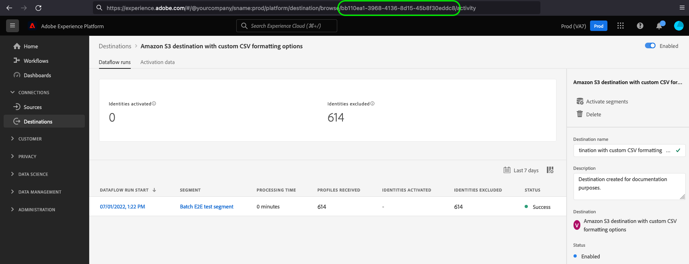

# Anzeigen detaillierter Aktivierungsergebnisse {#view-test-results}

## Übersicht {#overview}

Auf dieser Seite wird erläutert, wie Sie die `/testing/destinationInstance` API-Endpunkt zum Anzeigen der vollständigen Details Ihrer dateibasierten Zieltestergebnisse.

Wenn Sie bereits [Ziel getestet haben](file-based-destination-testing-api.md) und eine gültige API-Antwort erhalten haben, funktioniert Ihr Ziel ordnungsgemäß.

Wenn Sie genauere Informationen über Ihren Aktivierungsfluss erhalten möchten, können Sie die `results` -Eigenschaft aus [Zieltests](file-based-destination-testing-api.md) Endpunktantwort, wie weiter unten beschrieben.

>[!NOTE]
>
>Dieser API-Endpunkt gibt dasselbe Ergebnis zurück, das Sie bei Verwendung von [Flussdienst-API](../api/update-destination-dataflows.md) zur Überwachung von Datenflüssen.

## Erste Schritte {#getting-started}

Bevor Sie fortfahren, lesen Sie [Erste Schritte](./getting-started.md). Dort finden Sie die nötigen Informationen für den erfolgreichen Aufruf der API, einschließlich Details für den Abruf der erforderlichen Authoring-Berechtigung für Ziele und zu den erforderlichen Kopfzeilen.

## Voraussetzungen {#prerequisites}

Bevor Sie die `/testing/destinationInstance` -Endpunkt verwenden, stellen Sie sicher, dass Sie die folgenden Bedingungen erfüllen:

* Sie haben ein vorhandenes dateibasiertes Ziel, das über die Destination SDK erstellt wurde, und Sie können es in Ihrem [Zielkatalog](../ui/destinations-workspace.md).
* Sie haben in der Experience Platform-Benutzeroberfläche mindestens einen Aktivierungsfluss für Ihr Ziel erstellt.
* Für eine erfolgreiche API-Anfrage benötigen Sie die Ziel-Instanz-ID, die der zu testenden Zielinstanz entspricht. Rufen Sie die Ziel-Instanz-ID ab, die Sie beim Durchsuchen einer Verbindung mit Ihrem Ziel in der Platform-Benutzeroberfläche im API-Aufruf über die URL verwenden sollten.

   
* Sie haben zuvor [Zielkonfiguration getestet haben](file-based-destination-testing-api.md)und eine gültige API-Antwort erhalten haben, die eine `results` -Eigenschaft. Sie werden dies `results` -Wert, um Ihr Ziel weiter zu testen.

## Detaillierte Zieltestergebnisse anzeigen {#test-activation-results}

Einmal [Zielkonfiguration validieren](file-based-destination-testing-api.md)können Sie detaillierte Aktivierungsergebnisse anzeigen, indem Sie eine GET-Anfrage an die `authoring/testing/destinationInstance/` -Endpunkt und geben die Ziel-Instanz-ID des Ziels an, das Sie testen, sowie die Flusslaufs-IDs der aktivierten Segmente.

Sie finden die vollständige API-URL, die Sie in der `results` -Eigenschaft, die in der [Antwort des Zieltestaufrufs](file-based-destination-testing-api.md).

**API-Format**

```http
GET /authoring/testing/destinationInstance/{DESTINATION_INSTANCE_ID}/results?flowRunIds=id1,id2
```

| Pfadparameter | Beschreibung |
| -------- | ----------- |
| `{DESTINATION_INSTANCE_ID}` | Die ID der Zielinstanz, für die Sie Beispielprofile generieren. Siehe [Voraussetzungen](#prerequisites) für weitere Informationen zum Abrufen dieser ID. |

| Abfragezeichenfolge-Parameter | Beschreibung |
| -------- | ----------- |
| `flowRunIds` | Die Kennungen für die Flussausführung, die den aktivierten Segmenten entsprechen. Die Kennungen für die Flusslaufführung finden Sie im Abschnitt `results` -Eigenschaft, die in der [Antwort des Zieltestaufrufs](file-based-destination-testing-api.md). |

**Anfrage**

```shell
curl -X GET 'https://platform.adobe.io/data/core/activation/authoring/testing/destinationInstance/fd3449fb-b929-45c8-9f3d-06b9d6aac328/results?flowRunIds=30d34875-e7ba-4520-ab6e-5705e01dfb16,86c00ad7-443c-459a-855d-0e8cbee43c4f,12305c58-42a9-4230-8fad-1661ee49cb70' \
 -H 'Authorization: Bearer {ACCESS_TOKEN}' \
 -H 'Content-Type: application/json' \
 -H 'x-gw-ims-org-id: {IMS_ORG}' \
 -H 'x-api-key: {API_KEY}' \
 -H 'x-sandbox-name: {SANDBOX_NAME}' \
```

**Antwort**

Die Antwort enthält die vollständigen Details des Aktivierungsflusses. Sie können dieselbe Antwort erhalten, indem Sie die [Flussdienst-API](../api/update-destination-dataflows.md) zur Überwachung von Datenflüssen.

```json
{
   "items":[
      {
         "id":"18efd5d2-40ae-4f5c-afd1-37a39a45183a",
         "flowId":"a02071ad-f3a4-496c-a2b1-468812301d5d",
         "flowSpec":{
            "id":"25473b67-0801-418a-ab49-ed74ebf88137",
            "version":"1.0"
         },
         "metrics":{
            "durationSummary":{
               "startedAtUTC":1646652235124,
               "completedAtUTC":1646652270439
            },
            "latencySummary":null,
            "sizeSummary":{
               "inputBytes":122,
               "outputBytes":122
            },
            "recordSummary":{
               "inputRecordCount":1,
               "outputRecordCount":1,
               "createdRecordCount":1,
               "skippedRecordCount":0,
               "sourceSummaries":[
                  {
                     "id":"76e4b969-9700-4557-8330-0a8390afbdde",
                     "entitySummaries":[
                        {
                           "inputRecordCount":1,
                           "skippedRecordCount":0,
                           "id":"segment:4326c566-f81c-4ab0-8a80-9e741a5d0b1f"
                        }
                     ]
                  }
               ],
               "targetSummaries":[
                  {
                     "id":"b43607b6-0dca-43b3-a0bc-ecdea4fa6aa9",
                     "entitySummaries":[
                        {
                           "outputRecordCount":1,
                           "createdRecordCount":1,
                           "id":"segment:4326c566-f81c-4ab0-8a80-9e741a5d0b1f"
                        }
                     ]
                  }
               ]
            },
            "fileSummary":{
               "inputFileCount":1,
               "outputFileCount":1
            },
            "statusSummary":{
               "status":"success"
            }
         },
         "activities":[
            {
               "id":"c4f238e3-7334-4933-8b56-64d7ea43ea54",
               "name":"Activation Batch XdmProcessor Activity",
               "updatedAtUTC":0,
               "durationSummary":{
                  "startedAtUTC":1646652235124,
                  "completedAtUTC":1646652255157
               },
               "latencySummary":{
                  
               },
               "sizeSummary":{
                  "inputBytes":122,
                  "outputBytes":122
               },
               "recordSummary":{
                  "inputRecordCount":1,
                  "outputRecordCount":1,
                  "createdRecordCount":1,
                  "skippedRecordCount":0
               },
               "fileSummary":{
                  "inputFileCount":1,
                  "outputFileCount":1
               },
               "statusSummary":{
                  "status":"success",
                  "extensions":{
                     "incremental.batchId":"",
                     "snapshot.batchId":"",
                     "snapshot.datasetId":"",
                     "incremental.datasetId":""
                  }
               },
               "sourceInfo":null,
               "targetInfo":null
            },
            {
               "id":"51d82b36-6b8f-11eb-9439-0242ac130002",
               "name":"Activation Batch Publisher Activity",
               "updatedAtUTC":0,
               "durationSummary":{
                  "startedAtUTC":1646652270326,
                  "completedAtUTC":1646652270439
               },
               "latencySummary":{
                  
               },
               "sizeSummary":{
                  "outputBytes":122
               },
               "recordSummary":{
                  "inputRecordCount":1,
                  "outputRecordCount":1,
                  "createdRecordCount":1,
                  "skippedRecordCount":0
               },
               "fileSummary":{
                  "outputFileCount":1
               },
               "statusSummary":{
                  "status":"success",
                  "extensions":{
                     
                  }
               },
               "sourceInfo":null,
               "targetInfo":null
            }
         ],
         "predecessors":null
      }
   ],
   "_links":{
      
   }
}
```

## Umgang mit API-Fehlern {#api-error-handling}

Destination SDK-API-Endpunkte folgen den allgemeinen Grundsätzen von Experience Platform API-Fehlermeldungen. Siehe [API-Status-Codes](../../landing/troubleshooting.md#api-status-codes) und [Fehler im Anfrage-Header](../../landing/troubleshooting.md#request-header-errors) in der Anleitung zur Fehlerbehebung für Platform.

## Nächste Schritte

Nach dem Lesen dieses Dokuments wissen Sie jetzt, wie Sie Ihre dateibasierte Zielkonfiguration testen und die vollständigen Details Ihrer Aktivierungsergebnisse anzeigen können.

Wenn Sie ein öffentliches Ziel erstellen, können Sie jetzt [Senden der Zielkonfiguration](../destination-sdk/submit-destination.md) zur Adobe zur Überprüfung.
