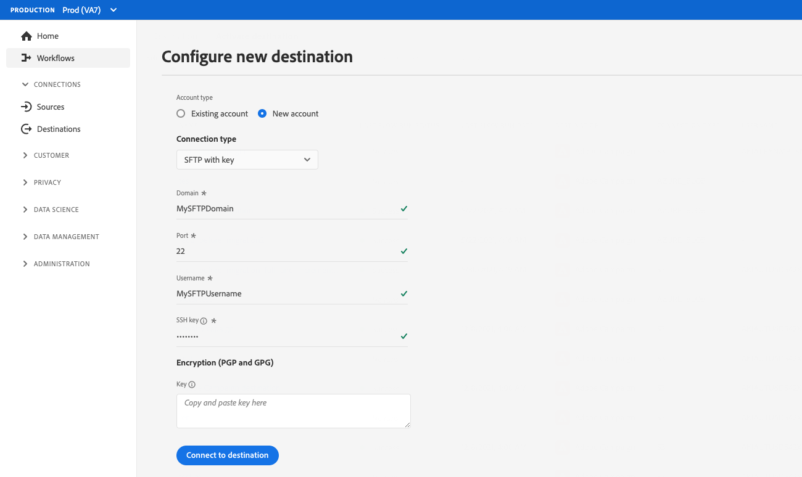

# Konfiguration der Kundenauthentifizierung

Experience Platform bietet eine große Flexibilität bei den Authentifizierungsprotokollen, die Partnern sowie Kundinnen und Kunden zur Verfügung stehen. Sie können Ihr Ziel so konfigurieren, dass es alle Authentifizierungsmethoden unterstützt, die dem Branchenstandard entsprechen, z. B. [!DNL OAuth2], Authentifizierung von Bearer-Token, Kennwortauthentifizierung und viele mehr.

Auf dieser Seite wird beschrieben, wie Sie Ihr Ziel mithilfe Ihrer bevorzugten Authentifizierungsmethode einrichten. Basierend auf der Authentifizierungskonfiguration, die Sie beim Erstellen Ihres Ziels verwenden, werden den Kundinnen und Kunden beim Herstellen einer Verbindung zum Ziel in der Experience Platform-Benutzeroberfläche unterschiedliche Arten von Authentifizierungsseiten angezeigt.

Informationen dazu, wo diese Komponente in eine mit Destination SDK erstellte Integration passt, finden Sie im Diagramm in der Dokumentation zu [Konfigurationsoptionen](../configuration-options.md) oder auf den folgenden Übersichtsseiten zur Zielkonfiguration:

* [Verwenden des Destination SDK zum Konfigurieren eines Streaming-Ziels](../../guides/configure-destination-instructions.md#create-destination-configuration)
* [Verwenden des Destination SDK zum Konfigurieren eines dateibasierten Ziels](../../guides/configure-file-based-destination-instructions.md#create-destination-configuration)

Bevor Kundinnen und Kunden Daten aus Platform in Ihr Ziel exportieren können, müssen sie eine neue Verbindung zwischen Experience Platform und Ihrem Ziel herstellen, indem sie die Schritte im Tutorial [Zielverbindung](../../../ui/connect-destination.md) befolgen.

Wenn Sie durch Destination SDK [ein Ziel erstellen](../../authoring-api/destination-configuration/create-destination-configuration.md), wird im Abschnitt `customerAuthenticationConfigurations` definiert, was Kundinnen und Kunden im [Authentifizierungsbildschirm](../../../ui/connect-destination.md#authenticate) sehen. Abhängig vom Zielauthentifizierungstyp müssen Kundinnen und Kunden verschiedene Authentifizierungsdetails angeben, z. B.:

* Für Ziele, die eine [einfache Authentifizierung](#basic) verwenden, müssen Benutzerinnen und Benutzer einen Benutzernamen und ein Kennwort direkt auf der Authentifizierungsseite der Experience Platform-Benutzeroberfläche angeben.
* Für Ziele, die eine [Bearer-Authentifizierung](#bearer) verwenden, müssen Benutzerinnen und Benutzer ein Bearer-Token bereitstellen.
* Für Ziele, die eine [OAuth2-Authentifizierung](#oauth2) verwenden, werden Benutzerinnen und Benutzer zur Anmeldeseite Ihres Ziels weitergeleitet, wo sie sich mit ihren Anmeldeinformationen anmelden können.
* Für [Amazon S3](#s3)-Ziele müssen Benutzerinnen und Benutzer ihren [!DNL Amazon S3]-Zugriffsschlüssel und geheimen Schlüssel angeben.
* Für [Azure Blob](#blob)-Ziele müssen Benutzerinnen und Benutzer ihre [!DNL Azure Blob]-Verbindungszeichenfolge angeben.

Sie können Details zur Kundenauthentifizierung über den Endpunkt `/authoring/destinations` konfigurieren. Detaillierte Beispiele für API-Aufrufe, in denen Sie die auf dieser Seite angezeigten Komponenten konfigurieren können, finden Sie auf den folgenden API-Referenzseiten.

* [Erstellen einer Zielkonfiguration](../../authoring-api/destination-configuration/create-destination-configuration.md)
* [Aktualisieren einer Zielkonfiguration](../../authoring-api/destination-configuration/update-destination-configuration.md)

In diesem Artikel werden alle unterstützten Konfigurationen für die Kundenauthentifizierung beschrieben, die Sie für Ihr Ziel verwenden können, und es wird gezeigt, was in der Experience Platform-Benutzeroberfläche zu sehen sein wird, basierend auf der Authentifizierungsmethode, die Sie für Ihr Ziel eingerichtet haben.

>[!IMPORTANT]
>
>Für die Konfiguration der Kundenauthentifizierung müssen Sie keine Parameter konfigurieren. Sie können die auf dieser Seite angezeigten Snippets kopieren und in Ihre API-Aufrufe einfügen, wenn Sie eine Zielkonfiguration [erstellen](../../authoring-api/destination-configuration/create-destination-configuration.md) oder [aktualisieren](../../authoring-api/destination-configuration/update-destination-configuration.md), und Ihren Benutzerinnen und Benutzern wird der entsprechende Authentifizierungsbildschirm in der Platform-Benutzeroberfläche angezeigt.

>[!IMPORTANT]
>
>Bei allen von Destination SDK unterstützten Parameternamen und Werten wird **nach Groß-/Kleinschreibung unterschieden**. Um Fehler bei der Groß-/Kleinschreibung zu vermeiden, verwenden Sie bitte die Parameternamen und -werte genau wie in der Dokumentation dargestellt.

## Unterstützte Integrationstypen {#supported-integration-types}

Die nachstehende Tabelle beschreibt ausführlich, welche Integrationstypen die auf dieser Seite beschriebenen Funktionen unterstützen.

| Integrationstyp | Unterstützt Funktionen |
|---|---|
| Echtzeit-Integrationen (Streaming) | Ja |
| Dateibasierte (Batch-)Integrationen | Ja |

## Konfiguration der Authentifizierungsregeln {#authentication-rule}

Wenn Sie eine der auf dieser Seite beschriebenen Kundenauthentifizierungskonfigurationen verwenden, legen Sie den Parameter `authenticationRule` im [Zielversand](destination-delivery.md) immer auf `"CUSTOMER_AUTHENTICATION"` fest, wie unten dargestellt.

```json {line-numbers="true" highlight="4"
{
   "destinationDelivery":[
      {
         "authenticationRule":"CUSTOMER_AUTHENTICATION",
         "destinationServerId":"{{destinationServerId}}"
      }
   ]
}
```

## Einfache Authentifizierung {#basic}

Die einfache Authentifizierung wird bei Echtzeit-Integrationen (Streaming) in Experience Platform unterstützt.

Wenn Sie den einfachen Authentifizierungstyp konfigurieren, müssen Benutzerinnen und Benutzer einen Benutzernamen und ein Kennwort eingeben, um eine Verbindung zu Ihrem Ziel herzustellen.


Um die einfache Authentifizierung für Ihr Ziel einzurichten, konfigurieren Sie den Parameter`customerAuthenticationConfigurations` über den Endpunkt `/destinations` wie unten angezeigt:

```json
"customerAuthenticationConfigurations":[
   {
      "authType":"BASIC"
   }
]
```

## Bearer-Authentifizierung {#bearer}

Wenn Sie den Bearer-Authentifizierungstyp konfigurieren, müssen Benutzerinnen und Benutzer das Bearer-Token eingeben, das sie von Ihrem Ziel erhalten.


Um die Authentifizierung des Bearer-Typs für Ihr Ziel einzurichten, konfigurieren Sie den Parameter`customerAuthenticationConfigurations` über den Endpunkt `/destinations`, wie unten angezeigt:

```json
"customerAuthenticationConfigurations":[
   {
      "authType":"BEARER"
   }
]
```

## OAuth 2-Authentifizierung {#oauth2}

Benutzerinnen und Benutzer wählen **[!UICONTROL Mit Ziel verbinden]** aus, um den OAuth 2-Authentifizierungsfluss für Ihr Ziel auszulösen (siehe folgendes Beispiel für das Ziel „Twitter Custom Audiences“). Detaillierte Informationen zum Konfigurieren der OAuth 2-Authentifizierung für Ihren Ziel-Endpunkt finden Sie in der entsprechenden [Authentifizierungsseite für Destination SDK OAuth 2](oauth2-authorization.md).


Um die [!DNL OAuth2]-Authentifizierung für Ihr Ziel einzurichten, konfigurieren Sie den Parameter`customerAuthenticationConfigurations` über den Endpunkt `/destinations`, wie unten angezeigt:

```json
"customerAuthenticationConfigurations":[
   {
      "authType":"OAUTH2"
   }
]
```

## Amazon S3-Authentifizierung {#s3}

Die [!DNL Amazon S3]-Authentifizierung wird für dateibasierte Ziele in Experience Platform unterstützt.

Wenn Sie den Authentifizierungstyp Amazon S3 konfigurieren, müssen Benutzerinnen und Benutzer die S3-Anmeldeinformationen eingeben.


Um die [!DNL Amazon S3]-Authentifizierung für Ihr Ziel einzurichten, konfigurieren Sie den Parameter`customerAuthenticationConfigurations` über den Endpunkt `/destinations`, wie unten angezeigt:

```json
"customerAuthenticationConfigurations":[
   {
      "authType":"S3"
   }
]
```

## Azure Blob-Authentifizierung  {#blob}

Die [!DNL Azure Blob Storage]-Authentifizierung wird für dateibasierte Ziele in Experience Platform unterstützt.

Wenn Sie den Authentifizierungstyp Azure Blob konfigurieren, müssen Benutzerinnen und Benutzer die Verbindungszeichenfolge eingeben.


Um die [!DNL Azure Blob]-Authentifizierung für Ihr Ziel einzurichten, konfigurieren Sie den Parameter `customerAuthenticationConfigurations` im Endpunkt `/destinations` wie unten angezeigt:

```json
"customerAuthenticationConfigurations":[
   {
      "authType":"AZURE_CONNECTION_STRING"
   }
]
```

## [!DNL Azure Data Lake Storage]-Authentifizierung {#adls}

Die [!DNL Azure Data Lake Storage]-Authentifizierung wird für dateibasierte Ziele in Experience Platform unterstützt.

Wenn Sie den Authentifizierungstyp [!DNL Azure Data Lake Storage] konfigurieren, müssen Benutzerinnen und Benutzer die Azure-Service-Prinzipalanmeldeinformationen und ihre Mandanteninformationen eingeben.

![UI-Rendering mit [!DNL Azure Data Lake Storage]-Authentifizierung](../../assets/functionality/destination-configuration/adls-authentication-ui.png)

Um die [!DNL Azure Data Lake Storage] (ADLS)-Authentifizierung für Ihr Ziel einzurichten, konfigurieren Sie den `customerAuthenticationConfigurations`-Parameter im `/destinations`-Endpunkt, wie unten angezeigt:

```json
"customerAuthenticationConfigurations":[
   {
      "authType":"AZURE_SERVICE_PRINCIPAL"
   }
]
```

## SFTP mit Passwortauthentifizierung

Die [!DNL SFTP]-Authentifizierung mit Passwort wird für dateibasierte Ziele in Experience Platform unterstützt.

Wenn Sie den SFTP-Authentifizierungstyp mit Passwort konfigurieren, müssen Benutzer den SFTP-Benutzernamen und das Passwort sowie die SFTP-Domain und den Port eingeben (der standardmäßige Port ist 22).


Um die SFTP-Authentifizierung mit einem Kennwort für Ihr Ziel einzurichten, konfigurieren Sie den `customerAuthenticationConfigurations`-Parameter im `/destinations`-Endpunkt, wie unten angezeigt:

```json
"customerAuthenticationConfigurations":[
   {
      "authType":"SFTP_WITH_PASSWORD"
   }
]
```

## SFTP mit SSH-Schlüsselauthentifizierung

Die [!DNL SFTP]-Authentifizierung mit dem [!DNL SSH]-Schlüssel wird für dateibasierte Ziele in Experience Platform unterstützt.

Wenn Sie den Authentifizierungstyp SFTP mit SSH-Schlüssel konfigurieren, müssen Benutzer den SFTP-Benutzernamen und SSH-Schlüssel sowie die SFTP-Domain und den Port eingeben (der standardmäßige Port ist 22).



Um die SFTP-Authentifizierung mit dem SSH-Schlüssel für Ihr Ziel einzurichten, konfigurieren Sie den `customerAuthenticationConfigurations`-Parameter im `/destinations`-Endpunkt, wie unten angezeigt:

```json
"customerAuthenticationConfigurations":[
   {
      "authType":"SFTP_WITH_SSH_KEY"
   }
]
```

## [!DNL Google Cloud Storage]-Authentifizierung {#gcs}

Die [!DNL Google Cloud Storage]-Authentifizierung wird für dateibasierte Ziele in Experience Platform unterstützt.

Wenn Sie die [!DNL Google Cloud Storage] Authentifizierungstyp: Benutzer müssen ihre [!DNL Google Cloud Storage] [!UICONTROL Zugriffsschlüssel-ID] und [!UICONTROL geheimer Zugriffsschlüssel].


Um die [!DNL Google Cloud Storage]-Authentifizierung für Ihr Ziel einzurichten, konfigurieren Sie den `customerAuthenticationConfigurations`-Parameter im `/destinations`-Endpunkt wie unten angezeigt:

```json
"customerAuthenticationConfigurations":[
   {
      "authType":"GOOGLE_CLOUD_STORAGE"
   }
]
```

## Nächste Schritte {#next-steps}

Nach dem Lesen dieses Artikels sollten Sie besser verstehen, wie Sie die Benutzerauthentifizierung für Ihre Zielplattform konfigurieren können.

Weitere Informationen zu den anderen Zielkomponenten finden Sie in den folgenden Artikeln:

* [OAuth 2-Authentifizierung](oauth2-authorization.md)
* [Benutzerdefinierte Datenfelder](customer-data-fields.md)
* [Benutzeroberflächenattribute](ui-attributes.md)
* [Schemakonfiguration](schema-configuration.md)
* [Konfiguration von Identity-Namespaces](identity-namespace-configuration.md)
* [Unterstützte Zuordnungskonfigurationen](supported-mapping-configurations.md)
* [Zielbereitstellung](destination-delivery.md)
* [Konfiguration von Zielgruppen-Metadaten](audience-metadata-configuration.md)
* [Aggregationsrichtlinie](aggregation-policy.md)
* [Batch-Konfiguration](batch-configuration.md)
* [Historische Profilqualifikationen](historical-profile-qualifications.md)
