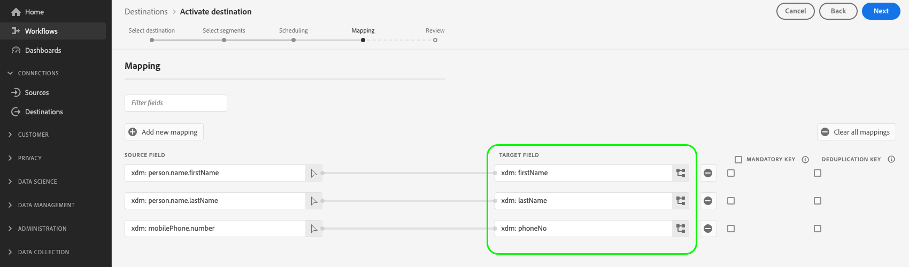

# Konfiguration des Partnerschemas

Schemata dienen in Experience Platform zur konsistenten und wiederverwendbaren Beschreibung der Struktur von Daten. Wenn Daten in Platform aufgenommen werden, werden sie nach einem XDM-Schema strukturiert. Weitere Informationen zum Schemaaufbaumodell, einschließlich Planungsgrundsätzen und Best Practices, finden Sie in den [Grundlagen des Schemaaufbaus](../../../../xdm/schema/composition.md).

Beim Erstellen eines Ziels mit Destination SDK können Sie Ihr eigenes Partnerschema definieren, das von Ihrer Zielplattform verwendet werden soll. Dadurch können Benutzerinnen und Benutzer Profilattribute von Platform bestimmten Feldern zuordnen, die von Ihrer Zielplattform erkannt werden, und zwar alles in der Platform-Benutzeroberfläche.

Beim Konfigurieren des Partnerschemas für Ihr Ziel können Sie die von Ihrer Zielplattform unterstützte Feldzuordnung anpassen, z. B.:

* Benutzerinnen und Benutzern erlauben, ein XDM-Attribut `phoneNumber` einem Attribut `phone` zuzuordnen, das von Ihrer Zielplattform unterstützt wird.
* Dynamische Partnerschemata erstellen, die von Experience Platform dynamisch aufgerufen werden können, um eine Liste aller unterstützten Attribute in Ihrem Ziel abzurufen.
* Erforderliche Feldzuordnungen definieren, die für Ihre Zielplattform erforderlich sind.

Informationen dazu, wo diese Komponente in eine mit Destination SDK erstellte Integration passt, finden Sie im Diagramm in der Dokumentation zu [Konfigurationsoptionen](../configuration-options.md) oder im Handbuch zur [Verwendung von Destination SDK zum Konfigurieren eines dateibasierten Ziels](../../guides/configure-file-based-destination-instructions.md#create-server-file-configuration).

Die Schemaeinstellungen können über den Endpunkt `/authoring/destinations` konfiguriert werden. Detaillierte Beispiele für API-Aufrufe, in denen Sie die auf dieser Seite angezeigten Komponenten konfigurieren können, finden Sie auf den folgenden API-Referenzseiten.

* [Erstellen einer Zielkonfiguration](../../authoring-api/destination-configuration/create-destination-configuration.md)
* [Aktualisieren einer Zielkonfiguration](../../authoring-api/destination-configuration/update-destination-configuration.md)

In diesem Artikel werden alle unterstützten Schemakonfigurationsoptionen beschrieben, die Sie für Ihr Ziel verwenden können, und es wird gezeigt, was Kundinnen und Kunden in der Platform-Benutzeroberfläche sehen werden..

>[!IMPORTANT]
>
>Bei allen von Destination SDK unterstützten Parameternamen und Werten wird **nach Groß-/Kleinschreibung unterschieden**. Um Fehler bei der Groß-/Kleinschreibung zu vermeiden, verwenden Sie bitte die Parameternamen und -werte genau wie in der Dokumentation dargestellt.

## Unterstützte Integrationstypen {#supported-integration-types}

Die nachstehende Tabelle beschreibt ausführlich, welche Integrationstypen die auf dieser Seite beschriebenen Funktionen unterstützen.

| Integrationstyp | Unterstützt Funktionen |
|---|---|
| Echtzeit-Integrationen (Streaming) | Ja |
| Dateibasierte (Batch-)Integrationen | Ja |

## Unterstützte Schemakonfiguration {#supported-schema-types}

Destination SDK unterstützt mehrere Schemakonfigurationen:

* Statische Schemata werden durch das Array `profileFields` im Abschnitt `schemaConfig` definiert. In einem statischen Schema definieren Sie jedes Zielattribut, das in der Experience Platform-Benutzeroberfläche angezeigt werden sollte, im Array `profileFields`. Wenn Sie Ihr Schema aktualisieren müssen, müssen Sie [die Zielkonfiguration aktualisieren](../../authoring-api/destination-configuration/update-destination-configuration.md).
* Dynamische Schemata verwenden einen zusätzlichen Typ von Ziel-Server, den so genannten [dynamischen Schema-Server](../../authoring-api/destination-server/create-destination-server.md), um Schemata dynamisch basierend auf Ihrer eigenen API zu erstellen. Dynamische Schemata verwenden nicht das Array `profileFields`. Wenn Sie Ihr Schema aktualisieren müssen, müssen Sie [die Zielkonfiguration aktualisieren](../../authoring-api/destination-configuration/update-destination-configuration.md). Stattdessen ruft der dynamische Schema-Server das aktualisierte Schema von Ihrer API ab.
* Innerhalb der Schemakonfiguration haben Sie die Möglichkeit, erforderliche (oder vordefinierte) Zuordnungen hinzuzufügen. Hierbei handelt es sich um Zuordnungen, die Benutzerinnen und Benutzer in der Platform-Benutzeroberfläche anzeigen können. Sie können sie jedoch beim Einrichten einer Verbindung zu Ihrem Ziel nicht ändern. Beispielsweise können Sie erzwingen, dass das Feld für die E-Mail-Adresse immer an das Ziel gesendet wird.

Der Abschnitt `schemaConfig` verwendet mehrere Konfigurationsparameter, je nach dem benötigten Schematyp, wie in den folgenden Abschnitten dargestellt.

## Erstellen eines statischen Schemas {#attributes-schema}

Um ein statisches Schema mit Profilattributen zu erstellen, definieren Sie die Zielattribute im Array `profileFields` wie unten dargestellt.

```json
"schemaConfig":{
      "profileFields":[
           {
              "name":"phoneNo",
              "title":"phoneNo",
              "description":"This is a fixed attribute on your destination side that customers can map profile attributes to. For example, the mobilePhone.number value in Experience Platform could be phoneNo on your side.",
              "type":"string",
              "isRequired":false,
              "readOnly":false,
              "hidden":false
           },
                      {
              "name":"firstName",
              "title":"firstName",
              "description":"This is a fixed attribute on your destination side that customers can map profile attributes to. For example, the person.name.firstName value in Experience Platform could be firstName on your side.",
              "type":"string",
              "isRequired":false,
              "readOnly":false,
              "hidden":false
           },
                      {
              "name":"lastName",
              "title":"lastName",
              "description":"This is a fixed attribute on your destination side that customers can map profile attributes to. For example, the person.name.lastName value in Experience Platform could be phoneNo on your side.",
              "type":"string",
              "isRequired":false,
              "readOnly":false,
              "hidden":false
           }
        ],
      "useCustomerSchemaForAttributeMapping":false,
      "profileRequired":true,
      "segmentRequired":true,
      "identityRequired":true,
      "segmentNamespaceAllowList": ["someNamespace"],
      "segmentNamespaceDenyList": ["someOtherNamespace"]

}
```

| Parameter | Typ | Erforderlich/Optional | Beschreibung |
|---------|----------|------|---|
| `profileFields` | Array | Optional | Definiert das Array von Zielattributen, die von Ihrer Zielplattform akzeptiert werden und denen Kundinnen und Kunden ihre Profilattribute zuordnen können. Bei Verwendung des Arrays `profileFields` können Sie den Parameter `useCustomerSchemaForAttributeMapping` ganz weglassen. |
| `useCustomerSchemaForAttributeMapping` | Boolesch | Optional | Aktiviert oder deaktiviert die Zuordnung von Attributen aus dem Kundenschema zu den Attributen, die Sie im Array `profileFields` definieren. <ul><li>Wenn auf `true` festgelegt, sehen Benutzerinnen und Benutzer nur die Quellspalte im Zuordnungsfeld. `profileFields` sind in diesem Fall nicht anwendbar.</li><li>Wenn auf `false` festgelegt, können Benutzerinnen und Benutzer Quellattribute aus ihrem Schema den Attributen zuordnen, die Sie in der `profileFields` Array.</li></ul> Der Standardwert lautet `false`. |
| `profileRequired` | Boolesch | Optional | Verwenden Sie `true`, wenn Benutzerinnen und Benutzer in der Lage sein sollen, Profilattribute von Experience Platform benutzerdefinierten Attributen auf Ihrer Zielplattform zuzuordnen. |
| `segmentRequired` | Boolesch | Erforderlich | Dieser Parameter ist für Destination SDK erforderlich und sollte immer auf `true` festgelegt werden. |
| `identityRequired` | Boolesch | Erforderlich | Legen Sie ihn auf `true` fest, wenn Benutzerinnen und Benutzer in der Lage sein sollen, [Identitätstypen](identity-namespace-configuration.md) von Experience Platform den Attributen zuzuordnen, die Sie im Array `profileFields` definiert haben. |
| `segmentNamespaceAllowList` | Array | Optional | Definiert spezifische Zielgruppen-Namespaces, aus denen Benutzer Zielgruppen dem Ziel zuordnen können. Verwenden Sie diesen Parameter, um Platform-Benutzer darauf zu beschränken, Zielgruppen nur aus den Zielgruppen-Namespaces zu exportieren, die Sie im -Array definieren. Dieser Parameter kann nicht zusammen mit `segmentNamespaceDenyList`.<br> <br> Beispiel: `"segmentNamespaceAllowList": ["AudienceManager"]` ermöglicht es Benutzern, nur Zielgruppen aus der `AudienceManager` -Namespace an dieses Ziel. <br> <br> Damit Benutzer Zielgruppen in Ihr Ziel exportieren können, können Sie diesen Parameter ignorieren. <br> <br> Wenn `segmentNamespaceAllowList` und `segmentNamespaceDenyList` fehlen, können Benutzer nur Zielgruppen exportieren, die aus der [Segmentierungsdienst](../../../../segmentation/home.md). |
| `segmentNamespaceDenyList` | Array | Optional | Beschränkt Benutzer von der Zuordnung von Zielgruppen zum Ziel aus den im Array definierten Zielgruppen-Namespaces. Darf nicht zusammen mit `segmentNamespaceAllowed`. <br> <br> Beispiel: `"segmentNamespaceDenyList": ["AudienceManager"]` verhindert, dass Benutzer Zielgruppen aus der `AudienceManager` -Namespace an dieses Ziel. <br> <br> Damit Benutzer Zielgruppen in Ihr Ziel exportieren können, können Sie diesen Parameter ignorieren. <br> <br> Wenn `segmentNamespaceAllowed` und `segmentNamespaceDenyList` fehlen, können Benutzer nur Zielgruppen exportieren, die aus der [Segmentierungsdienst](../../../../segmentation/home.md). <br> <br> Um den Export aller Zielgruppen unabhängig von der Herkunft zu ermöglichen, legen Sie `"segmentNamespaceDenyList":[]`. |

{style="table-layout:auto"}

Das daraus resultierende Benutzeroberflächenerlebnis wird in den unten stehenden Bildern gezeigt.

Wenn Benutzerinnen und Benutzer die Zielgruppenzuordnung auswählen, können sie die im Array `profileFields` definierten Felder sehen.


Nach Auswahl der Attribute werden sie in der Spalte mit den Zielfeldern angezeigt.



## Erstellen eines dynamischen Schemas {#dynamic-schema-configuration}

Destination SDK unterstützt die Erstellung von dynamischen Partnerschemata. Im Gegensatz zu statischen Schemata verwendet ein dynamisches Schema kein Array `profileFields`. Stattdessen verwenden dynamische Schemata einen dynamischen Schema-Server, der eine Verbindung zu Ihrer eigenen API herstellt, von der aus die Schemakonfiguration abgerufen wird.

>[!IMPORTANT]
>
>Bevor Sie ein dynamisches Schema erstellen, müssen Sie [einen dynamischen Schema-Server erstellen](../../authoring-api/destination-server/create-destination-server.md).

In einer dynamischen Schemakonfiguration wird das Array `profileFields` durch den Abschnitt `dynamicSchemaConfig` ersetzt, wie unten dargestellt.

```json
"schemaConfig":{
   "dynamicSchemaConfig":{
      "dynamicEnum": {
         "authenticationRule":"CUSTOMER_AUTHENTICATION",
         "destinationServerId":"DYNAMIC_SCHEMA_SERVER_ID",
         "value": "Schema Name",
         "responseFormat": "SCHEMA"
      }
   },
   "profileRequired":true,
   "segmentRequired":true,
   "identityRequired":true
}
```

| Parameter | Typ | Erforderlich/Optional | Beschreibung |
|---------|----------|------|---|
| `dynamicEnum.authenticationRule` | Zeichenfolge | Erforderlich | Gibt an, wie [!DNL Platform]-Kundinnen und -Kunden eine Verbindung zu Ihrem Ziel herstellen. Akzeptierte Werte sind `CUSTOMER_AUTHENTICATION`, `PLATFORM_AUTHENTICATION`, `NONE`. <br> <ul><li>Verwenden Sie die `CUSTOMER_AUTHENTICATION`, wenn sich Platform-Kundinnen und -Kunden über eine der [hier](customer-authentication.md) beschriebenen Authentifizierungsmethoden bei Ihrem System anmelden. </li><li> Verwenden Sie `PLATFORM_AUTHENTICATION`, wenn ein globales Authentifizierungssystem zwischen Adobe und Ihrem Ziel existiert und der [!DNL Platform]-Kunde keine Authentifizierungsdaten bereitstellen muss, um eine Verbindung zu Ihrem Ziel herzustellen. In diesem Fall müssen Sie [ein Anmeldeinformationen-Objekt ](../../credentials-api/create-credential-configuration.md) mithilfe der Anmeldeinformationen-API erstellen. </li><li>Verwenden Sie `NONE`, wenn keine Authentifizierung erforderlich ist, um Daten an Ihre Zielplattform zu senden. </li></ul> |
| `dynamicEnum.destinationServerId` | Zeichenfolge | Erforderlich | Die `instanceId` des dynamischen Schema-Servers. Dieser Ziel-Server enthält den API-Endpunkt, den Experience Platform aufruft, um das dynamische Schema abzurufen. |
| `dynamicEnum.value` | Zeichenfolge | Erforderlich | Der Name des dynamischen Schemas, wie in der Konfiguration des dynamischen Schema-Servers definiert. |
| `dynamicEnum.responseFormat` | Zeichenfolge | Erforderlich | Die Einstellung ist immer `SCHEMA`, wenn ein dynamisches Schema definiert wird. |
| `profileRequired` | Boolesch | Optional | Verwenden Sie `true`, wenn Benutzerinnen und Benutzer in der Lage sein sollen, Profilattribute von Experience Platform benutzerdefinierten Attributen auf Ihrer Zielplattform zuzuordnen. |
| `segmentRequired` | Boolesch | Erforderlich | Dieser Parameter ist für Destination SDK erforderlich und sollte immer auf `true` festgelegt werden. |
| `identityRequired` | Boolesch | Erforderlich | Legen Sie ihn auf `true` fest, wenn Benutzerinnen und Benutzer in der Lage sein sollen, [Identitätstypen](identity-namespace-configuration.md) von Experience Platform den Attributen zuzuordnen, die Sie im Array `profileFields` definiert haben. |

{style="table-layout:auto"}

## Erforderliche Zuordnungen {#required-mappings}

Innerhalb der Schemakonfiguration haben Sie neben Ihrem statischen oder dynamischen Schema die Möglichkeit, erforderliche (oder vordefinierte) Zuordnungen hinzuzufügen. Hierbei handelt es sich um Zuordnungen, die Benutzerinnen und Benutzer in der Platform-Benutzeroberfläche anzeigen können. Sie können sie jedoch beim Einrichten einer Verbindung zu Ihrem Ziel nicht ändern.

Beispielsweise können Sie erzwingen, dass das Feld für die E-Mail-Adresse immer an das Ziel gesendet wird.

>[!NOTE]
>
>Die folgenden Kombinationen erforderlicher Zuordnungen werden derzeit unterstützt:
>* Sie können ein erforderliches Quellfeld und ein erforderliches Zielfeld konfigurieren. In diesem Fall können Benutzerinnen und Benutzer keines der beiden Felder bearbeiten oder auswählen und nur die Auswahl anzeigen.
>* Sie können auch nur ein erforderliches Zielfeld konfigurieren. In diesem Fall können Benutzerinnen und Benutzer ein Quellfeld auswählen, das dem Ziel zugeordnet werden soll.
>
> Die Konfiguration, dass nur ein Quellfeld erforderlich ist, wird derzeit *nicht* unterstützt.

Nachfolgend finden Sie zwei Beispiele für eine Schemakonfiguration mit erforderlichen Zuordnungen und dafür, wie diese im Zuordnungsschritt des [Workflows „Daten für Batch-Ziele aktivieren“](../../../ui/activate-batch-profile-destinations.md) aussehen.


>[!BEGINTABS]

>[!TAB Erforderliche Quell- und Zielzuordnungen]

Das folgende Beispiel zeigt die erforderlichen Quell- und Zielzuordnungen. Wenn sowohl Quell- als auch Zielfelder als erforderliche Zuordnungen angegeben sind, können Benutzerinnen und Benutzer keines der beiden Felder auswählen oder bearbeiten und nur die vordefinierte Auswahl anzeigen.

```json
"schemaConfig": {
    "requiredMappingsOnly": true,
    "requiredMappings": [
      {
        "sourceType": "text/x.schema-path",
        "source": "personalEmail.address",
        "destination": "personalEmail.address"
      }
    ] 
}
```

| Parameter | Typ | Erforderlich/Optional | Beschreibung |
|---|---|---|---|
| `requiredMappingsOnly` | Boolesch | Optional | Wenn dies auf „true“ festgelegt ist, können Benutzerinnen und Benutzer keine anderen Attribute und Identitäten im Aktivierungsfluss zuordnen, abgesehen von den erforderlichen Zuordnungen, die Sie im Array `requiredMappings` definieren. |
| `requiredMappings.sourceType` | Zeichenfolge | Erforderlich | Gibt den Typ des Felds `source` an. Unterstützte Werte: <ul><li>`text/x.schema-path`: Verwenden Sie diesen Wert, wenn das Feld `source` ein Profilattribut aus einem XDM-Schema ist.</li><li>`text/x.aep-xl`: Verwenden Sie diesen Wert, wenn das Feld `source` durch einen regulären Ausdruck definiert wird. Beispiel: `iif(segmentMembership.ups.aep_seg_id.status==\"exited\", \"1\", \"0\")`</li><li>`text/plain`: Verwenden Sie diesen Wert, wenn das Feld `source` durch eine Makrovorlage definiert wird. Die einzige unterstützte Makrovorlage ist derzeit `metadata.segment.alias`.</li></ul> |
| `requiredMappings.source` | Zeichenfolge | Erforderlich | Gibt den Wert des Quellfelds an. Unterstützte Werttypen: <ul><li>XDM-Profilattribute. Beispiel: `personalEmail.address`. Wenn Ihr Quellattribut ein XDM-Profilattribut ist, legen Sie den Parameter `sourceType` auf `text/x.schema-path` fest.</li><li>Reguläre Ausdrücke. Beispiel: `iif(segmentMembership.ups.aep_seg_id.status==\"exited\", \"1\", \"0\")`. Wenn Ihr Quellattribut ein regulärer Ausdruck ist, legen Sie den Parameter `sourceType` auf `text/x.aep-xl` fest.</li><li>Makrovorlagen. Beispiel:`metadata.segment.alias`. Wenn Ihr Quellattribut eine Makrovorlage ist, legen Sie den Parameter `sourceType` auf `text/plain` fest. Die einzige unterstützte Makrovorlage ist derzeit `metadata.segment.alias`.</li></ul> |
| `requiredMappings.destination` | Zeichenfolge | Erforderlich | Gibt den Wert des Zielfelds an. Wenn sowohl Quell- als auch Zielfelder als erforderliche Zuordnungen angegeben sind, können Benutzerinnen und Benutzer keines der beiden Felder auswählen oder bearbeiten und nur die Auswahl anzeigen. |

{style="table-layout:auto"}

Daher werden die Abschnitte **[!UICONTROL Quellfeld]** und **[!UICONTROL Zielfeld]** in der Platform-Benutzeroberfläche ausgegraut.


>[!TAB Erforderliche Zielzuordnung]

Das folgende Beispiel zeigt eine erforderliche Zielzuordnung. Wenn nur das Zielfeld als erforderlich angegeben wird, können Benutzerinnen und Benutzer auswählen, welches Quellfeld ihm zugeordnet werden soll.

```json
"schemaConfig": {
    "requiredMappingsOnly": true,
    "requiredMappings": [
      {
        "destination": "identityMap.ExamplePartner_ID",
        "mandatoryRequired": true,
        "primaryKeyRequired": true
      }
    ] 
}
```

| Parameter | Typ | Erforderlich/Optional | Beschreibung |
|---|---|---|---|
| `requiredMappingsOnly` | Boolesch | Optional | Wenn dies auf „true“ festgelegt ist, können Benutzerinnen und Benutzer keine anderen Attribute und Identitäten im Aktivierungsfluss zuordnen, abgesehen von den erforderlichen Zuordnungen, die Sie im Array `requiredMappings` definieren. |
| `requiredMappings.destination` | Zeichenfolge | Erforderlich | Gibt den Wert des Zielfelds an. Wenn nur das Zielfeld angegeben ist, können Benutzerinnen und Benutzer ein Quellfeld auswählen, das dem Ziel zugeordnet werden soll. |
| `mandatoryRequired` | Boolesch | Optional | Gibt an, ob die Zuordnung als [obligatorisches Attribut](../../../ui/activate-batch-profile-destinations.md#mandatory-attributes) markiert werden soll. |
| `primaryKeyRequired` | Boolesch | Optional | Gibt an, ob die Zuordnung als [Deduplizierungsschlüssel](../../../ui/activate-batch-profile-destinations.md#deduplication-keys) markiert werden soll. |

{style="table-layout:auto"}

Daher wird das **[!UICONTROL Zielfeld]** in der Platform-Benutzeroberfläche ausgegraut, während der Abschnitt **[!UICONTROL Quellfeld]** aktiv ist und Benutzende damit interagieren können. Die Optionen **[!UICONTROL Obligatorischer Schlüssel]** und **[!UICONTROL Deduplizierungsschlüssel]** sind aktiviert und können von Benutzenden geändert werden.


>[!ENDTABS]

## Nächste Schritte {#next-steps}

Nach dem Lesen dieses Artikels sollten Sie besser verstehen, welche Schematypen von Destination SDK unterstützt werden und wie Sie Ihr Schema konfigurieren können.

Weitere Informationen zu den anderen Zielkomponenten finden Sie in den folgenden Artikeln:

* [Kundenauthentifizierung](customer-authentication.md)
* [OAuth 2-Authentifizierung](oauth2-authentication.md)
* [Benutzeroberflächenattribute](ui-attributes.md)
* [Benutzerdefinierte Datenfelder](customer-data-fields.md)
* [Konfiguration von Identity-Namespaces](identity-namespace-configuration.md)
* [Unterstützte Zuordnungskonfigurationen](supported-mapping-configurations.md)
* [Zielbereitstellung](destination-delivery.md)
* [Konfiguration von Zielgruppen-Metadaten](audience-metadata-configuration.md)
* [Aggregationsrichtlinie](aggregation-policy.md)
* [Batch-Konfiguration](batch-configuration.md)
* [Historische Profilqualifikationen](historical-profile-qualifications.md)