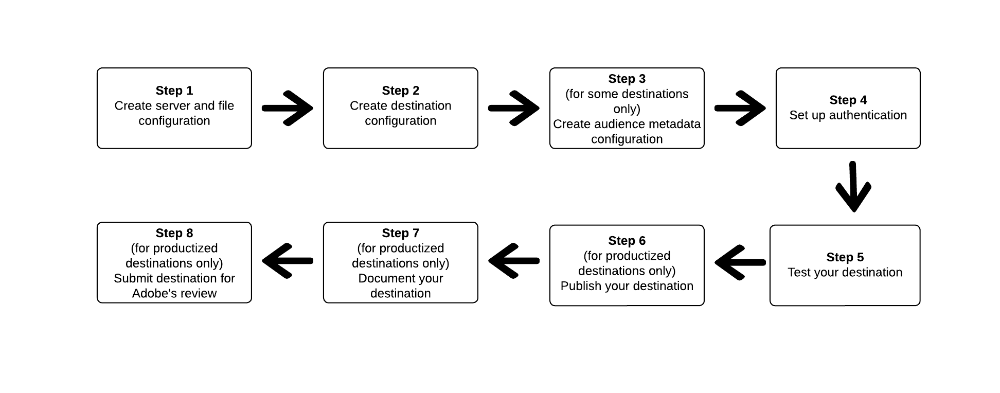

# Verwenden des Destination SDK zum Konfigurieren eines dateibasierten Ziels

## Übersicht {#overview}

Auf dieser Seite wird beschrieben, wie Sie die Informationen in [Konfigurationsoptionen im Destination SDK](../functionality/configuration-options.md) und in anderen Destination SDK-Funktionen und API-Referenzdokumenten verwenden können, um ein [dateibasiertes Ziel](../../destination-types.md#file-based) zu konfigurieren. Die Schritte sind im Folgenden in der vorgegebenen Reihenfolge aufgeführt.

## Voraussetzungen {#prerequisites}

Bevor Sie mit den unten dargestellten Schritten fortfahren, informieren Sie sich auf der Seite [Erste Schritte mit dem Destination SDK](../getting-started.md), wie Sie die erforderlichen Adobe I/O-Authentifizierungsdaten und andere Voraussetzungen für die Arbeit mit Destination SDK-APIs erhalten.

## Schritte zum Verwenden der Konfigurationsoptionen im Destination SDK zum Einrichten Ihres Ziels {#steps}



## Schritt 1: Erstellen einer Server- und Dateikonfiguration {#create-server-file-configuration}

Beginnen bei [Erstellen einer Server- und Dateikonfiguration](../authoring-api/destination-server/create-destination-server.md) mithilfe der `/destinations-server` -Endpunkt.

Nachfolgend finden Sie eine Beispielkonfiguration für ein [!DNL Amazon S3]-Ziel. Informationen zum Konfigurieren anderer Typen dateibasierter Ziele finden Sie in den entsprechenden [Server-Konfigurationen](../functionality/destination-server/server-specs.md).

**API-Format**

```shell
POST platform.adobe.io/data/core/activation/authoring/destination-servers
```

```json
{
    "name": "S3 destination",
    "destinationServerType": "FILE_BASED_S3",
    "fileBasedS3Destination": {
        "bucketName": {
            "templatingStrategy": "PEBBLE_V1",
            "value": "{{customerData.bucketName}}"
        },
        "path": {
            "templatingStrategy": "PEBBLE_V1",
            "value": "{{customerData.path}}"
        }
    },
    "fileConfigurations": {
        "compression": {
            "templatingStrategy": "PEBBLE_V1",
            "value": "{{customerData.compression}}"
        },
        "fileType": {
            "templatingStrategy": "PEBBLE_V1",
            "value": "{{customerData.fileType}}"
        },
        "csvOptions": {
            "quote": {
                "templatingStrategy": "NONE",
                "value": "\""
            },
            "quoteAll": {
                "templatingStrategy": "NONE",
                "value": "false"
            },
            "escape": {
                "templatingStrategy": "NONE",
                "value": "\\"
            },
            "escapeQuotes": {
                "templatingStrategy": "NONE",
                "value": "true"
            },
            "header": {
                "templatingStrategy": "NONE",
                "value": "true"
            },
            "ignoreLeadingWhiteSpace": {
                "templatingStrategy": "NONE",
                "value": "true"
            },
            "ignoreTrailingWhiteSpace": {
                "templatingStrategy": "NONE",
                "value": "true"
            },
            "nullValue": {
                "templatingStrategy": "NONE",
                "value": ""
            },
            "dateFormat": {
                "templatingStrategy": "NONE",
                "value": "yyyy-MM-dd"
            },
            "timestampFormat": {
                "templatingStrategy": "NONE",
                "value": "yyyy-MM-dd'T':mm:ss[.SSS][XXX]"
            },
            "charToEscapeQuoteEscaping": {
                "templatingStrategy": "NONE",
                "value": "\\"
            },
            "emptyValue": {
                "templatingStrategy": "NONE",
                "value": ""
            }
        }
    }
}
```

## Schritt 2: Erstellen einer Zielkonfiguration {#create-destination-configuration}

Unten sehen Sie ein Beispiel für eine Zielkonfiguration, die mithilfe des API-Endpunkts `/destinations` erstellt wurde.

Um die Server- und Dateikonfiguration in Schritt 1 mit dieser Zielkonfiguration zu verbinden, fügen Sie die Instanz-ID des Servers und die Vorlagenkonfiguration hier als `destinationServerId` hinzu.

**API-Format**

```http
POST platform.adobe.io/data/core/activation/authoring/destinations
```

```json {line-numbers="true" highlight="84"}
{
    "name": "Amazon S3 destination",
    "description": "Amazon S3 destination is a fictional destination, used for this example.",
    "status": "Test",
    "customerAuthenticationConfigurations": [
        {
            "authType": "S3"
        }
    ],
    "customerEncryptionConfigurations": [],
    "customerDataFields": [
        {
            "name": "bucketName",
            "title": "Amazon S3 bucket name",
            "description": "Enter the Amazon S3 Bucket name that will host the exported files.",
            "type": "string",
            "isRequired": true,
            "pattern": "(?=^.{3,63}$)(?!^(\\d+\\.)+\\d+$)(^(([a-z0-9]|[a-z0-9][a-z0-9\\-]*[a-z0-9])\\.)*([a-z0-9]|[a-z0-9][a-z0-9\\-]*[a-z0-9])$)",
            "readOnly": false,
            "hidden": false
        },
        {
            "name": "path",
            "title": "Amazon S3 path",
            "description": "Enter Amazon S3 folder path",
            "type": "string",
            "isRequired": true,
            "pattern": "^[0-9a-zA-Z\\/\\!\\-_\\.\\*\\''\\(\\)]*((\\%SEGMENT_(NAME|ID)\\%)?\\/?)+$",
            "readOnly": false,
            "hidden": false
        },
        {
            "name": "compression",
            "title": "Select compression type",
            "description": "Select the file compression type used by the exported files.",
            "type": "string",
            "isRequired": true,
            "readOnly": false,
            "enum": [
                "GZIP",
                "NONE",
                "bzip2",
                "lz4",
                "snappy",
                "deflate"
            ]
        },
        {
            "name": "fileType",
            "title": "Select a file format",
            "description": "Select the file format to be used by the exported files.",
            "type": "string",
            "isRequired": true,
            "readOnly": false,
            "hidden": false,
            "enum": [
                "csv",
                "json",
                "parquet"
            ],
            "default": "csv"
        }
    ],
    "uiAttributes": {
        "documentationLink": "https://www.adobe.io/apis/experienceplatform.html",
        "category": "S3",
        "connectionType": "S3",
        "flowRunsSupported": true,
        "monitoringSupported": true,
        "frequency": "Batch"
    },
    "destinationDelivery": [
        {
            "deliveryMatchers": [
                {
                    "type": "SOURCE",
                    "value": [
                        "batch"
                    ]
                }
            ],
            "authenticationRule": "CUSTOMER_AUTHENTICATION",
            "destinationServerId": "eec25bde-4f56-4c02-a830-9aa9ec73ee9d"
        }
    ],
    "schemaConfig": {
        "profileRequired": true,
        "segmentRequired": true,
        "identityRequired": true
    },
    "batchConfig": {
        "allowMandatoryFieldSelection": true,
        "allowDedupeKeyFieldSelection": true,
        "defaultExportMode": "DAILY_FULL_EXPORT",
        "allowedExportMode": [
            "DAILY_FULL_EXPORT",
            "FIRST_FULL_THEN_INCREMENTAL"
        ],
        "allowedScheduleFrequency": [
            "DAILY",
            "EVERY_3_HOURS",
            "EVERY_6_HOURS",
            "EVERY_8_HOURS",
            "EVERY_12_HOURS",
            "ONCE"
        ],
        "defaultFrequency": "DAILY",
        "defaultStartTime": "00:00"
    },
    "backfillHistoricalProfileData": true
}
```

## Schritt 3: Erstellen einer Zielgruppen-Metadatenkonfiguration {#create-audience-metadata-configuration}

Für einige Ziele erfordert das Destination SDK, dass Sie eine Zielgruppen-Metadatenkonfiguration konfigurieren, um Zielgruppen in Ihrem Ziel programmgesteuert zu erstellen, zu aktualisieren oder zu löschen. Informationen dazu, wann Sie diese Konfiguration einrichten müssen und wie Sie sie durchführen, finden Sie unter [Zielgruppen-Metadatenverwaltung](../functionality/audience-metadata-management.md).

Wenn Sie eine Zielgruppen-Metadatenkonfiguration verwenden, müssen Sie diese mit der Zielkonfiguration verbinden, die Sie in Schritt 2 erstellt haben. Fügen Sie die Instanz-ID Ihrer Zielgruppen-Metadatenkonfiguration als `audienceTemplateId` zu Ihrer Zielkonfiguration hinzu.

```json {line-numbers="true" highlight="91"}
{
    "name": "Amazon S3 destination",
    "description": "Amazon S3 destination is a fictional destination, used for this example.",
    "status": "Test",
    "customerAuthenticationConfigurations": [
        {
            "authType": "S3"
        }
    ],
    "customerEncryptionConfigurations": [],
    "customerDataFields": [
        {
            "name": "bucketName",
            "title": "Amazon S3 bucket name",
            "description": "Enter the Amazon S3 Bucket name that will host the exported files.",
            "type": "string",
            "isRequired": true,
            "pattern": "(?=^.{3,63}$)(?!^(\\d+\\.)+\\d+$)(^(([a-z0-9]|[a-z0-9][a-z0-9\\-]*[a-z0-9])\\.)*([a-z0-9]|[a-z0-9][a-z0-9\\-]*[a-z0-9])$)",
            "readOnly": false,
            "hidden": false
        },
        {
            "name": "path",
            "title": "Amazon S3 path",
            "description": "Enter Amazon S3 folder path",
            "type": "string",
            "isRequired": true,
            "pattern": "^[0-9a-zA-Z\\/\\!\\-_\\.\\*\\''\\(\\)]*((\\%SEGMENT_(NAME|ID)\\%)?\\/?)+$",
            "readOnly": false,
            "hidden": false
        },
        {
            "name": "compression",
            "title": "Select compression type",
            "description": "Select the file compression type used by the exported files.",
            "type": "string",
            "isRequired": true,
            "readOnly": false,
            "enum": [
                "GZIP",
                "NONE",
                "bzip2",
                "lz4",
                "snappy",
                "deflate"
            ]
        },
        {
            "name": "fileType",
            "title": "Select a file format",
            "description": "Select the file format to be used by the exported files.",
            "type": "string",
            "isRequired": true,
            "readOnly": false,
            "hidden": false,
            "enum": [
                "csv",
                "json",
                "parquet"
            ],
            "default": "csv"
        }
    ],
    "uiAttributes": {
        "documentationLink": "https://www.adobe.io/apis/experienceplatform.html",
        "category": "S3",
        "connectionType": "S3",
        "flowRunsSupported": true,
        "monitoringSupported": true,
        "frequency": "Batch"
    },
    "destinationDelivery": [
        {
            "deliveryMatchers": [
                {
                    "type": "SOURCE",
                    "value": [
                        "batch"
                    ]
                }
            ],
            "authenticationRule": "CUSTOMER_AUTHENTICATION",
            "destinationServerId": "eec25bde-4f56-4c02-a830-9aa9ec73ee9d"
        }
    ],
    "audienceMetadataConfig":{
    "mapExperiencePlatformSegmentName":false,
    "mapExperiencePlatformSegmentId":false,
    "mapUserInput":false,
    "audienceTemplateId":"cbf90a70-96b4-437b-86be-522fbdaabe9c"
    },   
    "schemaConfig": {
        "profileRequired": true,
        "segmentRequired": true,
        "identityRequired": true
    },
    "batchConfig": {
        "allowMandatoryFieldSelection": true,
        "allowDedupeKeyFieldSelection": true,
        "defaultExportMode": "DAILY_FULL_EXPORT",
        "allowedExportMode": [
            "DAILY_FULL_EXPORT",
            "FIRST_FULL_THEN_INCREMENTAL"
        ],
        "allowedScheduleFrequency": [
            "DAILY",
            "EVERY_3_HOURS",
            "EVERY_6_HOURS",
            "EVERY_8_HOURS",
            "EVERY_12_HOURS",
            "ONCE"
        ],
        "defaultFrequency": "DAILY",
        "defaultStartTime": "00:00"
    },
    "backfillHistoricalProfileData": true
}
```

## Schritt 4: Einrichten der Authentifizierung {#set-up-authentication}

Je nachdem, ob Sie `"authenticationRule": "CUSTOMER_AUTHENTICATION"` oder `"authenticationRule": "PLATFORM_AUTHENTICATION"` in der obigen Zielkonfiguration angeben, können Sie die Authentifizierung für Ihr Ziel einrichten, indem Sie den Endpunkt `/destination` oder `/credentials` verwenden.

* Wenn Sie in der Zielkonfiguration `"authenticationRule": "CUSTOMER_AUTHENTICATION"` ausgewählt haben, finden Sie in den folgenden Abschnitten Informationen zu den Authentifizierungstypen, die vom Destination SDK für dateibasierte Ziele unterstützt werden:

   * [Amazon S3-Authentifizierung](../functionality/destination-configuration/customer-authentication.md#s3)
   * [Azure Blob](../functionality/destination-configuration/customer-authentication.md#blob)
   * [Azure Data Lake Storage](../functionality/destination-configuration/customer-authentication.md#adls)
   * [Google Cloud Storage](../functionality/destination-configuration/customer-authentication.md#gcs)
   * [SFTP-Authentifizierung mit SSH-Schlüssel](../functionality/destination-configuration/customer-authentication.md#sftp-ssh)
   * [SFTP-Authentifizierung mit Passwort](../functionality/destination-configuration/customer-authentication.md#sftp-password)

* Wenn Sie `"authenticationRule": "PLATFORM_AUTHENTICATION"`, siehe [Dokumentation zur API für die Anmeldekonfiguration](../credentials-api/create-credential-configuration.md#when-to-use).


## Schritt 5: Testen des Ziels {#test-destination}

Nachdem Sie das Ziel mit den Konfigurationsendpunkten in den vorherigen Schritten eingerichtet haben, können Sie das [Zieltest-Tool](../testing-api/batch-destinations/file-based-destination-testing-overview.md) verwenden, um die Integration zwischen Adobe Experience Platform und Ihrem Ziel zu testen.

Im Rahmen des Testvorgangs Ihres Ziels müssen Sie die Experience Platform-Benutzeroberfläche zum Erstellen von Segmenten verwenden, die Sie für Ihr Ziel aktivieren. Anweisungen zum Erstellen von Zielgruppen in Experience Platform finden Sie in den beiden unten stehenden Ressourcen:

* [Erstellen einer Dokumentationsseite für Zielgruppen](/help/segmentation/ui/overview.md#create-segment)
* [Videoeinführung zum Erstellen einer Zielgruppe](https://experienceleague.adobe.com/docs/platform-learn/tutorials/segments/create-segments.html)

## Schritt 6: Veröffentlichen des Ziels {#publish-destination}

>[!NOTE]
>
>Dieser Schritt ist nicht erforderlich, wenn Sie ein privates Ziel für Ihre eigene Verwendung erstellen und es nicht im Zielkatalog veröffentlichen möchten, damit andere Kunden ihn verwenden können.

Verwenden Sie nach dem Konfigurieren und Testen Ihres Ziels die [Zielveröffentlichungs-API](../publishing-api/create-publishing-request.md), um Ihre Konfiguration zur Überprüfung an Adobe zu senden.

## Schritt 7: Dokumentieren des Ziels {#document-destination}

>[!NOTE]
>
>Dieser Schritt ist nicht erforderlich, wenn Sie ein privates Ziel für Ihre eigene Verwendung erstellen und es nicht im Zielkatalog veröffentlichen möchten, damit andere Kunden ihn verwenden können.

Wenn Sie ein unabhängiger Software-Anbieter (ISV) oder Systemintegrator (SI) sind, der eine [produktbezogene Integration](../overview.md#productized-custom-integrations) erstellt, verwenden Sie den [Self-Service-Dokumentationsprozess](../docs-framework/documentation-instructions.md), um eine Produktdokumentationsseite für Ihr Ziel im [Experience Platform-Zielkatalog](/help/destinations/catalog/overview.md) zu erstellen.

## Schritt 8: Senden des Ziels für die Adobe-Überprüfung {#submit-for-review}

>[!NOTE]
>
>Dieser Schritt ist nicht erforderlich, wenn Sie ein privates Ziel für Ihre eigene Verwendung erstellen und es nicht im Zielkatalog veröffentlichen möchten, damit andere Kunden ihn verwenden können.

Bevor das Ziel im Experience Platform-Katalog veröffentlicht und für alle Experience Platform-Kunden sichtbar ist, müssen Sie das Ziel offiziell zur Adobe-Überprüfung einreichen. Vollständige Informationen zum [zur Überprüfung eines in der Destination SDK erstellten produktiven Ziels einreichen](../guides/submit-destination.md).
