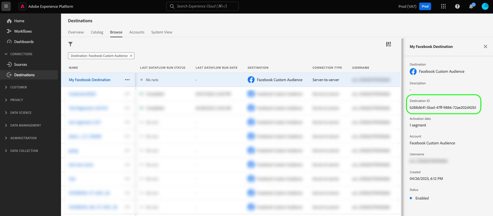
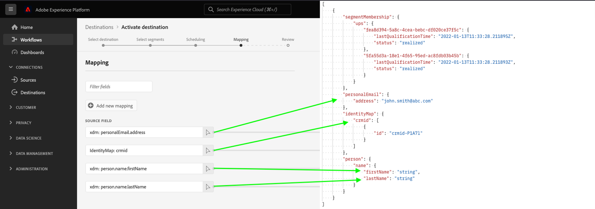

# Generieren von Beispielprofilen basierend auf einem Quellschema

Der erste Schritt beim Testen Ihres dateibasierten Ziels besteht darin, den Endpunkt `/sample-profiles` zu verwenden, um ein Beispielprofil zu generieren, das auf Ihrem vorhandenen Quellschema basiert.

Beispielprofile können Ihnen dabei helfen, die JSON-Struktur eines Profils zu verstehen. Darüber hinaus erhalten Sie eine Standardeinstellung, die Sie mit Ihren eigenen Profildaten anpassen können, um weitere Zieltests durchzuführen.

## Erste Schritte {#getting-started}

Bevor Sie fortfahren, lesen Sie den Abschnitt [Erste Schritte](../../getting-started.md). Dort erhalten Sie wichtige Informationen darüber, wie Sie die API aufrufen und die erforderliche Authoring-Berechtigung für Ziele und die Kopfzeilen abrufen können.

## Voraussetzungen {#prerequisites}

Bevor Sie den Endpunkt `/sample-profiles` verwenden, stellen Sie sicher, dass Sie die folgenden Bedingungen erfüllen:

* Sie haben ein vorhandenes dateibasiertes Ziel, das über das Destination SDK erstellt wurde, und Sie können es in Ihrem [Zielkatalog](../../../ui/destinations-workspace.md) sehen.
* Sie haben in der Experience Platform-Benutzeroberfläche mindestens einen Aktivierungsfluss für Ihr Ziel erstellt. Der Endpunkt `/sample-profiles` erstellt die Profile basierend auf dem Quellschema, das Sie in Ihrem Aktivierungsablauf definiert haben. Im [Aktivierungs-Tutorial](../../../ui/activate-batch-profile-destinations.md) erfahren Sie, wie Sie einen Aktivierungsfluss erstellen.
* Für eine erfolgreiche API-Anfrage benötigen Sie die Ziel-Instanz-ID, die der zu testenden Zielinstanz entspricht. Rufen Sie die Ziel-Instanz-ID ab, die Sie beim Durchsuchen einer Verbindung mit Ihrem Ziel in der Experience Platform-Benutzeroberfläche im API-Aufruf über die URL verwenden sollten.

  

## Generieren von Beispielprofilen für Zieltests {#generate-sample-profiles}

Sie können Beispielprofile basierend auf Ihrem Quellschema generieren, indem Sie eine GET-Anfrage an den Endpunkt `/sample-profiles` mit der Ziel-Instanz-ID des Ziels stellen, das Sie testen möchten.

**API-Format**

```http
GET /authoring/sample-profiles?destinationInstanceId={DESTINATION_INSTANCE_ID}&count={NUMBER_OF_GENERATED_PROFILES}
```

| Abfrageparameter | Beschreibung |
| -------- | ----------- |
| `destinationInstanceId` | Die ID der Zielinstanz, für die Sie Beispielprofile generieren. Im Abschnitt [Voraussetzungen](#prerequisites) finden Sie weitere Informationen zum Abrufen dieser ID. |
| `count` | *Optional*. Die Anzahl der Beispielprofile, die Sie generieren möchten. Der Parameter kann Werte von `1 - 1000` annehmen. Wenn diese Eigenschaft nicht definiert ist, generiert die API ein einzelnes Beispielprofil. |

**Anfrage**

Die folgende Anfrage generiert ein Beispielprofil basierend auf dem in der Zielinstanz definierten Quellschema mit der entsprechenden `destinationInstanceId`.

```shell
curl -X GET 'https://platform.adobe.io/data/core/activation/authoring/sample-profiles?destinationInstanceId={DESTINATION_INSTANCE_ID}' \
 -H 'Authorization: Bearer {ACCESS_TOKEN}' \
 -H 'Content-Type: application/json' \
 -H 'x-gw-ims-org-id: {IMS_ORG}' \
 -H 'x-api-key: {API_KEY}' \
 -H 'x-sandbox-name: {SANDBOX_NAME}' \
```

**Antwort**

Bei einer erfolgreichen Antwort wird der HTTP-Status 200 mit der angegebenen Anzahl von Beispielprofilen zurückgegeben, mit Zielgruppenzugehörigkeit, Identitäten und Profilattributen, die dem Quell-XDM-Schema entsprechen.

>[!NOTE]
>
> Die Antwort gibt nur Zielgruppenzugehörigkeiten, Identitäten und Profilattribute zurück, die in der Zielinstanz verwendet werden. Selbst wenn Ihr Quellschema andere Felder enthält, werden diese ignoriert.

```json
[
   {
      "segmentMembership":{
         "ups":{
            "fea8d394-5a8c-4cea-bebc-df020ce37f5c":{
               "lastQualificationTime":"2022-01-13T11:33:28.211895Z",
               "status":"realized"
            },
            "5fa55d3a-18e1-4f65-95ed-ac8fdb03b45b":{
               "lastQualificationTime":"2022-01-13T11:33:28.211893Z",
               "status":"realized"
            }
         }
      },
      "personalEmail":{
         "address":"john.smith@abc.com"
      },
      "identityMap":{
         "crmid":[
            {
               "id":"crmid-P1A7l"
            }
         ]
      },
      "person":{
         "name":{
            "firstName":"string",
            "lastName":"string"
         }
      }
   }
]
```



| Eigenschaft | Beschreibung |
| -------- | ----------- |
| `segmentMembership` | Ein Zuordnungsobjekt, das die Zielgruppenzugehörigkeiten der Person beschreibt. Weitere Informationen zu `segmentMembership` finden Sie unter [Details zur Zielgruppenzugehörigkeit](../../../../xdm/field-groups/profile/segmentation.md). |
| `lastQualificationTime` | Ein Zeitstempel, der angibt, wann sich dieses Profil zuletzt für das Segment qualifiziert hat. |
| `status` | Ein Zeichenfolgenfeld, das angibt, ob die Zielgruppenzugehörigkeit im Rahmen der aktuellen Anfrage realisiert wurde. Folgende Werte werden akzeptiert: <ul><li>`realized`: Das Profil ist Teil des Segments.</li><li>`exited`: Das Profil verlässt die Zielgruppe im Rahmen der aktuellen Anfrage.</li></ul> |
| `identityMap` | Ein Feld vom Typ „Zuordnung“, das die verschiedenen Identitätswerte einer Person zusammen mit den zugehörigen Namespaces beschreibt. Weitere Informationen zu `identityMap` finden Sie unter [Grundlage der Schemakomposition](../../../../xdm/schema/composition.md#identityMap). |

{style="table-layout:auto"}

## Umgang mit API-Fehlern {#api-error-handling}

Destination SDK-API-Endpunkte folgen den allgemeinen Grundsätzen von Experience Platform API-Fehlermeldungen. Siehe [API-Status](../../../../landing/troubleshooting.md#api-status-codes)Codes und [Fehler in der Anfragekopfzeile](../../../../landing/troubleshooting.md#request-header-errors) im Handbuch zur Fehlerbehebung bei Experience Platform.

## Nächste Schritte {#next-steps}

Nach dem Lesen dieses Dokuments wissen Sie jetzt, wie Sie Beispielprofile basierend auf dem Quellschema generieren, das Sie in Ihrem [Zielaktivierungsfluss](../../../ui/activate-batch-profile-destinations.md) konfiguriert haben.

Sie können diese Profile jetzt anpassen oder so verwenden, wie sie von der API zurückgegeben werden, um [die dateibasierte Zielkonfiguration zu testen](file-based-destination-testing-api.md).
