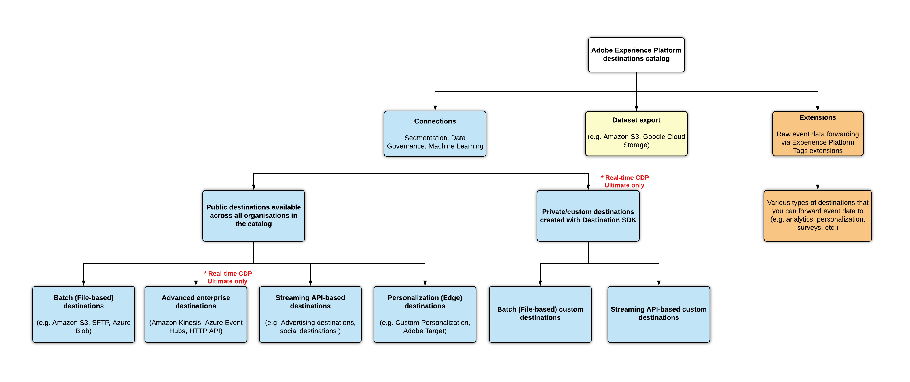

# Zieltypen und Kategorien

Lesen Sie diese Seite, um die verschiedenen Typen und Kategorien von Adobe Experience Platform-Zielen zu verstehen.

## Zieltypen {#destination-types}

In Adobe Experience Platform unterscheiden wir zwischen verschiedenen Zieltypen - Verbindungen, Datensatzexporten und Erweiterungen. Es gibt verschiedene Arten von Verbindungszielen, mit denen Sie Daten an API-basierte Ziele exportieren können.

Schließlich lassen sich Verbindungen auch zwischen öffentlichen Zielen unterscheiden, die für alle Organisationen im Zielkatalog verfügbar sind, und privaten Zielen, die Kunden mit Echtzeit-Kundendatenplattform Ultimate erstellen können, um ihre spezifischen Exportanwendungsfälle zu erfüllen.

## Verbindungen {#connections}

**[!UICONTROL Profilexport]**, **[!UICONTROL Export von Streaming-Segmenten]** und **[!DNL Edge Personalization]** Ziele in Adobe Experience Platform erfassen Ereignisdaten, kombinieren sie mit anderen Datenquellen, um die [Echtzeit-Kundenprofil](../profile/home.md), wenden Sie die Segmentierung an und exportieren Sie Segmente und qualifizierte Profile in Ziele.

## Profilexportziele {#profile-export}

Ziele von Profilexporten erhalten Rohdaten, wobei die E-Mail-Adresse oft als Primärschlüssel dient. Experience Platform unterstützt derzeit zwei Typen von Zielen von Profilexporten:

* [Exportziele für Streaming-Profile (Unternehmensziele)](#streaming-profile-export)
* [Batch-Ziele (dateibasiert)](#file-based)

### Exportziele für Streaming-Profile (Unternehmensziele) {#streaming-profile-export}

>[!IMPORTANT]
>
>Unternehmensziele oder Exportziele von Streaming-Profilen sind nur für Kunden von [Adobe Real-time Customer Data Platform Ultimate](https://helpx.adobe.com/de/legal/product-descriptions/real-time-customer-data-platform.html) verfügbar.

Verwenden Sie Data Connectors für Unternehmensziele, um Profile von Adobe Real-time Customer Data Platform nahezu in Echtzeit für interne Systeme oder andere Drittanbietersysteme zur Datensynchronisierung, Analyse und weiteren Anwendungsfällen der Profilanreicherung bereitzustellen.

Diese Ziele erhalten Segment- und Profildaten als Datenströme von Experience Platform.

Zu den Unternehmenszielen gehören:

* [HTTP-API-Ziel](catalog/streaming/http-destination.md)
* [Amazon Kinesis](catalog/cloud-storage/amazon-kinesis.md)
* [Azure Event Hubs](catalog/cloud-storage/azure-event-hubs.md)

### Batch-Ziele (dateibasiert) {#file-based}

Dateibasierte Ziele empfangen `.csv`-Dateien, die Profile und/oder Attribute enthalten. [Amazon S3](catalog/cloud-storage/amazon-s3.md) ist ein Beispiel für ein Ziel, zu dem Sie Dateien mit Profilexporten exportieren können.

## Exportziele für Streaming-Segmente {#streaming-destinations}

Ziele von Segmentexporten erhalten Daten zu Segmenten von Experience Platform. Diese Ziele nutzen Segment-IDs oder Anwender-IDs. Werbung und Social-Media-Ziele wie [[!DNL Google Display & Video 360]](catalog/advertising/google-dv360.md), [[!DNL Google Ads]](catalog/advertising/google-ads-destination.md) oder [Facebook](catalog/social/facebook.md) sind Beispiele für solche Ziele.

## Edge-Personalisierungsziele {#edge-personalization-destinations}

Zu den Edge-Personalisierungszielen in Experience Platform gehören [Adobe Target](/help/destinations/catalog/personalization/adobe-target-connection.md) und das [benutzerdefinierte Personalisierungsziel](/help/destinations/catalog/personalization/custom-personalization.md). Mithilfe dieser Ziele können Sie Anwendungsfälle für die Personalisierung von der gleichen Seite und der nächsten Seite für Ihre Kunden aktivieren.

Erfahren Sie mehr darüber, wie Sie [Personalisierungsziele für die Personalisierung der gleichen Seite und der nächsten Seite konfigurieren](/help/destinations/ui/configure-personalization-destinations.md).

## Ziele für Profil- und Segmentexport – Videoübersicht {#video}

Im folgenden Video werden Sie durch die Besonderheiten der beiden Zieltypen geführt:

>[!VIDEO](https://video.tv.adobe.com/v/29707?quality=12)

## (Beta) Ziele für Datensatzexporte {#dataset-export-destinations}

Einige Cloud-Speicherziele im Zielkatalog unterstützen Datensatzexporte. Verwenden Sie diese Ziele, um Rohdatensätze an Cloud-Speicherorte zu exportieren.

Weitere Informationen zum [Exportieren von Datensätzen](/help/destinations/ui/export-datasets.md).

## Erweiterungen {#extensions}

Platform nutzt die Leistungsfähigkeit und Flexibilität des Tag-Managements, sodass Sie Tag-Erweiterungen in der Benutzeroberfläche konfigurieren können.

>[!TIP]
>
>Ausführliche Informationen zu Tag-Erweiterungen, einschließlich Anwendungsfällen und wie sie in der Benutzeroberfläche zu finden sind, finden Sie in der [Übersicht über Tag-Erweiterungen](./catalog/launch-extensions/overview.md).

Tag-Erweiterungen leiten Rohdaten von Ereignissen an verschiedene Typen von Zielen weiter. Stellen Sie sich Erweiterungen als eine Art Ziel für die **Ereignisweiterleitung** vor. Dabei handelt es sich um eine einfachere Art der Integration mit Zielplattformen, die nur Rohdaten für Ereignisse weiterleiten. Beispiele hierfür sind die [Gainsight-Personalisierungserweiterung](./catalog/personalization/gainsight.md) oder die [Confirmit-Erweiterung „Stimme des Kunden“](./catalog/voice/confirmit-digital-feedback.md).

## Verwendung von Verbindungen und Erweiterungen {#when-to-use}

Als Marketing-Experte können Sie eine Kombination aus Verbindungen und Erweiterungen verwenden, um Ihre Anwendungsfälle zu bearbeiten.

Verbindungen sind nützlich, wenn es erforderlich ist, ein vollständiges zentralisiertes Kundenprofil oder ein Kundensegment zur Aktivierung zu nutzen. Verwenden Sie beispielsweise Verbindungen, wenn Sie Verhaltensdaten aus einem Analysesystem mit hochgeladenen CRM-Daten verbinden, um einen Benutzer für ein bestimmtes Segment zu qualifizieren, bevor Sie ihm eine personalisierte Nachricht senden.

Erweiterungen sind hilfreich, wenn Ereignisdaten zum Auslösen einer Aktion oder zur Segmentierung in einer externen Umgebung verwendet werden. Wenn beispielsweise Verhaltensdaten an ein externes System weitergeleitet werden müssen, ohne dass sie für einen bestimmten Benutzer an andere Datenquellen in der Datei angebunden werden.

## Zielkategorien {#categories}

Die Verbindungen und Erweiterungen im [Zielkatalog](https://platform.adobe.com/destination/catalog) sind nach Zielkategorie (**Werbung**, **Cloud-Speicher**, **Umfrageplattformen**, **E-Mail-Marketing** usw.) gruppiert, je nach Marketing-Aktion, zu deren Erreichung sie beitragen. Weitere Informationen zu den einzelnen Kategorien sowie zu den in den einzelnen Kategorien enthaltenen Zielen finden Sie in der [Dokumentation zum Zielkatalog](./catalog/overview.md).

