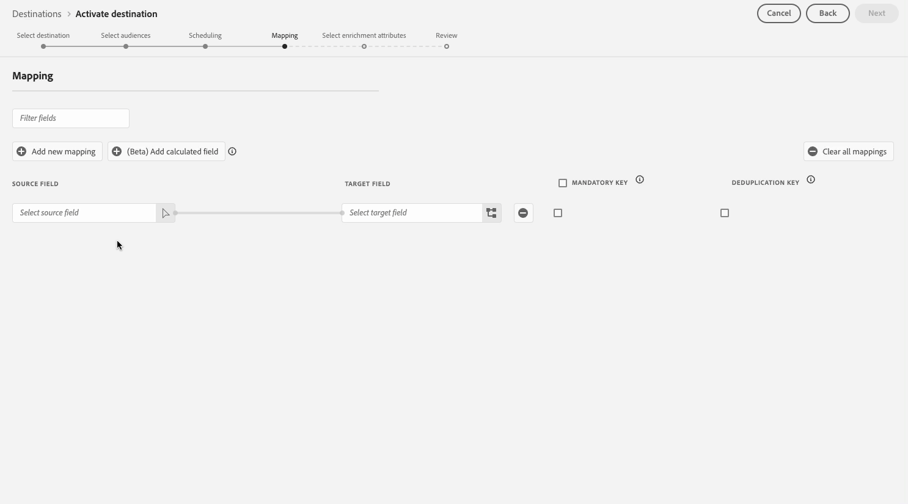
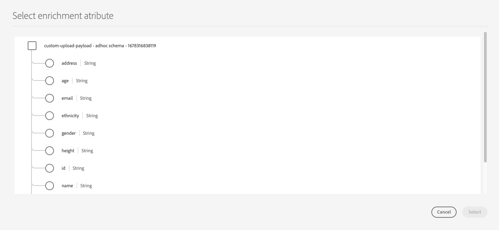

# Aktivieren von Zielgruppen für Batch-Profil-Exportziele

>[!IMPORTANT]
> 
> * Zum Aktivieren von Zielgruppen und Aktivieren [Zuordnungsschritts](#mapping) des Workflows sind die Berechtigungen **[!UICONTROL Ziele anzeigen]**, **[!UICONTROL Ziele aktivieren]**, **[!UICONTROL Profile anzeigen]** und **** Segmente anzeigen[ erforderlich](/help/access-control/home.md#permissions).
> * Um Zielgruppen zu aktivieren, ohne den [Zuordnungsschritt](#mapping) des Workflows zu durchlaufen, benötigen Sie die Berechtigungen **[!UICONTROL Ziele anzeigen]**, **[!UICONTROL Segment ohne Zuordnung aktivieren]**, **[!UICONTROL Profile anzeigen]** und **[!UICONTROL Segmente anzeigen]** [Zugriffssteuerungsberechtigungen](/help/access-control/home.md#permissions).
>* Zum Exportieren *Identitäten* benötigen Sie die Berechtigung **[!UICONTROL Identitätsdiagramm anzeigen]** [Zugriffssteuerung](/help/access-control/home.md#permissions). <br> {width="100" zoomable="yes"}
> 
> Lesen Sie die [Übersicht über die Zugriffskontrolle](/help/access-control/ui/overview.md) oder wenden Sie sich an Ihren Produktadministrator, um die erforderlichen Berechtigungen zu erhalten.

## Übersicht {#overview}

In diesem Artikel wird der Workflow erläutert, der zum Aktivieren von Zielgruppen in Adobe Experience Platform für Batch-Profil-dateibasierte Ziele erforderlich ist, z. B. Cloud-Speicher- und E-Mail-Marketing-Ziele.

## Voraussetzungen {#prerequisites}

Um Zielgruppen für Ziele aktivieren zu können, müssen Sie erfolgreich [mit einem Ziel verbunden](./connect-destination.md). Wenn Sie es noch nicht getan haben, navigieren Sie zum [Zielkatalog](../catalog/overview.md), durchsuchen Sie die unterstützten Ziele und konfigurieren Sie das Ziel, das Sie verwenden möchten.

## Unterstützte Dateiformate für den Export {#supported-file-formats-export}

Beim Exportieren von Audiences werden die folgenden Dateiformate unterstützt:

* CSV
* JSON
* Parquet

Beachten Sie, dass der Export von CSV-Dateien Ihnen mehr Flexibilität bei der Strukturierung Ihrer exportierten Dateien bietet. Lesen Sie mehr über [Dateiformatierungskonfiguration für CSV-Dateien](/help/destinations/ui/batch-destinations-file-formatting-options.md#file-configuration).

Wählen Sie das gewünschte Dateiformat für den Export aus[ wenn Sie eine Verbindung mit dem dateibasierten Ziel ](/help/destinations/ui/connect-destination.md).

## Auswählen des Ziels {#select-destination}

1. Navigieren Sie zu **[!UICONTROL Verbindungen und Ziele]** und wählen Sie die Registerkarte **[!UICONTROL Katalog]**.

   

1. Wählen Sie **[!UICONTROL Zielgruppen aktivieren]** auf der Karte, die dem Zielort entspricht, an dem Sie Ihre Zielgruppen aktivieren möchten, wie in der Abbildung unten dargestellt.

   

1. Wählen Sie die Zielverbindung aus, die Sie zum Aktivieren Ihrer Zielgruppen verwenden möchten, und klicken Sie dann auf **[!UICONTROL Weiter]**.

   

1. Gehen Sie zum nächsten Abschnitt, um [Ihre Zielgruppen auswählen](#select-audiences).

## Audiences auswählen {#select-audiences}

Um die Zielgruppen auszuwählen, die Sie für das Ziel aktivieren möchten, aktivieren Sie die Kontrollkästchen links neben den Zielgruppennamen und klicken Sie dann auf **[!UICONTROL Weiter]**.

Je nach Herkunft können Sie aus verschiedenen Arten von Zielgruppen auswählen:

* **[!UICONTROL Segmentierungs-Service]**: Zielgruppen, die in Experience Platform vom Segmentierungs-Service generiert werden. Weitere Informationen finden Sie [Segmentierungsdokumentation](../../segmentation/ui/overview.md) .
* **[!UICONTROL Benutzerdefinierter Upload]**: Zielgruppen, die außerhalb von Experience Platform generiert und als CSV-Dateien in Experience Platform hochgeladen werden. Weitere Informationen zu externen Zielgruppen finden Sie in der Dokumentation unter [Importieren einer Zielgruppe](../../segmentation/ui/audience-portal.md#import-audience). Die Auswahl von Zielgruppen aus **[!UICONTROL benutzerdefinierten Uploads]** aktiviert automatisch den Schritt [Anreicherungsattribute auswählen](#select-enrichment-attributes).
* Andere Arten von Zielgruppen, die aus anderen Adobe-Lösungen wie [!DNL Audience Manager] stammen.

>[!IMPORTANT]
>
>Beim Aktivieren benutzerdefinierter Upload-Zielgruppen für Batch-dateibasierte Ziele gibt es eine Beschränkung von 10 solcher Zielgruppen, die Sie in einem Datenfluss aktivieren können.


>[!TIP]
>
>Um Zielgruppen aus vorhandenen Aktivierungsflüssen zu entfernen, verwenden Sie die Seite **[!UICONTROL Aktivierungsdaten]** . Weitere Informationen finden Sie im Abschnitt [Entfernen mehrerer Zielgruppen aus ](../ui/destination-details-page.md#bulk-remove)-Flüssen“.

## Planen eines Zielgruppenexports {#scheduling}

>[!CONTEXTUALHELP]
>id="platform_destinations_activate_schedule"
>title="Zeitplan"
>abstract="Verwenden Sie das Stiftsymbol, um den Dateiexporttyp (vollständige Dateien oder inkrementelle Dateien) und die Exporthäufigkeit festzulegen."

>[!CONTEXTUALHELP]
>id="platform_destinations_activate_schedule_weekly_messaging"
>title="Wöchentliche Exporte"
>abstract="<sup>*</sup> Wählen Sie das Startdatum aus. Nachfolgende Exporte erfolgen bis zum ausgewählten Enddatum an diesem Wochentag."

>[!CONTEXTUALHELP]
>id="platform_destinations_activate_schedule_monthly_messaging"
>title="Monatliche Exporte"
>abstract="<sup>*</sup> Wählen Sie das Startdatum aus. Nachfolgende Exporte erfolgen bis zum ausgewählten Enddatum an diesem Datum des Monats. Bei Monaten mit weniger als 30 oder 31 Tagen erfolgt der Export am letzten Tag des Monats."

[!DNL Adobe Experience Platform] exportiert Daten für E-Mail-Marketing- und Cloud-Speicher-Ziele [verschiedene Dateitypen](#supported-file-formats-export). Auf der **[!UICONTROL Planung]** können Sie den Zeitplan und die Dateinamen für jede Audience konfigurieren, die Sie exportieren.

Experience Platform legt automatisch einen Standardzeitplan für jeden Dateiexport fest. Sie können den Standardzeitplan Ihren Anforderungen entsprechend ändern, indem Sie auf das Stiftsymbol neben jedem Zeitplan klicken und einen benutzerdefinierten Zeitplan definieren.


Um mehrere Zeitpläne gleichzeitig zu bearbeiten, aktivieren Sie die Zielgruppen, indem Sie die Kontrollkästchen auf der linken Seite des Bildschirms aktivieren, und wählen Sie dann **[!UICONTROL Zeitplan bearbeiten]**. Der konfigurierte Zeitplan wird dann auf alle exportierten Dateien für die ausgewählten Zielgruppen angewendet.


>[!TIP]
>
>Sie können Zielgruppen-Aktivierungspläne für vorhandene Aktivierungsflüsse über die Seite **[!UICONTROL Aktivierungsdaten]** bearbeiten. Weitere Informationen finden Sie in [ Dokumentation unter ](../ui/destination-details-page.md#bulk-edit-schedule) für die Massenbearbeitung .

>[!IMPORTANT]
>
>[!DNL Adobe Experience Platform] teilt die Exportdateien automatisch mit 5 Millionen Datensätzen (Zeilen) pro Datei auf. Jede Zeile stellt ein Profil dar.
>
>Bei aufgeteilten Dateien wird eine Nummer an den Namen angehängt, die anzeigt, dass die Datei Teil eines größeren Exports ist, z. B. `filename.csv`, `filename_2.csv`, `filename_3.csv`.

### Exportieren von vollständigen Dateien {#export-full-files}

>[!CONTEXTUALHELP]
>id="platform_destinations_activate_exportoptions"
>title="Dateiexportoptionen"
>abstract="Wählen Sie **Vollständige Dateien exportieren**, um einen vollständigen Schnappschuss aller Profile zu exportieren, die für die Zielgruppe qualifiziert sind. Wählen Sie **Inkrementelle Dateien exportieren**, um nur die Profile zu exportieren, die sich seit dem letzten Export für die Zielgruppe qualifiziert haben. <br> Der erste inkrementelle Dateiexport umfasst alle Profile, die für die Zielgruppe qualifiziert sind und als Aufstockung fungieren. Die folgenden inkrementellen Dateien enthalten nur die Profile, die sich seit dem ersten inkrementellen Dateiexport für die Zielgruppe qualifiziert haben."
>additional-url="https://experienceleague.adobe.com/docs/experience-platform/destinations/ui/activate/activate-batch-profile-destinations.html?lang=de#export-incremental-files" text="Exportieren von inkrementellen Dateien"

>[!CONTEXTUALHELP]
>id="platform_destinations_activationchaining_aftersegmentevaluation"
>title="Aktivieren nach der Zielgruppenauswertung"
>abstract="<p>Die Aktivierung erfolgt unmittelbar nach Abschluss des täglichen Segmentierungsvorgangs. Dadurch wird sichergestellt, dass die aktuellen Profile exportiert werden.</p><p>Die Option zum Exportieren von Profilen nach der Zielgruppenauswertung ist für wöchentliche und monatliche Exportintervalle <i>nicht</i> verfügbar.</p>"

>[!CONTEXTUALHELP]
>id="platform_destinations_activationchaining_scheduled"
>title="Geplante Aktivierung"
>abstract="Die Aktivierung erfolgt zu einer festen Tageszeit."

Wählen Sie **[!UICONTROL Vollständige Dateien exportieren]**, um den Export einer Datei mit einer vollständigen Momentaufnahme aller Profilqualifikationen für die ausgewählte Zielgruppe Trigger.


1. Verwenden Sie den **[!UICONTROL Häufigkeitsselektor]** zur Auswahl der Exportfrequenz:

   * **[!UICONTROL Einmal]**: plant einen einmaligen, bedarfsgesteuerten Export einer vollständigen Datei.
   * **[!UICONTROL Täglich]**: plant vollständige Dateiexporte einmal täglich zum angegebenen Zeitpunkt.
   * **[!UICONTROL Wöchentlich]**: Wählen Sie das Startdatum aus. Nachfolgende Exporte erfolgen an diesem Wochentag bis zum ausgewählten Enddatum.
   * **[!UICONTROL Monatlich]** Wählen Sie das Startdatum aus. Nachfolgende Exporte erfolgen an diesem Datum des Monats bis zum ausgewählten Enddatum. Bei Monaten mit weniger als 30 oder 31 Tagen erfolgt der Export am letzten Tag des Monats.

2. Verwenden Sie den Umschalter **[!UICONTROL Zeit]**, um festzulegen, ob der Export unmittelbar nach der Zielgruppenbewertung oder zu einem bestimmten, geplanten Zeitpunkt erfolgen soll. Bei Auswahl der Option **[!UICONTROL Geplant]** können Sie mit dem Selektor die Tageszeit für den Export im [!DNL UTC]-Format wählen.

   Verwenden Sie die Option **[!UICONTROL Nach der Segmentevaluierung]**, damit der Aktivierungsvorgang unmittelbar nach Abschluss des täglichen Experience Platform-Batch-Segmentierungsvorgangs ausgeführt wird. Diese Option stellt sicher, dass bei der Ausführung des Aktivierungsvorgangs die aktuellsten Profile an Ihr Ziel exportiert werden. Abhängig von Ihren Aktionen kann dies dazu führen, dass eine Zielgruppe mehrmals am Tag exportiert wird.

   >[!IMPORTANT]
   >
   >Wenn Sie [flexible Zielgruppenauswertung](../../segmentation/ui/audience-portal.md#flexible-audience-evaluation) für Zielgruppen ausführen, die bereits nach der Segmentauswertung aktiviert werden sollen, werden die Zielgruppen aktiviert, sobald der flexible Zielgruppenauswertungsauftrag abgeschlossen ist, unabhängig von vorherigen täglichen Aktivierungsaufträgen. Abhängig von Ihren Aktionen kann dies dazu führen, dass Zielgruppen mehrmals täglich exportiert werden.

   <!-- Batch segmentation currently runs at {{insert time of day}} and lasts for an average {{x hours}}. Adobe reserves the right to modify this schedule. -->

   
Verwenden Sie die Option **[!UICONTROL Geplant]**, damit der Aktivierungsvorgang zu einem festen Zeitpunkt ausgeführt wird. Diese Option stellt sicher, dass Experience Platform-Profildaten jeden Tag zur gleichen Zeit exportiert werden. Die Profile, die Sie exportieren, sind jedoch möglicherweise nicht auf dem neuesten Stand, je nachdem, ob der Batch-Segmentierungsauftrag vor dem Start des Aktivierungsauftrags abgeschlossen wurde.

   

   >[!IMPORTANT]
   >
   >Legen Sie beim Zuordnen einer Zielgruppe, die innerhalb der letzten 24 Stunden erstellt und mithilfe der [Batch-Segmentierung](../../segmentation/methods/batch-segmentation.md) ausgewertet wurde, den täglichen Exportplan so fest, dass er frühestens am folgenden Tag beginnt. Dadurch wird sichergestellt, dass der tägliche Batch-Auswertungsauftrag zuerst ausgeführt wird und Sie vollständige Zielgruppendaten exportieren.

3. Verwenden Sie den **[!UICONTROL Datumsselektor]**, um den Tag oder das Intervall auszuwählen, an dem der Export stattfinden soll. Für tägliche Exporte empfiehlt es sich, Ihr Start- und Enddatum so festzulegen, dass es der Dauer Ihrer Kampagnen auf Ihren nachgelagerten Plattformen entspricht.

   >[!IMPORTANT]
   >
   > Bei der Auswahl eines Exportintervalls wird der letzte Tag des Intervalls nicht in die Exporte einbezogen. Wenn Sie beispielsweise ein Intervall vom 4. bis 11. Januar auswählen, findet der letzte Dateiexport am 10. Januar statt.

4. Klicken Sie auf **[!UICONTROL Erstellen]**, um den Zeitplan zu speichern.

### Exportieren von inkrementellen Dateien

>[!CONTEXTUALHELP]
>id="platform_destinations_activate_something"
>title="Konfigurieren des Dateinamens"
>abstract="Bei dateibasierten Zielen wird pro Zielgruppe ein eindeutiger Dateiname generiert. Verwenden Sie den Dateinamen-Editor, um einen eindeutigen Dateinamen zu erstellen und zu bearbeiten oder den Standardnamen beizubehalten."

Wählen Sie **[!UICONTROL Inkrementelle Dateien exportieren]**, um einen Export Trigger, bei dem die erste Datei eine vollständige Momentaufnahme aller Profilqualifikationen für die ausgewählte Zielgruppe ist und die nachfolgenden Dateien aus den inkrementellen Profilqualifikationen seit dem letzten Export bestehen.

>[!IMPORTANT]
>
>Die erste exportierte inkrementelle Datei enthält alle Profile, die für eine Zielgruppe qualifiziert sind und als Aufstockung fungieren.


1. Verwenden Sie den **[!UICONTROL Häufigkeitsselektor]** zur Auswahl der Exportfrequenz:

   * **[!UICONTROL Täglich]**: plant inkrementelle Dateiexporte einmal täglich zum angegebenen Zeitpunkt.
   * **[!UICONTROL Stündlich]**: plant inkrementelle Dateiexporte alle 3, 6, 8 oder 12 Stunden.


2. Verwenden Sie den **[!UICONTROL Zeitselektor]** zur Auswahl der Tageszeit im Format [!DNL UTC], zu der der Export erfolgen soll.

3. Verwenden Sie den **[!UICONTROL Datumsselektor]**, um das Intervall auszuwählen, in dem der Export stattfinden soll. Es empfiehlt sich, Ihr Start- und Enddatum so festzulegen, dass es der Dauer Ihrer Kampagnen auf Ihren nachgelagerten Plattformen entspricht.

   >[!IMPORTANT]
   >
   >Der letzte Tag des Intervalls ist nicht in den Exporten enthalten. Wenn Sie beispielsweise ein Intervall vom 4. bis 11. Januar auswählen, findet der letzte Dateiexport am 10. Januar statt.

4. Klicken Sie auf **[!UICONTROL Erstellen]**, um den Zeitplan zu speichern.

### Konfigurieren der Dateinamen {#configure-file-names}

>[!CONTEXTUALHELP]
>id="platform_destinations_activate_filename"
>title="Konfigurieren des Dateinamens"
>abstract="Bei dateibasierten Zielen wird pro Zielgruppe ein eindeutiger Dateiname generiert. Verwenden Sie den Dateinamen-Editor, um einen eindeutigen Dateinamen zu erstellen und zu bearbeiten oder den Standardnamen beizubehalten."

Bei den meisten Zielen bestehen die standardmäßigen Dateinamen aus dem Zielnamen, der Zielgruppen-ID sowie einer Datums- und Uhrzeitangabe. Sie können beispielsweise Ihre exportierten Dateinamen bearbeiten, um zwischen verschiedenen Kampagnen zu unterscheiden, oder die Datenexportzeit an die Dateien anhängen zu lassen. Beachten Sie, dass manche Zielentwickler möglicherweise festlegen, dass für ihre Ziele andere Optionen zum Anhängen von standardmäßigen Dateinamen angezeigt werden.

Um ein modales Fenster zu öffnen und die Dateinamen zu bearbeiten, klicken Sie auf das Stiftsymbol. Dateinamen sind auf 255 Zeichen begrenzt.

>[!NOTE]
>
>Die folgende Abbildung zeigt, wie Dateinamen für [!DNL Amazon S3]-Ziele bearbeitet werden können, aber der Vorgang ist für alle Batch-Ziele identisch (z. B. SFTP, [!DNL Azure Blob Storage] oder [!DNL Google Cloud Storage]).


Im Dateinamen-Editor können Sie verschiedene Komponenten auswählen, die zum Dateinamen hinzugefügt werden sollen.


Zielname und Zielgruppen-ID können nicht aus Dateinamen entfernt werden. Zusätzlich zu diesen Optionen können Sie die folgenden Optionen hinzufügen:

| Dateinamenoption | Beschreibung |
|---------|----------|
| **[!UICONTROL Zielgruppenname]** | Der Name der exportierten Zielgruppe. |
| **[!UICONTROL Datum und Uhrzeit]** | Wählen Sie zwischen dem Hinzufügen eines `MMDDYYYY_HHMMSS` Formats oder eines 10-stelligen UNIX-Zeitstempels für den Zeitpunkt, zu dem die Dateien generiert werden. Wählen Sie eine dieser Optionen aus, wenn für Ihre Dateien bei jedem inkrementellen Export ein dynamischer Dateiname erstellt werden soll. |
| **[!UICONTROL Benutzerdefinierter Text]** | Beliebiger benutzerdefinierter Text, den Sie den Dateinamen hinzufügen möchten. |
| **[!UICONTROL Ziel-ID]** | Die ID des Ziel-Datenflusses, den Sie zum Exportieren der Zielgruppe verwenden. |
| **[!UICONTROL Zielname]** | Der Name des Ziel-Datenflusses, den Sie zum Exportieren der Zielgruppe verwenden. |
| **[!UICONTROL Organisationsname]** | Ihr Organisationsname in Experience Platform. |
| **[!UICONTROL Sandbox-Name]** | Die ID der Sandbox, die Sie zum Exportieren der Zielgruppe verwenden. |

{style="table-layout:auto"}

Um mehrere Dateinamen gleichzeitig zu bearbeiten, aktivieren Sie die Zielgruppen, indem Sie die Kontrollkästchen auf der linken Seite des Bildschirms aktivieren, und wählen Sie dann **[!UICONTROL Dateinamen bearbeiten]**. Die von Ihnen konfigurierten Dateinamenoptionen werden dann für die ausgewählten Zielgruppen auf alle exportierten Dateien angewendet.


Klicken Sie auf **[!UICONTROL Änderungen übernehmen]**, um Ihre Auswahl zu bestätigen.

>[!IMPORTANT]
> 
>Wenn Sie die Komponente **[!UICONTROL Datum und Uhrzeit]** nicht verwenden, sind die Dateinamen statisch und die neue exportierte Datei überschreibt die vorherige Datei an Ihrem Speicherort bei jedem Export. Diese Option wird bei der Ausführung eines wiederkehrenden Importvorgangs von einem Speicherort zu einer E-Mail-Marketing-Plattform empfohlen.

Nachdem Sie alle Zielgruppen konfiguriert haben, klicken Sie auf **[!UICONTROL Weiter]**, um fortzufahren.

## Zuordnung {#mapping}

In diesem Schritt müssen Sie die Profilattribute auswählen, die Sie zu den an das Ziel exportierten Dateien hinzufügen möchten. So wählen Sie Profilattribute und Identitäten für den Export aus:

1. Wählen Sie auf **[!UICONTROL Seite]** Zuordnung“ **[!UICONTROL Neue Zuordnung hinzufügen]** aus.

   

1. Wählen Sie den Pfeil rechts neben dem Eintrag **[!UICONTROL Quellfeld]** aus.

   

1. Wählen Sie auf der Seite **[!UICONTROL Quellfeld auswählen]** die Profilattribute und Identitäten aus, die Sie in die exportierten Dateien am Ziel einbeziehen möchten, und wählen Sie dann **[!UICONTROL Auswählen]**.

   >[!TIP]
   > 
   >Sie können das Suchfeld verwenden, um die Auswahl einzugrenzen, wie in der Abbildung unten dargestellt.

   Verwenden Sie den Umschalter **[!UICONTROL Nur Felder mit Daten anzeigen]**, um nur Schemafelder anzuzeigen, die mit Werten gefüllt sind. Standardmäßig werden nur ausgefüllte Schemafelder angezeigt.

   


1. Das für den Export ausgewählte Feld wird jetzt in der Zuordnungsansicht angezeigt. Bei Bedarf können Sie den Namen des Headers in der exportierten Datei bearbeiten. Wählen Sie dazu das Symbol im Zielfeld aus.

   

1. Geben Sie auf der Seite **[!UICONTROL Zielfeld auswählen]** den gewünschten Namen für den Header in der exportierten Datei ein und wählen Sie **[!UICONTROL Auswählen]**.

   

1. Das für den Export ausgewählte Feld wird jetzt in der Zuordnungsansicht mit dem bearbeiteten Header in der exportierten Datei angezeigt.

   

1. (Optional) Die Reihenfolge der zugeordneten Felder in der Benutzeroberfläche entspricht der Reihenfolge der Spalten in der exportierten CSV-Datei, von oben nach unten, wobei die oberste Zeile die Spalte in der CSV-Datei ganz links ist. Sie können die zugeordneten Felder beliebig neu anordnen, indem Sie die Zuordnungszeilen per Drag-and-Drop verschieben, wie unten dargestellt.

   >[!NOTE]
   >
   >Diese Funktion befindet sich in der Beta-Phase und steht nur ausgewählten Kunden zur Verfügung. Wenden Sie sich an Ihren Adobe-Support-Mitarbeiter, um Zugriff auf diese Funktion zu erhalten.

   

1. (Optional) Sie können das exportierte Feld als [obligatorischen Schlüssel](#mandatory-keys) oder [Deduplizierungsschlüssel](#deduplication-keys) festlegen.

   

1. Um weitere Felder zum Exportieren hinzuzufügen, wiederholen Sie die obigen Schritte.

### Obligatorische Attribute {#mandatory-attributes}

>[!CONTEXTUALHELP]
>id="platform_destinations_activate_mandatorykey"
>title="Über obligatorische Attribute"
>abstract="Wählen Sie die XDM-Schemaattribute aus, die alle exportierten Profile enthalten sollen. Profile ohne den obligatorischen Schlüssel werden nicht an das Ziel exportiert. Wenn Sie keinen obligatorischen Schlüssel auswählen, werden alle qualifizierten Profile unabhängig von ihren Attributen exportiert."

Ein obligatorisches Attribut ist ein vom Benutzer aktiviertes Kontrollkästchen, mit dem sichergestellt wird, dass alle Profildatensätze das ausgewählte Attribut enthalten. Beispiel: alle exportierten Profile enthalten eine E-Mail-Adresse.

Sie können Attribute als obligatorisch markieren, um sicherzustellen, dass [!DNL Experience Platform] nur die Profile exportiert, die das spezifische Attribut enthalten. Dies kann daher als eine zusätzliche Form des Filterns verwendet werden. Das Kennzeichnen eines Attributs als obligatorisch ist **nicht** erforderlich.

Wenn kein obligatorisches Attribut ausgewählt wird, werden alle qualifizierten Profile unabhängig von ihren Attributen exportiert.

Es wird empfohlen, dass eines der Attribute eine [eindeutige Kennung](../../destinations/catalog/email-marketing/overview.md#identity) aus Ihrem Schema ist. Weitere Informationen zu obligatorischen Attributen finden Sie im Abschnitt „Identität“ in der Dokumentation [E-Mail-Marketing-Ziele](../../destinations/catalog/email-marketing/overview.md#identity).

### Deduplizierungsschlüssel {#deduplication-keys}

>[!CONTEXTUALHELP]
>id="platform_destinations_activate_deduplicationkey"
>title="Über Deduplizierungsschlüssel"
>abstract="Beseitigen Sie mehrfach vorkommende Datensätze desselben Profils in den Exportdateien, indem Sie einen Deduplizierungsschlüssel auswählen. Sie können einen einzelnen Namespace oder bis zu zwei XDM-Schemaattribute als Deduplizierungsschlüssel auswählen. Wenn Sie keinen Deduplizierungsschlüssel auswählen, sind in den Exportdateien möglicherweise doppelte Profileinträge enthalten."

Ein Deduplizierungsschlüssel ist ein benutzerdefinierter Primärschlüssel, der die Identität bestimmt, anhand derer Benutzer ihre Profile deduplizieren lassen möchten.

Deduplizierungsschlüssel verhindern die Möglichkeit, mehrere Datensätze desselben Profils in einer Exportdatei zu haben.

Es gibt drei Möglichkeiten, Deduplizierungsschlüssel in [!DNL Experience Platform] zu verwenden:

* Verwenden eines einzelnen Identitäts-Namespace als [!UICONTROL Deduplizierungsschlüssel]
* Verwenden eines einzelnen Profilattributs aus einem [!DNL XDM]-Profil als [!UICONTROL Deduplizierungsschlüssel]
* Verwenden einer Kombination zweier Profilattribute aus einem [!DNL XDM]-Profil als zusammengesetzten Schlüssel

>[!IMPORTANT]
>
> Sie können einen einzelnen Identitäts-Namespace in ein Ziel exportieren, wobei der Namespace automatisch als Deduplizierungsschlüssel festgelegt wird. Das Senden mehrerer Namespaces an ein Ziel wird nicht unterstützt.
> 
> Sie können keine Kombination aus Identitäts-Namespaces und Profilattributen als Deduplizierungsschlüssel verwenden.

### Beispiel einer Deduplizierung {#deduplication-example}

Dieses Beispiel zeigt, wie die Deduplizierung je nach ausgewähltem Deduplizierungsschlüssel funktioniert.

Betrachten wir die beiden folgenden Profile.

**Profil A**

```json
{
  "identityMap": {
    "Email": [
      {
        "id": "johndoe_1@example.com"
      },
      {
        "id": "doejohn_1@example.com"
      }
    ]
  },
  "segmentMembership": {
    "ups": {
      "fa5c4622-6847-4199-8dd4-8b7c7c7ed1d6": {
        "status": "realized",
        "lastQualificationTime": "2021-03-10 10:03:08"
      }
    }
  },
  "person": {
    "name": {
      "lastName": "Doe",
      "firstName": "John"
    }
  },
  "personalEmail": {
    "address": "johndoe@example.com"
  }
}
```

**Profil B**

```json
{
  "identityMap": {
    "Email": [
      {
        "id": "johndoe_2@example.com"
      },
      {
        "id": "doejohn_2@example.com"
      }
    ]
  },
  "segmentMembership": {
    "ups": {
      "fa5c4622-6847-4199-8dd4-8b7c7c7ed1d6": {
        "status": "realized",
        "lastQualificationTime": "2021-04-10 11:33:28"
      }
    }
  },
  "person": {
    "name": {
      "lastName": "D",
      "firstName": "John"
    }
  },
  "personalEmail": {
    "address": "johndoe@example.com"
  }
}
```

### Deduplizierungs-Anwendungsfall 1: keine Deduplizierung {#deduplication-use-case-1}

Ohne Deduplizierung würde die Exportdatei die folgenden Einträge enthalten.

| personalEmail | firstName | lastName |
|---|---|---|
| johndoe@example.com | John | Doe |
| johndoe@example.com | John | D |


### Deduplizierungs-Anwendungsfall 2: Deduplizierung basierend auf Identitäts-Namespace {#deduplication-use-case-2}

Unter der Annahme einer Deduplizierung durch den [!DNL Email]-Namespace würde die Exportdatei die folgenden Einträge enthalten. Profil B ist das neueste Profil, das sich für die Zielgruppe qualifiziert hat. Daher wird nur dieses exportiert.

| E-Mail* | personalEmail | firstName | lastName |
|---|---|---|---|
| johndoe_2@example.com | johndoe@example.com | John | D |
| doejohn_2@example.com | johndoe@example.com | John | D |

### Deduplizierungsanwendungsfall 3: Deduplizierung basierend auf einem einzigen Profilattribut {#deduplication-use-case-3}

Angenommen, die Deduplizierung würde anhand des Attributs des Typs `personal Email` erfolgen, dann würde die Exportdatei den folgenden Eintrag enthalten. Profil B ist das neueste Profil, das sich für die Zielgruppe qualifiziert hat. Daher wird nur dieses exportiert.

| personalEmail* | firstName | lastName |
|---|---|---|
| johndoe@example.com | John | D |


### Deduplizierungsanwendungsfall 4: Deduplizierung basierend auf zwei Profilattributen {#deduplication-use-case-4}

Angenommen, die Deduplizierung würde anhand des zusammengesetzten Schlüssels `personalEmail + lastName` erfolgen, dann würde die Exportdatei die folgenden Einträge enthalten.

| personalEmail* | lastName* | firstName |
|---|---|---|
| johndoe@example.com | D | John |
| johndoe@example.com | Doe | John |

Adobe empfiehlt das Auswählen eines Identitäts-Namespace, z. B. einer [!DNL CRM ID] oder einer E-Mail-Adresse, als Deduplizierungsschlüssel, um sicherzustellen, dass alle Profildatensätze eindeutig identifiziert werden.

### Deduplizierungsverhalten für Profile mit demselben Zeitstempel {#deduplication-same-timestamp}

Beim Exportieren von Profilen an dateibasierte Ziele stellt die Deduplizierung sicher, dass nur ein Profil exportiert wird, wenn mehrere Profile denselben Deduplizierungsschlüssel und denselben Referenzzeitstempel verwenden. Dieser Zeitstempel stellt den Zeitpunkt dar, zu dem die Zielgruppenzugehörigkeit oder das Identitätsdiagramm eines Profils zuletzt aktualisiert wurde. Weitere Informationen dazu, wie Profile aktualisiert und exportiert werden, finden Sie im Dokument [Verhalten beim Profilexport](https://experienceleague.adobe.com/en/docs/experience-platform/destinations/how-destinations-work/profile-export-behavior#what-determines-a-data-export-and-what-is-included-in-the-export-2).

#### Wichtige Aspekte

* **Deterministische Auswahl**: Wenn mehrere Profile identische Deduplizierungsschlüssel und denselben Referenzzeitstempel haben, bestimmt die Deduplizierungslogik, welches Profil exportiert werden soll, indem die Werte anderer ausgewählter Spalten (ohne komplexe Typen wie Arrays, Zuordnungen oder Objekte) sortiert werden. Die sortierten Werte werden in lexikografischer Reihenfolge ausgewertet und das erste Profil wird ausgewählt.

* **Beispielszenario**

Betrachten Sie die folgenden Daten, wobei der Deduplizierungsschlüssel die `Email` Spalte ist:

| E-Mail* | first_name | last_name | Zeitstempel |
|---|---|---|---|  
| `test1@test.com` | John | Morris | 2024-10-12T09:50 |
| `test1@test.com` | John | Doe | 2024-10-12T09:50 |
| `test2@test.com` | freimütig | Smith | 2024-10-12T09:50 |

{style="table-layout:auto"}

Nach der Deduplizierung enthält die Exportdatei Folgendes:

| E-Mail* | first_name | last_name | Zeitstempel |
|---|---|---|---|  
| `test1@test.com` | John | Doe | 2024-10-12T09:50 |
| `test2@test.com` | freimütig | Smith | 2024-10-12T09:50 |

{style="table-layout:auto"}

**Erläuterung**: `test1@test.com` verwenden beide Profile denselben Deduplizierungsschlüssel und denselben Zeitstempel. Der Algorithmus sortiert die `first_name` und `last_name` Spaltenwerte lexikografisch. Da die Vornamen identisch sind, wird die Verbindung mithilfe der Spalte `last_name` aufgelöst, wobei „Doe“ vor „Morris“ steht.

**Verbesserte Zuverlässigkeit**: Dieser aktualisierte Deduplizierungsprozess stellt sicher, dass aufeinander folgende Ausführungen mit denselben Koordinaten immer dieselben Ergebnisse liefern, was die Konsistenz verbessert.

### Durchführen von Datenumwandlungen über berechnete Felder {#calculated-fields}

Sie können das Steuerelement [Berechnete Felder](/help/destinations/ui/data-transformations-calculated-fields.md) verwenden, um verschiedene Datenumwandlungen der in dateibasierte Ziele exportierten Daten durchzuführen.

### Bekannte Einschränkungen {#known-limitations}

Die neue Seite **[!UICONTROL Zuordnung]** weist die folgenden bekannten Einschränkungen auf:

#### Attribut für die Zielgruppenzugehörigkeit kann nicht über den Zuordnungs-Workflow ausgewählt werden

Aufgrund einer bekannten Einschränkung können Sie das Fenster **[!UICONTROL Feld auswählen]** derzeit nicht verwenden, um `segmentMembership.seg_namespace.seg_id.status` zu Ihren Dateiexporten hinzuzufügen. Stattdessen müssen Sie den Wert `xdm: segmentMembership.seg_namespace.seg_id.status` wie unten dargestellt manuell in das Schemafeld einfügen.




>[!NOTE]
>
>Bei Cloud-Speicher-Zielen werden der Zuordnung standardmäßig die folgenden Attribute hinzugefügt:
>
>* `segmentMembership.seg_namespace.seg_id.status`
>* `segmentMembership.seg_namespace.seg_id.lastQualificationTime`

Dateiexporte variieren auf folgende Weise, je nachdem, ob `segmentMembership.seg_namespace.seg_id.status` ausgewählt ist:

* Wenn das Feld `segmentMembership.seg_namespace.seg_id.status` ausgewählt ist, enthalten exportierte Dateien **[!UICONTROL Active]**-Elemente in der ersten vollständigen Momentaufnahme sowie neu **[!UICONTROL Active]** und **[!UICONTROL Expired]**-Elemente in nachfolgenden inkrementellen Exporten.
* Wenn die Variable `segmentMembership.seg_namespace.seg_id.status` nicht ausgewählt ist, umfassen exportierte Dateien sowohl in der ersten vollständigen Momentaufnahme als auch in nachfolgenden inkrementellen Exporten nur die **[!UICONTROL aktiven]** Mitglieder.

Weitere Informationen [Verhalten beim Profilexport für dateibasierte Ziele](/help/destinations/how-destinations-work/profile-export-behavior.md#file-based-destinations).

#### Identitäts-Namespaces derzeit nicht für Exporte auswählbar

Die Auswahl von Identitäts-Namespaces für den Export, wie in der Abbildung unten dargestellt, wird derzeit nicht unterstützt. Die Auswahl von Identitäts-Namespaces für den Export führt zu einem Fehler im **[!UICONTROL Überprüfungsschritt]**.


Wenn Sie zu Ihren exportierten Dateien während der Beta-Phase Identitäts-Namespaces hinzufügen müssen, haben Sie zur temporären Problemumgehung folgende Möglichkeiten:
* Verwenden Sie die Legacy-Cloud-Speicherziele für die Datenflüsse, bei denen Sie Identitäts-Namespaces in die Exporte einbeziehen möchten.
* Laden Sie Identitäten als Attribute in Experience Platform hoch, um sie dann in Ihre Cloud-Speicherziele zu exportieren.

## Auswählen der Profilattribute {#select-attributes}

>[!IMPORTANT]
> 
>Alle Cloud-Speicher-Ziele im Katalog können einen verbesserten [[!UICONTROL Zuordnungsschritt] sehen, ](#mapping) den in diesem Abschnitt beschriebenen **[!UICONTROL Attribute]**&quot; ersetzt.
>
>Dieser **[!UICONTROL Attribute auswählen]**-Schritt wird weiterhin für die E-Mail-Marketing-Ziele Adobe Campaign, Oracle Responsys, Oracle Eloqua und Salesforce Marketing Cloud angezeigt.

Bei profilbasierten Zielen müssen Sie die Profilattribute auswählen, die Sie an das Ziel senden möchten.

1. Wählen Sie auf der Seite **[!UICONTROL Attribute auswählen]** die Option **[!UICONTROL Neues Feld hinzufügen]**.

   

2. Wählen Sie den Pfeil rechts neben dem Eintrag **[!UICONTROL Schemafeld]**.

   

3. Wählen **[!UICONTROL auf der Seite &quot;]**&quot; die XDM-Attribute oder Identity-Namespaces aus, die Sie an das Ziel senden möchten, und wählen Sie dann **[!UICONTROL Auswählen]**.

   

4. Um weitere Zuordnungen hinzuzufügen, wiederholen Sie die Schritte 1 bis 3. 

>[!NOTE]
>
> Adobe Experience Platform füllt Ihre Auswahl vorab mit vier empfohlenen, häufig verwendeten Attributen aus Ihrem Schema: `person.name.firstName`, `person.name.lastName`, `personalEmail.address`, `segmentMembership.seg_namespace.seg_id.status`.


>[!IMPORTANT]
>
>Aufgrund einer bekannten Einschränkung können Sie das Fenster **[!UICONTROL Feld auswählen]** derzeit nicht verwenden, um `segmentMembership.seg_namespace.seg_id.status` zu Ihren Dateiexporten hinzuzufügen. Stattdessen müssen Sie den Wert `xdm: segmentMembership.seg_namespace.seg_id.status` wie unten dargestellt manuell in das Schemafeld einfügen.
>
>

Dateiexporte variieren auf folgende Weise, je nachdem, ob `segmentMembership.seg_namespace.seg_id.status` ausgewählt ist:
* Wenn das Feld `segmentMembership.seg_namespace.seg_id.status` ausgewählt ist, enthalten exportierte Dateien in der ersten vollständigen Momentaufnahme die **[!UICONTROL aktiven]** Mitglieder und in nachfolgenden inkrementellen Exporten die **[!UICONTROL aktiven]** und die **[!UICONTROL abgelaufenen]** Mitglieder.
* Wenn die Variable `segmentMembership.seg_namespace.seg_id.status` nicht ausgewählt ist, umfassen exportierte Dateien sowohl in der ersten vollständigen Momentaufnahme als auch in nachfolgenden inkrementellen Exporten nur die **[!UICONTROL aktiven]** Mitglieder.

## Auswählen von Anreicherungsattributen {#select-enrichment-attributes}

>[!CONTEXTUALHELP]
>id="platform_destinations_activate_exclude_enrichment_attributes"
>title="Ausschließen von Anreicherungsattributen"
>abstract="Aktivieren Sie diese Option, um die Profile aus den ausgewählten benutzerdefinierten, hochgeladenen Zielgruppen zu exportieren und dabei alle zugehörigen Attribute auszuschließen."

>[!IMPORTANT]
>
>Dieser Schritt wird nur angezeigt, wenn Sie im Schritt **[!UICONTROL Zielgruppenauswahl]** Zielgruppen [benutzerdefiniert hochladen](#select-audiences) ausgewählt haben.

Anreicherungsattribute entsprechen benutzerdefinierten hochgeladenen Zielgruppen, die in Experience Platform als **[!UICONTROL benutzerdefinierte Uploads“ aufgenommen]**. In diesem Schritt können Sie für jede ausgewählte externe Zielgruppe auswählen, welche Attribute Sie in Ihr Ziel exportieren möchten.


Gehen Sie wie folgt vor, um Anreicherungsattribute für jede externe Zielgruppe auszuwählen:

1. Wählen Sie in der **[!UICONTROL Anreicherungsattribute]** die Schaltfläche  (Bearbeiten) aus.
1. Wählen Sie **[!UICONTROL Anreicherungsattribut hinzufügen]** aus. Ein neues leeres Schemafeld wird angezeigt.
   
1. Klicken Sie auf die Schaltfläche rechts neben dem leeren Feld, um den Bildschirm für die Feldauswahl zu öffnen.
1. Wählen Sie die Attribute aus, die Sie für die Zielgruppe exportieren möchten.
   
1. Nachdem Sie alle Attribute hinzugefügt haben, die Sie exportieren möchten, wählen Sie **[!UICONTROL Speichern und schließen]**.
1. Wiederholen Sie diese Schritte für jede externe Zielgruppe.

Wenn Sie externe Zielgruppen für Ihre Ziele aktivieren möchten, ohne Attribute zu exportieren, aktivieren Sie den Umschalter **[!UICONTROL Anreicherungsattribute ausschließen]**. Diese Option exportiert die Profile aus den externen Zielgruppen, aber keines der entsprechenden Attribute wird an Ihr Ziel gesendet.


Wählen Sie **[!UICONTROL Weiter]** aus, um zum Schritt [Überprüfen](#review) zu wechseln.

## Überprüfung {#review}

>[!NOTE]
> 
>Wenn Datennutzungsbeschriftungen auf bestimmte Felder innerhalb eines Datensatzes angewendet wurden (und nicht auf den gesamten Datensatz), erfolgt die Durchsetzung dieser Beschriftungen auf Feldebene bei der Aktivierung unter folgenden Bedingungen:
>
>* Die Felder werden in der Zielgruppendefinition verwendet.
>* Die Felder werden als voraussichtliche Attribute für das Ziel der Zielgruppe konfiguriert.
>
> Wenn beispielsweise das Feld `person.name.firstName` über bestimmte Datennutzungsbeschriftungen verfügt, die im Konflikt mit der Marketing-Aktion des Ziels stehen, wird Ihnen im Überprüfungsschritt eine Verletzung der Datennutzungsrichtlinien angezeigt. Weitere Informationen finden Sie unter [Data Governance in Adobe Experience Platform](../../rtcdp/privacy/data-governance-overview.md#destinations).

Auf der Seite **[!UICONTROL Überprüfen]** können Sie eine Zusammenfassung Ihrer Auswahl sehen. Wählen Sie **[!UICONTROL Abbrechen]**, um den Fluss abzubrechen, **[!UICONTROL Zurück]**, um die Einstellungen zu ändern, oder **[!UICONTROL Fertig stellen]**, um Ihre Auswahl zu bestätigen und mit dem Senden von Daten an das Ziel zu beginnen.


### Auswertung der Einverständnisrichtlinie {#consent-policy-evaluation}

>[!CONTEXTUALHELP]
>id="platform_governance_policies_viewApplicableConsentPolicies"
>title="Aktuelle Einverständnisrichtlinien anzeigen"
>abstract="Wenn Ihr Unternehmen **Adobe Healthcare Shield** oder **Adobe Privacy &amp; Security Shield** erworben hat, wählen Sie **[!UICONTROL Aktuelle Einverständnisrichtlinien anzeigen]** aus, um zu sehen, welche Einverständnisrichtlinien angewendet werden und wie viele Profile in der Aktivierung enthalten sind. Diese Option ist deaktiviert, wenn Ihr Unternehmen keinen Zugriff auf die oben genannten Produkte hat."

Wenn Ihr Unternehmen **Adobe Healthcare Shield** oder **Adobe Privacy &amp; Security Shield** erworben hat, wählen Sie **[!UICONTROL Aktuelle Einverständnisrichtlinien anzeigen]** aus, um zu sehen, welche Einverständnisrichtlinien angewendet werden und wie viele Profile in der Aktivierung enthalten sind. Weitere Informationen finden [ unter ](/help/data-governance/enforcement/auto-enforcement.md#consent-policy-evaluation) der Einverständnisrichtlinie .

### Prüfung der Datennutzungsrichtlinien {#data-usage-policy-checks}

Im Schritt **[!UICONTROL Überprüfen]** prüft Experience Platform auch, ob Verstöße gegen Datennutzungsrichtlinien vorliegen. Nachstehend ist ein Beispiel angegeben, bei dem eine Richtlinie verletzt wird. Sie können den Zielgruppenaktivierungs-Workflow erst abschließen, nachdem Sie den Verstoß behoben haben. Informationen zum Beheben von Richtlinienverletzungen finden Sie unter [Verstöße gegen Datennutzungsrichtlinien](/help/data-governance/enforcement/auto-enforcement.md#data-usage-violation) im Dokumentationsabschnitt zur Data Governance.


### Audiences filtern {#filter-audiences}

In diesem Schritt können Sie auch die auf der Seite verfügbaren Filter verwenden, um nur die Zielgruppen anzuzeigen, deren Zeitplan oder Zuordnung im Rahmen dieses Workflows aktualisiert wurde. Sie können auch umschalten, welche Tabellenspalten angezeigt werden sollen.


Wenn Sie mit Ihrer Auswahl zufrieden sind und keine Richtlinienverletzungen festgestellt wurden, wählen Sie **[!UICONTROL Beenden]**, um Ihre Auswahl zu bestätigen und mit dem Senden von Daten an das Ziel zu beginnen.

## Zielgruppenaktivierung überprüfen {#verify}

Beim Exportieren von Zielgruppen in Cloud-Speicher-Ziele erstellt Adobe Experience Platform eine `.csv`-, `.json`- oder `.parquet`-Datei an dem von Ihnen angegebenen Speicherort. Wahrscheinlich wird eine neue Datei an Ihrem Speicherort entsprechend dem Zeitplan erstellt, den Sie im Workflow festgelegt haben. Das Standarddateiformat wird unten angezeigt, Sie können [die Komponenten des Dateinamens bearbeiten](#file-names):
`<destinationName>_segment<segmentID>_<timestamp-yyyymmddhhmmss>.csv`

Wenn Sie beispielsweise eine tägliche Exportfrequenz auswählen, könnten die Dateien, die Sie an drei aufeinander folgenden Tagen erhalten würden, wie folgt aussehen:

```console
Salesforce_Marketing_Cloud_segment12341e18-abcd-49c2-836d-123c88e76c39_20200408061804.csv
Salesforce_Marketing_Cloud_segment12341e18-abcd-49c2-836d-123c88e76c39_20200409052200.csv
Salesforce_Marketing_Cloud_segment12341e18-abcd-49c2-836d-123c88e76c39_20200410061130.csv
```

Das Vorhandensein dieser Dateien an Ihrem Speicherort bestätigt die erfolgreiche Aktivierung. Um zu verstehen, wie die exportierten Dateien strukturiert sind, können Sie ein [Beispiel für eine CSV-Datei herunterladen](../assets/common/sample_export_file_segment12341e18-abcd-49c2-836d-123c88e76c39_20200408061804.csv). Diese Beispieldatei enthält die Profilattribute `person.firstname`, `person.lastname`, `person.gender`, `person.birthyear` und `personalEmail.address`.
