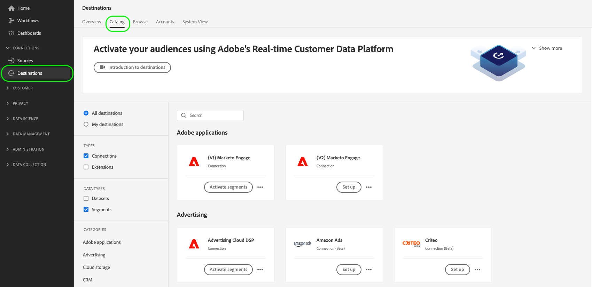

# Aktivieren von Zielgruppendaten für Batch-Profil-Exportziele

>[!IMPORTANT]
> 
>Um Daten zu aktivieren, benötigen Sie die **[!UICONTROL Ziele verwalten]**, **[!UICONTROL Ziele aktivieren]**, **[!UICONTROL Profile anzeigen]** und **[!UICONTROL Segmente anzeigen]** [Zugriffssteuerungsberechtigungen](/help/access-control/home.md#permissions). Lesen Sie die [Zugriffskontrolle - Übersicht](/help/access-control/ui/overview.md) oder wenden Sie sich an Ihren Produktadministrator, um die erforderlichen Berechtigungen zu erhalten.

## Übersicht {#overview}

In diesem Artikel wird der Workflow erläutert, der zum Aktivieren von Zielgruppendaten in Adobe Experience Platform bei Zielen erforderlich ist, die auf Batch-Profilen basieren, wie Cloud-Speicher- und E-Mail-Marketing-Zielen.

## Voraussetzungen {#prerequisites}

Um Daten für Ziele aktivieren zu können, müssen Sie eine erfolgreiche [Verbindung zu einem Ziel](./connect-destination.md) hergestellt haben. Wenn Sie das noch nicht getan haben, navigieren Sie zum [Zielkatalog](../catalog/overview.md), durchsuchen Sie die unterstützten Ziele und konfigurieren Sie das Ziel, das Sie verwenden möchten.

## Auswählen des Ziels {#select-destination}

1. Navigieren Sie zu **[!UICONTROL Verbindungen und Ziele]** und wählen Sie die Registerkarte **[!UICONTROL Katalog]**.

   

1. Wählen Sie **[!UICONTROL Segmente aktivieren]** auf der Karte, die dem Zielort entspricht, an dem Sie Ihre Segmente aktivieren möchten, wie in der Abbildung unten dargestellt.

   

1. Wählen Sie die Zielverbindung aus, die Sie zum Aktivieren Ihrer Segmente verwenden möchten, und klicken Sie dann auf **[!UICONTROL Weiter]**.

   

1. Gehen Sie zum nächsten Abschnitt, um [Ihre Segmente auszuwählen](#select-segments).

## Auswählen der Segmente {#select-segments}

Aktivieren Sie die Kontrollkästchen links neben den Segmentnamen, um die Segmente auszuwählen, die Sie für das Ziel aktivieren möchten, und klicken Sie dann auf **[!UICONTROL Weiter]**.


## Planen des Segmentexports {#scheduling}

>[!CONTEXTUALHELP]
>id="platform_destinations_activate_schedule"
>title="Zeitplan"
>abstract="Verwenden Sie das Stiftsymbol, um den Dateiexporttyp (vollständige Dateien oder inkrementelle Dateien) und die Exportfrequenz festzulegen."
>additional-url="https://experienceleague.adobe.com/docs/experience-platform/destinations/ui/activate/activate-batch-profile-destinations.html?lang=de" text="Weitere Informationen finden Sie in der Dokumentation"

[!DNL Adobe Experience Platform] exportiert Daten für E-Mail-Marketing- und Cloud-Speicher-Ziele in Form von [!DNL CSV]-Dateien. Auf der Seite **[!UICONTROL Planung]** können Sie den Zeitplan und die Dateinamen für jedes Segment konfigurieren, das Sie exportieren. Die Konfiguration des Zeitplans ist obligatorisch, die Konfiguration des Dateinamens ist jedoch optional.

>[!IMPORTANT]
> 
>[!DNL Adobe Experience Platform] teilt die Exportdateien automatisch mit 5 Millionen Datensätzen (Zeilen) pro Datei auf. Jede Zeile stellt ein Profil dar.
>
>Bei aufgeteilten Dateien wird eine Nummer an den Namen angehängt, die anzeigt, dass die Datei Teil eines größeren Exports ist, z. B. `filename.csv`, `filename_2.csv`, `filename_3.csv`.

Wählen Sie die Schaltfläche **[!UICONTROL Zeitplan erstellen]** für das Segment, das Sie an Ihr Ziel senden möchten.


### Exportieren von vollständigen Dateien {#export-full-files}

>[!CONTEXTUALHELP]
>id="platform_destinations_activate_exportoptions"
>title="Dateiexportoptionen"
>abstract="Wählen Sie **Vollständige Dateien exportieren**, um einen vollständigen Schnappschuss aller Profile zu exportieren, die für das Segment qualifiziert sind. Wählen Sie **Inkrementelle Dateien exportieren**, um nur die Profile zu exportieren, die sich seit dem letzten Export für das Segment qualifiziert haben. <br> Der erste inkrementelle Dateiexport umfasst alle Profile, die für das Segment qualifiziert sind und als Aufstockung fungieren. Die folgenden inkrementellen Dateien enthalten nur die Profile, die sich seit dem ersten inkrementellen Dateiexport für das Segment qualifiziert haben."
>additional-url="https://experienceleague.adobe.com/docs/experience-platform/destinations/ui/activate/activate-batch-profile-destinations.html#export-incremental-files" text="Exportieren von inkrementellen Dateien"

>[!CONTEXTUALHELP]
>id="platform_destinations_activationchaining_aftersegmentevaluation"
>title="Aktivieren nach Segmentbewertung"
>abstract="Die Aktivierung wird unmittelbar nach Abschluss des täglichen Segmentierungsauftrags ausgeführt. Dadurch wird sichergestellt, dass die aktuellsten Profile exportiert werden."

>[!CONTEXTUALHELP]
>id="platform_destinations_activationchaining_scheduled"
>title="Geplante Aktivierung"
>abstract="Die Aktivierung erfolgt zu einer festen Tageszeit."

>[!CONTEXTUALHELP]
>id="platform_destinations_activationchaining_activatenow"
>title="On-Demand aktivieren"
>abstract="Wählen Sie dieses Steuerelement aus, um zusätzlich zu allen zuvor geplanten Exporten einen vollständigen Dateiexport bereitzustellen. Der Dateiexport wird sofort ausgelöst und es werden die neuesten Ergebnisse aus der Experience Platform-Segmentierung abgerufen."

Wählen Sie **[!UICONTROL Vollständige Dateien exportieren]**, um den Export einer Datei auszulösen, die eine vollständige Momentaufnahme aller Profilqualifikationen für das ausgewählte Segment enthält.


1. Verwenden Sie den **[!UICONTROL Häufigkeitsselektor]** zur Auswahl der Exportfrequenz:

   * **[!UICONTROL Einmal]**: plant einen einmaligen, bedarfsgesteuerten Export einer vollständigen Datei.
   * **[!UICONTROL Täglich]**: plant vollständige Dateiexporte einmal täglich zum angegebenen Zeitpunkt.

1. Verwenden Sie die **[!UICONTROL Zeit]** umschalten, um festzulegen, ob der Export unmittelbar nach der Segmentauswertung oder auf geplanter Basis zu einem bestimmten Zeitpunkt erfolgen soll. Bei der Auswahl der **[!UICONTROL Geplant]** -Option verwenden, können Sie mit der Auswahl die Tageszeit in [!DNL UTC] -Format, wann der Export erfolgen soll.

   >[!NOTE]
   >
   >Die **[!UICONTROL Nach Segmentbewertung]** Die unten beschriebene Option steht derzeit nur zur Auswahl von Beta-Kunden zur Verfügung.

   Verwenden Sie die **[!UICONTROL Nach Segmentbewertung]** -Option, damit der Aktivierungsauftrag unmittelbar nach Abschluss des täglichen Platform-Batch-Segmentierungsauftrags ausgeführt wird. Dadurch wird sichergestellt, dass bei der Ausführung des Aktivierungsauftrags die aktuellsten Profile nach Ihrem Ziel exportiert werden.

   <!-- Batch segmentation currently runs at {{insert time of day}} and lasts for an average {{x hours}}. Adobe reserves the right to modify this schedule. -->

   
Verwenden Sie die **[!UICONTROL Geplant]** -Option, damit der Aktivierungsauftrag zu einem festen Zeitpunkt ausgeführt wird. Dadurch wird sichergestellt, dass Experience Platform-Profildaten jeden Tag gleichzeitig exportiert werden. Die zu exportierenden  sind jedoch möglicherweise nicht die aktuellsten, je nachdem, ob der Batch-Segmentierungsauftrag vor dem Start des Aktivierungsauftrags abgeschlossen wurde.

   

   >[!IMPORTANT]
   >
   >Aufgrund der Art und Weise, wie interne Experience Platform-Prozesse konfiguriert werden, enthält der erste inkrementelle oder vollständige Dateiexport möglicherweise nicht alle Aufstockungsdaten. <br> <br> Um den vollständigen und aktuellsten Datenexport für die Aufstockung sowohl für vollständige als auch für inkrementelle Dateien sicherzustellen, empfiehlt Adobe, die erste Dateiexportzeit nach 12:00 Uhr GMT des folgenden Tages festzulegen. Diese Einschränkung wird in zukünftigen Versionen behoben.

1. Verwenden Sie den **[!UICONTROL Datumsselektor]**, um den Tag oder das Intervall auszuwählen, an dem der Export stattfinden soll. Für tägliche Exporte empfiehlt es sich, Ihr Start- und Enddatum so festzulegen, dass es der Dauer Ihrer Kampagnen auf Ihren nachgelagerten Plattformen entspricht.

   >[!IMPORTANT]
   >
   > Bei der Auswahl eines Exportintervalls wird der letzte Tag des Intervalls nicht in die Exporte einbezogen. Wenn Sie beispielsweise ein Intervall vom 4. bis 11. Januar auswählen, findet der letzte Dateiexport am 10. Januar statt.

1. Klicken Sie auf **[!UICONTROL Erstellen]**, um den Zeitplan zu speichern.

### Exportieren von inkrementellen Dateien {#export-incremental-files}

Wählen Sie **[!UICONTROL Inkrementelle Dateien exportieren]**, um einen Export auszulösen, bei dem die erste Datei eine vollständige Momentaufnahme aller Profilqualifikationen für das ausgewählte Segment ist und die nachfolgenden Dateien aus den inkrementellen Profilqualifikationen seit dem letzten Export bestehen.

>[!IMPORTANT]
>
>Die erste exportierte inkrementelle Datei enthält alle Profile, die für das Segment qualifiziert sind und als Aufstockung fungieren.


1. Verwenden Sie den **[!UICONTROL Häufigkeitsselektor]** zur Auswahl der Exportfrequenz:

   * **[!UICONTROL Täglich]**: plant inkrementelle Dateiexporte einmal täglich zum angegebenen Zeitpunkt.
   * **[!UICONTROL Stündlich]**: plant inkrementelle Dateiexporte alle 3, 6, 8 oder 12 Stunden.

1. Verwenden Sie den **[!UICONTROL Zeitselektor]** zur Auswahl der Tageszeit im [!DNL UTC]-Format, zu der der Export erfolgen soll.

   >[!IMPORTANT]
   >
   >Aufgrund der Art und Weise, wie interne Experience Platform-Prozesse konfiguriert werden, enthält der erste inkrementelle oder vollständige Dateiexport möglicherweise nicht alle Aufstockungsdaten. <br> <br> Um den vollständigen und aktuellsten Datenexport für die Aufstockung sowohl für vollständige als auch für inkrementelle Dateien sicherzustellen, empfiehlt Adobe, die erste Dateiexportzeit nach 12:00 Uhr GMT des folgenden Tages festzulegen. Diese Einschränkung wird in zukünftigen Versionen behoben.

1. Verwenden Sie den **[!UICONTROL Datumsselektor]**, um das Intervall auszuwählen, in dem der Export stattfinden soll. Es empfiehlt sich, Ihr Start- und Enddatum so festzulegen, dass es der Dauer Ihrer Kampagnen auf Ihren nachgelagerten Plattformen entspricht.

   >[!IMPORTANT]
   >
   >Der letzte Tag des Intervalls ist nicht in den Exporten enthalten. Wenn Sie beispielsweise ein Intervall vom 4. bis 11. Januar auswählen, findet der letzte Dateiexport am 10. Januar statt.

1. Klicken Sie auf **[!UICONTROL Erstellen]**, um den Zeitplan zu speichern.

### Konfigurieren der Dateinamen {#file-names}

>[!CONTEXTUALHELP]
>id="platform_destinations_activate_filename"
>title="Konfigurieren des Dateinamens"
>abstract="Bei dateibasierten Zielen wird pro Segment ein eindeutiger Dateiname generiert. Verwenden Sie den Dateinamen-Editor, um einen eindeutigen Dateinamen zu erstellen und zu bearbeiten oder den Standardnamen beizubehalten."

Die standardmäßigen Dateinamen bestehen aus Zielname, Segment-ID und einem Datums- und Uhrzeitindikator. Sie können beispielsweise Ihre exportierten Dateinamen bearbeiten, um zwischen verschiedenen Kampagnen zu unterscheiden oder die Datenexportzeit an die Dateien anhängen zu lassen.

Wählen Sie das Stiftsymbol aus, um ein modales Fenster zu öffnen und die Dateinamen zu bearbeiten. Dateinamen sind auf 255 Zeichen begrenzt.

>[!NOTE]
>
>Die folgende Abbildung zeigt, wie Dateinamen für Amazon S3-Ziele bearbeitet werden können, der Prozess jedoch für alle Batch-Ziele identisch ist (z. B. SFTP oder Azure Blob Storage).


Im Dateinamen-Editor können Sie verschiedene Komponenten auswählen, die zum Dateinamen hinzugefügt werden sollen.


Zielname und Segment-ID können nicht aus Dateinamen entfernt werden. Zusätzlich können Sie Folgendes hinzufügen:

* **[!UICONTROL Segmentname]**: Sie können den Segmentnamen an den Dateinamen anhängen.
* **[!UICONTROL Datum und Uhrzeit]**: Wählen Sie zwischen dem Hinzufügen eines Formats `MMDDYYYY_HHMMSS` oder eines 10-stelligen Unix-Zeitstempels für den Zeitpunkt, zu dem die Dateien generiert werden. Wählen Sie eine dieser Optionen aus, wenn für Ihre Dateien bei jedem inkrementellen Export ein dynamischer Dateiname erstellt werden soll.
* **[!UICONTROL Benutzerdefinierter Text]**: Fügen Sie den Dateinamen benutzerdefinierten Text hinzu.

Klicken Sie auf **[!UICONTROL Änderungen übernehmen]**, um Ihre Auswahl zu bestätigen.

>[!IMPORTANT]
> 
>Wenn Sie die Komponente **[!UICONTROL Datum und Uhrzeit]** nicht verwenden, sind die Dateinamen statisch und die neue exportierte Datei überschreibt die vorherige Datei an Ihrem Speicherort bei jedem Export. Diese Option wird bei der Ausführung eines wiederkehrenden Importvorgangs von einem Speicherort zu einer E-Mail-Marketing-Plattform empfohlen.

Nachdem Sie alle Segmente konfiguriert haben, wählen Sie **[!UICONTROL Weiter]**, um fortzufahren.

## Auswählen der Profilattribute {#select-attributes}

Bei profilbasierten Zielen müssen Sie die Profilattribute auswählen, die Sie an das Ziel senden möchten.


1. Wählen Sie auf der Seite **[!UICONTROL Attribute auswählen]** die Option **[!UICONTROL Neues Feld hinzufügen]**.

   

1. Wählen Sie den Pfeil rechts neben dem Eintrag **[!UICONTROL Schemafeld]**.

   

1. Wählen Sie auf der Seite **[!UICONTROL Feld auswählen]** die XDM-Attribute aus, die Sie an das Ziel senden möchten, und klicken Sie dann auf **[!UICONTROL Auswählen]**.

   

1. Wiederholen Sie die Schritte 1 bis 3, um weitere Zuordnungen hinzuzufügen.

>[!NOTE]
>
> Adobe Experience Platform füllt Ihre Auswahl vorab mit vier empfohlenen, häufig verwendeten Attributen aus Ihrem Schema: `person.name.firstName`, `person.name.lastName`, `personalEmail.address`, `segmentMembership.status`.

Dateiexporte variieren auf folgende Weise, je nachdem, ob `segmentMembership.status` ausgewählt ist:
* Wenn das Feld `segmentMembership.status` ausgewählt ist, enthalten exportierte Dateien in der ersten vollständigen Momentaufnahme die **[!UICONTROL aktiven]** Mitglieder und in nachfolgenden inkrementellen Exporten die **[!UICONTROL aktiven]** und die **[!UICONTROL abgelaufenen]** Mitglieder.
* Wenn die Variable `segmentMembership.status` nicht ausgewählt ist, umfassen exportierte Dateien sowohl in der ersten vollständigen Momentaufnahme als auch in nachfolgenden inkrementellen Exporten nur die **[!UICONTROL aktiven]** Mitglieder.


### Obligatorische Attribute {#mandatory-attributes}

>[!CONTEXTUALHELP]
>id="platform_destinations_activate_mandatorykey"
>title="Über obligatorische Attribute"
>abstract="Wählen Sie die XDM-Schemaattribute aus, die alle exportierten Profile enthalten sollen. Profile ohne den obligatorischen Schlüssel werden nicht an das Ziel exportiert. Wenn Sie keinen obligatorischen Schlüssel auswählen, werden alle qualifizierten Profile unabhängig von ihren Attributen exportiert."
>additional-url="https://experienceleague.adobe.com/docs/experience-platform/destinations/ui/activate/activate-batch-profile-destinations.html?lang=de#mandatory-attributes" text="Weitere Informationen finden Sie in der Dokumentation"

Ein obligatorisches Attribut ist ein vom Benutzer aktiviertes Kontrollkästchen, mit dem sichergestellt wird, dass alle Profildatensätze das ausgewählte Attribut enthalten. Beispiel: alle exportierten Profile enthalten eine E-Mail-Adresse.

Sie können Attribute als obligatorisch markieren, um sicherzustellen, dass [!DNL Platform] nur die Profile exportiert, die das spezifische Attribut enthalten. Dies kann daher als eine zusätzliche Form des Filterns verwendet werden. Das Kennzeichnen eines Attributs als obligatorisch ist **nicht** erforderlich.

Wenn kein obligatorisches Attribut ausgewählt wird, werden alle qualifizierten Profile unabhängig von ihren Attributen exportiert.

Es wird empfohlen, dass eines der Attribute eine [eindeutige Kennung](../../destinations/catalog/email-marketing/overview.md#identity) aus Ihrem Schema ist. Weitere Informationen zu obligatorischen Attributen finden Sie im Abschnitt „Identität“ in der Dokumentation [E-Mail-Marketing-Ziele](../../destinations/catalog/email-marketing/overview.md#identity).

### Deduplizierungsschlüssel {#deduplication-keys}

>[!CONTEXTUALHELP]
>id="platform_destinations_activate_deduplicationkey"
>title="Über Deduplizierungsschlüssel"
>abstract="Beseitigen Sie mehrfach vorkommende Datensätze desselben Profils in den Exportdateien, indem Sie einen Deduplizierungsschlüssel auswählen. Sie können einen einzelnen Namespace oder bis zu zwei XDM-Schemaattribute als Deduplizierungsschlüssel auswählen. Wenn Sie keinen Deduplizierungsschlüssel auswählen, sind in den Exportdateien möglicherweise doppelte Profileinträge enthalten."
>additional-url="https://experienceleague.adobe.com/docs/experience-platform/destinations/ui/activate/activate-batch-profile-destinations.html?lang=de#deduplication-keys" text="Weitere Informationen finden Sie in der Dokumentation"

Ein Deduplizierungsschlüssel ist ein benutzerdefinierter Primärschlüssel, der die Identität bestimmt, anhand derer Benutzer ihre Profile deduplizieren lassen möchten.

Deduplizierungsschlüssel verhindern die Möglichkeit, mehrere Datensätze desselben Profils in einer Exportdatei zu haben.

Es gibt drei Möglichkeiten, Deduplizierungsschlüssel in [!DNL Platform] zu verwenden:

* Verwenden eines einzelnen Identitäts-Namespace als [!UICONTROL Deduplizierungsschlüssel]
* Verwenden eines einzelnen Profilattributs aus einem [!DNL XDM]-Profil als [!UICONTROL Deduplizierungsschlüssel]
* Verwenden einer Kombination zweier Profilattribute aus einem [!DNL XDM]-Profil als zusammengesetzten Schlüssel

>[!IMPORTANT]
>
> Sie können einen einzelnen Identitäts-Namespace in ein Ziel exportieren, wobei der Namespace automatisch als Deduplizierungsschlüssel festgelegt wird. Das Senden mehrerer Namespaces an ein Ziel wird nicht unterstützt.
> 
> Sie können keine Kombination aus Identitäts-Namespaces und Profilattributen als Deduplizierungsschlüssel verwenden.

### Beispiel einer Deduplizierung {#deduplication-example}

Dieses Beispiel zeigt, wie die Deduplizierung je nach ausgewähltem Deduplizierungsschlüssel funktioniert.

Betrachten wir die beiden folgenden Profile.

**Profil A**

```json
{
  "identityMap": {
    "Email": [
      {
        "id": "johndoe_1@example.com"
      },
      {
        "id": "johndoe_2@example.com"
      }
    ]
  },
  "segmentMembership": {
    "ups": {
      "fa5c4622-6847-4199-8dd4-8b7c7c7ed1d6": {
        "status": "existing",
        "lastQualificationTime": "2021-03-10 10:03:08"
      }
    }
  },
  "person": {
    "name": {
      "lastName": "Doe",
      "firstName": "John"
    }
  },
  "personalEmail": {
    "address": "johndoe@example.com"
  }
}
```

**Profil B**

```json
{
  "identityMap": {
    "Email": [
      {
        "id": "johndoe_1@example.com"
      },
      {
        "id": "johndoe_2@example.com"
      }
    ]
  },
  "segmentMembership": {
    "ups": {
      "fa5c4622-6847-4199-8dd4-8b7c7c7ed1d6": {
        "status": "existing",
        "lastQualificationTime": "2021-04-10 11:33:28"
      }
    }
  },
  "person": {
    "name": {
      "lastName": "D",
      "firstName": "John"
    }
  },
  "personalEmail": {
    "address": "johndoe@example.com"
  }
}
```

### Deduplizierungs-Anwendungsfall 1: keine Deduplizierung {#deduplication-use-case-1}

Ohne Deduplizierung würde die Exportdatei die folgenden Einträge enthalten.

| personalEmail | firstName | lastName |
|---|---|---|
| johndoe@example.com | John | Doe |
| johndoe@example.com | John | D |


### Deduplizierungs-Anwendungsfall 2: Deduplizierung basierend auf Identitäts-Namespace {#deduplication-use-case-2}

Unter der Annahme einer Deduplizierung durch den [!DNL Email]-Namespace würde die Exportdatei die folgenden Einträge enthalten. Das Profil B ist das neueste Profil, das sich für das Segment qualifiziert hat. Daher wird nur dieses exportiert.

| E-Mail* | personalEmail | firstName | lastName |
|---|---|---|---|
| johndoe_1@example.com | johndoe@example.com | John | D |
| johndoe_2@example.com | johndoe@example.com | John | D |

### Deduplizierungsanwendungsfall 3: Deduplizierung basierend auf einem einzigen Profilattribut {#deduplication-use-case-3}

Angenommen, die Deduplizierung würde anhand des Attributs des Typs `personal Email` erfolgen, dann würde die Exportdatei den folgenden Eintrag enthalten. Das Profil B ist das neueste Profil, das sich für das Segment qualifiziert hat. Daher wird nur dieses exportiert.

| personalEmail* | firstName | lastName |
|---|---|---|
| johndoe@example.com | John | D |


### Deduplizierungsanwendungsfall 4: Deduplizierung basierend auf zwei Profilattributen {#deduplication-use-case-4}

Angenommen, die Deduplizierung würde anhand des zusammengesetzten Schlüssels `personalEmail + lastName` erfolgen, dann würde die Exportdatei die folgenden Einträge enthalten.

| personalEmail* | lastName* | firstName |
|---|---|---|
| johndoe@example.com | D | John |
| johndoe@example.com | Doe | John |


Adobe empfiehlt das Auswählen eines Identitäts-Namespace, z. B. einer [!DNL CRM ID] oder einer E-Mail-Adresse, als Deduplizierungsschlüssel, um sicherzustellen, dass alle Profildatensätze eindeutig identifiziert werden.

>[!NOTE]
> 
>Wenn Datennutzungsbeschriftungen auf bestimmte Felder innerhalb eines Datensatzes angewendet wurden (und nicht auf den gesamten Datensatz), erfolgt die Durchsetzung dieser Beschriftungen auf Feldebene bei der Aktivierung unter folgenden Bedingungen:
>
>* Die Felder werden in der Segmentdefinition verwendet.
>* Die Felder werden als projizierte Attribute für das Ziel der Zielgruppe konfiguriert.
>
> Wenn beispielsweise das Feld `person.name.firstName` über bestimmte Datennutzungsbeschriftungen verfügt, die im Konflikt mit der Marketing-Aktion des Ziels stehen, wird Ihnen im Überprüfungsschritt eine Verletzung der Datennutzungsrichtlinien angezeigt. Weitere Informationen finden Sie unter [Data Governance in Adobe Experience Platform](../../rtcdp/privacy/data-governance-overview.md#destinations).

## Überprüfung {#review}

Auf der Seite **[!UICONTROL Überprüfen]** können Sie eine Zusammenfassung Ihrer Auswahl sehen. Wählen Sie **[!UICONTROL Abbrechen]**, um den Fluss abzubrechen, **[!UICONTROL Zurück]**, um die Einstellungen zu ändern, oder **[!UICONTROL Fertig stellen]**, um Ihre Auswahl zu bestätigen und mit dem Senden von Daten an das Ziel zu beginnen.

>[!IMPORTANT]
>
>In diesem Schritt prüft Adobe Experience Platform, ob Verstöße gegen Datennutzungsrichtlinien vorliegen. Nachstehend ist ein Beispiel angegeben, bei dem eine Richtlinie verletzt wird. Sie können den Workflow zur Segmentaktivierung erst abschließen, nachdem Sie den Verstoß behoben haben. Informationen dazu, wie Richtlinienverletzungen behoben werden, finden Sie unter [Durchsetzung von Richtlinien](../../rtcdp/privacy/data-governance-overview.md#enforcement) im Dokumentationsabschnitt zur Data Governance.


Wenn keine Richtlinienverletzungen festgestellt wurden, wählen Sie **[!UICONTROL Beenden]**, um Ihre Auswahl zu bestätigen und mit dem Senden von Daten an das Ziel zu beginnen.


## Überprüfen der Segmentaktivierung {#verify}


Bei E-Mail-Marketing- und Cloud-Speicher-Zielen erstellt Adobe Experience Platform eine Datei des Typs `.csv` am von Ihnen angegebenen Speicherort. An diesem Speicherort wird täglich eine neue Datei erstellt. Das standardmäßige Dateiformat lautet:
`<destinationName>_segment<segmentID>_<timestamp-yyyymmddhhmmss>.csv`

Dateien, die Sie an drei aufeinander folgenden Tagen erhalten, könnten wie folgt aussehen:

```console
Salesforce_Marketing_Cloud_segment12341e18-abcd-49c2-836d-123c88e76c39_20200408061804.csv
Salesforce_Marketing_Cloud_segment12341e18-abcd-49c2-836d-123c88e76c39_20200409052200.csv
Salesforce_Marketing_Cloud_segment12341e18-abcd-49c2-836d-123c88e76c39_20200410061130.csv
```

Das Vorhandensein dieser Dateien an Ihrem Speicherort bestätigt die erfolgreiche Aktivierung. Um zu verstehen, wie die exportierten Dateien strukturiert sind, können Sie ein [Beispiel für eine CSV-Datei herunterladen](../assets/common/sample_export_file_segment12341e18-abcd-49c2-836d-123c88e76c39_20200408061804.csv). Diese Beispieldatei enthält die Profilattribute `person.firstname`, `person.lastname`, `person.gender`, `person.birthyear` und `personalEmail.address`.
