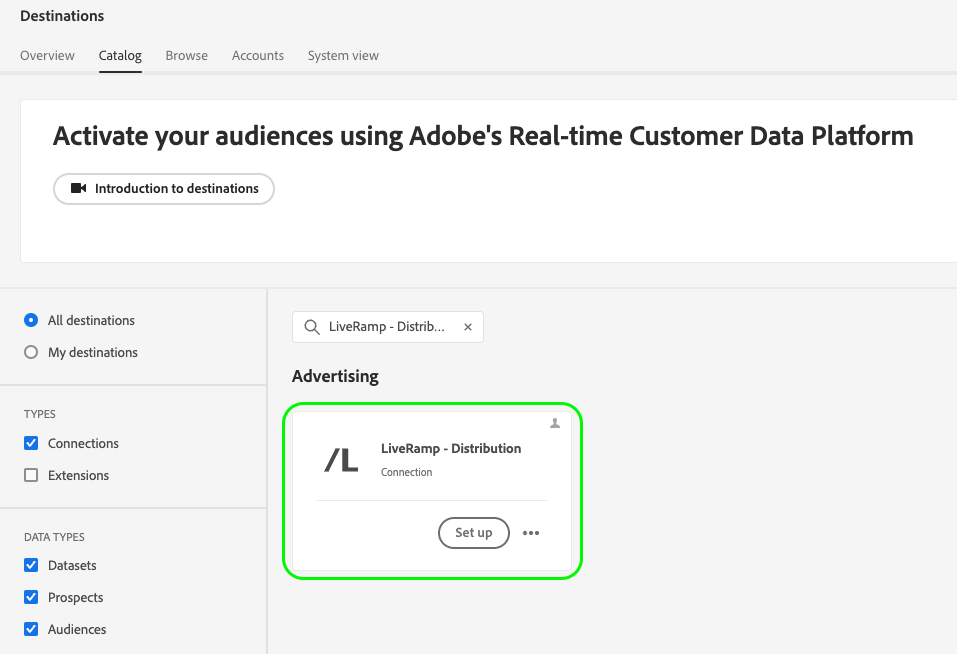

# Aktivieren von Zielgruppen für kuratierte Ziele basierend auf LiveRamp-IDs

Verwenden Sie die Adobe Real-Time CDP-Integration mit [!DNL LiveRamp] So aktivieren Sie Zielgruppen für eine kuratierte Liste von Zielen, die [!DNL [LiveRamp RampID]](https://docs.liveramp.com/connect/en/interpreting-rampid,-liveramp-s-people-based-identifier.html) für die Aktivierung, einschließlich angeschlossener TV- und Audioziele, wie die unten aufgeführten.

>[!IMPORTANT]
>
>Sie müssen LiveRamp-Ramp-IDs nicht in der Experience Platform-Oberfläche erfassen oder in irgendeiner Weise verwenden.
>
> Sie können Identitäten aus Real-Time CDP exportieren, z. B. personenbasierte Kennungen, bekannte Kennungen und benutzerdefinierte Kennungen, wie im [LiveRamp-Dokumentation](https://docs.liveramp.com/connect/en/identity-and-identifier-terms-and-concepts.html#known-identifiers). Diese Identitäten werden dann mit [!DNL LiveRamp RampIDs] weiter im Anschluss an den Aktivierungsprozess.

* [[!DNL 4C Insights]](#insights)
* [[!DNL Acast]](#acast)
* [[!DNL Ampersand.tv]](#ampersand-tv)
* [[!DNL Captify]](#captify)
* [[!DNL Cardlytics]](#cardlytics)
* [[!DNL Disney (Hulu/ESPN/ABC)]](#disney)
* [[!DNL iHeartMedia]](#iheartmedia)
* [[!DNL Index Exchange]](#index-exchange)
* [[!DNL Magnite CTV Platform]](#magnite)
* [[!DNL Magnite DV+ (Rubicon Project)]](#magnite-dv)
* [[!DNL Nexxen]](#nexxen)
* [[!DNL One Fox]](#fox)
* [[!DNL Pandora]](#pandora)
* [[!DNL Reddit]](#reddit)
* [[!DNL Roku]](#roku)
* [[!DNL Spotify]](#spotify)
* [[!DNL Taboola]](#taboola)
* [[!DNL TargetSpot]](#targetspot)
* [[!DNL Teads]](#teads)
* [[!DNL WB Discovery]](#wb-discovery)

In diesem Artikel wird der Workflow erläutert, der zum Aktivieren von Zielgruppen aus Real-Time CDP für die oben aufgeführten Ziele direkt über die Real-Time CDP-Benutzeroberfläche erforderlich ist.

## Aktivierungs-Workflow {#workflow}

Sie aktivieren Zielgruppen für verbundene TV- und Audioziele, indem Sie einen zweistufigen Prozess durchführen und die [LiveRamp - Onboarding](../catalog/advertising/liveramp-onboarding.md) und [LiveRamp - Distribution](../catalog/advertising/liveramp-distribution.md) Ziele, wie in der Abbildung unten dargestellt.

{width="1920" zoomable="yes"}

Exportieren Sie zunächst Ihre Zielgruppen aus Real-Time CDP in die [[!DNL LiveRamp - Onboarding]](../catalog/advertising/liveramp-onboarding.md) Ziel, als CSV-Dateien.

Nachdem Sie Ihre Zielgruppen exportiert haben, aktivieren Sie sie mithilfe der [[!DNL LiveRamp - Distribution]](../catalog/advertising/liveramp-distribution.md) Ziel.

>[!TIP]
>
>Dieser Prozess ermöglicht es Ihnen, Ihre Zielgruppen für Ziele wie [[!DNL Roku]](../catalog/advertising/liveramp-distribution.md#roku), [[!DNL Disney]](../catalog/advertising/liveramp-distribution.md#disney)und mehr direkt über die Real-Time CDP-Benutzeroberfläche, ohne sich bei Ihrem [!DNL LiveRamp] Konto für die Aktivierung.

### Video-Tutorial {#video}

Sehen Sie sich das folgende Video an, um eine umfassende Erläuterung des auf dieser Seite beschriebenen Workflows zu erhalten.

>[!VIDEO](https://video.tv.adobe.com/v/3425367)

### Schritt 1: Senden Sie Ihre Zielgruppen von Experience Platform an LiveRamp über die [!DNL LiveRamp - Onboarding] Ziel {#onboarding}

Das erste, was Sie tun müssen, um Ihre Zielgruppen für kuratierte Ziele basierend auf LiveRamp-Ramp-IDs zu aktivieren, ist Folgendes: **Zielgruppenexport von Experience Platform nach[!DNL LiveRamp]**.

Verwenden Sie dazu die **[!DNL LiveRamp - Onboarding]** Ziel.

Informationen zum Konfigurieren der [!DNL LiveRamp - Onboarding] Zielgruppe bestimmen und aus Experience Platform exportieren, lesen Sie den Abschnitt [[!DNL LiveRamp - Onboarding]](../catalog/advertising/liveramp-onboarding.md) Zieldokumentation.

>[!IMPORTANT]
>
>Beim Exportieren von Dateien an das [!DNL LiveRamp - Onboarding]-Ziel generiert Platform eine CSV-Datei für jede [Zusammenführungsrichtlinien-ID](../../profile/merge-policies/overview.md). Siehe [[!DNL LiveRamp - Onboarding]](../catalog/advertising/liveramp-onboarding.md) Zieldokumentation für detaillierte Informationen zur Validierung Ihres Datenexports zu LiveRamp.

Nachdem Sie Ihre Zielgruppen erfolgreich in LiveRamp exportiert haben, fahren Sie mit dem [Schritt 2](#distribution).

>[!TIP]
>
>Vor dem Wechsel zu [Schritt 2](#distribution), [validate](../catalog/advertising/liveramp-onboarding.md#exported-data) dass Ihre Zielgruppen erfolgreich in LiveRamp exportiert wurden. Siehe die Dokumentation unter [Zieldatenflüsse überwachen](../../dataflows/ui/monitor-destinations.md#dataflow-runs-for-batch-destinations) und lesen Sie mehr über die spezifischen Überwachungsdetails für [[!DNL LiveRamp - Onboarding]](../catalog/advertising/liveramp-onboarding.md#exported-data).

### Schritt 2: Aktivieren Sie die integrierten Zielgruppen für verbundene TV- und Audioziele über das [!DNL LiveRamp - Distribution] Ziel {#distribution}

Nachdem Sie [validiert](../catalog/advertising/liveramp-onboarding.md#exported-data) Nachdem Ihre Zielgruppen erfolgreich in LiveRamp exportiert wurden, ist es Zeit, die Zielgruppen für Ihre bevorzugten Ziele zu aktivieren, z. B. [[!DNL Roku]](../catalog/advertising/liveramp-distribution.md#roku), [[!DNL Disney]](../catalog/advertising/liveramp-distribution.md#disney)und mehr.

Sie aktivieren die Zielgruppen (exportiert in [Schritt 1](#onboarding)) durch Verwendung der **[!DNL LiveRamp - Distribution]** Ziel.

Informationen zum Konfigurieren der **[!DNL LiveRamp - Distribution]** Zielgruppe bestimmen und die Zielgruppen aktivieren, in denen Sie exportiert haben [Schritt 1](#onboarding), lesen Sie die [[!DNL LiveRamp - Distribution]](../catalog/advertising/liveramp-distribution.md) Zieldokumentation.

>[!IMPORTANT]
>
>Im **Zielgruppenauswahl** Schritt des **[!DNL LiveRamp - Distribution]** Ziel, müssen Sie die *exakt dieselben Zielgruppen* , die Sie in die [LiveRamp - Onboarding](../catalog/advertising/liveramp-onboarding.md) Zielort [Schritt 1](#onboarding).

Wenn Sie die **[!DNL LiveRamp - Distribution]** Ziel, müssen Sie eine dedizierte Verbindung für jedes nachgelagerte Ziel erstellen, das Sie verwenden möchten (Roku, Disney usw.).

>[!TIP]
>
>Beim Benennen Ihres Ziels empfiehlt Adobe folgendes Format: `LiveRamp - Downstream Destination Name`. Dieses Benennungsmuster hilft Ihnen beim schnellen Identifizieren Ihrer Ziele im [Durchsuchen](../ui/destinations-workspace.md#browse) im Arbeitsbereich &quot;Ziele&quot;angezeigt.
> 
>Beispiel: `LiveRamp - Roku`.

## Exportierte Daten/Datenexport validieren {#exported-data}

Überprüfen des erfolgreichen Exports Ihrer Zielgruppen in die [[!DNL LiveRamp - Onboarding]](../catalog/advertising/liveramp-onboarding.md) Ziel finden Sie in der Dokumentation unter [Zieldatenflüsse überwachen](../../dataflows/ui/monitor-destinations.md#dataflow-runs-for-batch-destinations) und lesen Sie mehr über die spezifischen Überwachungsdetails für [[!DNL LiveRamp - Onboarding]](../catalog/advertising/liveramp-onboarding.md#exported-data).

Um die erfolgreiche Aktivierung Ihrer Zielgruppen auf Ihrer gewünschten Werbeplattform zu überprüfen (z. B. Roku, Disney und andere), melden Sie sich bei Ihrem Zielplattformkonto an und überprüfen Sie die Aktivierungsmetriken.
