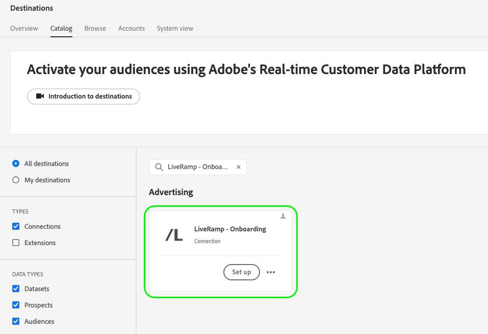

# Aktivieren von Zielgruppen für kuratierte Ziele basierend auf LiveRamp-Kennungen

Verwenden Sie die Adobe Real-Time CDP-Integration mit [!DNL LiveRamp], um Zielgruppen für eine kuratierte Liste von Zielen zu aktivieren, die [[!DNL [LiveRamp RampID]]](https://docs.liveramp.com/connect/en/interpreting-rampid,-liveramp-s-people-based-identifier.html) zur Aktivierung verwenden, einschließlich verbundener TV- und Audio-Ziele, wie die unten aufgeführten.

>[!IMPORTANT]
>
>Sie müssen LiveRampIDs in der Experience Platform-Benutzeroberfläche nicht aufnehmen und in keiner Weise mit ihnen arbeiten.
>
> Sie können Identitäten aus Real-Time CDP exportieren, z. B. PII-basierte Kennungen, bekannte Kennungen und benutzerdefinierte IDs, wie in der offiziellen [LiveRamp-Dokumentation](https://docs.liveramp.com/connect/en/identity-and-identifier-terms-and-concepts.html#known-identifiers) beschrieben. Diese Identitäten werden dann im Aktivierungsprozess weiter unten mit [!DNL LiveRamp RampIDs] abgeglichen.

* [[!DNL 4C Insights]](#insights)
* [[!DNL Acast]](#acast)
* [[!DNL Ampersand.tv]](#ampersand-tv)
* [[!DNL Captify]](#captify)
* [[!DNL Cardlytics]](#cardlytics)
* [[!DNL Disney (Hulu/ESPN/ABC)]](#disney)
* [[!DNL iHeartMedia]](#iheartmedia)
* [[!DNL Index Exchange]](#index-exchange)
* [[!DNL Magnite CTV Platform]](#magnite)
* [[!DNL Magnite DV+ (Rubicon Project)]](#magnite-dv)
* [[!DNL Nexxen]](#nexxen)
* [[!DNL One Fox]](#fox)
* [[!DNL Pandora]](#pandora)
* [[!DNL Reddit]](#reddit)
* [[!DNL Roku]](#roku)
* [[!DNL Spotify]](#spotify)
* [[!DNL Taboola]](#taboola)
* [[!DNL TargetSpot]](#targetspot)
* [[!DNL Teads]](#teads)
* [[!DNL WB Discovery]](#wb-discovery)

In diesem Artikel wird der Workflow erläutert, der zum Aktivieren von Zielgruppen aus Real-Time CDP für die oben aufgeführten Ziele direkt über die Real-Time CDP-Benutzeroberfläche erforderlich ist.

## Aktivierungs-Workflow {#workflow}

Sie können Zielgruppen für verbundene TV- und Audio-Ziele aktivieren, indem Sie einen zweistufigen Prozess durchlaufen und die Ziele [LiveRamp - Onboarding](../catalog/advertising/liveramp-onboarding.md) und [LiveRamp - Verteilung](../catalog/advertising/liveramp-distribution.md) verwenden, wie in der Abbildung unten dargestellt.

{width="1920" zoomable="yes"}

Zunächst exportieren Sie Ihre Zielgruppen aus Real-Time CDP in das [[!DNL LiveRamp - Onboarding]](../catalog/advertising/liveramp-onboarding.md)-Ziel als CSV-Dateien.

Nachdem Sie Ihre Zielgruppen exportiert haben, aktivieren Sie sie mithilfe des [[!DNL LiveRamp - Distribution]](../catalog/advertising/liveramp-distribution.md).

>[!TIP]
>
>Dieser Prozess ermöglicht es Ihnen, Ihre Zielgruppen für Ziele wie [[!DNL Roku]](../catalog/advertising/liveramp-distribution.md#roku), [[!DNL Disney]](../catalog/advertising/liveramp-distribution.md#disney) und mehr direkt über die Real-Time CDP-Benutzeroberfläche zu aktivieren, ohne sich zur Aktivierung bei Ihrem [!DNL LiveRamp]-Konto anmelden zu müssen.

### Video-Tutorial {#video}

Sehen Sie sich das folgende Video an, um eine umfassende Erläuterung des auf dieser Seite beschriebenen Workflows zu erhalten.

>[!VIDEO](https://video.tv.adobe.com/v/3425367)

### Schritt 1: Senden Sie Ihre Zielgruppen von Experience Platform über das [!DNL LiveRamp - Onboarding] Ziel an LiveRamp {#onboarding}

Um Ihre Zielgruppen für kuratierte Ziele auf Grundlage von LiveRamp-IDs zu aktivieren, müssen Sie zunächst Ihre Zielgruppen **Experience Platform nach[!DNL LiveRamp]** exportieren.

Verwenden Sie dazu das **[!DNL LiveRamp - Onboarding]** .

Informationen zum Konfigurieren des [!DNL LiveRamp - Onboarding] Ziels und zum Exportieren Ihrer Zielgruppen aus Experience Platform finden Sie in der Dokumentation zum [[!DNL LiveRamp - Onboarding]](../catalog/advertising/liveramp-onboarding.md) Ziel .

>[!IMPORTANT]
>
>Beim Exportieren von Dateien an das [!DNL LiveRamp - Onboarding]-Ziel generiert Experience Platform eine CSV-Datei für jede [Zusammenführungsrichtlinien-ID](../../profile/merge-policies/overview.md). In der Dokumentation zum [[!DNL LiveRamp - Onboarding]](../catalog/advertising/liveramp-onboarding.md) finden Sie detaillierte Informationen zur Validierung Ihres Datenexports in LiveRamp.

Fahren Sie nach dem erfolgreichen Export Ihrer Zielgruppen in LiveRamp mit [Schritt 2](#distribution) fort.

>[!TIP]
>
>Bevor Sie zu [Schritt 2](#distribution) übergehen[ überprüfen Sie](../catalog/advertising/liveramp-onboarding.md#exported-data) ob Ihre Zielgruppen erfolgreich nach LiveRamp exportiert wurden. Weitere Informationen finden Sie in [ Dokumentation zur Überwachung ](../../dataflows/ui/monitor-destinations.md#dataflow-runs-for-batch-destinations) Zieldatenflüssen und zu den spezifischen Überwachungsdetails für [[!DNL LiveRamp - Onboarding]](../catalog/advertising/liveramp-onboarding.md#exported-data).

### Schritt 2: Aktivieren Sie die integrierten Zielgruppen für angeschlossene TV- und Audio-Ziele über das [!DNL LiveRamp - Distribution] {#distribution}

Nachdem Sie [validiert](../catalog/advertising/liveramp-onboarding.md#exported-data) haben, dass Ihre Zielgruppen erfolgreich nach LiveRamp exportiert wurden, können Sie die Zielgruppen für Ihre bevorzugten Ziele, wie [[!DNL Roku]](../catalog/advertising/liveramp-distribution.md#roku), [[!DNL Disney]](../catalog/advertising/liveramp-distribution.md#disney) und mehr, aktivieren.

Sie aktivieren die Zielgruppen (exportiert in [Schritt 1](#onboarding)) mithilfe des **[!DNL LiveRamp - Distribution]**.

Informationen zum Konfigurieren des **[!DNL LiveRamp - Distribution]**-Ziels und Aktivieren der in Schritt 1 exportierten Zielgruppen [ Sie ](#onboarding) der Dokumentation zum [[!DNL LiveRamp - Distribution]](../catalog/advertising/liveramp-distribution.md)-Ziel.

>[!IMPORTANT]
>
>Im Schritt **Zielgruppenauswahl** des **[!DNL LiveRamp - Distribution]**-Ziels müssen Sie *exakt dieselben Zielgruppen* auswählen, die Sie in das Ziel [LiveRamp - Onboarding](../catalog/advertising/liveramp-onboarding.md) in [Schritt 1](#onboarding) exportiert haben.

Wenn Sie das **[!DNL LiveRamp - Distribution]**-Ziel konfigurieren, müssen Sie für jedes nachgelagerte Ziel, das Sie verwenden möchten (Roku, Disney usw.), eine dedizierte Verbindung erstellen.

>[!TIP]
>
>Beim Benennen Ihres Ziels empfiehlt Adobe das folgende Format: `LiveRamp - Downstream Destination Name`. Dieses Benennungsmuster hilft Ihnen, Ihre Ziele auf der Registerkarte [Durchsuchen](../ui/destinations-workspace.md#browse) des Arbeitsbereichs Ziele schnell zu identifizieren.
> 
>Beispiel: `LiveRamp - Roku`.

Screenshot der 

## Exportierte Daten/Datenexport validieren {#exported-data}

Informationen zum erfolgreichen Export Ihrer Zielgruppen in das [[!DNL LiveRamp - Onboarding]](../catalog/advertising/liveramp-onboarding.md)-Ziel finden Sie in der Dokumentation unter [Überwachen von Zieldatenflüssen](../../dataflows/ui/monitor-destinations.md#dataflow-runs-for-batch-destinations) und lesen Sie die spezifischen Überwachungsdetails für [[!DNL LiveRamp - Onboarding]](../catalog/advertising/liveramp-onboarding.md#exported-data).

Um die erfolgreiche Aktivierung Ihrer Zielgruppen auf der gewünschten Werbeplattform (z. B. Roku, Disney und andere) zu überprüfen, melden Sie sich bei Ihrem Zielplattformkonto an und überprüfen Sie die Aktivierungsmetriken.
