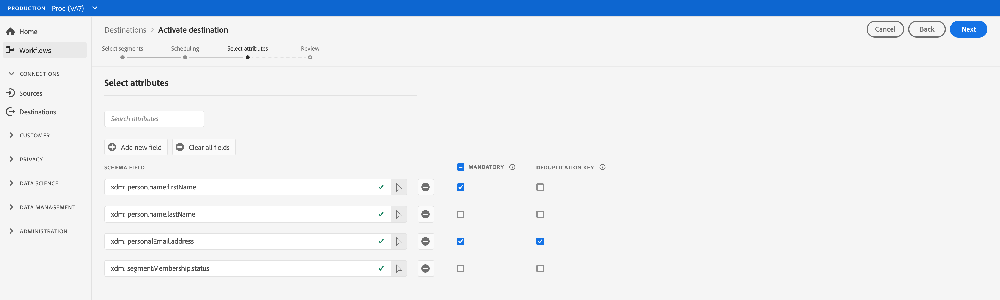

# Profile und Segmente für ein Ziel aktivieren

## Übersicht {#overview}

Aktivieren Sie die Daten, die Sie in [!DNL Adobe Experience Platform] haben, indem Sie Segmente Zielen zuordnen. Gehen Sie dazu wie folgt vor.

## Voraussetzungen  {#prerequisites}

Um Daten für Ziele aktivieren zu können, müssen Sie eine erfolgreiche [Verbindung zu einem Ziel](./connect-destination.md) hergestellt haben. Wenn Sie das noch nicht getan haben, navigieren Sie zum [Zielkatalog](../catalog/overview.md), durchsuchen Sie die unterstützten Ziele und richten Sie ein oder mehrere Ziele ein.

## Daten aktivieren {#activate-data}

Die Schritte im Aktivierungs-Workflow variieren geringfügig zwischen den Zieltypen. Der vollständige Workflow für alle Zieltypen wird nachfolgend beschrieben.

## Wählen Sie das Ziel aus, für das Daten aktiviert werden sollen {#select-destination}

Gilt für: Alle Ziele

Navigieren Sie in der Adobe Experience Platform-Benutzeroberfläche zu **[!UICONTROL Ziele]** > **[!UICONTROL Durchsuchen]** und klicken Sie auf die Schaltfläche **[!UICONTROL Aktivieren]** , die dem Ziel entspricht, an dem Sie Ihre Segmente aktivieren möchten, wie in der folgenden Abbildung dargestellt.


Führen Sie die Schritte im nächsten Abschnitt aus, um die Segmente auszuwählen, die Sie aktivieren möchten.

## [!UICONTROL Schritt &quot;] Segmente auswählen&quot; {#select-segments}

Gilt für: Alle Ziele


Wählen Sie im Workflow **[!UICONTROL Ziel aktivieren]** auf der Seite **[!UICONTROL Segmente auswählen]** ein oder mehrere Segmente aus, die für das Ziel aktiviert werden sollen. Wählen Sie **[!UICONTROL Weiter]** aus, um mit dem nächsten Schritt fortzufahren.


##  Zuordnungsschritt {#mapping}

>[!CONTEXTUALHELP]
>id="platform_destinations_activate_applytransformation"
>title="Umwandlung anwenden"
>abstract="Aktivieren Sie diese Option bei Verwendung von nicht gehashten Quellfeldern, damit Adobe Experience Platform sie bei Aktivierung automatisch hash."

Gilt für: Social-Ziele und Werbeziel für Google-Kundenabgleich


Bei sozialen Zielen müssen Sie Quellattribute oder Identitäts-Namespaces auswählen, um als Zielidentitäten im Ziel zuzuordnen.

## Beispiel: Aktivieren von Zielgruppendaten in [!DNL Facebook Custom Audience] {#example-facebook}

Nachstehend finden Sie ein Beispiel für die korrekte Identitätszuordnung bei der Aktivierung von Zielgruppendaten in [!DNL Facebook].

Auswählen von Quellfeldern:

* Wählen Sie den Namespace `Email` als Quellidentität aus, wenn die von Ihnen verwendeten E-Mail-Adressen nicht gehasht sind.
* Wählen Sie den Namespace `Email_LC_SHA256` als Quellidentität aus, wenn Sie Kunden-E-Mail-Adressen bei der Datenerfassung in [!DNL Platform] gehasht haben, gemäß [!DNL Facebook] [E-Mail-Hashing-Anforderungen](../catalog/social/facebook.md#email-hashing-requirements).
* Wählen Sie den Namespace `PHONE_E.164` als Quellkennung aus, wenn Ihre Daten aus nicht gehashten Telefonnummern bestehen. [!DNL Platform] werden die Telefonnummern hash, um die  [!DNL Facebook] Anforderungen zu erfüllen.
* Wählen Sie den Namespace `Phone_SHA256` als Quellidentität aus, wenn Sie bei der Datenerfassung Telefonnummern gemäß [!DNL Facebook] [ [!DNL Platform]Anforderungen an das Hashing von Telefonnummern](../catalog/social/facebook.md#phone-number-hashing-requirements) gehasht haben.
* Wählen Sie den Namespace `IDFA` als Quellidentität aus, wenn Ihre Daten aus [!DNL Apple] Geräte-IDs bestehen.
* Wählen Sie den Namespace `GAID` als Quellidentität aus, wenn Ihre Daten aus [!DNL Android] Geräte-IDs bestehen.
* Wählen Sie den Namespace `Custom` als Quellidentität aus, wenn Ihre Daten aus einem anderen Kennungstyp bestehen.

Zielgruppenfelder auswählen:

* Wählen Sie den Namespace `Email_LC_SHA256` als Zielidentität aus, wenn Ihre Quell-Namespaces entweder `Email` oder `Email_LC_SHA256` lauten.
* Wählen Sie den Namespace `Phone_SHA256` als Zielidentität aus, wenn Ihre Quell-Namespaces entweder `PHONE_E.164` oder `Phone_SHA256` lauten.
* Wählen Sie die Namespaces `IDFA` oder `GAID` als Zielidentität aus, wenn Ihre Quell-Namespaces `IDFA` oder `GAID` lauten.
* Wählen Sie den Namespace `Extern_ID` als Zielidentität aus, wenn Ihr Quellnamespace ein benutzerdefinierter Namespace ist.


Daten aus nicht gehashten Namespaces werden bei Aktivierung automatisch von [!DNL Platform] gehasht.

Attributquellendaten werden nicht automatisch gehasht. Wenn Ihr Quellfeld ungehashte Attribute enthält, aktivieren Sie die Option **[!UICONTROL Umwandlung anwenden]**, damit [!DNL Platform] die Daten bei Aktivierung automatisch hash.


 

## Beispiel: Aktivieren von Zielgruppendaten in [!DNL Google Customer Match] {#example-gcm}

Dies ist ein Beispiel für die korrekte Identitätszuordnung bei der Aktivierung von Zielgruppendaten in [!DNL Google Customer Match].

Auswählen von Quellfeldern:

* Wählen Sie den Namespace `Email` als Quellidentität aus, wenn die von Ihnen verwendeten E-Mail-Adressen nicht gehasht sind.
* Wählen Sie den Namespace `Email_LC_SHA256` als Quellidentität aus, wenn Sie Kunden-E-Mail-Adressen bei der Datenerfassung in [!DNL Platform] gehasht haben, gemäß [!DNL Google Customer Match] [E-Mail-Hashing-Anforderungen](../catalog/social/../advertising/google-customer-match.md).
* Wählen Sie den Namespace `PHONE_E.164` als Quellkennung aus, wenn Ihre Daten aus nicht gehashten Telefonnummern bestehen. [!DNL Platform] werden die Telefonnummern hash, um die  [!DNL Google Customer Match] Anforderungen zu erfüllen.
* Wählen Sie den Namespace `Phone_SHA256_E.164` als Quellidentität aus, wenn Sie bei der Datenerfassung Telefonnummern gemäß [!DNL Facebook] [ [!DNL Platform]Anforderungen an das Hashing von Telefonnummern](../catalog/social/../advertising/google-customer-match.md) gehasht haben.
* Wählen Sie den Namespace `IDFA` als Quellidentität aus, wenn Ihre Daten aus [!DNL Apple] Geräte-IDs bestehen.
* Wählen Sie den Namespace `GAID` als Quellidentität aus, wenn Ihre Daten aus [!DNL Android] Geräte-IDs bestehen.
* Wählen Sie den Namespace `Custom` als Quellidentität aus, wenn Ihre Daten aus einem anderen Kennungstyp bestehen.

Zielgruppenfelder auswählen:

* Wählen Sie den Namespace `Email_LC_SHA256` als Zielidentität aus, wenn Ihre Quell-Namespaces entweder `Email` oder `Email_LC_SHA256` lauten.
* Wählen Sie den Namespace `Phone_SHA256_E.164` als Zielidentität aus, wenn Ihre Quell-Namespaces entweder `PHONE_E.164` oder `Phone_SHA256_E.164` lauten.
* Wählen Sie die Namespaces `IDFA` oder `GAID` als Zielidentität aus, wenn Ihre Quell-Namespaces `IDFA` oder `GAID` lauten.
* Wählen Sie den Namespace `User_ID` als Zielidentität aus, wenn Ihr Quellnamespace ein benutzerdefinierter Namespace ist.


Daten aus nicht gehashten Namespaces werden bei Aktivierung automatisch von [!DNL Platform] gehasht.

Attributquellendaten werden nicht automatisch gehasht. Wenn Ihr Quellfeld ungehashte Attribute enthält, aktivieren Sie die Option **[!UICONTROL Umwandlung anwenden]**, damit [!DNL Platform] die Daten bei Aktivierung automatisch hash.


## **** Planungsschritt {#scheduling}

Gilt für: E-Mail-Marketing-Ziele und Cloud-Speicher-Ziele


[!DNL Adobe Experience Platform] exportiert Daten für E-Mail-Marketing- und Cloud-Speicher-Ziele in Form von  [!DNL CSV] Dateien. Im Schritt **[!UICONTROL Planung]** können Sie den Zeitplan und die Dateinamen für jedes Segment, das Sie exportieren, konfigurieren. Die Konfiguration des Zeitplans ist obligatorisch, die Konfiguration des Dateinamens ist jedoch optional.

>[!IMPORTANT]
> 
>[!DNL Adobe Experience Platform] teilt die Exportdateien automatisch mit 5 Millionen Datensätzen (Zeilen) pro Datei auf. Jede Zeile stellt ein Profil dar.
>
>Dateinamen mit Aufspaltung werden mit einer Zahl angehängt, die angibt, dass die Datei Teil eines größeren Exports ist. Dies zeigt an: `filename.csv`, `filename_2.csv`, `filename_3.csv`.

Wählen Sie die Schaltfläche **[!UICONTROL Zeitplan]** erstellen , die dem Segment entspricht, das Sie an Ihr Ziel senden möchten.


### Exportieren von vollständigen Dateien {#export-full-files}

Wählen Sie **[!UICONTROL Vollständige Dateien exportieren]** aus, damit Ihre exportierten Dateien eine vollständige Momentaufnahme aller Profile enthalten, die für dieses Segment qualifiziert sind.


1. Verwenden Sie den Selektor **[!UICONTROL Häufigkeit]**, um zwischen einmaligen (**[!UICONTROL Einmal]**) oder **[!UICONTROL Täglichen]** Exporten zu wählen. Durch den Export einer vollständigen Datei **[!UICONTROL Täglich]** wird die Datei täglich vom Startdatum bis zum Enddatum um 12:00 Uhr UTC (19:00 Uhr EST) exportiert.
2. Verwenden Sie die Auswahl **[!UICONTROL Zeit]** , um die Tageszeit im Format [!DNL UTC] festzulegen, zu der der Export erfolgen soll. Durch den Export einer Datei **[!UICONTROL Täglich]** wird die Datei täglich vom Startdatum bis zum Enddatum zum ausgewählten Zeitpunkt exportiert.

   >[!IMPORTANT]
   >
   >Die Option zum Exportieren von Dateien zu einem bestimmten Tageszeitpunkt befindet sich derzeit in der Beta-Phase und steht nur einer ausgewählten Anzahl von Kunden zur Verfügung.<br> <br> Aufgrund der Art und Weise, wie interne Experience Platform-Prozesse konfiguriert werden, enthält der erste inkrementelle oder vollständige Dateiexport möglicherweise nicht alle Aufstockungsdaten.  <br> <br> Um einen vollständigen und aktuellsten Datenexport für die Aufstockung sowohl für vollständige als auch für inkrementelle Dateien sicherzustellen, empfiehlt Adobe, die erste Dateiexportzeit nach 22:00 Uhr GMT des folgenden Tages festzulegen. Dies ist eine Einschränkung, die in zukünftigen Versionen behoben wird.

3. Verwenden Sie den Selektor **[!UICONTROL Datum]** , um den Tag oder das Intervall auszuwählen, an dem der Export stattfinden soll.
4. Wählen Sie **[!UICONTROL Erstellen]** aus, um den Zeitplan zu speichern.

>[!IMPORTANT]
>
>Das Ändern des Zeitplans für den Dateiexport für Segmente, die bereits exportiert wurden, wird derzeit nicht unterstützt. Um Segmente mit einem anderen Zeitplan erneut zu exportieren, müssen Sie eine neue Zielinstanz erstellen. Dies ist eine Einschränkung, die in zukünftigen Versionen behoben wird.

### Inkrementelle Dateien exportieren {#export-incremental-files}

Wählen Sie **[!UICONTROL Inkrementelle Dateien exportieren]** aus, damit Ihre exportierten Dateien nur die Profile enthalten, die sich seit dem letzten Export für dieses Segment qualifiziert haben.

>[!IMPORTANT]
>
>Die erste exportierte inkrementelle Datei enthält alle Profile, die sich für ein Segment qualifizieren und als Aufstockung fungieren.


1. Verwenden Sie den Selektor **[!UICONTROL Häufigkeit]**, um zwischen **[!UICONTROL täglichen]** oder **[!UICONTROL stündlichen]** Exporten zu wählen. Durch den Export einer inkrementellen Datei **[!UICONTROL Täglich]** wird die Datei täglich vom Startdatum bis zum Enddatum um 22:00 Uhr UTC (07:00 Uhr EST) exportiert.
   * Verwenden Sie bei der Auswahl von **[!UICONTROL Stündlich]** den Selektor **[!UICONTROL Jedes]**, um zwischen den Optionen **[!UICONTROL 3]**, **[!UICONTROL 6]**, **[!UICONTROL 8]** und **[!UICONTROL 12]** zu wählen.

      >[!IMPORTANT]
      >
      >Die Option, inkrementelle Dateien alle 3, 6, 8 oder 12 Stunden zu exportieren, befindet sich derzeit in der Beta-Phase und steht nur einer bestimmten Anzahl von Kunden zur Verfügung. Nicht-Beta-Kunden können inkrementelle Dateien einmal täglich exportieren.

2. Verwenden Sie die Auswahl **[!UICONTROL Zeit]** , um die Tageszeit im Format [!DNL UTC] festzulegen, zu der der Export erfolgen soll.

   >[!IMPORTANT]
   >
   >Die Option zur Auswahl der Tageszeit für den Export ist nur für eine ausgewählte Anzahl von Kunden verfügbar. <br> <br> Aufgrund der Art und Weise, wie interne Experience Platform-Prozesse konfiguriert werden, enthält der erste inkrementelle oder vollständige Dateiexport möglicherweise nicht alle Aufstockungsdaten.  <br> <br> Um einen vollständigen und aktuellsten Datenexport für die Aufstockung sowohl für vollständige als auch für inkrementelle Dateien sicherzustellen, empfiehlt Adobe, die erste Dateiexportzeit nach 22:00 Uhr GMT des folgenden Tages festzulegen. Dies ist eine Einschränkung, die in zukünftigen Versionen behoben wird.

3. Verwenden Sie den Selektor **[!UICONTROL Datum]** , um den Tag oder das Intervall auszuwählen, an dem der Export stattfinden soll.
4. Wählen Sie **[!UICONTROL Erstellen]** aus, um den Zeitplan zu speichern.

>[!IMPORTANT]
>
>Das Ändern des Zeitplans für den Dateiexport für Segmente, die bereits exportiert wurden, wird derzeit nicht unterstützt. Um Segmente mit einem anderen Zeitplan erneut zu exportieren, müssen Sie eine neue Zielinstanz erstellen. Dies ist eine Einschränkung, die in zukünftigen Versionen behoben wird.

### Dateinamen konfigurieren {#file-names}

Die standardmäßigen Dateinamen bestehen aus Zielname, Segment-ID und einem Datums- und Uhrzeitindikator. Sie können beispielsweise Ihre exportierten Dateinamen bearbeiten, um zwischen verschiedenen Kampagnen zu unterscheiden oder die Datenexportzeit an die Dateien anhängen zu lassen.

Wählen Sie das Stiftsymbol aus, um ein modales Fenster zu öffnen und die Dateinamen zu bearbeiten. Dateinamen sind auf 255 Zeichen begrenzt.


Im Dateinamen-Editor können Sie verschiedene Komponenten auswählen, die zum Dateinamen hinzugefügt werden sollen.


Zielname und Segment-ID können nicht aus Dateinamen entfernt werden. Zusätzlich können Sie Folgendes hinzufügen:

* **[!UICONTROL Segmentname]**: Sie können den Segmentnamen an den Dateinamen anhängen.
* **[!UICONTROL Datum und Uhrzeit]**: Wählen Sie zwischen dem Hinzufügen eines  `MMDDYYYY_HHMMSS` Formats oder eines Unix-10-stelligen Zeitstempels der Zeit, zu der die Dateien generiert werden. Wählen Sie eine dieser Optionen aus, wenn für Ihre Dateien bei jedem inkrementellen Export ein dynamischer Dateiname erstellt werden soll.
* **[!UICONTROL Benutzerdefinierter Text]**: Fügen Sie den Dateinamen benutzerdefinierten Text hinzu.

Wählen Sie **[!UICONTROL Änderungen anwenden]** aus, um Ihre Auswahl zu bestätigen.

>[!IMPORTANT]
> 
>Wenn Sie die Komponente **[!UICONTROL Datum und Uhrzeit]** nicht auswählen, sind die Dateinamen statisch und die neue exportierte Datei überschreibt die vorherige Datei an Ihrem Speicherort bei jedem Export. Bei der Ausführung eines wiederkehrenden Importvorgangs von einem Speicherort zu einer E-Mail-Marketing-Plattform wird diese Option empfohlen.

Nachdem Sie alle Ihre Segmente konfiguriert haben, wählen Sie **[!UICONTROL Weiter]** aus, um fortzufahren.

## **[!UICONTROL Zeitplan]** für Segmente {#segment-schedule}

Gilt für: Werbeziele, soziale Ziele


Auf der Seite **[!UICONTROL Segment schedule]** können Sie das Startdatum für das Senden von Daten an das Ziel und die Häufigkeit des Sendens von Daten an das Ziel festlegen.

>[!IMPORTANT]
>
>Für Ziele in sozialen Netzwerken müssen Sie in diesem Schritt die Herkunft Ihrer Zielgruppe auswählen. Sie können mit dem nächsten Schritt erst fortfahren, nachdem Sie eine der Optionen in der folgenden Abbildung ausgewählt haben.


>[!IMPORTANT]
>
>Für Google-Kundenabgleich müssen Sie in diesem Schritt die [!UICONTROL App-ID] angeben, wenn Sie die Segmente [!DNL IDFA] oder [!DNL GAID] aktivieren.


## **[!UICONTROL Auswählen]** von attributesstep {#select-attributes}

Gilt für: E-Mail-Marketing-Ziele und Cloud-Speicher-Ziele


Wählen Sie auf der Seite **[!UICONTROL Attribute]** auswählen die Option **[!UICONTROL Neues Feld hinzufügen]** und wählen Sie die Attribute aus, die Sie an das Ziel senden möchten.

>[!NOTE]
>
> Adobe Experience Platform füllt Ihre Auswahl mit vier empfohlenen, häufig verwendeten Attributen aus Ihrem Schema: `person.name.firstName`, `person.name.lastName`, `personalEmail.address`, `segmentMembership.status`.

Dateiexporte variieren auf folgende Weise, je nachdem, ob `segmentMembership.status` ausgewählt ist:
* Wenn das Feld `segmentMembership.status` ausgewählt ist, enthalten exportierte Dateien **[!UICONTROL Aktive]** Mitglieder im ersten vollständigen Snapshot und **[!UICONTROL Aktive]** und **[!UICONTROL Abgelaufene]** Mitglieder in nachfolgenden inkrementellen Exporten.
* Wenn das Feld `segmentMembership.status` nicht ausgewählt ist, enthalten exportierte Dateien nur **[!UICONTROL aktive]**-Mitglieder im ersten vollständigen Snapshot und in nachfolgenden inkrementellen Exporten.



### Obligatorische Attribute {#mandatory-attributes}

>[!CONTEXTUALHELP]
>id="platform_destinations_activate_mandatorykey"
>title="Über obligatorische Attribute"
>abstract="Wählen Sie die XDM-Schemaattribute aus, die alle exportierten Profile enthalten sollen. Profile ohne obligatorischen Schlüssel werden nicht an das Ziel exportiert. Wenn Sie keinen obligatorischen Schlüssel auswählen, werden alle qualifizierten Profile unabhängig von ihren Attributen exportiert."
>additional-url="http://www.adobe.com/go/destinations-mandatory-attributes-en" text="Weitere Informationen finden Sie in der Dokumentation ."

Sie können Attribute als obligatorisch markieren, um sicherzustellen, dass [!DNL Platform] nur die Profile exportiert, die das spezifische Attribut enthalten. Sie kann daher als zusätzliche Filterform verwendet werden. Die Kennzeichnung eines Attributs als obligatorisch ist **nicht** erforderlich.

Wenn kein obligatorisches Attribut ausgewählt wird, werden alle qualifizierten Profile unabhängig von ihren Attributen exportiert.

Es wird empfohlen, eines der Attribute aus Ihrem Schema eine [eindeutige Kennung](../../destinations/catalog/email-marketing/overview.md#identity) zu verwenden. Weitere Informationen zu obligatorischen Attributen finden Sie im Abschnitt Identität in der Dokumentation [E-Mail-Marketing-Ziele](../../destinations/catalog/email-marketing/overview.md#identity) .

### Deduplizierungsschlüssel {#deduplication-keys}

>[!CONTEXTUALHELP]
>id="platform_destinations_activate_deduplicationkey"
>title="Über Deduplizierungsschlüssel"
>abstract="Beseitigen Sie mehrere Datensätze desselben Profils in den Exportdateien, indem Sie einen Deduplizierungsschlüssel auswählen. Wählen Sie einen einzelnen Namespace oder bis zu zwei XDM-Schemaattribute als Deduplizierungsschlüssel aus. Wenn Sie keinen Deduplizierungsschlüssel auswählen, werden in den Exportdateien möglicherweise doppelte Profileinträge angezeigt."
>additional-url="http://www.adobe.com/go/destinations-deduplication-keys-en" text="Weitere Informationen finden Sie in der Dokumentation ."

>[!IMPORTANT]
>
>Die Option zur Verwendung von Deduplizierungsschlüsseln befindet sich derzeit in der Beta-Phase und steht nur einer ausgewählten Anzahl von Kunden zur Verfügung.

Deduplizierungsschlüssel verhindern die Möglichkeit, mehrere Datensätze desselben Profils in einer Exportdatei zu haben.

Es gibt drei Möglichkeiten, Deduplizierungsschlüssel in [!DNL Platform] zu verwenden:

* Verwenden eines einzelnen Identitäts-Namespace als [!UICONTROL Deduplizierungsschlüssel]
* Verwenden eines einzelnen Profilattributs aus einem [!DNL XDM]-Profil als [!UICONTROL Deduplizierungsschlüssel]
* Verwenden einer Kombination zweier Profilattribute aus einem [!DNL XDM]-Profil als zusammengesetzten Schlüssel

>[!IMPORTANT]
>
> Sie können einen einzelnen Identitäts-Namespace in ein Ziel exportieren und der Namespace wird automatisch als Deduplizierungsschlüssel festgelegt. Das Senden mehrerer Namespaces an ein Ziel wird nicht unterstützt.
> 
> Sie können keine Kombination aus Identitäts-Namespaces und Profilattributen als Deduplizierungsschlüssel verwenden.

### Beispiel einer Deduplizierung {#deduplication-example}

Dieses Beispiel zeigt, wie Deduplizierung je nach ausgewähltem Deduplizierungsschlüssel funktioniert.

Betrachten wir die beiden folgenden Profile.

**Profil A**

```json
{
  "identityMap": {
    "Email": [
      {
        "id": "johndoe_1@example.com"
      },
      {
        "id": "johndoe_2@example.com"
      }
    ]
  },
  "segmentMembership": {
    "ups": {
      "fa5c4622-6847-4199-8dd4-8b7c7c7ed1d6": {
        "status": "existing",
        "lastQualificationTime": "2021-03-10 10:03:08"
      }
    }
  },
  "person": {
    "name": {
      "lastName": "Doe",
      "firstName": "John"
    }
  },
  "personalEmail": {
    "address": "johndoe@example.com"
  }
}
```

**Profil B**

```json
{
  "identityMap": {
    "Email": [
      {
        "id": "johndoe_1@example.com"
      },
      {
        "id": "johndoe_2@example.com"
      }
    ]
  },
  "segmentMembership": {
    "ups": {
      "fa5c4622-6847-4199-8dd4-8b7c7c7ed1d6": {
        "status": "existing",
        "lastQualificationTime": "2021-04-10 11:33:28"
      }
    }
  },
  "person": {
    "name": {
      "lastName": "D",
      "firstName": "John"
    }
  },
  "personalEmail": {
    "address": "johndoe@example.com"
  }
}
```

### Nutzungsszenario 1: Deduplizierung keine Deduplizierung

Ohne Deduplizierung würde die Exportdatei die folgenden Einträge enthalten.

| personalEmail | firstName | lastName |
|---|---|---|
| johndoe@example.com | John | Doe |
| johndoe@example.com | John | D |


### Anwendungsfall 2: Deduplizierung Deduplizierung basierend auf Identitäts-Namespace

Unter der Annahme einer Deduplizierung durch den Namespace [!DNL Email] enthält die Exportdatei die folgenden Einträge. Profil B ist das neueste Profil, das sich für das Segment qualifiziert hat. Daher wird nur dieses exportiert.

| E-Mail* | personalEmail | firstName | lastName |
|---|---|---|---|
| johndoe_1@example.com | johndoe@example.com | John | D |
| johndoe_2@example.com | johndoe@example.com | John | D |

### Nutzungsszenario 3: Deduplizierung Deduplizierung basierend auf einem einzelnen Profilattribut

Unter der Annahme einer Deduplizierung durch das Attribut `personal Email` würde die Exportdatei den folgenden Eintrag enthalten. Profil B ist das neueste Profil, das sich für das Segment qualifiziert hat. Daher wird nur dieses exportiert.

| personalEmail* | firstName | lastName |
|---|---|---|
| johndoe@example.com | John | D |


### Anwendungsfall 4: Deduplizierung Deduplizierung basierend auf zwei Profilattributen (zusammengesetzter Deduplizierungsschlüssel)

Bei Deduplizierung durch den zusammengesetzten Schlüssel `personalEmail + lastName` enthält die Exportdatei die folgenden Einträge.

| personalEmail* | lastName* | firstName |
|---|---|---|
| johndoe@example.com | D | John |
| johndoe@example.com | Doe | John |


Adobe empfiehlt die Auswahl eines Identitäts-Namespace wie [!DNL CRM ID] oder einer E-Mail-Adresse als Deduplizierungsschlüssel, um sicherzustellen, dass alle Profildatensätze eindeutig identifiziert werden.

>[!NOTE]
> 
>Wenn Datennutzungsbezeichnungen auf bestimmte Felder in einem Datensatz angewendet wurden (und nicht auf den gesamten Datensatz), erfolgt die Durchsetzung dieser Feldbezeichnungen bei der Aktivierung unter folgenden Bedingungen:
>
>* Die Felder werden in der Segmentdefinition verwendet.
>* Die Felder werden als projizierte Attribute für das Ziel der Zielgruppe konfiguriert.

>
> 
Wenn beispielsweise das Feld `person.name.firstName` bestimmte Datennutzungsbezeichnungen enthält, die mit der Marketing-Aktion des Ziels in Konflikt stehen, wird Ihnen im Überprüfungsschritt eine Verletzung der Datennutzungsrichtlinien angezeigt. Weitere Informationen finden Sie unter [Data Governance in Adobe Experience Platform](../../rtcdp/privacy/data-governance-overview.md#destinations).

## **** Überprüfungsschritt {#review}

Gilt für: alle Ziele


Auf der Seite **[!UICONTROL Überprüfen]** können Sie eine Zusammenfassung Ihrer Auswahl sehen. Wählen Sie **[!UICONTROL Abbrechen]**, um den Fluss abzubrechen, **[!UICONTROL Zurück]**, um die Einstellungen zu ändern, oder **[!UICONTROL Fertig stellen]**, um Ihre Auswahl zu bestätigen und mit dem Senden von Daten an das Ziel zu beginnen.

>[!IMPORTANT]
>
>In diesem Schritt prüft Adobe Experience Platform, ob Verstöße gegen Datennutzungsrichtlinien vorliegen. Im Folgenden finden Sie ein Beispiel, bei dem eine Richtlinie verletzt wird. Sie können den Workflow zur Segmentaktivierung erst abschließen, nachdem Sie den Verstoß behoben haben. Informationen zum Beheben von Richtlinienverletzungen finden Sie unter [Richtliniendurchsetzung](../../rtcdp/privacy/data-governance-overview.md#enforcement) im Abschnitt zur Data Governance-Dokumentation.


Wenn keine Richtlinienverletzungen festgestellt wurden, wählen Sie **[!UICONTROL Beenden]** aus, um Ihre Auswahl zu bestätigen und mit dem Senden von Daten an das Ziel zu beginnen.


## Überprüfen, ob die Segmentaktivierung erfolgreich war {#verify-activation}

### E-Mail-Marketing-Ziele und Cloud-Speicher-Ziele {#esp-and-cloud-storage}

Für E-Mail-Marketing-Ziele und Cloud-Speicher-Ziele erstellt Adobe Experience Platform eine tabulatorgetrennte `.csv`-Datei am von Ihnen angegebenen Speicherort. An diesem Speicherort wird täglich eine neue Datei erstellt. Das standardmäßige Dateiformat lautet:
`<destinationName>_segment<segmentID>_<timestamp-yyyymmddhhmmss>.csv`

Dateien, die Sie an drei aufeinander folgenden Tagen erhalten, könnten wie folgt aussehen:

```console
Salesforce_Marketing_Cloud_segment12341e18-abcd-49c2-836d-123c88e76c39_20200408061804.csv
Salesforce_Marketing_Cloud_segment12341e18-abcd-49c2-836d-123c88e76c39_20200409052200.csv
Salesforce_Marketing_Cloud_segment12341e18-abcd-49c2-836d-123c88e76c39_20200410061130.csv
```

Das Vorhandensein dieser Dateien an Ihrem Speicherort bestätigt die erfolgreiche Aktivierung. Um zu verstehen, wie die exportierten Dateien strukturiert sind, können Sie [eine .csv-Beispieldatei](../assets/common/sample_export_file_segment12341e18-abcd-49c2-836d-123c88e76c39_20200408061804.csv) herunterladen. Diese Beispieldatei enthält die Profilattribute `person.firstname`, `person.lastname`, `person.gender`, `person.birthyear` und `personalEmail.address`.

## Werbeziele

Überprüfen Sie Ihr Konto im entsprechenden Werbeziel, für das Sie Ihre Daten aktivieren. Wenn die Aktivierung erfolgreich war, werden in Ihrer Werbeplattform Zielgruppen ausgefüllt.

## Social-Ziele

Bei [!DNL Facebook] bedeutet eine erfolgreiche Aktivierung, dass eine [!DNL Facebook] benutzerdefinierte Zielgruppe programmgesteuert in [[!UICONTROL Facebook Ads Manager]](https://www.facebook.com/adsmanager/manage/) erstellt wird. Segmentmitgliedschaft in der Zielgruppe wird hinzugefügt und entfernt, wenn Anwender für die aktivierten Segmente qualifiziert oder disqualifiziert werden.

>[!TIP]
>
>Die Integration zwischen Adobe Experience Platform und [!DNL Facebook] unterstützt historische Zielgruppen-Backups. Alle historischen Segmentqualifikationen werden an [!DNL Facebook] gesendet, wenn Sie die Segmente für das Ziel aktivieren.

## Aktivierung deaktivieren {#disable-activation}

Gehen Sie wie folgt vor, um einen vorhandenen Aktivierungsfluss zu deaktivieren:

1. Wählen Sie in der linken Navigationsleiste **[!UICONTROL Ziele]**, klicken Sie dann auf die Registerkarte **[!UICONTROL Durchsuchen]** und klicken Sie auf den Zielnamen.
2. Klicken Sie in der rechten Leiste auf das Steuerelement **[!UICONTROL Aktiviert]**, um den Status des Aktivierungsflusses zu ändern.
3. Wählen Sie im Fenster **Datenflussstatus aktualisieren** die Option **Bestätigen**, um den Aktivierungsfluss zu deaktivieren.
