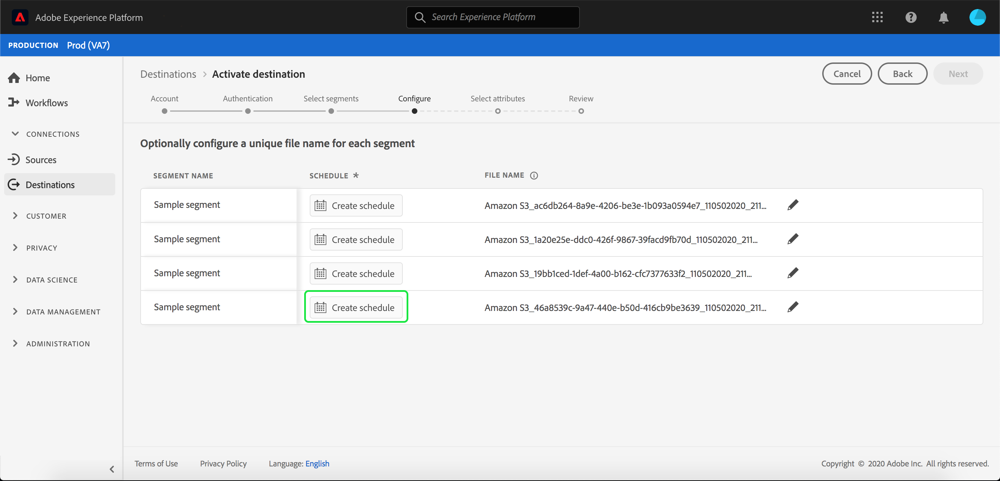
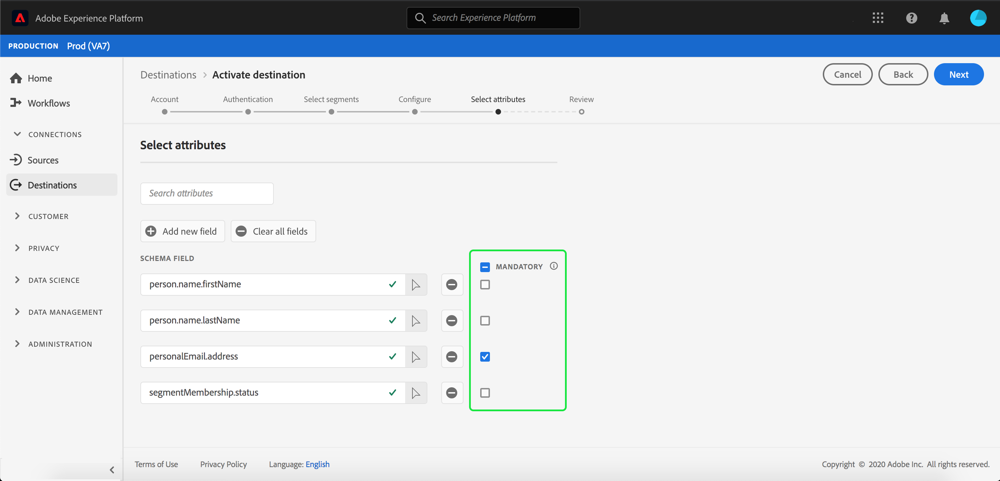

# Profile und Segmente für ein Ziel aktivieren

Aktivieren Sie die Daten, die Sie in [!DNL Adobe Experience Platform] haben, indem Sie Segmente Zielen zuordnen. Gehen Sie dazu wie folgt vor.

## Voraussetzungen  {#prerequisites}

Um Daten für Ziele aktivieren zu können, müssen Sie eine erfolgreiche [Verbindung zu einem Ziel](./connect-destination.md) hergestellt haben. Wenn Sie das noch nicht getan haben, navigieren Sie zum [Zielkatalog](../catalog/overview.md), durchsuchen Sie die unterstützten Ziele und richten Sie ein oder mehrere Ziele ein.

## Daten aktivieren {#activate-data}

Die Schritte im Arbeitsablauf für die Aktivierung unterscheiden sich geringfügig von den Zieltypen. Der vollständige Arbeitsablauf für alle Zieltypen wird nachfolgend beschrieben.

## Wählen Sie das Ziel aus, an dem die Daten für {#select-destination} aktiviert werden sollen

Gilt für: Alle Ziele

Navigieren Sie in der Adobe Experience Platform-Benutzeroberfläche zu **[!UICONTROL Ziele]** > **[!UICONTROL Durchsuchen]** und klicken Sie auf die Schaltfläche **[!UICONTROL Aktivieren]**, die dem Ziel entspricht, an dem Sie Ihre Segmente aktivieren möchten, wie in der Abbildung unten dargestellt.


Führen Sie die Schritte im nächsten Abschnitt aus, um die Segmente auszuwählen, die Sie aktivieren möchten.

## [!UICONTROL Segmentschritt ] auswählen  {#select-segments}

Gilt für: Alle Ziele


Wählen Sie im Arbeitsablauf **[!UICONTROL Ziel aktivieren]** auf der Seite **[!UICONTROL Segmente auswählen]** eines oder mehrere Segmente aus, die am Ziel aktiviert werden sollen. Wählen Sie **[!UICONTROL Weiter]**, um mit dem nächsten Schritt fortzufahren.


## [!UICONTROL Identitätszuordnungsschritt ]   {#identity-mapping}

Gilt für: Social-Ziele und Werbeziel Google-Kunden-Übereinstimmung


Bei Social-Zielen müssen Sie Quellattribute oder Identitäts-Namensraum auswählen, die als Zielgruppen-IDs im Ziel zugeordnet werden sollen.

## Beispiel: Aktivieren von Audiencen in [!DNL Facebook Custom Audience] {#example-facebook}

Nachstehend finden Sie ein Beispiel für eine korrekte Identitätszuordnung bei der Aktivierung von Audiencen in [!DNL Facebook].

Auswählen von Quellfeldern:

* Wählen Sie den Namensraum `Email` als Quellidentität aus, wenn die von Ihnen verwendeten E-Mail-Adressen nicht mit Hashing versehen werden.
* Wählen Sie den Namensraum `Email_LC_SHA256` als Quellidentität aus, wenn Sie bei der Datenerfassung per Hash E-Mail-Adresse nach [!DNL Facebook] [ [!DNL Platform]E-Mail-Hashing-Anforderungen](../catalog/social/facebook.md#email-hashing-requirements) gehackt haben.
* Wählen Sie den Namensraum `PHONE_E.164` als Quellidentität aus, wenn Ihre Daten aus nicht-hash-Telefonnummern bestehen. [!DNL Platform] werden die Telefonnummern zur Erfüllung der  [!DNL Facebook] Anforderungen gehackt.
* Wählen Sie den Namensraum `Phone_SHA256` als Quellidentität aus, wenn Sie bei der Datenerfassung Telefonnummern nach [!DNL Facebook] [ [!DNL Platform]Anforderungen für das Hashing von Telefonnummern](../catalog/social/facebook.md#phone-number-hashing-requirements) gehackt haben.
* Wählen Sie den Namensraum `IDFA` als Quellidentität aus, wenn Ihre Daten aus [!DNL Apple] Geräte-IDs bestehen.
* Wählen Sie den Namensraum `GAID` als Quellidentität aus, wenn Ihre Daten aus [!DNL Android] Geräte-IDs bestehen.
* Wählen Sie den Namensraum `Custom` als Quellidentität aus, wenn Ihre Daten aus einem anderen Identifizierungstyp bestehen.

Auswählen von Zielgruppen:

* Wählen Sie den Namensraum `Email_LC_SHA256` als Zielgruppe-ID aus, wenn Ihre Quell-Namensraum entweder `Email` oder `Email_LC_SHA256` sind.
* Wählen Sie den Namensraum `Phone_SHA256` als Zielgruppe-ID aus, wenn Ihre Quell-Namensraum entweder `PHONE_E.164` oder `Phone_SHA256` sind.
* Wählen Sie die Namensraum `IDFA` oder `GAID` als Zielgruppe-ID aus, wenn die Namensraum `IDFA` oder `GAID` sind.
* Wählen Sie den Namensraum `Extern_ID` als Zielgruppe-ID aus, wenn Ihr Quell-Namensraum ein benutzerdefinierter ist.


Daten von Namensräumen ohne Hash werden bei Aktivierung automatisch durch [!DNL Platform] gehasht.

Attributquellendaten werden nicht automatisch mit Hashing versehen. Wenn Ihr Quellfeld ungehackte Attribute enthält, aktivieren Sie die Option **[!UICONTROL Transformation]** anwenden, damit [!DNL Platform] die Daten bei Aktivierung automatisch hash.


 

## Beispiel: Aktivieren von Audiencen in [!DNL Google Customer Match] {#example-gcm}

Dies ist ein Beispiel für die korrekte Identitätszuordnung bei der Aktivierung von Audiencen in [!DNL Google Customer Match].

Auswählen von Quellfeldern:

* Wählen Sie den Namensraum `Email` als Quellidentität aus, wenn die von Ihnen verwendeten E-Mail-Adressen nicht mit Hashing versehen werden.
* Wählen Sie den Namensraum `Email_LC_SHA256` als Quellidentität aus, wenn Sie bei der Datenerfassung per Hash E-Mail-Adresse nach [!DNL Google Customer Match] [ [!DNL Platform]E-Mail-Hashing-Anforderungen](../catalog/social/../advertising/google-customer-match.md) gehackt haben.
* Wählen Sie den Namensraum `PHONE_E.164` als Quellidentität aus, wenn Ihre Daten aus nicht-hash-Telefonnummern bestehen. [!DNL Platform] werden die Telefonnummern zur Erfüllung der  [!DNL Google Customer Match] Anforderungen gehackt.
* Wählen Sie den Namensraum `Phone_SHA256_E.164` als Quellidentität aus, wenn Sie bei der Datenerfassung Telefonnummern nach [!DNL Facebook] [ [!DNL Platform]Anforderungen für das Hashing von Telefonnummern](../catalog/social/../advertising/google-customer-match.md) gehackt haben.
* Wählen Sie den Namensraum `IDFA` als Quellidentität aus, wenn Ihre Daten aus [!DNL Apple] Geräte-IDs bestehen.
* Wählen Sie den Namensraum `GAID` als Quellidentität aus, wenn Ihre Daten aus [!DNL Android] Geräte-IDs bestehen.
* Wählen Sie den Namensraum `Custom` als Quellidentität aus, wenn Ihre Daten aus einem anderen Identifizierungstyp bestehen.

Auswählen von Zielgruppen:

* Wählen Sie den Namensraum `Email_LC_SHA256` als Zielgruppe-ID aus, wenn Ihre Quellordner `Email` oder `Email_LC_SHA256` sind.
* Wählen Sie den Namensraum `Phone_SHA256_E.164` als Zielgruppe-ID aus, wenn Ihre Quell-Namensraum entweder `PHONE_E.164` oder `Phone_SHA256_E.164` sind.
* Wählen Sie die Namensraum `IDFA` oder `GAID` als Zielgruppe-ID aus, wenn die Namensraum `IDFA` oder `GAID` sind.
* Wählen Sie den Namensraum `User_ID` als Zielgruppe-ID aus, wenn Ihr Quell-Namensraum ein benutzerdefinierter ist.


Daten von Namensräumen ohne Hash werden bei Aktivierung automatisch durch [!DNL Platform] gehasht.

Attributquellendaten werden nicht automatisch mit Hashing versehen. Wenn Ihr Quellfeld ungehackte Attribute enthält, aktivieren Sie die Option **[!UICONTROL Transformation]** anwenden, damit [!DNL Platform] die Daten bei Aktivierung automatisch hash.


## **[!UICONTROL Configurestep]**   {#configure}

Gilt für: E-Mail-Marketing-Ziele und Cloud-Datenspeicherung-Ziele


[!DNL Adobe Experience Platform] exportiert Daten für E-Mail-Marketing- und Cloud-Datenspeicherung-Ziele in  [!DNL CSV] Dateiform. Im Schritt **[!UICONTROL Konfigurieren]** können Sie den Zeitplan und die Dateinamen für jedes Segment konfigurieren, das Sie exportieren. Die Konfiguration des Zeitplans ist obligatorisch, die Konfiguration des Dateinamens ist jedoch optional.

>[!IMPORTANT]
> 
>[!DNL Adobe Experience Platform] teilt die Exportdateien automatisch mit 5 Millionen Datensätzen (Zeilen) pro Datei auf. Jede Zeile stellt ein Profil dar.
>
>Dateinamen mit Teilinformationen werden mit einer Zahl angehängt, die angibt, dass die Datei Teil eines größeren Exports ist. Dies bedeutet: `filename.csv`, `filename_2.csv`, `filename_3.csv`.


Um einen Zeitplan für das Segment hinzuzufügen, wählen Sie **[!UICONTROL Plan erstellen]**.



Ein Dialogfeld mit Optionen zum Erstellen des Segmentplans wird angezeigt.

* **Dateiexport**: Sie haben die Möglichkeit, entweder vollständige oder inkrementelle Dateien zu exportieren. Beim Exportieren einer vollständigen Datei wird eine vollständige Momentaufnahme aller Profil veröffentlicht, die für dieses Segment qualifiziert sind. Beim Exportieren einer inkrementellen Datei wird das Delta der Profil veröffentlicht, die seit dem letzten Export für dieses Segment qualifiziert sind.
* **Häufigkeit**: Wenn &quot;Vollständige  **[!UICONTROL Datei]** exportieren&quot;ausgewählt ist, können Sie &quot;Einmalig&quot;oder &quot; ****  **[!UICONTROL Täglich]**&quot;exportieren. Wenn **[!UICONTROL Inkrementelle Dateien exportieren]** ausgewählt ist, haben Sie nur die Möglichkeit, **[!UICONTROL Täglich]** zu exportieren. Beim Exportieren einer Datei **[!UICONTROL Sobald]** wird die Datei einmal exportiert. Beim Exportieren einer Datei **[!UICONTROL Täglich]** wird die Datei jeden Tag vom Beginn bis zum Enddatum um 12:00 Uhr UTC (19:00 Uhr EST) exportiert, wenn vollständige Dateien ausgewählt sind, und um 22:00 Uhr UTC (7:00 Uhr EST), wenn inkrementelle Dateien ausgewählt wurden.
* **Datum**: Wenn &quot;Einmalig&quot; **** ausgewählt ist, können Sie das Datum für den einmaligen Export auswählen. Wenn **[!UICONTROL Täglich]** ausgewählt ist, können Sie Beginns- und Enddaten für die Exporte auswählen.


Die Standarddateinamen bestehen aus dem Zielnamen, der Segment-ID und einer Datums- und Zeitanzeige. Sie können beispielsweise die Namen der exportierten Dateien bearbeiten, um zwischen verschiedenen Kampagnen zu unterscheiden, oder um die Datenexportzeit an die Dateien anhängen zu lassen.

Wählen Sie das Stiftsymbol aus, um ein modales Fenster zu öffnen und die Dateinamen zu bearbeiten. Beachten Sie, dass Dateinamen auf 255 Zeichen begrenzt sind.


Im Dateinameneditor können Sie verschiedene Komponenten auswählen, die dem Dateinamen hinzugefügt werden sollen. Der Zielname und die Segment-ID können nicht aus den Dateinamen entfernt werden. Darüber hinaus können Sie Folgendes hinzufügen:

* **[!UICONTROL Segmentname]**: Sie können den Segmentnamen an den Dateinamen anhängen.
* **[!UICONTROL Datum und Uhrzeit]**: Wählen Sie zwischen dem Hinzufügen eines  `MMDDYYYY_HHMMSS` Formats oder eines 10-stelligen Unix-Zeitstempels für den Zeitpunkt der Erstellung der Dateien. Wählen Sie eine der folgenden Optionen, wenn für Ihre Dateien bei jedem inkrementellen Export ein dynamischer Dateiname generiert werden soll.
* **[!UICONTROL Benutzerdefinierter Text]**: hinzufügen benutzerdefinierter Text in die Dateinamen.

Wählen Sie **[!UICONTROL Änderungen anwenden]**, um Ihre Auswahl zu bestätigen.

>[!IMPORTANT]
> 
>Wenn Sie die Komponente **[!UICONTROL Datum und Uhrzeit]** nicht auswählen, sind die Dateinamen statisch und die neue exportierte Datei überschreibt die vorherige Datenspeicherung bei jedem Export. Bei der Ausführung eines wiederkehrenden Importauftrags von einer Datenspeicherung in eine E-Mail-Marketingplattform wird diese Option empfohlen.


Nachdem Sie alle Segmente konfiguriert haben, wählen Sie **[!UICONTROL Weiter]** aus, um fortzufahren.

## **[!UICONTROL Segment-]** Zeitplanung  {#segment-schedule}

Gilt für: Werbeziele, soziale Ziele


Auf der Seite **[!UICONTROL Segmentplan]** können Sie das Datum des Beginns für das Senden der Daten an das Ziel und die Häufigkeit des Sendens der Daten an das Ziel festlegen.

>[!IMPORTANT]
>
>Für Ziele in sozialen Netzwerken müssen Sie in diesem Schritt die Herkunft Ihrer Zielgruppe auswählen. Sie können mit dem nächsten Schritt erst fortfahren, nachdem Sie eine der Optionen in der folgenden Abbildung ausgewählt haben.


>[!IMPORTANT]
>
>Bei der Google-Kundenübereinstimmung müssen Sie in diesem Schritt die [!UICONTROL App-ID] angeben, wenn Sie die Segmente [!DNL IDFA] oder [!DNL GAID] aktivieren.


## **** Planungsschritt  {#scheduling}

Gilt für: E-Mail-Marketing-Ziele und Cloud-Datenspeicherung-Ziele


Auf der Seite **[!UICONTROL Einplanen]** können Sie das Datum des Beginns zum Senden der Daten an das Ziel sowie die Häufigkeit des Datenversands an das Ziel sehen. Diese Werte können nicht bearbeitet werden.

## **[!UICONTROL Wählen Sie]** attributesstep  {#select-attributes}

Gilt für: E-Mail-Marketing-Ziele und Cloud-Datenspeicherung-Ziele


Wählen Sie auf der Seite **[!UICONTROL Attribute auswählen]** die Option **[!UICONTROL Hinzufügen neues Feld]** und wählen Sie die Attribute, die Sie an das Ziel senden möchten.

>[!NOTE]
>
> Adobe Experience Platform füllt Ihre Auswahl mit vier empfohlenen, häufig verwendeten Attributen aus Ihrem Schema im Voraus aus: `person.name.firstName`, `person.name.lastName`, `personalEmail.address`, `segmentMembership.status`.

Dateiexporte variieren auf folgende Weise, je nachdem, ob `segmentMembership.status` ausgewählt ist:
* Wenn das Feld `segmentMembership.status` ausgewählt ist, enthalten die exportierten Dateien die Mitglieder **[!UICONTROL Aktiv]** im ersten vollständigen Schnappschuss und die Mitglieder **[!UICONTROL Aktiv]** und **[!UICONTROL Abgelaufen]** in nachfolgenden inkrementellen Exporten.
* Wenn das Feld `segmentMembership.status` nicht ausgewählt ist, enthalten exportierte Dateien nur **[!UICONTROL Aktive]**-Mitglieder im ersten vollständigen Schnappschuss und in nachfolgenden inkrementellen Exporten.



Darüber hinaus können Sie verschiedene Attribute als obligatorisch markieren. Wenn Sie ein Attribut als obligatorisch markieren, muss es im exportierten Segment dieses Attribut enthalten. Daher kann es als zusätzliche Filterform verwendet werden. Die obligatorische Kennzeichnung eines Attributs ist **nicht** erforderlich.

Es wird empfohlen, dass eines der Attribute eine [eindeutige Kennung](../../destinations/catalog/email-marketing/overview.md#identity) aus Ihrem Schema ist. Weitere Informationen zu obligatorischen Attributen finden Sie im Identitätsabschnitt in der Dokumentation [E-Mail-Marketingziele](../../destinations/catalog/email-marketing/overview.md#identity).

>[!NOTE]
> 
>Wenn Datenverwendungsbeschriftungen auf bestimmte Felder in einem Datensatz angewendet wurden (und nicht auf den gesamten Datensatz), erfolgt die Durchsetzung dieser Beschriftungen auf Feldebene bei der Aktivierung unter folgenden Bedingungen:
>* Die Felder werden in der Segmentdefinition verwendet.
>* Die Felder sind als projizierte Attribute für das Ziel der Zielgruppe konfiguriert.

>
> 
Wenn das Feld `person.name.firstName` beispielsweise bestimmte Datenverwendungsbeschriftungen enthält, die mit der Marketingaktion des Ziels kollidieren, wird Ihnen im Überprüfungsschritt eine Verletzung der Datenverwendungsrichtlinie angezeigt. Weitere Informationen finden Sie unter [Datenverwaltung in Adobe Experience Platform](../../rtcdp/privacy/data-governance-overview.md#destinations).

## **** ReviewStep  {#review}

Gilt für: alle Ziele


Auf der Seite **[!UICONTROL Überprüfen]** können Sie eine Zusammenfassung Ihrer Auswahl sehen. Wählen Sie **[!UICONTROL Abbrechen]**, um den Fluss abzubrechen, **[!UICONTROL Zurück]**, um die Einstellungen zu ändern, oder **[!UICONTROL Fertig stellen]**, um Ihre Auswahl zu bestätigen und mit dem Senden von Daten an das Ziel zu beginnen.

>[!IMPORTANT]
>
>In diesem Schritt prüft Adobe Experience Platform, ob die Datenschutzrichtlinien verletzt wurden. Unten sehen Sie ein Beispiel, bei dem eine Richtlinie verletzt wird. Sie können den Segmentarbeitsablauf erst dann abschließen, wenn Sie die Aktivierung gelöst haben. Informationen zum Beheben von Richtlinienverletzungen finden Sie unter [Richtliniendurchsetzung](../../rtcdp/privacy/data-governance-overview.md#enforcement) im Abschnitt zur Datenverwaltung.


Wenn keine Richtlinienverletzungen festgestellt wurden, wählen Sie **[!UICONTROL Fertigstellen]**, um Ihre Auswahl zu bestätigen und den Beginn, der Daten an das Ziel sendet, zu bestätigen.


## Aktivierung bearbeiten {#edit-activation}

Gehen Sie wie folgt vor, um die vorhandenen Aktivierungen in Adobe Experience Platform zu bearbeiten:

1. Wählen Sie in der linken Navigationsleiste **[!UICONTROL Ziele]**, klicken Sie dann auf die Registerkarte **[!UICONTROL Durchsuchen]** und klicken Sie auf den Zielnamen.
2. Wählen Sie in der rechten Leiste **[!UICONTROL Aktivierung bearbeiten]**, um zu ändern, welche Segmente an das Ziel gesendet werden.

## Überprüfen, ob die Segmentaktivierung erfolgreich war {#verify-activation}

### E-Mail-Marketing-Ziele  und Cloud-Speicher-Ziele  {#esp-and-cloud-storage}

Für E-Mail-Marketing-Ziele und Cloud-Datenspeicherung-Ziele erstellt Adobe Experience Platform eine tabulatorbegrenzte `.csv`- oder `.txt`-Datei im angegebenen Speicherort der Datenspeicherung. An diesem Speicherort wird täglich eine neue Datei erstellt. Das Standarddateiformat lautet:
`<destinationName>_segment<segmentID>_<timestamp-yyyymmddhhmmss>.csv|txt`

Beachten Sie, dass Sie das Dateiformat bearbeiten können. Weitere Informationen zu Cloud-Datenspeicherung-Zielen und E-Mail-Marketingzielen finden Sie im Schritt [Konfigurieren](#configure).

Beim standardmäßigen Dateiformat könnten die Dateien, die Sie an drei aufeinander folgenden Tagen erhalten würden, wie folgt aussehen:

```console
Salesforce_Marketing_Cloud_segment12341e18-abcd-49c2-836d-123c88e76c39_20200408061804.csv
Salesforce_Marketing_Cloud_segment12341e18-abcd-49c2-836d-123c88e76c39_20200409052200.csv
Salesforce_Marketing_Cloud_segment12341e18-abcd-49c2-836d-123c88e76c39_20200410061130.csv
```

Das Vorhandensein dieser Dateien an Ihrem Speicherort bestätigt die erfolgreiche Aktivierung. Um zu verstehen, wie die exportierten Dateien strukturiert sind, können Sie eine .csv-Beispieldatei [herunterladen. ](../assets/common/sample_export_file_segment12341e18-abcd-49c2-836d-123c88e76c39_20200408061804.csv) Diese Beispieldatei enthält die Profil-Attribute `person.firstname`, `person.lastname`, `person.gender`, `person.birthyear` und `personalEmail.address`.

## Werbeziele

Überprüfen Sie Ihr Konto im entsprechenden Werbeziel, an dem Sie Ihre Daten aktivieren. Wenn die Aktivierung erfolgreich war, werden in Ihrer Werbeplattform Zielgruppen ausgefüllt.

## Ziele in sozialen Netzwerken

Bei [!DNL Facebook] bedeutet eine erfolgreiche Aktivierung, dass eine [!DNL Facebook] benutzerdefinierte Audience programmgesteuert in [[!UICONTROL Facebook Ads Manager]](https://www.facebook.com/adsmanager/manage/) erstellt wird. Segmentmitgliedschaft in der Zielgruppe wird hinzugefügt und entfernt, wenn Anwender für die aktivierten Segmente qualifiziert oder disqualifiziert werden.

>[!TIP]
>
>Die Integration zwischen Adobe Experience Platform und [!DNL Facebook] unterstützt Backfills für historische Audiencen. Alle historischen Segmentqualifikationen werden an [!DNL Facebook] gesendet, wenn Sie die Segmente an das Ziel aktivieren.

## Aktivierung deaktivieren {#disable-activation}

Gehen Sie wie folgt vor, um einen vorhandenen Aktivierungsfluss zu deaktivieren:

1. Wählen Sie in der linken Navigationsleiste **[!UICONTROL Ziele]**, klicken Sie dann auf die Registerkarte **[!UICONTROL Durchsuchen]** und klicken Sie auf den Zielnamen.
2. Klicken Sie in der rechten Leiste auf das Steuerelement **[!UICONTROL Aktiviert]**, um den Status des Aktivierungsflusses zu ändern.
3. Wählen Sie im Fenster **Datenflussstatus aktualisieren** die Option **Bestätigen**, um den Aktivierungsfluss zu deaktivieren.
