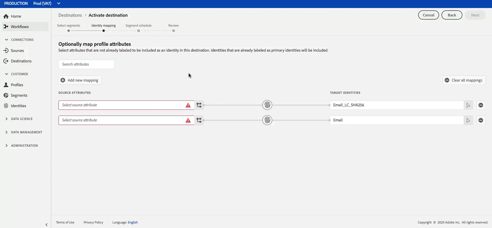
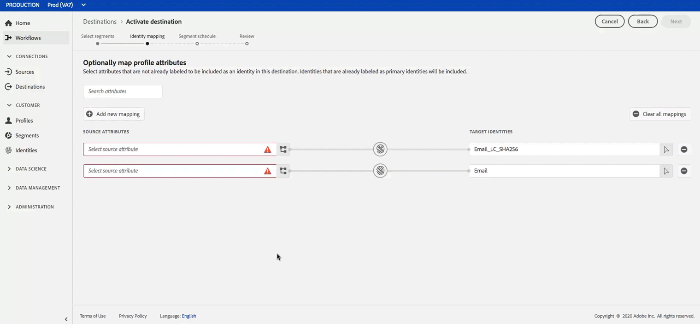

# Profile und Segmente für ein Ziel aktivieren

Aktivieren Sie die Daten, die in der Echtzeit-Kundendatenplattform von vorhanden sind, indem Sie Segmente Zielen zuordnen. Gehen Sie dazu wie folgt vor.

## Voraussetzungen  {#prerequisites}

Um Daten für Ziele aktivieren zu können, müssen Sie eine erfolgreiche [Verbindung zu einem Ziel](./connect-destination.md) hergestellt haben. Wenn Sie das noch nicht getan haben, navigieren Sie zum [Zielkatalog](../catalog/overview.md), durchsuchen Sie die unterstützten Ziele und richten Sie ein oder mehrere Ziele ein.

## Daten aktivieren {#activate-data}

Die Schritte im Arbeitsablauf für die Aktivierung unterscheiden sich geringfügig von den Zieltypen. Der vollständige Arbeitsablauf für alle Zieltypen wird nachfolgend beschrieben.

### Wählen Sie das Ziel aus, für das die Daten aktiviert werden sollen {#select-destination}

Gilt für: Alle Ziele

Navigieren Sie in der Echtzeit-CDP-Benutzeroberfläche zu **[!UICONTROL Ziele]** > **[!UICONTROL Durchsuchen]** und wählen Sie das Ziel aus, an dem Sie Ihre Segmente aktivieren möchten.


Wählen Sie den Namen des Ziels aus, um zum Arbeitsablauf für die Aktivierung zu navigieren.


Beachten Sie, dass Sie, wenn für ein Ziel bereits ein Aktivierungen-Workflow vorhanden ist, die derzeit aktivierten Segmente für das Ziel sehen können. Wählen Sie in der rechten Leiste die Option **[!UICONTROL Aktivierung bearbeiten]** und führen Sie die unten beschriebenen Schritte aus, um die Aktivierungsdetails zu ändern.

Nachdem Sie ein Ziel ausgewählt haben, wählen Sie **[!UICONTROL Aktivieren]**.

### [!UICONTROL Schritt Segmente] auswählen {#select-segments}

Gilt für: Alle Ziele


In the **[!UICONTROL Activate destination]** workflow, on the **[!UICONTROL Select Segments]** page, select one or more segments to activate to the destination. Wählen Sie **[!UICONTROL Weiter]** , um mit dem nächsten Schritt fortzufahren.


### [!UICONTROL Schritt zur] Identitätszuordnung {#identity-mapping}

Gilt für: Social-Ziele und Werbeziel Google-Kunden-Übereinstimmung


Bei Social-Zielen können Sie Quellattribute auswählen, die als Zielgruppen-ID im Ziel zugeordnet werden sollen. Dieser Schritt ist entweder optional oder obligatorisch, je nachdem, welche primäre Identität Sie im Schema verwenden.

Wenn Sie die E-Mail-Adresse als primäre Identität in Ihrem Schema verwenden, können Sie den Schritt für die Identitätszuordnung überspringen, wie nachfolgend gezeigt:



Wenn Sie eine andere ID wie &quot;Belohnungs-ID&quot;oder &quot;Loyalität-ID&quot;als primäre Identität in Ihrem Schema verwenden, müssen Sie die E-Mail-Adresse aus Ihrem Identitäts-Schema manuell als Zielgruppe-ID im Social-Ziel zuordnen, wie nachfolgend gezeigt:



Wählen Sie `Email_LC_SHA256` als Zielgruppen-ID aus, wenn Sie bei der Dateneingabe in Adobe Experience Platform per Hash E-Mail- [!DNL Facebook] Hashing an Ihre E-Mail-Adresse gesendet haben [](../catalog/social/facebook.md#email-hashing-requirements).

Wählen Sie `Email` als Zielgruppen-ID aus, wenn die von Ihnen verwendeten E-Mail-Adressen nicht mit Hashing versehen werden. Echtzeit-CDP wird die E-Mail-Adressen zur Erfüllung der [!DNL Facebook] Anforderungen hacken.


### **[!UICONTROL Konfigurieren]** des Schritts {#configure}

Gilt für: E-Mail-Marketing-Ziele und Cloud-Datenspeicherung-Ziele


Im Schritt **[!UICONTROL Konfigurieren]** können Sie den Zeitplan und die Dateinamen für jedes Segment konfigurieren, das Sie exportieren. Die Konfiguration des Zeitplans ist obligatorisch, die Konfiguration des Dateinamens ist jedoch optional.

Um einen Zeitplan für das Segment hinzuzufügen, wählen Sie &quot;Zeitplan **[!UICONTROL erstellen&quot;]**.


Es wird ein Popup mit Optionen zum Erstellen des Segmentplans angezeigt.

- **Dateiexport**: Sie haben die Möglichkeit, entweder vollständige oder inkrementelle Dateien zu exportieren. Beim Exportieren einer vollständigen Datei wird eine vollständige Momentaufnahme aller Profil veröffentlicht, die für dieses Segment qualifiziert sind. Beim Exportieren einer inkrementellen Datei wird das Delta der Profil veröffentlicht, die seit dem letzten Export für dieses Segment qualifiziert sind.
- **Häufigkeit**: Wenn &quot; **[!UICONTROL Vollständige Dateien]** exportieren&quot;aktiviert ist, haben Sie die Möglichkeit, **[!UICONTROL einmal]** oder **[!UICONTROL täglich]** zu exportieren. Wenn &quot;Inkrementelle Dateien **[!UICONTROL exportieren]** &quot;aktiviert ist, können Sie nur **[!UICONTROL täglich]** exportieren. Beim Exportieren einer Datei **[!UICONTROL einmal]** wird die Datei einmal exportiert. Beim Exportieren einer Datei **[!UICONTROL täglich]** wird die Datei jeden Tag vom Beginn bis zum Enddatum um 12:00 Uhr UTC (19:00 Uhr EST) exportiert, wenn vollständige Dateien ausgewählt sind, und um 22:00 Uhr UTC (7:00 Uhr EST), wenn inkrementelle Dateien ausgewählt wurden.
- **Datum**: Wenn &quot; **[!UICONTROL Einmal]** &quot;aktiviert ist, können Sie das Datum für den einmaligen Export auswählen. Wenn &quot; **[!UICONTROL Täglich]** &quot;ausgewählt ist, können Sie die Beginns- und Enddaten für die Exporte auswählen.


Die Standarddateinamen bestehen aus dem Zielnamen, der Segment-ID und einer Datums- und Zeitanzeige. Sie können beispielsweise die Namen der exportierten Dateien bearbeiten, um zwischen verschiedenen Kampagnen zu unterscheiden, oder um die Datenexportzeit an die Dateien anhängen zu lassen.

Wählen Sie das Stiftsymbol aus, um ein modales Fenster zu öffnen und die Dateinamen zu bearbeiten. Beachten Sie, dass Dateinamen auf 255 Zeichen begrenzt sind.


Im Dateinameneditor können Sie verschiedene Komponenten auswählen, die dem Dateinamen hinzugefügt werden sollen. Der Zielname und die Segment-ID können nicht aus den Dateinamen entfernt werden. Darüber hinaus können Sie Folgendes hinzufügen:

- **[!UICONTROL Segmentname]**: Sie können den Segmentnamen an den Dateinamen anhängen.
- **[!UICONTROL Datum und Uhrzeit]**: Wählen Sie zwischen dem Hinzufügen eines `MMDDYYYY_HHMMSS` Formats oder eines 10-stelligen Unix-Zeitstempels für den Zeitpunkt der Erstellung der Dateien. Wählen Sie eine der folgenden Optionen, wenn für Ihre Dateien bei jedem inkrementellen Export ein dynamischer Dateiname generiert werden soll.
- **[!UICONTROL Benutzerdefinierter Text]**: hinzufügen benutzerdefinierter Text in die Dateinamen.

Wählen Sie Änderungen **[!UICONTROL anwenden]** , um Ihre Auswahl zu bestätigen.

>[!IMPORTANT]
> 
>Wenn Sie die **[!UICONTROL Datums- und Uhrzeitkomponente]** nicht auswählen, sind die Dateinamen statisch und die neue Exportdatei überschreibt bei jedem Export die vorherige Datenspeicherung im Speicherort. Bei der Ausführung eines wiederkehrenden Importauftrags von einer Datenspeicherung in eine E-Mail-Marketingplattform wird diese Option empfohlen.


Nachdem Sie alle Segmente konfiguriert haben, wählen Sie **[!UICONTROL Weiter]** , um fortzufahren.

### **[!UICONTROL Segmentplanschritt]** {#segment-schedule}

Gilt für: Werbeziele, soziale Ziele


On the **[!UICONTROL Segment schedule]** page, you can set the start date for sending data to the destination, as well as the frequency of sending data to the destination.

>[!IMPORTANT]
>
>Für Ziele in sozialen Netzwerken müssen Sie in diesem Schritt die Herkunft Ihrer Zielgruppe auswählen. Sie können mit dem nächsten Schritt erst fortfahren, nachdem Sie eine der Optionen in der folgenden Abbildung ausgewählt haben.


### **[!UICONTROL Planungsschritt]** {#scheduling}

Gilt für: E-Mail-Marketing-Ziele und Cloud-Datenspeicherung-Ziele


On the **[!UICONTROL Scheduling]** page, you can see the start date for sending data to the destination as well as the frequency of sending data to the destination. Diese Werte können nicht bearbeitet werden.

### **[!UICONTROL Schritt &quot;Attribute]** auswählen&quot; {#select-attributes}

Gilt für: E-Mail-Marketing-Ziele und Cloud-Datenspeicherung-Ziele


On the **[!UICONTROL Select attributes]** page, select **[!UICONTROL Add new field]** and choose the attributes that you want to send to the destination.

>[!NOTE]
>
> Die CDP-Datei in Echtzeit füllt Ihre Auswahl mit vier empfohlenen, häufig verwendeten Attributen aus Ihrem Schema: `person.name.firstName`, `person.name.lastName`, `personalEmail.address`, `segmentMembership.status`.

Dateiexporte variieren auf folgende Weise, je nachdem, ob ausgewählt `segmentMembership.status` ist:
- Wenn das `segmentMembership.status` Feld ausgewählt ist, enthalten exportierte Dateien **[!UICONTROL aktive]** Mitglieder in den ersten vollständigen Schnappschuss sowie **[!UICONTROL aktive]** und **[!UICONTROL abgelaufene]** Mitglieder in nachfolgenden inkrementellen Exporten.
- Wenn das `segmentMembership.status` Feld nicht ausgewählt ist, enthalten exportierte Dateien nur **[!UICONTROL aktive]** Mitglieder im ersten vollständigen Schnappschuss und in nachfolgenden inkrementellen Exporten.


Darüber hinaus können Sie verschiedene Attribute als obligatorisch markieren. Wenn Sie ein Attribut als obligatorisch markieren, muss es im exportierten Segment dieses Attribut enthalten. Dadurch kann sie als zusätzliche Filterform verwendet werden. Die obligatorische Kennzeichnung eines Attributs ist **nicht** erforderlich.

Es wird empfohlen, dass eines der Attribute eine [eindeutige Kennung](../../destinations/catalog/email-marketing/overview.md#identity) Ihres Schemas ist. For more information about mandatory attributes, see the identity section in the [Email marketing destinations](../../destinations/catalog/email-marketing/overview.md#identity) documentation.

>[!NOTE]
> 
>Wenn Datenverwendungsbeschriftungen auf bestimmte Felder in einem Datensatz angewendet wurden (und nicht auf den gesamten Datensatz), erfolgt die Durchsetzung dieser Beschriftungen auf Feldebene bei der Aktivierung unter folgenden Bedingungen:
>- Die Felder werden in der Segmentdefinition verwendet.
>- Die Felder sind als projizierte Attribute für das Ziel der Zielgruppe konfiguriert.

>
> 
Wenn das Feld beispielsweise bestimmte Beschriftungen für die Datenverwendung enthält, die mit dem Marketing-Verwendungsfall des Ziels kollidieren, wird Ihnen im Review-Schritt eine Verletzung der Datenverwendungsrichtlinie angezeigt. `person.name.firstName` Weitere Informationen finden Sie unter [Datenverwaltung in Echtzeit-CDP](../../rtcdp/privacy/data-governance-overview.md#destinations).

### **[!UICONTROL Schritt überprüfen]** {#review}

Gilt für: alle Ziele


Auf der Seite **[!UICONTROL Überprüfen]** können Sie eine Zusammenfassung Ihrer Auswahl sehen. Wählen Sie **[!UICONTROL Abbrechen]**, um den Fluss abzubrechen, **[!UICONTROL Zurück]**, um die Einstellungen zu ändern, oder **[!UICONTROL Fertig stellen]**, um Ihre Auswahl zu bestätigen und mit dem Senden von Daten an das Ziel zu beginnen.

>[!IMPORTANT]
>
>In diesem Schritt sucht CDP in Echtzeit nach Verstößen gegen die Datenverwendungsrichtlinie. Unten sehen Sie ein Beispiel, bei dem eine Richtlinie verletzt wird. Sie können den Segmentarbeitsablauf erst dann abschließen, wenn Sie die Aktivierung gelöst haben. Informationen zum Beheben von Richtlinienverletzungen finden Sie unter [Richtliniendurchsetzung](../../rtcdp/privacy/data-governance-overview.md#enforcement) im Abschnitt zur Datenverwaltung.


Wenn keine Richtlinienverletzungen festgestellt wurden, wählen Sie **[!UICONTROL Fertig stellen]** , um Ihre Auswahl zu bestätigen und den Beginn, der Daten an das Ziel sendet, zu bestätigen.


## Aktivierung bearbeiten {#edit-activation}

Gehen Sie wie folgt vor, um vorhandene Aktivierungsflüsse in der Echtzeit-Kundendatenplattform zu bearbeiten:

1. Wählen Sie in der linken Navigationsleiste **[!UICONTROL Ziele]**, klicken Sie dann auf die Registerkarte **[!UICONTROL Durchsuchen]** und klicken Sie auf den Zielnamen.
2. Wählen Sie in der rechten Leiste **[!UICONTROL Aktivierung bearbeiten]**, um zu ändern, welche Segmente an das Ziel gesendet werden.

## Überprüfen, ob die Segmentaktivierung erfolgreich war {#verify-activation}

### E-Mail-Marketing-Ziele  und Cloud-Speicher-Ziele {#esp-and-cloud-storage}

For email marketing destinations and cloud storage destinations, Real-time CDP creates a tab-delimited `.csv` or `.txt` file in the storage location that you provided. An diesem Speicherort wird täglich eine neue Datei erstellt. The default file format is:
`<destinationName>_segment<segmentID>_<timestamp-yyyymmddhhmmss>.csv|txt`

Beachten Sie, dass Sie das Dateiformat bearbeiten können. Weitere Informationen finden Sie unter Ziele für Cloud-Datenspeicherung und E-Mail-Marketing-Ziele [konfigurieren](#configure) .

Beim standardmäßigen Dateiformat könnten die Dateien, die Sie an drei aufeinander folgenden Tagen erhalten würden, wie folgt aussehen:

```console
Salesforce_Marketing_Cloud_segment12341e18-abcd-49c2-836d-123c88e76c39_20200408061804.csv
Salesforce_Marketing_Cloud_segment12341e18-abcd-49c2-836d-123c88e76c39_20200409052200.csv
Salesforce_Marketing_Cloud_segment12341e18-abcd-49c2-836d-123c88e76c39_20200410061130.csv
```

Das Vorhandensein dieser Dateien an Ihrem Speicherort bestätigt die erfolgreiche Aktivierung. Um zu verstehen, wie die exportierten Dateien strukturiert sind, können Sie eine .csv-Beispieldatei [herunterladen](../assets/common/sample_export_file_segment12341e18-abcd-49c2-836d-123c88e76c39_20200408061804.csv). Diese Beispieldatei enthält die Profil-Attribute `person.firstname`, `person.lastname`, `person.gender`, `person.birthyear`und `personalEmail.address`.

### Werbeziele

Überprüfen Sie Ihr Konto im entsprechenden Werbeziel, an dem Sie Ihre Daten aktivieren. Wenn die Aktivierung erfolgreich war, werden in Ihrer Werbeplattform Zielgruppen ausgefüllt.

### Ziele in sozialen Netzwerken

For [!DNL Facebook], a successful activation means that a [!DNL Facebook] custom audience would be created programmatically in [[!UICONTROL Facebook Ads Manager]](https://www.facebook.com/adsmanager/manage/). Segmentmitgliedschaft in der Zielgruppe wird hinzugefügt und entfernt, wenn Anwender für die aktivierten Segmente qualifiziert oder disqualifiziert werden.

>[!TIP]
>
>Die Integration zwischen Echtzeit-CDP und [!DNL Facebook] unterstützt historische Audiencen-Backfills. Alle historischen Segmentqualifikationen werden an gesendet, [!DNL Facebook] wenn Sie die Segmente an das Ziel aktivieren.

## Aktivierung deaktivieren {#disable-activation}

Gehen Sie wie folgt vor, um einen vorhandenen Aktivierungsfluss zu deaktivieren:

1. Wählen Sie in der linken Navigationsleiste **[!UICONTROL Ziele]**, klicken Sie dann auf die Registerkarte **[!UICONTROL Durchsuchen]** und klicken Sie auf den Zielnamen.
2. Klicken Sie in der rechten Leiste auf das Steuerelement **[!UICONTROL Aktiviert]**, um den Status des Aktivierungsflusses zu ändern.
3. Wählen Sie im Fenster **Datenflussstatus aktualisieren** die Option **Bestätigen**, um den Aktivierungsfluss zu deaktivieren.
