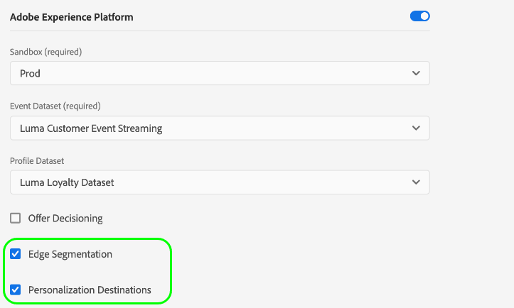
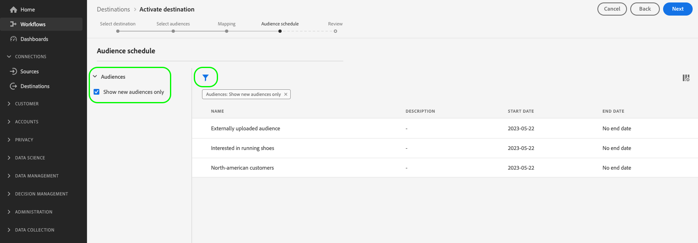

# Aktivieren von Zielgruppen für Edge-Personalisierungsziele

## Übersicht {#overview}

Adobe Experience Platform verwendet [Kantensegmentierung](../../segmentation/ui/edge-segmentation.md) zusammen mit [Edge-Ziele](/help/destinations/destination-types.md#edge-personalization-destinations) , damit Kunden Zielgruppen in großem Maßstab in Echtzeit erstellen und ansprechen können. Mit dieser Funktion können Sie Anwendungsfälle für die Personalisierung von derselben Seite und von der nächsten Seite konfigurieren.

Beispiele für Edge-Ziele sind die [Adobe Target](../../destinations/catalog/personalization/adobe-target-connection.md) und [Benutzerdefinierte Personalisierung](../../destinations/catalog/personalization/custom-personalization.md) Verbindungen.

>[!NOTE]
>
>Wann [Konfigurieren der Adobe Target-Verbindung](../catalog/personalization/adobe-target-connection.md) *without* Wenn Sie eine Datastream-ID verwenden, werden die in diesem Artikel beschriebenen Anwendungsfälle nicht unterstützt. Es werden nur Anwendungsfälle für die Personalisierung der nächsten Sitzung unterstützt, wenn kein Datastream vorhanden ist.

>[!IMPORTANT]
> 
> * So aktivieren Sie Daten und aktivieren die [Zuordnungsschritt](#mapping) des Workflows benötigen Sie die **[!UICONTROL Ziele anzeigen]**, **[!UICONTROL Ziele aktivieren]**, **[!UICONTROL Anzeigen von Profilen]**, und **[!UICONTROL Segmente anzeigen]** [Zugriffssteuerungsberechtigungen](/help/access-control/home.md#permissions).
> * So aktivieren Sie Daten, ohne die [Zuordnungsschritt](#mapping) des Workflows benötigen Sie die **[!UICONTROL Ziele anzeigen]**, **[!UICONTROL Segment ohne Zuordnung aktivieren]**, **[!UICONTROL Anzeigen von Profilen]**, und **[!UICONTROL Segmente anzeigen]** [Zugriffssteuerungsberechtigungen](/help/access-control/home.md#permissions).
>* Export *identities*, benötigen Sie die **[!UICONTROL Identitätsdiagramm anzeigen]** [Zugriffsberechtigung](/help/access-control/home.md#permissions).   {width="100" zoomable="yes"}
> 
> Lesen Sie die [Übersicht über die Zugriffssteuerung](/help/access-control/ui/overview.md) oder wenden Sie sich an Ihre Produktadmins, um die erforderlichen Berechtigungen zu erhalten.

In diesem Artikel wird der Workflow erläutert, der zum Aktivieren von Zielgruppen für Adobe Experience Platform Edge-Ziele erforderlich ist. Bei Verwendung zusammen mit [Kantensegmentierung](../../segmentation/ui/edge-segmentation.md) und der optionalen [Profilattributzuordnung](#mapping)verwenden, ermöglichen diese Ziele Anwendungsfälle für die Personalisierung von derselben Seite und nächsten Seiten in Ihren Web- und mobilen Eigenschaften.

Eine kurze Übersicht über die Konfiguration der Adobe Target-Verbindung für die Edge-Personalisierung finden Sie im folgenden Video.

>[!NOTE]
>
>Die Benutzeroberfläche von Experience Platform wird häufig aktualisiert und kann sich seit der Aufzeichnung dieses Videos geändert haben. Die aktuellsten Informationen finden Sie in den Konfigurationsschritten, die in den folgenden Abschnitten beschrieben werden.

>[!VIDEO](https://video.tv.adobe.com/v/3418799/?quality=12&learn=on)

Eine kurze Übersicht darüber, wie Sie Zielgruppen und Profilattribute für Adobe Target und benutzerdefinierte Personalisierungsziele freigeben können, finden Sie im folgenden Video.

>[!VIDEO](https://video.tv.adobe.com/v/3419036/?quality=12&learn=on)

## Anwendungsfälle {#use-cases}

Verwenden Sie Adobe-Personalisierungslösungen wie Adobe Target oder Ihre eigenen Personalisierungspartner-Plattformen (z. B. [!DNL Optimizely], [!DNL Pega]) sowie proprietären Systemen (z. B. internem CMS), um eine tiefere Kundenpersonalisierung über die [Benutzerdefinierte Personalisierung](../catalog/personalization/custom-personalization.md) Ziel. Dies alles nutzt gleichzeitig auch Experience Platform Edge Network-Datenerfassungs- und Segmentierungsfunktionen.

Die unten beschriebenen Anwendungsfälle umfassen sowohl die Personalisierung der Site als auch zielgruppengerechte On-site-Werbung.

Um diese Anwendungsfälle zu aktivieren, benötigen Kunden eine schnelle, optimierte Methode, um sowohl Zielgruppen- als auch Profilattributinformationen von Experience Platform abzurufen und diese Informationen an die [Adobe Target](../catalog/personalization/adobe-target-connection.md) oder [Benutzerdefinierte Personalisierung](../catalog/personalization/custom-personalization.md) Verbindungen in der Experience Platform-Benutzeroberfläche.

### Personalisierung derselben Seite {#same-page}

Ein Benutzer besucht eine Seite Ihrer Website. Sie können die aktuellen Seitenbesuchsinformationen (z. B. verweisende URL, Browsersprache, eingebettete Produktinformationen) verwenden, um die nächste Aktion oder Entscheidung (z. B. Personalisierung) mithilfe der [Benutzerdefinierte Personalisierung](../catalog/personalization/custom-personalization.md) Verbindung für Nicht-Adobe-Plattformen (z. B. [!DNL Pega], [!DNL Optimizely] oder andere.).

### Personalisierung der nächsten Seite {#next-page}

Ein Benutzer besucht Seite A auf Ihrer Website. Auf der Grundlage dieser Interaktion hat sich der Benutzer für eine Reihe von Zielgruppen qualifiziert. Der Benutzer klickt dann auf einen Link, der ihn von Seite A zu Seite B bringt. Die Zielgruppen, für die sich der Benutzer während der vorherigen Interaktion auf Seite A qualifiziert hat, werden zusammen mit den durch den aktuellen Website-Besuch festgelegten Profilaktualisierungen verwendet, um die nächste Aktion oder Entscheidung zu ermöglichen (z. B. welches Werbebanner dem Besucher angezeigt werden soll oder im Fall von A/B-Tests, welche Version der Seite angezeigt werden soll).

### Personalisierung der nächsten Sitzung {#next-session}

Ein Benutzer besucht mehrere Seiten auf Ihrer Website. Auf der Grundlage dieser Interaktionen hat sich der Benutzer für eine Reihe von Zielgruppen qualifiziert. Der Benutzer beendet dann die aktuelle Browser-Sitzung.

Am folgenden Tag kehrt der Benutzer zur gleichen Kundenwebsite zurück. Die Zielgruppen, für die sie sich während der vorherigen Interaktion mit allen besuchten Webseiten qualifiziert hatten, sowie die durch den aktuellen Website-Besuch bestimmten Profilaktualisierungen werden verwendet, um die nächste Aktion/Entscheidung auszuwählen (z. B. welches Werbebanner dem Besucher angezeigt werden soll oder, im Fall von A/B-Tests, welche Version der Seite angezeigt werden soll).

### Personalisieren eines Homepage-Banners {#home-page-banner}

Ein häusliches Verleih- und Vertriebsunternehmen möchte seine Homepage mit einem Banner personalisieren, das auf den Zielgruppenqualifikationen in Adobe Experience Platform basiert. Das Unternehmen kann auswählen, welche Zielgruppen ein personalisiertes Erlebnis erhalten sollen, und diese Zielgruppen als Targeting-Kriterien für sein Target-Angebot an Adobe Target senden.

## Voraussetzungen {#prerequisites}

### Konfigurieren eines Datenspeichers in der Benutzeroberfläche für die Datenerfassung {#configure-datastream}

Der erste Schritt bei der Einrichtung Ihres Personalisierungsziels besteht darin, einen Datenstrom für das Experience Platform Web SDK zu konfigurieren. Dies erfolgt in der Benutzeroberfläche für die Datenerfassung.

Stellen Sie beim Konfigurieren des Datenstroms unter **[!UICONTROL Adobe Experience Platform]** sicher, dass sowohl **[!UICONTROL Edge-Segmentierung]** als auch **[!UICONTROL Personalisierungsziele]** ausgewählt sind.

Weitere Informationen zum Einrichten eines Datenstroms finden Sie in den Anweisungen in der [Dokumentation zum Platform Web SDK](../../datastreams/configure.md#aep).

### Erstellen Sie eine [!DNL Active-On-Edge] Zusammenführungsrichtlinie {#create-merge-policy}

Nachdem Sie Ihre Zielverbindung erstellt haben, müssen Sie eine [!DNL Active-On-Edge] Zusammenführungsrichtlinie. Die [!DNL Active-On-Edge] Zusammenführungsrichtlinie stellt sicher, dass Zielgruppen kontinuierlich ausgewertet werden [am Rand](../../segmentation/ui/edge-segmentation.md) und sind für den Anwendungsfall der Personalisierung in Echtzeit und auf der nächsten Seite verfügbar.

>[!IMPORTANT]
>
>Derzeit unterstützen Edge-Ziele nur die Aktivierung von Zielgruppen, die die [Richtlinie zur aktiven Zusammenführung auf Edge](../../segmentation/ui/segment-builder.md#merge-policies) als Standard festlegen. Wenn Sie Zielgruppen, die eine andere Zusammenführungsrichtlinie verwenden, Edge-Zielen zuordnen, werden diese Zielgruppen nicht ausgewertet.

Befolgen Sie die Anweisungen zum [Erstellen einer Zusammenführungsrichtlinie](../../profile/merge-policies/ui-guide.md#create-a-merge-policy) und stellen Sie sicher, dass Sie die **[!UICONTROL Active-On-Edge-Zusammenführungsrichtlinie]** aktivieren.

### Erstellen einer neuen Zielgruppe in Platform {#create-audience}

Nachdem Sie die [!DNL Active-On-Edge] Zusammenführungsrichtlinie erstellen, müssen Sie eine neue Zielgruppe in Platform erstellen.

Befolgen Sie die [Audience Builder](../../segmentation/ui/segment-builder.md) Anleitung zum Erstellen einer neuen Zielgruppe und stellen Sie sicher, dass [zuweisen](../../segmentation/ui/segment-builder.md#merge-policies) die [!DNL Active-On-Edge] Zusammenführungsrichtlinie, die Sie im vorherigen Schritt erstellt haben.

### Erstellen einer Zielverbindung {#connect-destination}

Nachdem Sie Ihren Datenstrom konfiguriert haben, können Sie mit der Konfiguration Ihres Personalisierungsziels beginnen.

Im [Tutorial zur Erstellung von Zielverbindungen](../ui/connect-destination.md) finden Sie detaillierte Anweisungen zum Erstellen einer neuen Zielverbindung.

Abhängig vom konfigurierten Ziel finden Sie in den folgenden Artikeln Informationen zu zielspezifischen Voraussetzungen und zugehörigen Informationen:

* [Adobe Target-Verbindung](../catalog/personalization/adobe-target-connection.md#parameters)
* [Benutzerdefinierte Personalisierungsverbindung](../catalog/personalization/custom-personalization.md##parameters)

## Auswählen des Ziels {#select-destination}

Nachdem Sie die Voraussetzungen erfüllt haben, können Sie jetzt das Edge-Personalisierungsziel auswählen, das für die Personalisierung der gleichen Seite und der nächsten Seite verwendet werden soll.

1. Navigieren Sie zu **[!UICONTROL Verbindungen > Ziele]** und wählen Sie die Registerkarte **[!UICONTROL Katalog]**.

   

1. Auswählen **[!UICONTROL Aktivieren von Zielgruppen]** auf der Karte, die dem Personalisierungsziel entspricht, an dem Sie Ihre Zielgruppen aktivieren möchten, wie in der Abbildung unten dargestellt.

   

1. Wählen Sie die Zielverbindung aus, die Sie zum Aktivieren Ihrer Zielgruppen verwenden möchten, und wählen Sie dann **[!UICONTROL Nächste]**.

   

1. Zum nächsten Abschnitt wechseln, um [Zielgruppen auswählen](#select-audiences).

## Audiences auswählen {#select-audiences}

Aktivieren Sie die Kontrollkästchen links neben den Zielgruppennamen, um die Zielgruppen auszuwählen, die Sie für das Ziel aktivieren möchten, und wählen Sie dann **[!UICONTROL Nächste]**.

Um die Zielgruppen auszuwählen, die Sie für das Ziel aktivieren möchten, aktivieren Sie die Kontrollkästchen links neben den Zielgruppennamen und wählen Sie **[!UICONTROL Nächste]**.

Je nach Herkunft können Sie aus mehreren Zielgruppentypen auswählen:

* **[!UICONTROL Segmentierungsdienst]**: Vom Segmentation-Dienst innerhalb von Experience Platform generierte Zielgruppen. Siehe [Segmentierungsdokumentation](../../segmentation/ui/overview.md) für weitere Details.
* **[!UICONTROL Benutzerdefinierter Upload]**: Zielgruppen, die außerhalb von Experience Platform generiert und als CSV-Dateien in Platform hochgeladen wurden. Weitere Informationen zu externen Zielgruppen finden Sie in der Dokumentation unter [Audience importieren](../../segmentation/ui/overview.md#import-audience).
* Andere Zielgruppentypen, die von anderen Adobe-Lösungen stammen, z. B. [!DNL Audience Manager].

## Zuordnungsattribute {#mapping}

>[!IMPORTANT]
>
>Profilattribute können vertrauliche Daten enthalten. Um diese Daten zu schützen, muss die Variable **[!UICONTROL Benutzerdefinierte Personalisierung]** Für das Ziel müssen Sie die [Edge Network Server-API](../../server-api/overview.md) beim Konfigurieren des Ziels für eine attributbasierte Personalisierung. Alle Server-API-Aufrufe müssen in einem [authentifizierter Kontext](../../server-api/authentication.md).
>
> Wenn Sie bereits Web SDK oder Mobile SDK für Ihre Integration verwenden, können Sie Attribute über die Server-API abrufen, indem Sie eine serverseitige Integration hinzufügen.
>
> Wenn Sie die obigen Anforderungen nicht erfüllen, basiert die Personalisierung nur auf der Zielgruppenmitgliedschaft.

Wählen Sie die Attribute aus, auf deren Grundlage Sie die Anwendungsfälle der Personalisierung für Ihre Benutzer aktivieren möchten. Wenn sich also der Wert eines Attributs ändert oder einem Profil ein Attribut hinzugefügt wird, wird dieses Profil Mitglied der Zielgruppe und für das Personalisierungsziel aktiviert.

Das Hinzufügen von Attributen ist optional. Sie können weiterhin mit dem nächsten Schritt fortfahren und die Personalisierung der gleichen Seite und der nächsten Seite aktivieren, ohne Attribute auszuwählen. Wenn Sie in diesem Schritt keine Attribute hinzufügen, erfolgt die Personalisierung weiterhin basierend auf der Zielgruppenzugehörigkeit und den Qualifikationen der Identitätszuordnung für Profile.

### Quellattribute auswählen {#select-source-attributes}

Um Quellattribute hinzuzufügen, wählen Sie die **[!UICONTROL Neues Feld hinzufügen]** Kontrolle über **[!UICONTROL Quellfeld]** und suchen oder navigieren Sie zum gewünschten XDM-Attributfeld, wie unten dargestellt.

### Zielattribute auswählen {#select-target-attributes}

Um Zielattribute hinzuzufügen, wählen Sie die **[!UICONTROL Neues Feld hinzufügen]** Kontrolle über **[!UICONTROL Zielfeld]** und geben Sie den benutzerdefinierten Attributnamen ein, dem Sie das Quellattribut zuordnen möchten.

>[!NOTE]
>
>Die Auswahl der Zielattribute gilt nur für die [Benutzerdefinierte Personalisierung](../catalog/personalization/custom-personalization.md) Aktivierungs-Workflow, um die Zuordnung von Anzeigenamenfeldern in der Zielplattform zu unterstützen.

## Planen eines Zielgruppenexports {#scheduling}

Standardmäßig wird die Variable [!UICONTROL Zielgruppenplanung] zeigt nur die neu ausgewählten Zielgruppen an, die Sie im aktuellen Aktivierungsablauf ausgewählt haben.

Um alle für Ihr Ziel aktivierten Zielgruppen anzuzeigen, verwenden Sie die Filteroption und deaktivieren Sie die **[!UICONTROL Nur neue Zielgruppen anzeigen]** Filter.

Im **[!UICONTROL Zielgruppenplanung]** Seite, wählen Sie jede Zielgruppe aus und verwenden Sie dann die **[!UICONTROL Startdatum]** und **[!UICONTROL Enddatum]** Selektoren zum Konfigurieren des Zeitintervalls für das Senden von Daten an Ihr Ziel.

Auswählen **[!UICONTROL Nächste]** , um zu [!UICONTROL Überprüfen] Seite.

## Überprüfung {#review}

Auf der Seite **[!UICONTROL Überprüfen]** können Sie eine Zusammenfassung Ihrer Auswahl sehen. Wählen Sie **[!UICONTROL Abbrechen]**, um den Fluss abzubrechen, **[!UICONTROL Zurück]**, um die Einstellungen zu ändern, oder **[!UICONTROL Fertig stellen]**, um Ihre Auswahl zu bestätigen und mit dem Senden von Daten an das Ziel zu beginnen.

### Auswertung der Einverständnisrichtlinie {#consent-policy-evaluation}

Wenn Ihr Unternehmen **Adobe Healthcare Shield** oder **Adobe Privacy &amp; Security Shield** erworben hat, wählen Sie **[!UICONTROL Aktuelle Einverständnisrichtlinien anzeigen]** aus, um zu sehen, welche Einverständnisrichtlinien angewendet werden und wie viele Profile in der Aktivierung enthalten sind. Informationen [Bewertung der Einwilligungsrichtlinie](/help/data-governance/enforcement/auto-enforcement.md#consent-policy-evaluation) für weitere Informationen.

### Prüfungen von Datennutzungsrichtlinien {#data-usage-policy-checks}

Im **[!UICONTROL Überprüfen]** -Schritt, überprüft Experience Platform auch auf Verstöße gegen Datennutzungsrichtlinien. Nachstehend ist ein Beispiel angegeben, bei dem eine Richtlinie verletzt wird. Sie können den Aktivierungs-Workflow für die Zielgruppe erst abschließen, nachdem Sie den Verstoß behoben haben. Informationen zum Beheben von Richtlinienverletzungen finden Sie unter [Verstöße gegen Datennutzungsrichtlinien](/help/data-governance/enforcement/auto-enforcement.md#data-usage-violation) im Abschnitt Data Governance-Dokumentation .

### Filtern von Zielgruppen {#filter-audiences}

In diesem Schritt können Sie die verfügbaren Filter auf der Seite verwenden, um nur die Zielgruppen anzuzeigen, deren Zeitplan oder Zuordnung im Rahmen dieses Workflows aktualisiert wurde. Sie können auch umschalten, welche Tabellenspalten angezeigt werden sollen.

Wenn Sie mit Ihrer Auswahl zufrieden sind und keine Richtlinienverletzungen festgestellt wurden, wählen Sie **[!UICONTROL Beenden]** , um Ihre Auswahl zu bestätigen und mit dem Senden von Daten an das Ziel zu beginnen.

<!--

Commenting out this part since destination monitoring is not available currently for the Adobe Target and Custom Personalization destinations.

## Verify audience activation {#verify}

Check the [destination monitoring documentation](../../dataflows/ui/monitor-destinations.md) for detailed information on how to monitor the flow of data to your destinations.

-->
