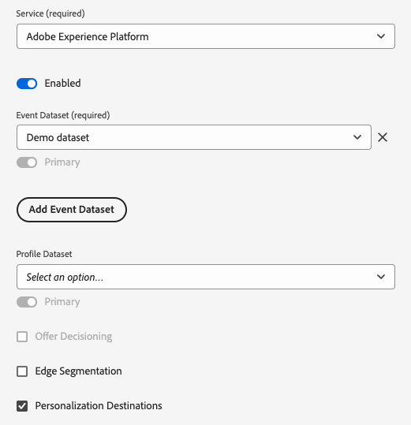
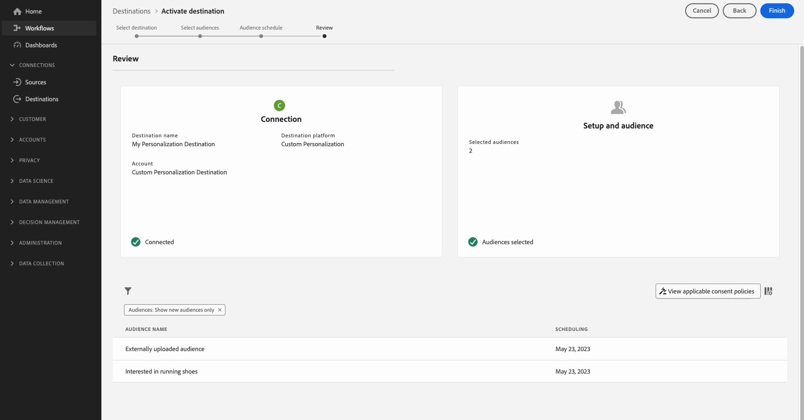

# Suchen nach Profilattributen am Edge in Echtzeit

Adobe Experience Platform verwendet das [Echtzeit-Kundenprofil](../../profile/home.md) als einzige &quot;Source of Truth&quot;(Wahrheitsquelle für alle Profildaten). Für den schnellen Echtzeit-Datenabruf werden [Kantenprofile](../../profile/edge-profiles.md) verwendet, bei denen es sich um einfache Profile handelt, die über das gesamte [Edge Network](../../collection/home.md#edge) verteilt sind. Dies ermöglicht schnelle Anwendungsfälle für die Personalisierung in Echtzeit.

## Anwendungsfälle {#use-cases}

Im Folgenden finden Sie zwei Anwendungsfälle, in denen die Suche nach Kantenprofilen hilfreich sein kann.

* **Echtzeit-Personalization**: Schnelles Abrufen von Profilinformationen aus dem Edge-Profil, um das Benutzererlebnis auf Ihrer Website zu personalisieren.
* **Kundensupport**: Rufen Sie Profilinformationen in Echtzeit ab, wenn ein Kunde einen Support-Center-Agenten aufruft.

Auf dieser Seite werden die Schritte beschrieben, die Sie ausführen müssen, um Edge-Profildaten in Echtzeit zu suchen, um Personalisierungserlebnisse bereitzustellen oder Entscheidungsregeln über nachgelagerte Anwendungen zu informieren.

## Terminologie und Voraussetzungen {#prerequisites}

Beim Konfigurieren des auf dieser Seite beschriebenen Anwendungsfalls verwenden Sie die folgenden Platform-Komponenten:

* [Datastreams](../../datastreams/overview.md): Ein Datastream empfängt eingehende Ereignisdaten vom Web SDK und reagiert mit Edge-Profildaten.
* [Zusammenführungsrichtlinien](../../segmentation/ui/segment-builder.md#merge-policies): Sie erstellen eine Zusammenführungsrichtlinie [!UICONTROL Active-On-Edge], um sicherzustellen, dass die Kantenprofile die richtigen Profildaten verwenden.
* [Benutzerdefinierte Personalization-Verbindung](../catalog/personalization/custom-personalization.md): Sie konfigurieren eine neue benutzerdefinierte Personalisierungsverbindung, über die die Profilattribute an das Edge Network gesendet werden.
* [Edge Network-API](../../server-api/overview.md): Mithilfe der Edge Network-API [interaktiven Datenerfassungsfunktion](../../server-api/interactive-data-collection.md) können Sie Profilattribute schnell aus den Kantenprofilen abrufen.

## Performance-Garantien {#guardrails}

Anwendungsfälle für die Edge-Profilsuche unterliegen den in der folgenden Tabelle beschriebenen spezifischen Leistungsgarantien. Weitere Informationen zu den Limits der Edge Network-API finden Sie auf der Seite mit den Limits [Dokumentation](https://developer.adobe.com/data-collection-apis/docs/getting-started/guardrails/) .

| Edge Network Service | Edge-Segmentierung | Anforderungen pro Sekunde |
|---------|----------|---------|
| [Benutzerdefiniertes Personalisierungsziel](../catalog/personalization/custom-personalization.md) über die [Edge Network-API](https://developer.adobe.com/data-collection-apis/docs/api/) | Ja | 1500 |
| [Benutzerdefiniertes Personalisierungsziel](../catalog/personalization/custom-personalization.md) über die [Edge Network-API](https://developer.adobe.com/data-collection-apis/docs/api/) | Nein | 1500 |

## Schritt 1: Erstellen und Konfigurieren eines Datenspeichers {#create-datastream}

Führen Sie die Schritte in der Dokumentation zur [Datastream-Konfiguration](../../datastreams/configure.md#create-a-datastream) aus, um einen neuen Datastream mit den folgenden **[!UICONTROL Service]**-Einstellungen zu erstellen:

* **[!UICONTROL service]**: [!UICONTROL Adobe Experience Platform]
* **[!UICONTROL Personalization-Ziele]**: Aktiviert
* **[!UICONTROL Edge-Segmentierung]**: Wenn Sie Kantensegmentierung benötigen, aktivieren Sie diese Option. Wenn Sie nur nach Profilattributen am Rand suchen möchten, aber keine Segmentierung basierend auf den Kantenprofilen durchführen möchten, lassen Sie diese Option deaktiviert.


  <!-- >[!IMPORTANT]
    >
    >Enabling edge segmentation limits the maximum number of lookup requests to 1500 request per second. If you need a higher request throughput, disable edge segmentation for your datastream. See the [guardrails documentation](../guardrails.md#edge-destinations-activation) for detailed information. -->

  


## Schritt 2: Konfigurieren Sie Ihre Zielgruppen für die Edge-Auswertung. {#audience-edge-evaluation}

Für die Suche nach Profilattributen am Rand müssen Ihre Zielgruppen für die Edge-Bewertung konfiguriert sein.

Stellen Sie sicher, dass für die Zielgruppen, die Sie aktivieren möchten, die [Richtlinie zur Zusammenführung von Aktiv mit Edge](../../segmentation/ui/segment-builder.md#merge-policies) als Standard festgelegt ist. Die [!DNL Active-On-Edge]-Zusammenführungsrichtlinie stellt sicher, dass Zielgruppen ständig [am Rand](../../segmentation/ui/edge-segmentation.md) ausgewertet werden und für Anwendungsfälle der Echtzeit-Personalisierung verfügbar sind.

Befolgen Sie die Anweisungen zum [Erstellen einer Zusammenführungsrichtlinie](../../profile/merge-policies/ui-guide.md#create-a-merge-policy) und stellen Sie sicher, dass Sie die **[!UICONTROL Active-On-Edge-Zusammenführungsrichtlinie]** aktivieren.

>[!IMPORTANT]
>
>Wenn Ihre Zielgruppen eine andere Zusammenführungsrichtlinie verwenden, können Sie keine Profilattribute vom Edge abrufen und Sie können keine Edge-Profil-Suche durchführen.

## Schritt 3: Senden von Profilattributdaten an das Edge Network{#configure-custom-personalization-connection}

Um in Echtzeit nach Edge-Profilen, einschließlich Attributen und Zielgruppenmitgliedsdaten, zu suchen, müssen die Daten im Edge Network bereitgestellt werden. Dazu müssen Sie eine Verbindung zu einem Ziel vom Typ **[!UICONTROL Benutzerdefinierte Personalization mit Attributen]** herstellen und die Zielgruppen aktivieren, einschließlich der Attribute, die Sie in den Kantenprofilen nachschlagen möchten.

+++ Konfigurieren einer benutzerdefinierten Personalization-Verbindung mit Attributen

Im [Tutorial zur Erstellung von Zielverbindungen](../ui/connect-destination.md) finden Sie detaillierte Anweisungen zum Erstellen einer neuen Zielverbindung.

Wählen Sie beim Konfigurieren des neuen Ziels im Feld **[!UICONTROL Datastream-ID]** den Datenspeicher aus, den Sie in Schritt 1 [1](#create-datastream) erstellt haben. Für **[!UICONTROL Integrationsalias]** können Sie jeden Wert verwenden, der Ihnen dabei hilft, diese Zielverbindung in der Zukunft zu identifizieren, z. B. den Zielnamen.


+++

++ + Aktivieren Ihrer Zielgruppen für die Verbindung &quot;Benutzerdefinierte Personalization mit Attributen&quot;

Nachdem Sie eine Verbindung mit **[!UICONTROL Benutzerdefiniertem Personalization mit Attributen]** erstellt haben, können Sie jetzt Profildaten an das Edge Network senden.

>[!IMPORTANT]
> 
> * Um Daten zu aktivieren und den Schritt [Zuordnen](#mapping) des Workflows zu aktivieren, benötigen Sie die Zugriffssteuerungsberechtigungen **[!UICONTROL Ziele anzeigen]**, **[!UICONTROL Ziele aktivieren]**, **[!UICONTROL Profile anzeigen]** und **[!UICONTROL Segmente anzeigen]** [.](/help/access-control/home.md#permissions)
> 
> Lesen Sie die [Übersicht über die Zugriffssteuerung](/help/access-control/ui/overview.md) oder wenden Sie sich an Ihre Produktadmins, um die erforderlichen Berechtigungen zu erhalten.

1. Navigieren Sie zu **[!UICONTROL Verbindungen > Ziele]** und wählen Sie die Registerkarte **[!UICONTROL Katalog]**.

   

1. Suchen Sie die Zielkarte **[!UICONTROL Benutzerdefinierte Personalization mit Attributen]** und wählen Sie dann **[!UICONTROL Zielgruppen aktivieren]** aus, wie in der Abbildung unten dargestellt.

   

1. Wählen Sie die zuvor konfigurierte Zielverbindung und dann **[!UICONTROL Weiter]** aus.

   

1. Wählen Sie Ihre Zielgruppen aus. Verwenden Sie die Kontrollkästchen links neben den Zielgruppennamen, um die Zielgruppen auszuwählen, die Sie für das Ziel aktivieren möchten, und wählen Sie dann **[!UICONTROL Weiter]** aus.

   Je nach Herkunft können Sie aus mehreren Zielgruppentypen auswählen:

   * **[!UICONTROL Segmentation Service]**: Zielgruppen, die innerhalb von Experience Platform vom Segmentation Service generiert werden. Weitere Informationen finden Sie in der [Dokumentation zur Segmentierung](../../segmentation/ui/overview.md) .
   * **[!UICONTROL Benutzerdefinierter Upload]**: Zielgruppen, die außerhalb von Experience Platform generiert und als CSV-Dateien in Platform hochgeladen wurden. Weitere Informationen zu externen Zielgruppen finden Sie in der Dokumentation zum [Importieren einer Zielgruppe](../../segmentation/ui/overview.md#import-audience).
   * Andere Zielgruppentypen, die von anderen Adobe-Lösungen wie [!DNL Audience Manager] stammen.

     

1. Wählen Sie die Profilattribute aus, die Sie für die Kantenprofile zur Verfügung stellen möchten.

   * **Quellattribute auswählen**. Um Quellattribute hinzuzufügen, wählen Sie das Steuerelement **[!UICONTROL Neues Feld hinzufügen]** in der Spalte **[!UICONTROL Source-Feld]** aus und suchen oder navigieren Sie zum gewünschten XDM-Attributfeld, wie unten dargestellt.

     

   * **Wählen Sie Zielattribute aus.** Um Zielattribute hinzuzufügen, wählen Sie das Steuerelement **[!UICONTROL Neues Feld hinzufügen]** in der Spalte **[!UICONTROL Zielfeld]** aus und geben Sie den benutzerdefinierten Attributnamen ein, dem Sie das Quellattribut zuordnen möchten.

     


Wenn Sie die Zuordnung der Profilattribute abgeschlossen haben, wählen Sie **[!UICONTROL Weiter]** aus.

Auf der Seite **[!UICONTROL Überprüfen]** können Sie eine Zusammenfassung Ihrer Auswahl sehen. Wählen Sie **[!UICONTROL Abbrechen]** , um den Fluss abzubrechen, **[!UICONTROL Zurück]**, um Ihre Einstellungen zu ändern, oder **[!UICONTROL Beenden]** , um Ihre Auswahl zu bestätigen und mit dem Senden von Profildaten an das Edge Network zu beginnen.


+++

+++ Bewertung von Einwilligungsrichtlinien

Wenn Ihr Unternehmen **Adobe Healthcare Shield** oder **Adobe Privacy &amp; Security Shield** erworben hat, wählen Sie **[!UICONTROL Aktuelle Einverständnisrichtlinien anzeigen]** aus, um zu sehen, welche Einverständnisrichtlinien angewendet werden und wie viele Profile in der Aktivierung enthalten sind. Weitere Informationen finden Sie unter [Bewertung von Zustimmungsrichtlinien](/help/data-governance/enforcement/auto-enforcement.md#consent-policy-evaluation) .

**Prüfungen der Datennutzungsrichtlinien**

Im Schritt **[!UICONTROL Überprüfen]** überprüft Experience Platform auch auf Verstöße gegen Datennutzungsrichtlinien. Nachstehend ist ein Beispiel angegeben, bei dem eine Richtlinie verletzt wird. Sie können den Aktivierungs-Workflow für die Zielgruppe erst abschließen, nachdem Sie den Verstoß behoben haben. Informationen zum Beheben von Richtlinienverletzungen finden Sie unter [Verstöße gegen Datennutzungsrichtlinien](/help/data-governance/enforcement/auto-enforcement.md#data-usage-violation) im Abschnitt zur Data Governance-Dokumentation.


+++

+++Zielgruppen filtern

Im Schritt **[!UICONTROL Überprüfen]** können Sie die verfügbaren Filter auf der Seite verwenden, um nur die Zielgruppen anzuzeigen, deren Zeitplan oder Zuordnung im Rahmen dieses Workflows aktualisiert wurde. Sie können auch umschalten, welche Tabellenspalten angezeigt werden sollen.




Wenn Sie mit Ihrer Auswahl zufrieden sind und keine Richtlinienverletzungen festgestellt wurden, wählen Sie **[!UICONTROL Beenden]** aus, um Ihre Auswahl zu bestätigen.

+++

## Schritt 4: Profilattribute am Rand nachschlagen {#configure-edge-profile-lookup}

Jetzt sollten Sie [ mit der Konfiguration Ihres Datenspeichers](#create-datastream) fertig sein, [ eine neue benutzerdefinierte Personalization-Zielverbindung mit Attributen erstellt haben](#configure-destination) und diese Verbindung zum [Senden der Profilattribute](#activate-audiences) verwendet haben, nach denen Sie das Edge Network suchen können.

Der nächste Schritt besteht darin, Ihre Personalisierungslösung so zu konfigurieren, dass Profilattribute von den Kantenprofilen abgerufen werden.

>[!IMPORTANT]
>
>Profilattribute können vertrauliche Daten enthalten. Zum Schutz dieser Daten müssen Sie die Profilattribute über die [Edge Network-API](../../server-api/overview.md) abrufen. Außerdem müssen Sie die Profilattribute über den Edge Network-API [interaktiven Datenerfassungsendpunkt](../../server-api/interactive-data-collection.md) abrufen, damit die API-Aufrufe authentifiziert werden können.
><br>Wenn Sie die obigen Anforderungen nicht erfüllen, basiert die Personalisierung nur auf der Mitgliedschaft in einer Zielgruppe, und Profilattribute stehen Ihnen nicht zur Verfügung.

Der in Schritt 1](#create-datastream) konfigurierte Datastream ist jetzt bereit, eingehende Ereignisdaten zu akzeptieren und mit Edge-Profilinformationen zu reagieren.[

Konfigurieren Sie Ihre Integration, um Edge-Profilinformationen abzurufen, wie in den Beispielen unten dargestellt.

### Anfrage {#request}

Um Kantenprofildaten abzurufen, senden Sie einen leeren `POST` -Aufruf an den `/interact` -Endpunkt mit der primären Identität, für die Sie im Ereignis Profilattribute nachschlagen, wie unten dargestellt.

```shell
curl -X POST "https://server.adobedc.net/ee/v2/interact?dataStreamId={DATASTREAM_ID}" 
-H "Authorization: Bearer {TOKEN}" 
-H "x-gw-ims-org-id: {ORG_ID}" 
-H "x-api-key: {API_KEY}" 
-H "Content-Type: application/json" 
-d '{
    "event":
    {
        "xdm": {
            "identityMap": {
                "Email": [
                    {  
                        "id":"test123@adobetest.com",
                        "primary":true
                    }
                ]
            }
        }
    }
    
}'
```

| Parameter | Typ | Erforderlich | Beschreibung |
| --- | --- | --- | --- |
| `dataStreamId` | `String` | Ja. | Die Datastream-ID des Datastreams, den Sie in [Schritt 1](#create-datastream) erstellt haben. |

### Antwort {#response}

Eine erfolgreiche Antwort gibt den HTTP-Status `200 OK` mit einem `Handle` -Objekt zurück, das Informationen enthält, die den Beispielen in den folgenden Registerkarten ähnlich sind, je nachdem, ob das Profil am Rand gefunden wurde oder nicht.

>[!NOTE]
>
>Die API-Antworten sind modular und das `handle` -Objekt kann mehrere `payload` -Objekte verschiedener Typen enthalten. Die Informationen zur Suche nach Kantenprofilen werden unter dem Objekt `payload` mit `"type": "activation:pull"` gruppiert.

>[!BEGINTABS]

>[!TAB Profil ist am Rand vorhanden]

Wenn das Profil am Edge vorhanden ist, können Sie abhängig von den Profilattributen und den für den Edge aktivierten Zielgruppen eine Antwort mit Attributen und Zielgruppenmitgliedschaften ähnlich der unten stehenden erwarten.

```json
{
  "requestId": "3c600138-d785-42ca-a025-bb725f4b5da9",
  "handle": [
    {
      "payload": [
        {
          "type": "profileLookup",
          "destinationId": "9218b727-ec59-4a46-b8b9-05503f138c5d",
          "alias": "rk-demo-custom-personalization-XXXX",
          "attributes": {
            "zip": {
              "value": "19000"
            },
            "firstName": {
              "value": "Test"
            },
            "lastName": {
              "value": "User123"
            },
            "gender": {
              "value": "male"
            },
            "city": {
              "value": "Philadelphia"
            },
            "state": {
              "value": "PA"
            },
            "email": {
              "value": "test123@adobetest.com"
            }
          },
          "segments": [
            {
              "id": "85018bd8-7ad1-4e17-ae30-8389c04bd3c0",
              "namespace": "ups"
            },
            {
              "id": "d09a8159-8b30-4178-b2f2-7a8c5e3168d9",
              "namespace": "ups"
            }
          ]
        }
      ],
      "type": "activation:pull",
      "eventIndex": 0
    }
  ]
}
```

Das Objekt `handle` stellt die in der folgenden Tabelle beschriebenen Informationen bereit.

| Parameter | Beschreibung |
|---------|----------|
| `payload` | Das `payload` -Objekt, das die Kantensuche-Informationen enthält. Die Antwort kann mehrere zusätzliche `payload` -Objekte enthalten, die nicht mit der Kantensuche in Verbindung stehen. |
| `type` | Payloads werden in der Antwort nach ihrem Typ gruppiert. Der Payload-Typ für die Edge-Profil-Suche ist immer auf `profileLookup` eingestellt. |
| `destinationId` | Die ID der Verbindungsinstanz **[!UICONTROL Benutzerdefinierter Personalization]** , die Sie in [Schritt 3](#configure-custom-personalization-connection) erstellt haben. |
| `alias` | Der Alias der Zielverbindung, der vom Benutzer beim Erstellen der [benutzerdefinierten Personalization](../catalog/personalization/custom-personalization.md) -Zielverbindung konfiguriert wird. |
| `attributes` | Dieses Array enthält die Edge-Profilattribute der Zielgruppen, die Sie in [Schritt 3](#configure-custom-personalization-connection) aktiviert haben. |
| `segments` | Dieses Array enthält die Zielgruppen, die Sie in [Schritt 3](#configure-custom-personalization-connection) aktiviert haben. |
| `type` | `handle` -Objekte werden nach Typ gruppiert. Bei Anwendungsfällen für die Suche nach Kantenprofilen ist der Typ des Objekts `handle` immer `activation:pull`. |
| `eventIndex` | Das Edge Network empfängt Ereignisse vom Client in Form von Arrays. Die Reihenfolge der Ereignisse im Array wird während der Verarbeitung beibehalten und durch diesen Index widergespiegelt. Die Ereignisindizierung beginnt mit `0`. |

>[!TAB Profil existiert nicht am Rand]

Wenn das Profil nicht am Rand vorhanden ist, können Sie eine Antwort ähnlich der folgenden erwarten.

```json
{
  "requestId": "531b541a-4541-419e-ac99-fd7e452f0c0f",
  "handle": [
    {
      "payload": [],
      "type": "activation:pull",
      "eventIndex": 0
    }
  ]
}
```

Das Objekt `handle` stellt die in der folgenden Tabelle beschriebenen Informationen bereit.

| Parameter | Beschreibung |
|---------|----------|
| `payload` | Wenn das Profil nicht am Rand vorhanden ist, ist das Objekt `payload` leer. |
| `type` | `payload` -Objekte werden nach Typ gruppiert. Bei Anwendungsfällen für die Suche nach Kantenprofilen ist der Typ des Objekts `payload` immer `activation:pull`. |
| `eventIndex` | Das Edge Network empfängt Ereignisse vom Client in Form von Arrays. Die Reihenfolge der Ereignisse im Array wird während der Verarbeitung beibehalten und durch diesen Index widergespiegelt. Die Ereignisindizierung beginnt mit `0`. |

>[!ENDTABS]

>[!SUCCESS]
>
>Wenn Sie die Integration korrekt konfiguriert haben, haben Sie jetzt Zugriff auf die Edge-Profildaten und Sie können die Attribute und die Zielgruppenzugehörigkeit Ihrer Edge-Profile verwenden, um in Ihrer nachgelagerten Personalisierungs-Engine eine Echtzeit-Personalisierung für den Trigger zu ermöglichen.

## Zusammenfassung {#conclusion}

Mit den obigen Schritten können Sie Edge-Profilattribute effizient in Echtzeit nachschlagen und so personalisierte Erlebnisse und fundierte Entscheidungen über nachgelagerte Anwendungen ermöglichen.
