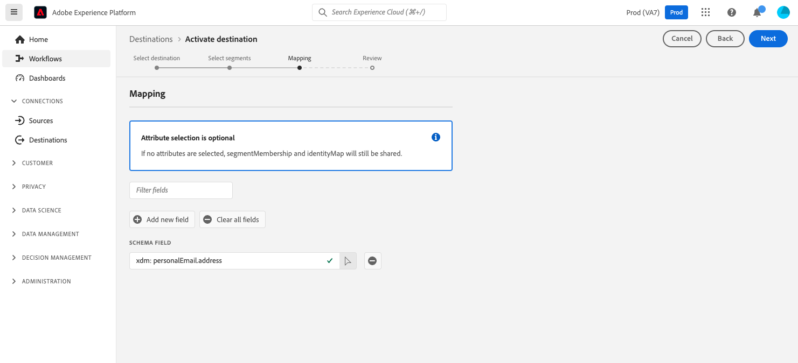
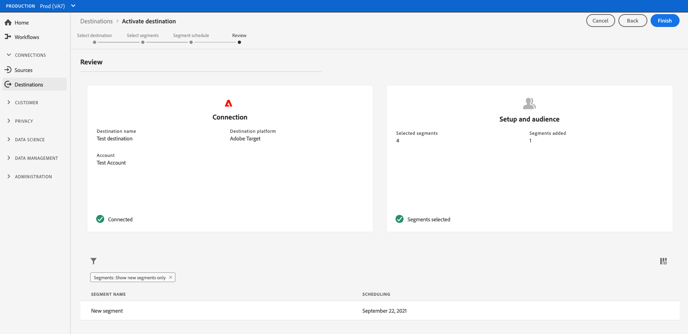

# Aktivieren von Zielgruppendaten für Profilanforderungsziele

>[!IMPORTANT]
> 
>Um Daten zu aktivieren, benötigen Sie die **[!UICONTROL Ziele verwalten]**, **[!UICONTROL Ziele aktivieren]**, **[!UICONTROL Profile anzeigen]** und **[!UICONTROL Segmente anzeigen]** [Zugriffssteuerungsberechtigungen](/help/access-control/home.md#permissions). Lesen Sie die [Zugriffskontrolle - Übersicht](/help/access-control/ui/overview.md) oder wenden Sie sich an Ihren Produktadministrator, um die erforderlichen Berechtigungen zu erhalten.

## Übersicht {#overview}

In diesem Artikel wird der Workflow erläutert, der zum Aktivieren von Zielgruppendaten in Adobe Experience Platform-Profilanforderungszielen erforderlich ist. Bei Verwendung zusammen mit [Kantensegmentierung](../../segmentation/ui/edge-segmentation.md), aktivieren diese Ziele Anwendungsfälle für die Personalisierung von derselben Seite und nächsten Seiten in Ihren Webeigenschaften. Mehr dazu [Anwendungsfälle für die Personalisierung von derselben Seite und nächsten Seiten aktivieren](/help/destinations/ui/configure-personalization-destinations.md).

Beispiele für Profilanforderungsziele sind die [Adobe Target](../../destinations/catalog/personalization/adobe-target-connection.md) und [Benutzerdefinierte Personalisierung](../../destinations/catalog/personalization/custom-personalization.md) Verbindungen.

## Voraussetzungen {#prerequisites}

Um Daten für Ziele aktivieren zu können, müssen Sie eine erfolgreiche [Verbindung zu einem Ziel](./connect-destination.md) hergestellt haben. Wenn Sie das noch nicht getan haben, gehen Sie zum [Zielkatalog](../catalog/overview.md), durchsuchen Sie die unterstützten Personalisierungsziele und konfigurieren Sie das Ziel, das Sie verwenden möchten.

### Segmentzusammenführungsrichtlinie {#merge-policy}

Derzeit unterstützen Profilanforderungsziele nur die Aktivierung von Segmenten, die die [Richtlinie zur aktiven Zusammenführung auf Edge](../../segmentation/ui/segment-builder.md#merge-policies) als Standard festlegen.

## Auswählen des Ziels {#select-destination}

1. Navigieren Sie zu **[!UICONTROL Verbindungen und Ziele]** und wählen Sie die Registerkarte **[!UICONTROL Katalog]**.

   

1. Auswählen **[!UICONTROL Segmente aktivieren]** auf der Karte, die dem Personalisierungsziel entspricht, an dem Sie Ihre Segmente aktivieren möchten, wie in der Abbildung unten dargestellt.

   

1. Wählen Sie die Zielverbindung aus, die Sie zum Aktivieren Ihrer Segmente verwenden möchten, und klicken Sie dann auf **[!UICONTROL Weiter]**.

   

1. Gehen Sie zum nächsten Abschnitt, um [Ihre Segmente auszuwählen](#select-segments).

## Auswählen der Segmente {#select-segments}

Aktivieren Sie die Kontrollkästchen links neben den Segmentnamen, um die Segmente auszuwählen, die Sie für das Ziel aktivieren möchten, und klicken Sie dann auf **[!UICONTROL Weiter]**.

## (Beta) Zuordnungsattribute {#map-attributes}

>[!IMPORTANT]
>
>Der Zuordnungsschritt, der eine attributbasierte Personalisierung für [Adobe Target](/help/destinations/catalog/personalization/adobe-target-connection.md) und [allgemeine Personalisierungsziele](/help/destinations/catalog/personalization/custom-personalization.md), befindet sich derzeit in der Beta-Phase und Ihre Organisation hat möglicherweise noch keinen Zugriff darauf. Diese Dokumentation kann sich ändern.

Wählen Sie die Attribute aus, auf deren Grundlage Sie die Anwendungsfälle der Personalisierung für Ihre Benutzer aktivieren möchten. Wenn sich also der Wert eines Attributs ändert oder einem Profil ein Attribut hinzugefügt wird, wird dieses Profil zum Segment und für das Personalisierungsziel aktiviert.

Das Hinzufügen von Attributen ist optional. Sie können weiterhin mit dem nächsten Schritt fortfahren und die Personalisierung der gleichen Seite und der nächsten Seite aktivieren, ohne Attribute auszuwählen. Wenn Sie in diesem Schritt keine Attribute hinzufügen, erfolgt die Personalisierung weiterhin basierend auf der Segmentzugehörigkeit und den Qualifikationen der Identitätszuordnung für Profile.

### Quellattribute auswählen {#select-source-attributes}

Um Quellattribute hinzuzufügen, wählen Sie die **[!UICONTROL Neues Feld hinzufügen]** Kontrolle **[!UICONTROL Quellfeld]** und suchen oder navigieren Sie zum gewünschten XDM-Attributfeld, wie unten dargestellt.

### Zielattribute auswählen {#select-target-attributes}

>[!NOTE]
>
>Bei einigen Zielen müssen Sie nur Quellattribute auswählen, bei anderen werden sowohl Quell- als auch Zielattribute benötigt.
>
>Derzeit wird die [Adobe Target V2](../catalog/personalization/adobe-target-connection.md) Das Ziel erfordert nur Quellattribute, während [Benutzerdefinierte Personalisierung mit Attributen](../catalog/personalization/custom-personalization.md) erfordert sowohl Quell- als auch Zielattribute.

Um Zielattribute hinzuzufügen, wählen Sie die **[!UICONTROL Neues Feld hinzufügen]** Kontrolle **[!UICONTROL Zielfeld]** und geben Sie den benutzerdefinierten Attributnamen ein, dem Sie das Quellattribut zuordnen möchten.

## Planen des Segmentexports {#scheduling}

Standardmäßig wird die [!UICONTROL Segmentplan] zeigt nur die neu ausgewählten Segmente an, die Sie im aktuellen Aktivierungsfluss ausgewählt haben.

Um alle für Ihr Ziel aktivierten Segmente anzuzeigen, verwenden Sie die Filteroption und deaktivieren Sie die **[!UICONTROL Nur neue Segmente anzeigen]** Filter.

Im **[!UICONTROL Segmentplan]** Seite, wählen Sie jedes Segment aus und verwenden Sie dann die **[!UICONTROL Startdatum]** und **[!UICONTROL Enddatum]** Selektoren zum Konfigurieren des Zeitintervalls für das Senden von Daten an Ihr Ziel.

Auswählen **[!UICONTROL Nächste]** , um [!UICONTROL Überprüfen] Seite.

## Überprüfung {#review}

Auf der Seite **[!UICONTROL Überprüfen]** können Sie eine Zusammenfassung Ihrer Auswahl sehen. Wählen Sie **[!UICONTROL Abbrechen]**, um den Fluss abzubrechen, **[!UICONTROL Zurück]**, um die Einstellungen zu ändern, oder **[!UICONTROL Fertig stellen]**, um Ihre Auswahl zu bestätigen und mit dem Senden von Daten an das Ziel zu beginnen.

>[!IMPORTANT]
>
>In diesem Schritt prüft Adobe Experience Platform, ob Verstöße gegen Datennutzungsrichtlinien vorliegen. Nachstehend ist ein Beispiel angegeben, bei dem eine Richtlinie verletzt wird. Sie können den Workflow zur Segmentaktivierung erst abschließen, nachdem Sie den Verstoß behoben haben. Informationen dazu, wie Richtlinienverletzungen behoben werden, finden Sie unter [Durchsetzung von Richtlinien](../../rtcdp/privacy/data-governance-overview.md#enforcement) im Dokumentationsabschnitt zur Data Governance.

Wenn keine Richtlinienverletzungen festgestellt wurden, wählen Sie **[!UICONTROL Beenden]**, um Ihre Auswahl zu bestätigen und mit dem Senden von Daten an das Ziel zu beginnen.

<!--

Commenting out this part since destination monitoring is not available currently for the Adobe Target and Custom Personalization destinations.

## Verify segment activation {#verify}

Check the [destination monitoring documentation](../../dataflows/ui/monitor-destinations.md) for detailed information on how to monitor the flow of data to your destinations.

-->