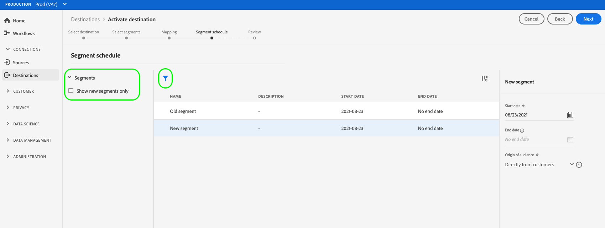

# Aktivieren von Zielgruppendaten für Streaming-Segmentexportziele

>[!IMPORTANT]
> 
>Um Daten zu aktivieren, benötigen Sie die **[!UICONTROL Ziele verwalten]**, **[!UICONTROL Ziele aktivieren]**, **[!UICONTROL Profile anzeigen]** und **[!UICONTROL Segmente anzeigen]** [Zugriffssteuerungsberechtigungen](/help/access-control/home.md#permissions). Lesen Sie die [Zugriffskontrolle - Übersicht](/help/access-control/ui/overview.md) oder wenden Sie sich an Ihren Produktadministrator, um die erforderlichen Berechtigungen zu erhalten.

## Übersicht {#overview}

In diesem Artikel wird der Workflow erläutert, der zum Aktivieren von Zielgruppendaten in Adobe Experience Platform-Segmentstreaming-Zielen erforderlich ist.

## Voraussetzungen {#prerequisites}

Um Daten für Ziele aktivieren zu können, müssen Sie eine erfolgreiche [Verbindung zu einem Ziel](./connect-destination.md) hergestellt haben. Wenn Sie das noch nicht getan haben, navigieren Sie zum [Zielkatalog](../catalog/overview.md), durchsuchen Sie die unterstützten Ziele und konfigurieren Sie das Ziel, das Sie verwenden möchten.

## Auswählen des Ziels {#select-destination}

1. Navigieren Sie zu **[!UICONTROL Verbindungen und Ziele]** und wählen Sie die Registerkarte **[!UICONTROL Katalog]**.

   

1. Wählen Sie **[!UICONTROL Segmente aktivieren]** auf der Karte, die dem Zielort entspricht, an dem Sie Ihre Segmente aktivieren möchten, wie in der Abbildung unten dargestellt.

   

1. Wählen Sie die Zielverbindung aus, die Sie zum Aktivieren Ihrer Segmente verwenden möchten, und klicken Sie dann auf **[!UICONTROL Weiter]**.

   

1. Gehen Sie zum nächsten Abschnitt, um [Ihre Segmente auszuwählen](#select-segments).

## Auswählen der Segmente {#select-segments}

Aktivieren Sie die Kontrollkästchen links neben den Segmentnamen, um die Segmente auszuwählen, die Sie für das Ziel aktivieren möchten, und klicken Sie dann auf **[!UICONTROL Weiter]**.

## Zuordnen von Attributen und Identitäten {#mapping}

>[!IMPORTANT]
>
>Dieser Schritt gilt nur für einige Segment-Streaming-Ziele. Wenn Ihr Ziel keine **[!UICONTROL Zuordnung]** Schritt, überspringen Sie zu [Segmentexport planen](#scheduling).

Bei einigen Segmentstreaming-Zielen müssen Sie Quellattribute oder Identitäts-Namespaces auswählen, um sie als Zielidentitäten im Ziel zuzuordnen.

1. Im **[!UICONTROL Zuordnung]** Seite, wählen Sie **[!UICONTROL Neues Mapping hinzufügen]**.

   

1. Wählen Sie den Pfeil rechts neben dem **[!UICONTROL Quellfeld]** eingeben.

   

1. Im **[!UICONTROL Quellfeld auswählen]** Seite, verwenden Sie die **[!UICONTROL Attribute auswählen]** oder **[!UICONTROL Identitäts-Namespace auswählen]** Optionen, um zwischen den beiden Kategorien der verfügbaren Quellfelder zu wechseln. In der [!DNL XDM] Profilattribute und Identitäts-Namespaces, die Sie dem Ziel zuordnen möchten, auswählen und dann **[!UICONTROL Auswählen]**.

   

1. Wählen Sie die Schaltfläche rechts neben dem **[!UICONTROL Zielfeld]** eingeben.

   

1. Im **[!UICONTROL Zielgruppenfeld auswählen]** Seite, wählen Sie den Zielidentitäts-Namespace aus, dem Sie das Quellfeld zuordnen möchten, und wählen Sie **[!UICONTROL Auswählen]**.

   

1. Um weitere Zuordnungen hinzuzufügen, wiederholen Sie die Schritte 1 bis 5.

### Umwandlung anwenden {#apply-transformation}

>[!CONTEXTUALHELP]
>id="platform_destinations_activate_applytransformation"
>title="Umwandlung anwenden"
>abstract="Aktivieren Sie diese Option bei Verwendung von nicht gehashten Quellfeldern, damit Adobe Experience Platform sie bei Aktivierung automatisch hash."
>additional-url="https://experienceleague.adobe.com/docs/experience-platform/destinations/ui/activate/activate-segment-streaming-destinations.html#apply-transformation" text="Weitere Informationen finden Sie in der Dokumentation"

Wenn Sie ungehashte Quellattribute Zielattributen zuordnen, von denen das Ziel erwartet, dass sie gehasht werden (z. B.: `email_lc_sha256` oder `phone_sha256`), überprüfen Sie die **Umwandlung anwenden** Option, damit Adobe Experience Platform die Quellattribute bei Aktivierung automatisch hasst.

## Planen des Segmentexports {#scheduling}

>[!CONTEXTUALHELP]
>id="platform_destinations_activate_enddate"
>title="Enddatum"
>abstract="Das Hinzufügen eines Enddatums für den Segmentzeitplan ist nicht verfügbar."
>additional-url="https://www.adobe.com/go/destinations-activate-segment-scheduling-en" text="Weitere Informationen finden Sie in der Dokumentation"

Standardmäßig wird die [!UICONTROL Segmentplan] zeigt nur die neu ausgewählten Segmente an, die Sie im aktuellen Aktivierungsfluss ausgewählt haben.

Um alle für Ihr Ziel aktivierten Segmente anzuzeigen, verwenden Sie die Filteroption und deaktivieren Sie die **[!UICONTROL Nur neue Segmente anzeigen]** Filter.

1. Im **[!UICONTROL Segmentplan]** Seite, wählen Sie jedes Segment aus und verwenden Sie dann die **[!UICONTROL Startdatum]** und **[!UICONTROL Enddatum]** Selektoren zum Konfigurieren des Zeitintervalls für das Senden von Daten an Ihr Ziel.

   

   * Bei einigen Zielen müssen Sie die **[!UICONTROL Ursprung der Zielgruppe]** für jedes Segment mithilfe des Dropdown-Menüs unter den Kalender-Selektoren. Wenn Ihr Ziel diesen Selektor nicht enthält, überspringen Sie diesen Schritt.

      

   * Für einige Ziele müssen Sie die Zuordnung manuell vornehmen [!DNL Platform] Segmenten auf ihre Gegenstücke im Zielziel hinzu. Wählen Sie dazu jedes Segment aus und geben Sie dann die entsprechende Segment-ID aus der Zielplattform im **[!UICONTROL Zuordnungs-ID]** -Feld. Wenn Ihr Ziel dieses Feld nicht enthält, überspringen Sie diesen Schritt.

      

   * Für einige Ziele müssen Sie eine **[!UICONTROL App-ID]** beim Aktivieren [!DNL IDFA] oder [!DNL GAID] Segmente. Wenn Ihr Ziel dieses Feld nicht enthält, überspringen Sie diesen Schritt.

      

1. Auswählen **[!UICONTROL Nächste]** , um [!UICONTROL Überprüfen] Seite.

## Überprüfung {#review}

Auf der Seite **[!UICONTROL Überprüfen]** können Sie eine Zusammenfassung Ihrer Auswahl sehen. Wählen Sie **[!UICONTROL Abbrechen]**, um den Fluss abzubrechen, **[!UICONTROL Zurück]**, um die Einstellungen zu ändern, oder **[!UICONTROL Fertig stellen]**, um Ihre Auswahl zu bestätigen und mit dem Senden von Daten an das Ziel zu beginnen.

>[!IMPORTANT]
>
>In diesem Schritt prüft Adobe Experience Platform, ob Verstöße gegen Datennutzungsrichtlinien vorliegen. Nachstehend ist ein Beispiel angegeben, bei dem eine Richtlinie verletzt wird. Sie können den Workflow zur Segmentaktivierung erst abschließen, nachdem Sie den Verstoß behoben haben. Informationen dazu, wie Richtlinienverletzungen behoben werden, finden Sie unter [Durchsetzung von Richtlinien](../../rtcdp/privacy/data-governance-overview.md#enforcement) im Dokumentationsabschnitt zur Data Governance.

Wenn keine Richtlinienverletzungen festgestellt wurden, wählen Sie **[!UICONTROL Beenden]**, um Ihre Auswahl zu bestätigen und mit dem Senden von Daten an das Ziel zu beginnen.

## Überprüfen der Segmentaktivierung {#verify}

Überprüfen Sie die [Zielüberwachungsdokumentation](../../dataflows/ui/monitor-destinations.md) für detaillierte Informationen zur Überwachung des Datenflusses zu Ihren Zielen.

<!-- 
For [!DNL Facebook Custom Audience], a successful activation means that a [!DNL Facebook] custom audience would be created programmatically in [[!UICONTROL Facebook Ads Manager]](https://www.facebook.com/adsmanager/manage/). Segment membership in the audience would be added and removed as users are qualified or disqualified for the activated segments.

>[!TIP]
>
>The integration between Adobe Experience Platform and [!DNL Facebook] supports historical audience backfills. All historical segment qualifications are sent to [!DNL Facebook] when you activate the segments to the destination.
-->
