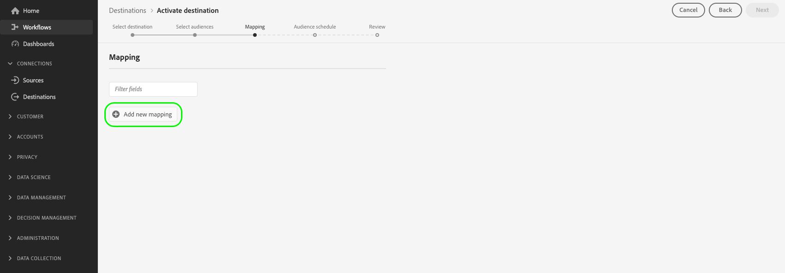

# Aktivieren von Zielgruppendaten für Streaming-Segmentexportziele

## Übersicht {#overview}

In diesem Artikel wird der Workflow erläutert, der zum Aktivieren von Zielgruppendaten in Adobe Experience Platform-Segmentstreaming-Zielen erforderlich ist.

## Voraussetzungen {#prerequisites}

Um Daten für Ziele aktivieren zu können, müssen Sie über eine erfolgreiche [Verbindung zu einem Ziel](./connect-destination.md) verfügen. Wenn Sie dies noch nicht getan haben, navigieren Sie zum [Zielkatalog](../catalog/overview.md), durchsuchen Sie die unterstützten Ziele und konfigurieren Sie das Ziel, das Sie verwenden möchten.

## Ziel auswählen {#select-destination}

1. Gehen Sie zu **[!UICONTROL Verbindungen > Ziele]** und wählen Sie die Registerkarte **[!UICONTROL Katalog]** aus.

   

1. Wählen Sie **[!UICONTROL Segmente aktivieren]** auf der Karte aus, die dem Ziel entspricht, an dem Sie Ihre Segmente aktivieren möchten, wie in der Abbildung unten dargestellt.

   

1. Wählen Sie die Zielverbindung aus, die Sie zum Aktivieren Ihrer Segmente verwenden möchten, und wählen Sie dann **[!UICONTROL Weiter]** aus.

   

1. Navigieren Sie zum nächsten Abschnitt [wählen Sie Ihre Segmente](#select-segments) aus.

## Segmente auswählen {#select-segments}

Verwenden Sie die Kontrollkästchen links neben den Segmentnamen, um die Segmente auszuwählen, die Sie für das Ziel aktivieren möchten, und wählen Sie dann **[!UICONTROL Weiter]** aus.

## Zuordnen von Attributen und Identitäten {#mapping}

>[!IMPORTANT]
>
>Dieser Schritt gilt nur für einige Segment-Streaming-Ziele. Wenn für Ihr Ziel kein Schritt **[!UICONTROL Zuordnung]** vorhanden ist, überspringen Sie zu [Segmentexport planen](#scheduling).

Bei einigen Segmentstreaming-Zielen müssen Sie Quellattribute oder Identitäts-Namespaces auswählen, um sie als Zielidentitäten im Ziel zuzuordnen.

1. Wählen Sie auf der Seite **[!UICONTROL Mapping]** die Option **[!UICONTROL Neues Mapping hinzufügen]** aus.

   

1. Wählen Sie den Pfeil rechts neben dem Eintrag **[!UICONTROL Quellfeld]** aus.

   

1. Verwenden Sie auf der Seite **[!UICONTROL Quellfeld]** auswählen die Optionen **[!UICONTROL Attribute auswählen]** oder **[!UICONTROL Identitäts-Namespace auswählen]** , um zwischen den beiden Kategorien der verfügbaren Quellfelder zu wechseln. Wählen Sie aus den verfügbaren [!DNL XDM]-Profilattributen und Identitäts-Namespaces die Namespaces aus, die Sie dem Ziel zuordnen möchten, und wählen Sie dann **[!UICONTROL Auswählen]**.

   

1. Wählen Sie die Schaltfläche rechts neben dem Eintrag **[!UICONTROL Zielfeld]** aus.

   

1. Wählen Sie auf der Seite **[!UICONTROL Zielfeld]** aus, wählen Sie den Zielidentitäts-Namespace aus, dem Sie das Quellfeld zuordnen möchten, und wählen Sie **[!UICONTROL Auswählen]**.

   

1. Um weitere Zuordnungen hinzuzufügen, wiederholen Sie die Schritte 1 bis 5.

### Umwandlung anwenden {#apply-transformation}

>[!CONTEXTUALHELP]
>id="platform_destinations_activate_applytransformation"
>title="Umwandlung anwenden"
>abstract="Aktivieren Sie diese Option bei Verwendung von nicht gehashten Quellfeldern, damit Adobe Experience Platform sie bei Aktivierung automatisch hash."
>additional-url="https://experienceleague.adobe.com/docs/experience-platform/destinations/ui/activate/activate-segment-streaming-destinations.html?lang=en#apply-transformation" text="Weitere Informationen finden Sie in der Dokumentation ."

Wenn Sie ungehashte Quellattribute Zielattributen zuordnen, von denen das Ziel erwartet, dass sie gehasht werden (z. B.: `email_lc_sha256` oder `phone_sha256`), aktivieren Sie die Option **Umwandlung anwenden**, damit Adobe Experience Platform die Quellattribute bei Aktivierung automatisch hasst.

## Segmentexport planen {#scheduling}

Standardmäßig zeigt die Seite [!UICONTROL Segmentzeitplan] nur die neu ausgewählten Segmente an, die Sie im aktuellen Aktivierungsfluss ausgewählt haben.

Um alle für Ihr Ziel aktivierten Segmente anzuzeigen, verwenden Sie die Filteroption und deaktivieren Sie den Filter **[!UICONTROL Nur neue Segmente anzeigen]** .

1. Wählen Sie auf der Seite **[!UICONTROL Segment schedule]** jedes Segment aus und konfigurieren Sie dann mithilfe der Selektoren **[!UICONTROL Startdatum]** und **[!UICONTROL Enddatum]** das Zeitintervall für das Senden von Daten an Ihr Ziel.

   

   * Bei einigen Zielen müssen Sie für jedes Segment den **[!UICONTROL Ursprung der Zielgruppe]** mithilfe des Dropdown-Menüs unter den Kalenderselektoren auswählen. Wenn Ihr Ziel diesen Selektor nicht enthält, überspringen Sie diesen Schritt.

      

   * Bei einigen Zielen müssen Sie [!DNL Platform]-Segmente manuell ihrem Gegenstück im Ziel zuordnen. Wählen Sie dazu jedes Segment aus und geben Sie dann die entsprechende Segment-ID aus der Zielplattform in das Feld **[!UICONTROL Zuordnungs-ID]** ein. Wenn Ihr Ziel dieses Feld nicht enthält, überspringen Sie diesen Schritt.

      

   * Bei einigen Zielen müssen Sie eine **[!UICONTROL App-ID]** eingeben, wenn Sie [!DNL IDFA]- oder [!DNL GAID]-Segmente aktivieren. Wenn Ihr Ziel dieses Feld nicht enthält, überspringen Sie diesen Schritt.

      

1. Wählen Sie **[!UICONTROL Next]** aus, um zur Seite [!UICONTROL Review] zu wechseln.

## Überprüfung {#review}

Auf der Seite **[!UICONTROL Überprüfen]** können Sie eine Zusammenfassung Ihrer Auswahl sehen. Wählen Sie **[!UICONTROL Abbrechen]**, um den Fluss abzubrechen, **[!UICONTROL Zurück]**, um die Einstellungen zu ändern, oder **[!UICONTROL Fertig stellen]**, um Ihre Auswahl zu bestätigen und mit dem Senden von Daten an das Ziel zu beginnen.

>[!IMPORTANT]
>
>In diesem Schritt prüft Adobe Experience Platform, ob Verstöße gegen Datennutzungsrichtlinien vorliegen. Im Folgenden finden Sie ein Beispiel, bei dem eine Richtlinie verletzt wird. Sie können den Workflow zur Segmentaktivierung erst abschließen, nachdem Sie den Verstoß behoben haben. Informationen zum Beheben von Richtlinienverletzungen finden Sie unter [Richtliniendurchsetzung](../../rtcdp/privacy/data-governance-overview.md#enforcement) im Abschnitt zur Data Governance-Dokumentation.

Wenn keine Richtlinienverletzungen festgestellt wurden, wählen Sie **[!UICONTROL Beenden]** aus, um Ihre Auswahl zu bestätigen und mit dem Senden von Daten an das Ziel zu beginnen.

## Segmentaktivierung überprüfen {#verify}

Detaillierte Informationen zur Überwachung des Datenflusses zu Ihren Zielen finden Sie in der [Dokumentation zur Zielüberwachung](../../dataflows/ui/monitor-destinations.md) .

<!-- 
For [!DNL Facebook Custom Audience], a successful activation means that a [!DNL Facebook] custom audience would be created programmatically in [[!UICONTROL Facebook Ads Manager]](https://www.facebook.com/adsmanager/manage/). Segment membership in the audience would be added and removed as users are qualified or disqualified for the activated segments.

>[!TIP]
>
>The integration between Adobe Experience Platform and [!DNL Facebook] supports historical audience backfills. All historical segment qualifications are sent to [!DNL Facebook] when you activate the segments to the destination.
-->
