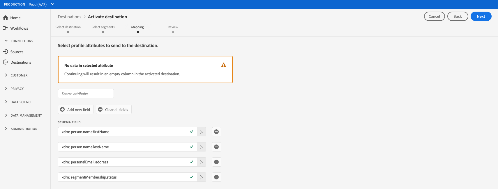

# Aktivieren von Zielgruppendaten für Exportziele von Streaming-Profilen

>[!IMPORTANT]
> 
> * So aktivieren Sie Daten und aktivieren die [Zuordnungsschritt](#mapping) des Workflows benötigen Sie die **[!UICONTROL Ziele verwalten]**, **[!UICONTROL Ziele aktivieren]**, **[!UICONTROL Profile anzeigen]** und **[!UICONTROL Segmente anzeigen]** [Zugriffssteuerungsberechtigungen](/help/access-control/home.md#permissions).
> * So aktivieren Sie Daten, ohne die [Zuordnungsschritt](#mapping) des Workflows benötigen Sie die **[!UICONTROL Ziele verwalten]**, **[!UICONTROL Segment ohne Zuordnung aktivieren]**, **[!UICONTROL Profile anzeigen]** und **[!UICONTROL Segmente anzeigen]** [Zugriffssteuerungsberechtigungen](/help/access-control/home.md#permissions).
> 
> Lesen Sie die [Übersicht über die Zugriffskontrolle](/help/access-control/ui/overview.md) oder wenden Sie sich an Ihren Produktadministrator, um die erforderlichen Berechtigungen zu erhalten.

## Übersicht {#overview}

In diesem Artikel wird der Workflow erläutert, der zum Aktivieren von Zielgruppendaten in profilbasierten Adobe Experience Platform-Zielen wie Amazon Kinesis erforderlich ist.

## Voraussetzungen {#prerequisites}

Um Daten für Ziele aktivieren zu können, müssen Sie eine erfolgreiche [Verbindung zu einem Ziel](./connect-destination.md) hergestellt haben. Wenn Sie das noch nicht getan haben, navigieren Sie zum [Zielkatalog](../catalog/overview.md), durchsuchen Sie die unterstützten Ziele und konfigurieren Sie das Ziel, das Sie verwenden möchten.

## Auswählen des Ziels {#select-destination}

1. Navigieren Sie zu **[!UICONTROL Verbindungen und Ziele]** und wählen Sie die Registerkarte **[!UICONTROL Katalog]**.

   

1. Wählen Sie **[!UICONTROL Segmente aktivieren]** auf der Karte, die dem Zielort entspricht, an dem Sie Ihre Segmente aktivieren möchten, wie in der Abbildung unten dargestellt.

   

1. Wählen Sie die Zielverbindung aus, die Sie zum Aktivieren Ihrer Segmente verwenden möchten, und klicken Sie dann auf **[!UICONTROL Weiter]**.

   

1. Gehen Sie zum nächsten Abschnitt, um [Ihre Segmente auszuwählen](#select-segments).

## Auswählen der Segmente {#select-segments}

Aktivieren Sie die Kontrollkästchen links neben den Segmentnamen, um die Segmente auszuwählen, die Sie für das Ziel aktivieren möchten, und klicken Sie dann auf **[!UICONTROL Weiter]**.


## Auswählen der Profilattribute {#select-attributes}

Im **[!UICONTROL Zuordnung]** wählen Sie die Profilattribute aus, die Sie an das Ziel senden möchten.

>[!NOTE]
>
> Adobe Experience Platform füllt Ihre Auswahl vorab mit vier empfohlenen, häufig verwendeten Attributen aus Ihrem Schema: `person.name.firstName`, `person.name.lastName`, `personalEmail.address`, `segmentMembership.status`.

Dateiexporte variieren auf folgende Weise, je nachdem, ob `segmentMembership.status` ausgewählt ist:
* Wenn das Feld `segmentMembership.status` ausgewählt ist, enthalten exportierte Dateien in der ersten vollständigen Momentaufnahme die **[!UICONTROL aktiven]** Mitglieder und in nachfolgenden inkrementellen Exporten die **[!UICONTROL aktiven]** und die **[!UICONTROL abgelaufenen]** Mitglieder.
* Wenn die Variable `segmentMembership.status` nicht ausgewählt ist, umfassen exportierte Dateien sowohl in der ersten vollständigen Momentaufnahme als auch in nachfolgenden inkrementellen Exporten nur die **[!UICONTROL aktiven]** Mitglieder.



1. Wählen Sie auf der Seite **[!UICONTROL Attribute auswählen]** die Option **[!UICONTROL Neues Feld hinzufügen]**.

   

1. Wählen Sie den Pfeil rechts neben dem Eintrag **[!UICONTROL Schemafeld]**.

   

1. Wählen Sie auf der Seite **[!UICONTROL Feld auswählen]** die XDM-Attribute aus, die Sie an das Ziel senden möchten, und klicken Sie dann auf **[!UICONTROL Auswählen]**.

   


1. Wiederholen Sie die Schritte 1 bis 3 und wählen Sie dann **[!UICONTROL Nächste]**.

## Überprüfung {#review}

Auf der Seite **[!UICONTROL Überprüfen]** können Sie eine Zusammenfassung Ihrer Auswahl sehen. Wählen Sie **[!UICONTROL Abbrechen]**, um den Fluss abzubrechen, **[!UICONTROL Zurück]**, um die Einstellungen zu ändern, oder **[!UICONTROL Fertig stellen]**, um Ihre Auswahl zu bestätigen und mit dem Senden von Daten an das Ziel zu beginnen.


### Auswertung der Einverständnisrichtlinie {#consent-policy-evaluation}

Wenn Ihr Unternehmen **Adobe Gesundheitsschild** oder **Adobe Privacy &amp; Security Shield** auswählen **[!UICONTROL Gültige Zustimmungsrichtlinien anzeigen]** , um zu sehen, welche Zustimmungsrichtlinien angewendet werden und wie viele Profile infolge dieser Aktivierung in die Aktivierung einbezogen werden. Informationen [Bewertung der Einwilligungsrichtlinie](/help/data-governance/enforcement/auto-enforcement.md#consent-policy-evaluation) für weitere Informationen.

### Prüfungen von Datennutzungsrichtlinien {#data-usage-policy-checks}

Im **[!UICONTROL Überprüfen]** -Schritt, überprüft Experience Platform auch auf Verstöße gegen Datennutzungsrichtlinien. Nachstehend ist ein Beispiel angegeben, bei dem eine Richtlinie verletzt wird. Sie können den Workflow zur Segmentaktivierung erst abschließen, nachdem Sie den Verstoß behoben haben. Informationen zum Beheben von Richtlinienverletzungen finden Sie unter [Verstöße gegen Datennutzungsrichtlinien](/help/data-governance/enforcement/auto-enforcement.md#data-usage-violation) im Abschnitt Data Governance-Dokumentation .


### Filtern von Segmenten {#filter-segments}

Außerdem können Sie in diesem Schritt die verfügbaren Filter auf der Seite verwenden, um nur die Segmente anzuzeigen, deren Zeitplan oder Zuordnung im Rahmen dieses Workflows aktualisiert wurde.


Wenn Sie mit Ihrer Auswahl zufrieden sind und keine Richtlinienverletzungen festgestellt wurden, wählen Sie **[!UICONTROL Beenden]** , um Ihre Auswahl zu bestätigen und mit dem Senden von Daten an das Ziel zu beginnen.

## Überprüfen der Segmentaktivierung {#verify}

Ihr exportiert [!DNL Experience Platform] Daten landen in Ihrem Ziel im JSON-Format. Beispielsweise enthält das nachstehende Ereignis das E-Mail-Adressen-Profilattribut einer Zielgruppe, die sich für ein bestimmtes Segment qualifiziert und ein anderes Segment verlassen hat. Die Identitäten für diesen Interessenten sind ECID und E-Mail.

```json
{
  "person": {
    "email": "yourstruly@adobe.com"
  },
  "segmentMembership": {
    "ups": {
      "7841ba61-23c1-4bb3-a495-00d3g5fe1e93": {
        "lastQualificationTime": "2020-05-25T21:24:39Z",
        "status": "exited"
      },
      "59bd2fkd-3c48-4b18-bf56-4f5c5e6967ae": {
        "lastQualificationTime": "2020-05-25T23:37:33Z",
        "status": "existing"
      }
    }
  },
  "identityMap": {
    "ecid": [
      {
        "id": "14575006536349286404619648085736425115"
      },
      {
        "id": "66478888669296734530114754794777368480"
      }
    ],
    "email_lc_sha256": [
      {
        "id": "655332b5fa2aea4498bf7a290cff017cb4"
      },
      {
        "id": "66baf76ef9de8b42df8903f00e0e3dc0b7"
      }
    ]
  }
}
```
