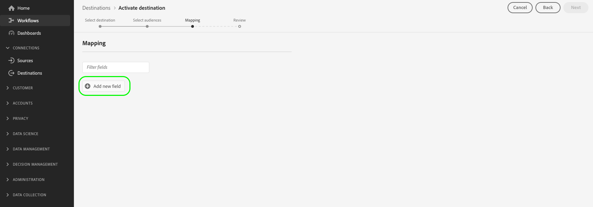

# Aktivieren von Zielgruppen für Streaming-Profil-Export-Ziele

>[!IMPORTANT]
> 
> * So aktivieren Sie Daten und aktivieren die [Zuordnungsschritt](#mapping) des Workflows benötigen Sie die **[!UICONTROL Ziele verwalten]**, **[!UICONTROL Ziele aktivieren]**, **[!UICONTROL Profile anzeigen]** und **[!UICONTROL Segmente anzeigen]** [Zugriffssteuerungsberechtigungen](/help/access-control/home.md#permissions).
> * So aktivieren Sie Daten, ohne die [Zuordnungsschritt](#mapping) des Workflows benötigen Sie die **[!UICONTROL Ziele verwalten]**, **[!UICONTROL Segment ohne Zuordnung aktivieren]**, **[!UICONTROL Profile anzeigen]** und **[!UICONTROL Segmente anzeigen]** [Zugriffssteuerungsberechtigungen](/help/access-control/home.md#permissions).
> 
> Lesen Sie die [Übersicht über die Zugriffskontrolle](/help/access-control/ui/overview.md) oder wenden Sie sich an Ihren Produktadministrator, um die erforderlichen Berechtigungen zu erhalten.

## Übersicht {#overview}

In diesem Artikel wird der Workflow erläutert, der zum Aktivieren von Zielgruppendaten in profilbasierten Adobe Experience Platform-Zielen wie Amazon Kinesis erforderlich ist.

## Voraussetzungen {#prerequisites}

Um Daten für Ziele aktivieren zu können, müssen Sie eine erfolgreiche [Verbindung zu einem Ziel](./connect-destination.md) hergestellt haben. Wenn Sie das noch nicht getan haben, navigieren Sie zum [Zielkatalog](../catalog/overview.md), durchsuchen Sie die unterstützten Ziele und konfigurieren Sie das Ziel, das Sie verwenden möchten.

## Auswählen des Ziels {#select-destination}

1. Navigieren Sie zu **[!UICONTROL Verbindungen und Ziele]** und wählen Sie die Registerkarte **[!UICONTROL Katalog]**.

   

1. Auswählen **[!UICONTROL Aktivieren von Zielgruppen]** auf der Karte, die dem Ziel entspricht, in dem Sie Ihre Zielgruppen aktivieren möchten, wie in der Abbildung unten dargestellt.

   

1. Wählen Sie die Zielverbindung aus, die Sie zum Aktivieren Ihrer Zielgruppen verwenden möchten, und wählen Sie dann **[!UICONTROL Nächste]**.

   

1. Zum nächsten Abschnitt wechseln, um [Zielgruppen auswählen](#select-audiences).

## Audiences auswählen {#select-audiences}

Um die Zielgruppen auszuwählen, die Sie für das Ziel aktivieren möchten, aktivieren Sie die Kontrollkästchen links neben den Zielgruppennamen und wählen Sie **[!UICONTROL Nächste]**.

Je nach Herkunft können Sie aus mehreren Zielgruppentypen auswählen:

* **[!UICONTROL Segmentierungsdienst]**: Zielgruppen, die in der Experience Platform vom Segmentierungsdienst generiert wurden. Siehe [Segmentierungsdokumentation](../../segmentation/ui/overview.md) für weitere Details.
* **[!UICONTROL Benutzerdefinierter Upload]**: Zielgruppen, die außerhalb von Experience Platform generiert und als CSV-Dateien in Platform hochgeladen wurden. Weitere Informationen zu externen Zielgruppen finden Sie in der Dokumentation unter [Audience importieren](../../segmentation/ui/overview.md#import-audience).
* Andere Zielgruppentypen, die aus anderen Adobe-Lösungen stammen, z. B. [!DNL Audience Manager].


## Auswählen der Profilattribute {#select-attributes}

Im **[!UICONTROL Zuordnung]** wählen Sie die Profilattribute aus, die Sie an das Ziel senden möchten.

1. Wählen Sie auf der Seite **[!UICONTROL Attribute auswählen]** die Option **[!UICONTROL Neues Feld hinzufügen]**.

   

1. Wählen Sie den Pfeil rechts neben dem Eintrag **[!UICONTROL Schemafeld]**.

   

1. Wählen Sie auf der Seite **[!UICONTROL Feld auswählen]** die XDM-Attribute aus, die Sie an das Ziel senden möchten, und klicken Sie dann auf **[!UICONTROL Auswählen]**.

   

1. Um weitere Felder hinzuzufügen, wiederholen Sie die Schritte 1 bis 3 und wählen Sie dann **[!UICONTROL Nächste]**.

## Überprüfung {#review}

Auf der Seite **[!UICONTROL Überprüfen]** können Sie eine Zusammenfassung Ihrer Auswahl sehen. Wählen Sie **[!UICONTROL Abbrechen]**, um den Fluss abzubrechen, **[!UICONTROL Zurück]**, um die Einstellungen zu ändern, oder **[!UICONTROL Fertig stellen]**, um Ihre Auswahl zu bestätigen und mit dem Senden von Daten an das Ziel zu beginnen.


### Auswertung der Einverständnisrichtlinie {#consent-policy-evaluation}

Wenn Ihr Unternehmen **Adobe Healthcare Shield** oder **Adobe Privacy &amp; Security Shield** erworben hat, wählen Sie **[!UICONTROL Aktuelle Einverständnisrichtlinien anzeigen]** aus, um zu sehen, welche Einverständnisrichtlinien angewendet werden und wie viele Profile in der Aktivierung enthalten sind. Informationen [Bewertung der Einwilligungsrichtlinie](/help/data-governance/enforcement/auto-enforcement.md#consent-policy-evaluation) für weitere Informationen.

### Prüfungen von Datennutzungsrichtlinien {#data-usage-policy-checks}

Im **[!UICONTROL Überprüfen]** -Schritt, überprüft Experience Platform auch auf Verstöße gegen Datennutzungsrichtlinien. Nachstehend ist ein Beispiel angegeben, bei dem eine Richtlinie verletzt wird. Sie können den Aktivierungs-Workflow für die Zielgruppe erst abschließen, nachdem Sie den Verstoß behoben haben. Informationen zum Beheben von Richtlinienverletzungen finden Sie unter [Verstöße gegen Datennutzungsrichtlinien](/help/data-governance/enforcement/auto-enforcement.md#data-usage-violation) im Abschnitt Data Governance-Dokumentation .


### Filtern von Zielgruppen {#filter-audiences}

Außerdem können Sie in diesem Schritt die verfügbaren Filter auf der Seite verwenden, um nur die Zielgruppen anzuzeigen, deren Zeitplan oder Zuordnung im Rahmen dieses Workflows aktualisiert wurde.


Wenn Sie mit Ihrer Auswahl zufrieden sind und keine Richtlinienverletzungen festgestellt wurden, wählen Sie **[!UICONTROL Beenden]** , um Ihre Auswahl zu bestätigen und mit dem Senden von Daten an das Ziel zu beginnen.

## Überprüfung der Zielgruppenaktivierung {#verify}

Ihr exportiert [!DNL Experience Platform] Daten landen in Ihrem Ziel im JSON-Format. Beispielsweise enthält das nachstehende Ereignis das E-Mail-Adressen-Attribut eines Profils, das sich für eine bestimmte Zielgruppe qualifiziert und eine andere Zielgruppe verlassen hat. Die Identitäten für diese Perspektive sind `ECID` und `email_lc_sha256`.

```json
{
  "person": {
    "email": "yourstruly@adobe.com"
  },
  "segmentMembership": {
    "ups": {
      "7841ba61-23c1-4bb3-a495-00d3g5fe1e93": {
        "lastQualificationTime": "2020-05-25T21:24:39Z",
        "status": "exited"
      },
      "59bd2fkd-3c48-4b18-bf56-4f5c5e6967ae": {
        "lastQualificationTime": "2020-05-25T23:37:33Z",
        "status": "realized"
      }
    }
  },
  "identityMap": {
    "ecid": [
      {
        "id": "14575006536349286404619648085736425115"
      },
      {
        "id": "66478888669296734530114754794777368480"
      }
    ],
    "email_lc_sha256": [
      {
        "id": "655332b5fa2aea4498bf7a290cff017cb4"
      },
      {
        "id": "66baf76ef9de8b42df8903f00e0e3dc0b7"
      }
    ]
  }
}
```
