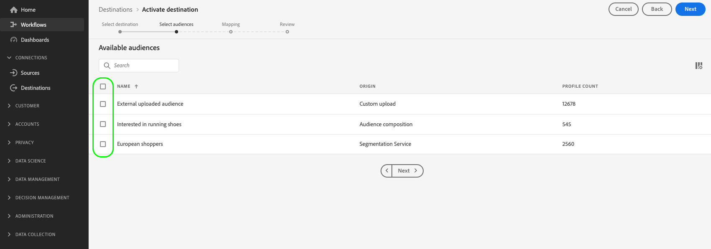

# Aktivieren von Zielgruppen für Exportziele von Streaming-Profilen

>[!IMPORTANT]
> 
> * Um Daten zu aktivieren und den Schritt [Zuordnen](#mapping) des Workflows zu aktivieren, benötigen Sie die Zugriffssteuerungsberechtigungen **[!UICONTROL Ziele anzeigen]**, **[!UICONTROL Ziele aktivieren]**, **[!UICONTROL Profile anzeigen]** und **[!UICONTROL Segmente anzeigen]** [.](/help/access-control/home.md#permissions)
> * Um Daten zu aktivieren, ohne den Schritt [Zuordnen](#mapping) des Workflows zu durchlaufen, benötigen Sie die Zugriffssteuerungsberechtigungen **[!UICONTROL Ziele anzeigen]**, **[!UICONTROL Segment ohne Zuordnung aktivieren]**, **[!UICONTROL Profile anzeigen]** und **[!UICONTROL Segmente anzeigen]** [.](/help/access-control/home.md#permissions)
> 
> Lesen Sie die [Übersicht über die Zugriffskontrolle](/help/access-control/ui/overview.md) oder wenden Sie sich an Ihren Produktadministrator, um die erforderlichen Berechtigungen zu erhalten.

## Übersicht {#overview}

In diesem Artikel wird der Workflow erläutert, der zum Aktivieren von Zielgruppendaten in Adobe Experience Platform für das Streaming profilbasierter Ziele erforderlich ist (auch als [Enterprise-Ziele](/help/destinations/destination-types.md#streaming-profile-export) bezeichnet).

Dieser Artikel gilt für die folgenden drei Ziele:

* [Amazon Kinesis](/help/destinations/catalog/cloud-storage/amazon-kinesis.md)
* [Azure Event Hubs](/help/destinations/catalog/cloud-storage/azure-event-hubs.md)
* [HTTP-API-Ziel](/help/destinations/catalog/streaming/http-destination.md).

## Voraussetzungen {#prerequisites}

Um Daten für Ziele aktivieren zu können, müssen Sie eine erfolgreiche [Verbindung zu einem Ziel](./connect-destination.md) hergestellt haben. Wenn Sie das noch nicht getan haben, navigieren Sie zum [Zielkatalog](../catalog/overview.md), durchsuchen Sie die unterstützten Ziele und konfigurieren Sie das Ziel, das Sie verwenden möchten.

## Auswählen des Ziels {#select-destination}

1. Navigieren Sie zu **[!UICONTROL Verbindungen und Ziele]** und wählen Sie die Registerkarte **[!UICONTROL Katalog]**.

   

1. Wählen Sie **[!UICONTROL Zielgruppen aktivieren]** auf der Karte aus, die dem Ziel entspricht, in dem Sie Ihre Zielgruppen aktivieren möchten, wie in der Abbildung unten dargestellt.

   

1. Wählen Sie die Zielverbindung aus, die Sie zum Aktivieren Ihrer Zielgruppen verwenden möchten, und wählen Sie dann **[!UICONTROL Weiter]** aus.

   

1. Wechseln Sie zum nächsten Abschnitt mit [Auswählen Ihrer Zielgruppen](#select-audiences).

## Audiences auswählen {#select-audiences}

Um die Zielgruppen auszuwählen, die Sie für das Ziel aktivieren möchten, aktivieren Sie die Kontrollkästchen links neben den Zielgruppennamen und wählen Sie dann **[!UICONTROL Weiter]** aus.

Je nach Herkunft können Sie aus mehreren Zielgruppentypen auswählen:

* **[!UICONTROL Segmentation Service]**: Zielgruppen, die innerhalb von Experience Platform vom Segmentation Service generiert werden. Weitere Informationen finden Sie in der [Dokumentation zu Audience Portal](../../segmentation/ui/audience-portal.md) .
* **[!UICONTROL Benutzerdefinierter Upload]**: Zielgruppen, die außerhalb von Experience Platform generiert und als CSV-Dateien in Platform hochgeladen wurden. Weitere Informationen zu externen Zielgruppen finden Sie in der Dokumentation zum [Importieren einer Zielgruppe](../../segmentation/ui/audience-portal.md#import-audience).
* Andere Zielgruppentypen, die von anderen Adobe-Lösungen wie [!DNL Audience Manager] stammen.



## Auswählen der Profilattribute {#select-attributes}

Wählen Sie im Schritt **[!UICONTROL Zuordnung]** die Profilattribute aus, die Sie an das Ziel senden möchten.

1. Wählen Sie auf der Seite **[!UICONTROL Attribute auswählen]** die Option **[!UICONTROL Neues Feld hinzufügen]**.

   

1. Wählen Sie den Pfeil rechts neben dem Eintrag **[!UICONTROL Schemafeld]**.

   

1. Wählen Sie auf der Seite **[!UICONTROL Feld auswählen]** die XDM-Attribute aus, die Sie an das Ziel senden möchten, und klicken Sie dann auf **[!UICONTROL Auswählen]**.

   

1. Um weitere Felder hinzuzufügen, wiederholen Sie die Schritte 1 bis 3 und wählen Sie dann **[!UICONTROL Weiter]** aus.

## Überprüfung {#review}

Auf der Seite **[!UICONTROL Überprüfen]** können Sie eine Zusammenfassung Ihrer Auswahl sehen. Wählen Sie **[!UICONTROL Abbrechen]**, um den Fluss abzubrechen, **[!UICONTROL Zurück]**, um die Einstellungen zu ändern, oder **[!UICONTROL Fertig stellen]**, um Ihre Auswahl zu bestätigen und mit dem Senden von Daten an das Ziel zu beginnen.


### Auswertung der Einverständnisrichtlinie {#consent-policy-evaluation}

[Bewertung der Einwilligungsrichtlinie](/help/data-governance/enforcement/auto-enforcement.md#consent-policy-evaluation) wird derzeit nicht bei Exporten in die drei Unternehmensziele unterstützt: Amazon Kinesis, Azure Event Hub und HTTP-API.

Das bedeutet, dass Profile, die nicht mit der Zielgruppenbestimmung *einverstanden sind,* in den Exporten zu diesen drei Zielen enthalten sind.

<!--

If your organization purchased **Adobe Healthcare Shield** or **Adobe Privacy & Security Shield**, select **[!UICONTROL View applicable consent policies]** to see which consent policies are applied and how many profiles are included in the activation as a result of them. Read about [consent policy evaluation](/help/data-governance/enforcement/auto-enforcement.md#consent-policy-evaluation) for more information.

-->

### Prüfungen von Datennutzungsrichtlinien {#data-usage-policy-checks}

Im Schritt **[!UICONTROL Überprüfen]** überprüft Experience Platform auch auf Verstöße gegen Datennutzungsrichtlinien. Nachstehend ist ein Beispiel angegeben, bei dem eine Richtlinie verletzt wird. Sie können den Aktivierungs-Workflow für die Zielgruppe erst abschließen, nachdem Sie den Verstoß behoben haben. Informationen zum Beheben von Richtlinienverletzungen finden Sie unter [Verstöße gegen Datennutzungsrichtlinien](/help/data-governance/enforcement/auto-enforcement.md#data-usage-violation) im Abschnitt zur Data Governance-Dokumentation.


### Filtern von Zielgruppen {#filter-audiences}

Außerdem können Sie in diesem Schritt die verfügbaren Filter auf der Seite verwenden, um nur die Zielgruppen anzuzeigen, deren Zeitplan oder Zuordnung im Rahmen dieses Workflows aktualisiert wurde.


Wenn Sie mit Ihrer Auswahl zufrieden sind und keine Richtlinienverletzungen festgestellt wurden, wählen Sie **[!UICONTROL Beenden]** aus, um Ihre Auswahl zu bestätigen und mit dem Senden von Daten an das Ziel zu beginnen.

## Überprüfung der Zielgruppenaktivierung {#verify}

Ihre exportierten [!DNL Experience Platform] -Daten werden im JSON-Format in Ihrem Ziel gespeichert. Beispielsweise enthält das nachstehende Ereignis das E-Mail-Adressen-Attribut eines Profils, das sich für eine bestimmte Zielgruppe qualifiziert und eine andere Zielgruppe verlassen hat. Die Identitäten für diesen Interessenten sind `ECID` und `email_lc_sha256`.

```json
{
  "person": {
    "email": "yourstruly@adobe.com"
  },
  "segmentMembership": {
    "ups": {
      "7841ba61-23c1-4bb3-a495-00d3g5fe1e93": {
        "lastQualificationTime": "2020-05-25T21:24:39Z",
        "status": "exited"
      },
      "59bd2fkd-3c48-4b18-bf56-4f5c5e6967ae": {
        "lastQualificationTime": "2020-05-25T23:37:33Z",
        "status": "realized"
      }
    }
  },
  "identityMap": {
    "ecid": [
      {
        "id": "14575006536349286404619648085736425115"
      },
      {
        "id": "66478888669296734530114754794777368480"
      }
    ],
    "email_lc_sha256": [
      {
        "id": "655332b5fa2aea4498bf7a290cff017cb4"
      },
      {
        "id": "66baf76ef9de8b42df8903f00e0e3dc0b7"
      }
    ]
  }
}
```
