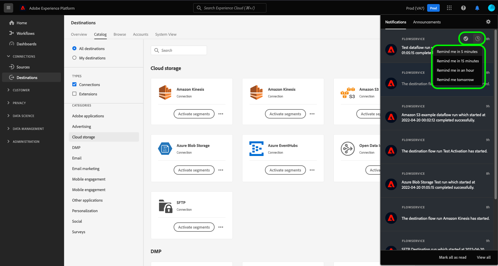
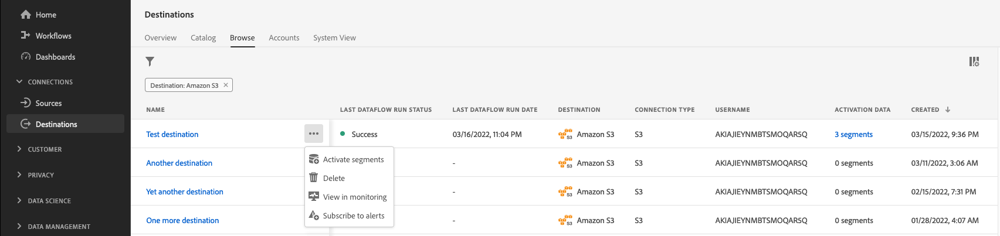

# In-Context-Zielwarnungen abonnieren

Mit Adobe Experience Platform können Sie ereignisbasierte Warnhinweise zu Adobe Experience Platform-Aktivitäten abonnieren. Warnhinweise verringern oder beseitigen die Notwendigkeit, die [[!DNL Observability Insights] API](../../observability/api/overview.md) abzufragen, um zu überprüfen, ob ein Auftrag abgeschlossen wurde, ob ein bestimmter Meilenstein innerhalb eines Arbeitsablaufs erreicht wurde oder ob Fehler aufgetreten sind.

Sie können Warnhinweise abonnieren, wenn Sie einen Datenfluss erstellen, um Warnhinweise zum Status, Erfolg oder Misserfolg Ihres Datenflusses zu erhalten.

In diesem Dokument erfahren Sie, wie Sie Warnhinweise für Ihren Ziel-Datenfluss abonnieren.

## Erste Schritte

Dieses Dokument setzt ein Verständnis der folgenden Komponenten von Adobe Experience Platform voraus:

* [Ziele](../home.md): Vordefinierte Integrationen mit Zielplattformen, die die nahtlose Aktivierung von Daten aus Adobe Experience Platform ermöglichen. Mit Zielen können Sie Ihre bekannten und unbekannten Daten für kanalübergreifende Marketing-Kampagnen, E-Mail-Kampagnen, zielgruppengerechte Werbung und viele andere Anwendungsfälle aktivieren.
* [Mit Observability können Sie Platform-Aktivitäten mithilfe von statistischen Metriken und Ereignisbenachrichtigungen überwachen.](../../observability/home.md)[!DNL Observability Insights]
   * [Warnhinweise](../../observability/alerts/overview.md): Wenn bestimmte Bedingungen in Ihren Platform-Vorgängen erreicht sind (z. B. ein potenzielles Problem, wenn das System einen Schwellenwert überschreitet), kann Platform allen Benutzern in Ihrer Organisation, die sich für diese Bedingungen angemeldet haben, Warnhinweise bereitstellen.

## Warnhinweise über die Benutzeroberfläche abonnieren {#subscribe-destination-alerts}

>[!CONTEXTUALHELP]
>id="platform_destination_alerts_subscribe"
>title="Zielbenachrichtigungen abonnieren"
>abstract="Warnhinweise ermöglichen es Ihnen, Benachrichtigungen basierend auf dem Status Ihrer Ziel-Datenflüsse zu erhalten. Sie können Warnhinweise so einrichten, dass Aktualisierungen abgerufen werden, wenn Ihr Datenfluss gestartet wurde, erfolgreich war, fehlgeschlagen ist oder keine Daten an Ihr Ziel gesendet hat."
>text="Learn more in documentation"

>[!IMPORTANT]
>
>Sie müssen sofortige Benachrichtigungen von E-Mails für Ihr Platform-Konto aktivieren, um E-Mail-basierte Warnhinweise für Ihre Datenflüsse zu erhalten.

Sie können Warnhinweise für Ihre Datenflüsse während der [!UICONTROL Neues Ziel konfigurieren] Schritt [Zielverbindung](connect-destination.md) Arbeitsablauf.

Wählen Sie die Warnhinweise aus, die Sie abonnieren möchten, und wählen Sie dann **[!UICONTROL Nächste]** , um Ihren Datenfluss zu überprüfen und abzuschließen.

Die für Ziel-Datenflüsse verfügbaren Warnhinweise sind in der folgenden Tabelle beschrieben.

* Bei Streaming-Zielen wird nur der [!DNL Activation Skipped Rate Exceeded] Warnhinweis verfügbar.
* Bei dateibasierten Zielen sind alle Warnhinweise verfügbar.

| Warnhinweise | Beschreibung |
| --- | --- |
| Verzögerung bei der Ausführung des Zielflusses | Dieser Warnhinweis benachrichtigt Sie, wenn die Aktivierung eines Segments länger als 150 Minuten dauert, bis ein Zielfluss ausgeführt wird. |
| Fehler beim Ausführen des Zielflusses | Dieser Warnhinweis benachrichtigt Sie, wenn beim Aktivieren eines Segments für ein Ziel ein Fehler auftritt. |
| Erfolgreiche Ausführung des Zielflusses | Dieser Warnhinweis benachrichtigt Sie, wenn ein Segment erfolgreich für ein Ziel aktiviert wurde. |
| Start der Ausführung des Zielflusses | Dieser Warnhinweis benachrichtigt Sie, wenn ein Zielflussablauf mit der Aktivierung eines Segments beginnt. |
| Aktivierungsübersprungene Rate überschritten | Dieser Warnhinweis benachrichtigt Sie, wenn die Übersprungrate der Aktivierung 1 % der gesamten Aktivierungen überschritten hat. Identitäten werden während der Aktivierung übersprungen, wenn sie fehlende Attribute oder Zustimmungsverletzungen aufweisen. |

## Warnungen erhalten {#receiving-alerts}

Sobald Ihr Ziel-Datenfluss ausgeführt wird, können Sie Warnhinweise über die Benutzeroberfläche oder per E-Mail erhalten.

### Warnungen in der Benutzeroberfläche empfangen {#receiving-alerts-in-ui}

Warnhinweise werden in der Benutzeroberfläche durch ein Benachrichtigungssymbol in der oberen Kopfzeile der Platform-Benutzeroberfläche dargestellt. Wählen Sie das Benachrichtigungssymbol aus, um Warnhinweise zu Ihren Datenflüssen anzuzeigen.

Das Fenster &quot;Benachrichtigungen&quot;wird mit einer Liste von Statusaktualisierungen für den von Ihnen erstellten Datenfluss angezeigt.

Sie können den Mauszeiger auf eine Warnmeldung bewegen, um sie als gelesen zu kennzeichnen, oder Sie können das Uhrensymbol auswählen, um zukünftige Erinnerungen zum Status Ihres Datenflusses festzulegen.

Wählen Sie die Warnmeldung aus, um spezifische Informationen zu Ihrem Datenfluss anzuzeigen.

Die [!UICONTROL Datenfluss-Ausführungsdetails] angezeigt. In der oberen Hälfte des Bildschirms wird ein Überblick über Ihren Datenfluss angezeigt, einschließlich Informationen zu seinen Attributen, der zugehörigen Datenfluss-Ausführungskennung und einer allgemeinen Fehlerzusammenfassung.

In der unteren Hälfte der Seite werden alle [!UICONTROL Fehler bei Datenfluss-Ausführung] , die während der Datenfluss-Ausführungsphase aufgetreten sind. Hier können Sie eine Vorschau der Fehlerdiagnose anzeigen oder die [[!DNL Data Access] API](https://www.adobe.io/experience-platform-apis/references/data-access/) um die Fehlerdiagnose oder das Dateimanifest herunterzuladen, das Ihrem Datenfluss entspricht.

Weitere Informationen zur Verarbeitung von Datenflug-Fehlern finden Sie im Handbuch unter [Überwachen von Zieldatenflüssen in der Benutzeroberfläche](../../dataflows/ui/monitor-destinations.md).

### Warnungen per E-Mail erhalten {#receiving-alerts-by-email}

Warnhinweise für Ihre Datenflüsse werden Ihnen auch per E-Mail zugestellt. Wählen Sie den Namen des Datenflusses im E-Mail-Textkörper aus, um weitere Informationen zu Ihrem Datenfluss anzuzeigen.

Ähnlich wie bei der UI-Warnung wird die [!UICONTROL Übersicht über Datenfluss] angezeigt werden. Sie erhalten eine Oberfläche, über die Sie alle mit Ihrem Datenfluss verbundenen Fehler untersuchen können.

## Warnungen abonnieren und abmelden {#subscribe-and-unsubscribe}

Sie können mehr Warnhinweise für einen vorhandenen Zieldatensatz in den Zielen abonnieren oder sich von etablierten Warnhinweisen abmelden [!UICONTROL Durchsuchen] Seite.

Suchen Sie die Zielverbindung, für die Sie Warnhinweise erhalten möchten, und wählen Sie die Auslassungspunkte (`...`), um ein Dropdown-Menü mit Optionen anzuzeigen. Wählen Sie als Nächstes **[!UICONTROL Warnhinweise abonnieren]** , um die Warnhinweiseinstellungen Ihres Ziel-Datenflusses zu ändern.

Es wird ein Popup-Fenster mit einer Liste von Zielwarnungen angezeigt. Wählen Sie alle Warnhinweise aus, die Sie abonnieren möchten, oder heben Sie die Auswahl für Warnhinweise auf, von denen Sie sich abmelden möchten. Klicken Sie abschließend auf **[!UICONTROL Speichern]**.

## Nächste Schritte {#next-steps}

Dieses Dokument enthält eine schrittweise Anleitung zum Abonnieren von kontextbezogenen Warnhinweisen für Ihre Ziel-Datenflüsse. Weitere Informationen finden Sie unter [Warnhinweis-UI-Handbuch](../../observability/alerts/ui.md).
