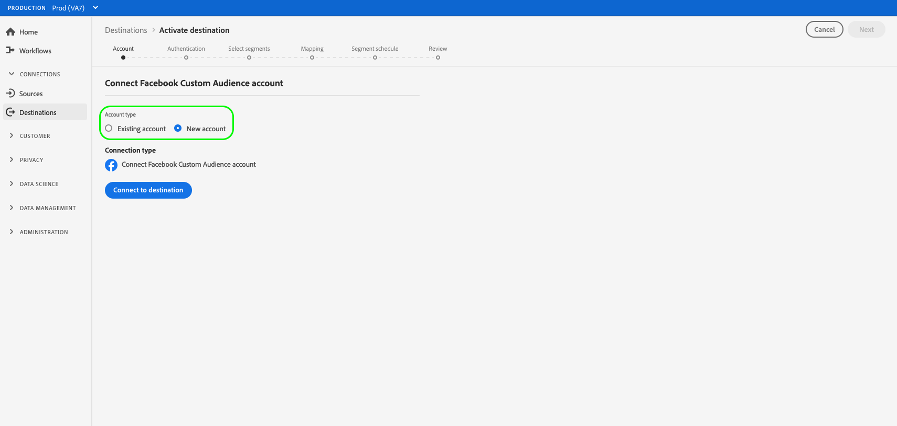

# Neue Zielverbindung erstellen

## Übersicht {#overview}

Bevor Sie Zielgruppendaten an ein Ziel senden können, müssen Sie eine Verbindung zu Ihrer Zielplattform herstellen. In diesem Artikel erfahren Sie, wie Sie mit der Adobe Experience Platform-Benutzeroberfläche ein neues Ziel einrichten.

## Neue Zielverbindung erstellen {#setup}

### Ziel auswählen {#select-destination}

1. Gehen Sie zu **[!UICONTROL Verbindungen]** > **[!UICONTROL Ziele]** und wählen Sie die Registerkarte **[!UICONTROL Katalog]** aus.

   

1. Je nachdem, ob Sie über eine vorhandene Verbindung zu Ihrem Ziel verfügen, können Sie auf der Zielkarte entweder eine Schaltfläche **[!UICONTROL Konfigurieren]** oder eine Schaltfläche **[!UICONTROL Aktivieren]** sehen. Weitere Informationen zum Unterschied zwischen **[!UICONTROL Activate]** und **[!UICONTROL Configure]** finden Sie im Abschnitt [Catalog](../ui/destinations-workspace.md#catalog) der Dokumentation zum Ziel-Workspace. Wählen Sie je nach verfügbarer Schaltfläche entweder **[!UICONTROL Konfigurieren]** oder **[!UICONTROL Aktivieren]** aus.

   

   

<!-- 1. If you selected **[!UICONTROL Set up]**, skip this step. If you selected **[!UICONTROL Activate segments]**, you can now see a list of the existing destination connections. Select **[!UICONTROL Configure new destination]**.

    -->

### Kontoschritt {#account}

Wählen Sie **[!UICONTROL Neues Konto]** aus, um eine neue Verbindung zu Ihrem Ziel einzurichten. Wenn Sie zuvor eine Verbindung zu Ihrem Ziel eingerichtet haben, wählen Sie **[!UICONTROL Vorhandenes Konto]** und wählen Sie die vorhandene Verbindung aus.

Die Anmeldeinformationen, die Sie im Kontoschritt eingeben müssen, variieren je nach Ziel und Authentifizierungstyp.

* Bei Cloud-Speicher-Zielen müssen Sie Anmeldeinformationen für Experience Platform angeben, um eine Verbindung zu Ihrem Speicherort herzustellen.

   

* Wählen Sie für Facebook und verschiedene andere Social- und Werbeziele **[!UICONTROL Neues Konto]** und dann **[!UICONTROL Mit Ziel verbinden]** aus. Dadurch gelangen Sie zur Zielanmeldeseite, sodass Sie die Experience Platform mit Ihrem Ziel verbinden können.

   

>[!IMPORTANT]
>
>Detaillierte Informationen zu den für diesen Schritt erforderlichen Parametern finden Sie im Abschnitt **[!UICONTROL Verbindungsparameter]** auf jeder Zielkatalogseite (z. B. [Azure Blob](../catalog/cloud-storage/azure-blob.md#parameters) erfordert eine Verbindungszeichenfolge).

### Authentifizierungsschritt {#authentication}

Geben Sie die Verbindungsdetails der Zielplattform ein und wählen Sie dann **[!UICONTROL Ziel erstellen]** aus.

1. Wählen Sie die Marketing-Aktionen aus, die für die Daten gelten, die Sie an das Ziel exportieren möchten. Marketing-Aktionen geben die Absicht an, für die Daten an das Ziel exportiert werden. Sie können aus von der Adobe definierten Marketing-Aktionen auswählen oder eine eigene Marketing-Aktion erstellen. Weitere Informationen zu Marketing-Aktionen finden Sie auf der Seite [Datennutzungsrichtlinien - Übersicht](../../data-governance/policies/overview.md) .

   >[!IMPORTANT]
   >
   >Das folgende Bild dient nur zu Veranschaulichungszwecken. Die Details der Zielverbindung variieren je nach Ziel. Detaillierte Informationen zu den Verbindungsdetails für Ihr Ziel finden Sie im Abschnitt **[!UICONTROL Verbindungsparameter]** auf jeder [Zielkatalog](../catalog/overview.md)-Seite (z. B. [Google-Kundenabgleich](../catalog/advertising/google-customer-match.md#parameters)).

   

1. Wählen Sie **[!UICONTROL Speichern und beenden]**, um die Zielkonfiguration zu speichern, oder wählen Sie **[!UICONTROL Weiter]** aus, um mit den Zielgruppendaten [Aktivierungsfluss](activation-overview.md) fortzufahren.