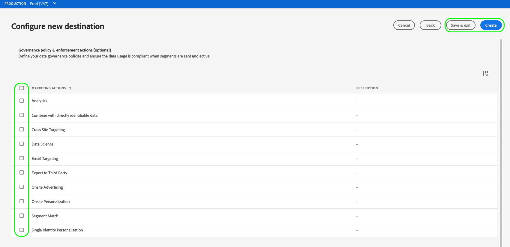

# Neue Zielverbindung erstellen

## Übersicht {#overview}

Bevor Sie Zielgruppendaten an ein Ziel senden können, müssen Sie eine Verbindung zu Ihrer Zielplattform herstellen. In diesem Artikel erfahren Sie, wie Sie mit der Adobe Experience Platform-Benutzeroberfläche ein neues Ziel einrichten.

## Neue Zielverbindung erstellen {#setup}

1. Gehen Sie zu **[!UICONTROL Verbindungen]** > **[!UICONTROL Ziele]** und wählen Sie die Registerkarte **[!UICONTROL Katalog]** aus.

   

1. Je nachdem, ob Sie über eine vorhandene Verbindung zu Ihrem Ziel verfügen, können Sie auf der Zielkarte entweder die Schaltfläche **[!UICONTROL Einrichten]** oder **[!UICONTROL Aktivieren von Segmenten]** sehen. Weitere Informationen zum Unterschied zwischen **[!UICONTROL Aktivieren von Segmenten]** und **[!UICONTROL Einrichten]** finden Sie im Abschnitt [Katalog](../ui/destinations-workspace.md#catalog) der Dokumentation zum Ziel-Workspace.

   Wählen Sie je nach verfügbarer Schaltfläche entweder **[!UICONTROL Einrichten]** oder **[!UICONTROL Aktivieren von Segmenten]** aus.

   

   

1. Wenn Sie **[!UICONTROL Einrichten]** ausgewählt haben, fahren Sie mit dem nächsten Schritt fort.

   Wenn Sie **[!UICONTROL Segmente aktivieren]** ausgewählt haben, wird jetzt eine Liste der vorhandenen Zielverbindungen angezeigt.

   Wählen Sie **[!UICONTROL Neues Ziel konfigurieren]** aus.

   

1. Geben Sie die Details der Zielplattform-Verbindung ein und wählen Sie **[!UICONTROL Mit Ziel verbinden]** aus.

   >[!NOTE]
   >
   >Das folgende Bild dient nur zu Veranschaulichungszwecken. Die Details der Zielverbindung variieren je nach Ziel. Detaillierte Informationen zu den Verbindungsdetails für Ihr Ziel finden Sie im Abschnitt **Verbindungsparameter** auf jeder [Zielkatalog](../catalog/overview.md)-Seite (z. B. [Google-Kundenabgleich](..//catalog/advertising/google-customer-match.md#parameters)).

   

1. Wählen Sie **[!UICONTROL Weiter]** aus.

   

1. Wählen Sie die Marketing-Aktionen aus, die für die Daten gelten, die Sie an das Ziel exportieren möchten. Marketing-Aktionen geben die Absicht an, für die Daten an das Ziel exportiert werden. Sie können aus von der Adobe definierten Marketing-Aktionen auswählen oder eine eigene Marketing-Aktion erstellen. Weitere Informationen zu Marketing-Aktionen finden Sie auf der Seite [Datennutzungsrichtlinien - Übersicht](../../data-governance/policies/overview.md) .

   

1. Wählen Sie **[!UICONTROL Speichern und beenden]**, um die Zielkonfiguration zu speichern, oder wählen Sie **[!UICONTROL Weiter]** aus, um mit den Zielgruppendaten [Aktivierungsfluss](activation-overview.md) fortzufahren.