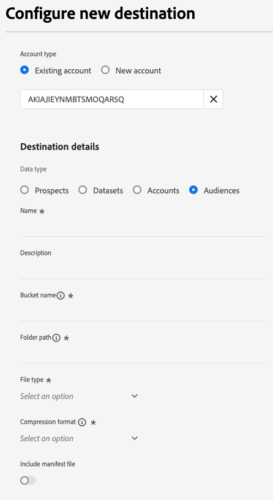

# Erstellen einer neuen Zielverbindung

>[!IMPORTANT]
> 
>* Um eine Verbindung mit einem Ziel herzustellen, benötigen Sie die [Zugriffssteuerungsberechtigung](/help/access-control/home.md#permissions) **[!UICONTROL Ziele verwalten]**. Lesen Sie die [Übersicht über die Zugriffskontrolle](/help/access-control/ui/overview.md) oder wenden Sie sich an Ihren Produktadministrator, um die erforderlichen Berechtigungen zu erhalten.
>* Um eine Verbindung mit einem Ziel herzustellen, das Datensatzexporte unterstützt, benötigen Sie die [Zugriffssteuerungsberechtigung](/help/access-control/home.md#permissions) **[!UICONTROL Datensatzziele verwalten und aktivieren]**. Lesen Sie die [Übersicht über die Zugriffskontrolle](/help/access-control/ui/overview.md) oder wenden Sie sich an Ihren Produktadministrator, um die erforderlichen Berechtigungen zu erhalten.

## Übersicht {#overview}

Bevor Sie Zielgruppendaten an ein Ziel senden können, müssen Sie eine Verbindung mit Ihrer Zielplattform einrichten. In diesem Artikel erfahren Sie, wie Sie eine neue Zielverbindung einrichten, für die Sie dann über die Adobe Experience Platform-Benutzeroberfläche Segmente aktivieren oder Datensätze exportieren können.

## Suchen des gewünschten Ziels im Katalog {#setup}

1. Navigieren Sie zu **[!UICONTROL Verbindungen]** > **[!UICONTROL Ziele]** und wählen Sie die Registerkarte **[!UICONTROL Katalog]** aus.

   

2. Zielkarten im Katalog verfügen möglicherweise über unterschiedliche Aktionssteuerelemente. Sie hängen davon ab, ob Sie über eine bestehende Verbindung mit dem Ziel verfügen und ob die Ziele die Aktivierung von Segmenten, den Export von Datensätzen oder beides unterstützen. Möglicherweise werden die folgenden Steuerelemente für Zielkarten angezeigt:

   * **[!UICONTROL Einrichten]**. Bevor Sie Segmente aktivieren oder Datensätze exportieren können, muss zunächst eine Verbindung mit diesem Ziel eingerichtet werden.
   * **[!UICONTROL Aktivieren]**. Für dieses Ziel wurde bereits eine Verbindung eingerichtet. Dieses Ziel unterstützt die Segmentaktivierung und den Export von Datensätzen.
   * **[!UICONTROL Segmente aktivieren]**. Für dieses Ziel wurde bereits eine Verbindung eingerichtet. Dieses Ziel unterstützt nur die Segmentaktivierung.

   Weitere Informationen zum Unterschied zwischen diesen Steuerelementen finden Sie auch im Abschnitt [Katalog](../ui/destinations-workspace.md#catalog) der Dokumentation zum Zielarbeitsbereich.

   Wählen Sie entweder **[!UICONTROL Einrichten]**, **[!UICONTROL Aktivieren]** oder **[!UICONTROL Segmente aktivieren]** aus, je nachdem, welche Steuerung Ihnen zur Verfügung steht.

   

   

3. Wenn Sie **[!UICONTROL Einrichten]** ausgewählt haben, springen Sie zum nächsten Schritt, um die [Authentifizierung](#authenticate) beim Ziel durchzuführen.

   Wenn Sie **[!UICONTROL Aktivieren]**, **[!UICONTROL Segmente aktivieren]** oder **[!UICONTROL Datensätze exportieren]** ausgewählt haben, können Sie jetzt eine Liste der vorhandenen Zielverbindungen sehen.

   Wählen Sie **[!UICONTROL Neues Ziel konfigurieren]** aus, um eine neue Verbindung mit dem Ziel herzustellen.

   

## Beim Ziel authentifizieren {#authenticate}

Der erste Schritt beim Herstellen einer Verbindung mit einem Ziel besteht darin, sich bei der Zielplattform zu authentifizieren.

Je nach Ziel, mit dem Sie eine Verbindung herstellen, gelangen Sie möglicherweise zur Seite des Zielpartners, um sich zu authentifizieren. Möglicherweise werden Sie aber auch direkt im Platform-Workflow aufgefordert, Anmeldeinformationen zur Authentifizierung einzugeben. Nachfolgend finden Sie ein Beispiel für die erforderliche Eingabe zur Authentifizierung bei einem [!DNL Amazon S3]-Ziel. Detaillierte Anweisungen zur erforderlichen Eingabe finden Sie auf jeder Zieldokumentationsseite (lesen Sie beispielsweise den Abschnitt zur Authentifizierung für [[!DNL Amazon S3]](/help/destinations/catalog/cloud-storage/amazon-s3.md#authenticate) und für [[!DNL Facebook]](/help/destinations/catalog/social/facebook.md#authenticate)).

Für **[!DNL Amazon S3]erforderliche und optionale Authentifizierungsparameter**

## Einrichten von Verbindungsparametern {#set-up-connection-parameters}

Wenn Sie die Authentifizierung für das Ziel bereits eingerichtet haben, können Sie mit dem vorhandenen Konto fortfahren oder ein neues Konto einrichten.

Je nach Ziel, mit dem Sie eine Verbindung herstellen, werden Sie möglicherweise aufgefordert, unterschiedliche Typen von Verbindungsparametern einzugeben. Wenn Sie beispielsweise eine Verbindung mit einem [!DNL Amazon S3]-Ziel herstellen, werden Sie aufgefordert, Details zum [!DNL Amazon S3]-Behälternamen und -Ordnerpfad anzugeben, in dem Dateien abgelegt werden. Nachfolgend finden Sie zwei Beispiele für erforderliche Eingaben für ein [!DNL Amazon S3]-Ziel und ein [!DNL Trade Desk]-Ziel. Detaillierte Anweisungen zur erforderlichen Eingabe finden Sie auf jeder Zieldokumentationsseite.

>[!IMPORTANT]
>
>Die folgenden Bilder dienen nur zur Veranschaulichung. Die Details der Zielverbindung variieren je nach Ziel. Detaillierte Informationen zu den Verbindungsdetails für Ihr Ziel finden Sie im Abschnitt **Verbinden mit dem Ziel** auf jeder Seite [Zielkatalog](../catalog/overview.md) (z. B. [[!DNL Google Customer Match]](../catalog/advertising/google-customer-match.md#connect), [[!DNL Trade Desk]](/help/destinations/catalog/advertising/tradedesk.md#connect) oder [[!DNL Amazon S3]](/help/destinations/catalog/cloud-storage/amazon-s3.md#destination-details)).

Für **[!DNL Amazon S3]erforderliche und optionale Eingabeparameter**

Für **[!DNL The Trade Desk]erforderliche und optionale Eingabeparameter**

### (Beta) Einrichten von Dateiformatierungsoptionen für exportierte Dateien {#file-formatting-and-compression-options}

Für dateibasierte Ziele können Sie verschiedene Einstellungen für die Formatierung und Komprimierung der exportierten Dateien konfigurieren. Weitere Informationen zu allen verfügbaren Formatierungs- und Komprimierungsoptionen finden Sie im [Tutorial zum Konfigurieren von Dateiformatierungsoptionen für dateibasierte Ziele](/help/destinations/ui/batch-destinations-file-formatting-options.md).

### Einrichten der Zielverbindung für die Segmentaktivierung oder für Datensatzexporte {#segment-activation-or-dataset-exports}

Einige dateibasierte Ziele unterstützen die Segmentaktivierung sowie den Export von Datensätzen. Für diese Ziele können Sie auswählen, ob eine Verbindung erstellt werden soll, über die Sie Segmente aktivieren oder Datensätze exportieren können.

### Aktivieren von Ziel-Warnhinweisen {#enable-alerts}

1. (Optional) Wählen Sie die Ziel-Datenfluss-Warnhinweise aus, die Sie abonnieren möchten. Sie können jetzt beim Erstellen eines Ziel-Datenflusses Warnhinweise abonnieren, um Benachrichtigungen zum Status, Erfolg oder Misserfolg Ihres Datenflusses zu erhalten. Die verfügbaren Warnhinweise unterscheiden sich je nach Zieltyp (dateibasiert oder Streaming), mit dem Sie eine Verbindung herstellen. Lesen Sie [Kontextabhängige Ziel-Warnhinweise abonnieren](alerts.md), um detaillierte Informationen zu Ziel-Datenfluss-Warnhinweisen zu erhalten.

   

2. Klicken Sie auf **[!UICONTROL Weiter]**.

   

## Auswählen von Marketing-Aktionen {#select-marketing-actions}

1. Wählen Sie die Marketing-Aktionen aus, die für die Daten gelten, die Sie an das Ziel exportieren möchten. Marketing-Aktionen geben an, mit welcher Absicht Daten an das Ziel exportiert werden. Sie können aus von Adobe definierten Marketing-Aktionen auswählen oder eine eigene Marketing-Aktion erstellen. Weitere Informationen zu Marketing-Aktionen finden Sie auf der Seite [Datennutzungsrichtlinien – Übersicht](../../data-governance/policies/overview.md).

   

2. Klicken Sie auf **[!UICONTROL Speichern und beenden]**, um die Zielkonfiguration zu speichern, oder auf **[!UICONTROL Weiter]**, um mit dem [Aktivierungsfluss](activation-overview.md) der Zielgruppendaten fortzufahren

## Nächste Schritte {#next-steps}

Durch das Lesen dieses Dokuments haben Sie gelernt, wie Sie mit der Experience Platform-Benutzeroberfläche eine Verbindung zu einem Ziel herstellen können. Zur Erinnerung: Die verfügbaren und erforderlichen Verbindungsparameter variieren von Ziel zu Ziel. Sie sollten auch die Seite zur Zieldokumentation im [Zielkatalog](/help/destinations/catalog/overview.md) konsultieren, um spezifische Informationen zu den erforderlichen Eingaben und verfügbaren Optionen pro Zieltyp zu erhalten.

Als Nächstes können Sie mit dem [Aktivieren von Segmenten](/help/destinations/ui/activation-overview.md) oder dem [Exportieren von Datensätzen](/help/destinations/ui/export-datasets.md) zu Ihrem Ziel fortfahren.