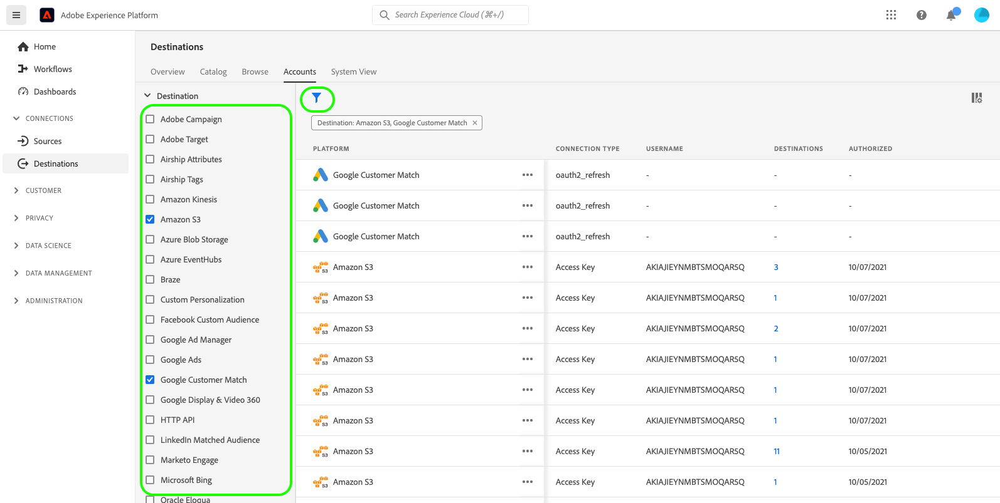

# Löschen von Zielkonten

## Überblick {#overview}

Auf der Registerkarte **[!UICONTROL Accounts]** werden Details zu den Verbindungen angezeigt, die Sie mit verschiedenen Zielen hergestellt haben. Unter [Konten - Übersicht](../ui/destinations-workspace.md#accounts) finden Sie alle Informationen, die Sie zu den einzelnen Zielkonten erhalten können.

In diesem Tutorial werden die Schritte zum Löschen von Zielkonten beschrieben, die nicht mehr benötigt werden, indem die Experience Platform-Benutzeroberfläche verwendet wird.

## Löschen von Konten {#delete}

>[!TIP]
>
>Bevor Sie das Zielkonto löschen, müssen Sie zunächst alle vorhandenen Datenflüsse löschen, die mit dem Zielkonto verknüpft sind. Informationen zum Löschen vorhandener Ziel-Datenflüsse finden Sie im Tutorial [Löschen von Ziel-Datenflüssen in der Benutzeroberfläche](./delete-destinations.md).

Gehen Sie wie folgt vor, um vorhandene Zielkonten zu löschen.

1. Melden Sie sich bei der Benutzeroberfläche von [Experience Platform &#x200B;](https://platform.adobe.com/) und wählen Sie **[!UICONTROL Destinations]** über die linke Navigationsleiste aus. Wählen Sie **[!UICONTROL Accounts]** in der oberen Kopfzeile aus, um Ihre vorhandenen Konten anzuzeigen.

   

2. Wählen Sie das Symbol  oben links, um das Sortier-Bedienfeld zu öffnen. Das Sortier-Bedienfeld bietet eine Liste aller Ihrer Ziele. Sie können mehr als ein Ziel aus der Liste auswählen, um eine gefilterte Auswahl von Konten anzuzeigen, die mit den ausgewählten Zielen verknüpft sind.

   

3. Klicken Sie auf die Auslassungszeichen (`...`) neben dem Namen des Kontos, das Sie löschen möchten. Es wird ein Popup-Bedienfeld angezeigt, das Optionen zum **[!UICONTROL Activate audiences]**, **[!UICONTROL Edit details]** und **[!UICONTROL Delete]** des Kontos bietet. Wählen Sie die Schaltfläche  **[!UICONTROL Delete]** aus, um das gewünschte Konto zu löschen.

   

4. Wählen Sie **[!UICONTROL Delete]** aus, um den Vorgang abzuschließen.

## Nächste Schritte {#next-steps}

In diesem Tutorial haben Sie den Arbeitsbereich Ziele erfolgreich zum Löschen vorhandener Konten verwendet.

Anweisungen zum programmgesteuerten Ausführen dieser Vorgänge mithilfe der [!DNL Flow Service]-API finden Sie im Tutorial zum [Löschen von Verbindungen mithilfe der Flow Service-API](../api/delete-destination-account.md)
