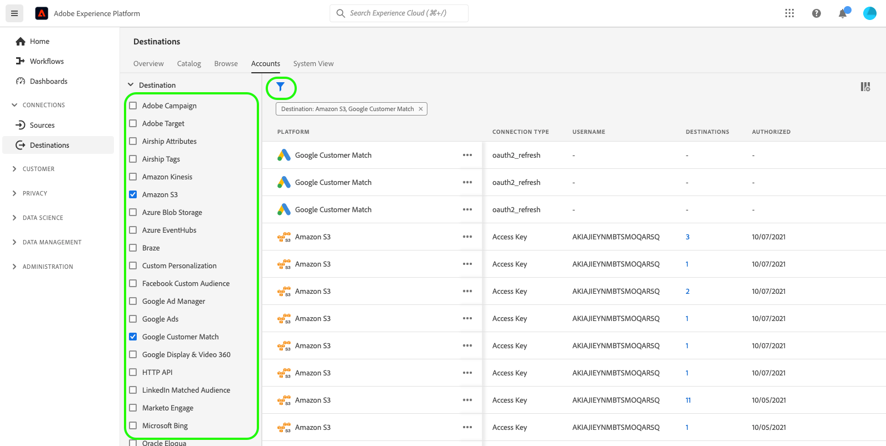

# Zielkonten löschen

## Übersicht {#overview}

Die **[!UICONTROL Konten]** zeigt Details zu den Verbindungen an, die Sie mit verschiedenen Zielen hergestellt haben. Siehe Abschnitt [Übersicht über Konten](../ui/destinations-workspace.md#accounts) für alle Informationen, die Sie für jedes Zielkonto erhalten können.

In diesem Tutorial werden die Schritte zum Löschen von Zielkonten beschrieben, die nicht mehr über die Experience Platform-Benutzeroberfläche benötigt werden.

## Konten löschen {#delete}

>[!TIP]
>
>Bevor Sie das Zielkonto löschen, müssen Sie zunächst alle vorhandenen Datenflüsse löschen, die mit dem Zielkonto verknüpft sind. Informationen zum Löschen vorhandener Ziel-Datenflüsse finden Sie im Tutorial unter [Löschen von Ziel-Datenflüssen in der Benutzeroberfläche](./delete-destinations.md).

Gehen Sie wie folgt vor, um vorhandene Zielkonten zu löschen.

1. Melden Sie sich bei der [Experience Platform-Benutzeroberfläche](https://platform.adobe.com/) und wählen Sie **[!UICONTROL Ziele]** über die linke Navigationsleiste. Auswählen **[!UICONTROL Konten]** aus der oberen Kopfzeile, um Ihre vorhandenen Konten anzuzeigen.

   

2. Filtersymbol auswählen  oben links, um das Sortierungsfenster zu öffnen. Das Sortierungsfenster bietet eine Liste aller Ziele. Sie können mehr als ein Ziel aus der Liste auswählen, um eine gefilterte Auswahl von Konten anzuzeigen, die mit den ausgewählten Zielen verknüpft sind.

   

3. Wählen Sie die Auslassungszeichen (`...`) neben dem Namen des Kontos, das Sie löschen möchten. Ein Popup-Bedienfeld wird angezeigt, das Optionen für **[!UICONTROL Segmente aktivieren]**, **[!UICONTROL Details bearbeiten]** und **[!UICONTROL Löschen]** das Konto. Wählen Sie die  **[!UICONTROL Löschen]** zum Löschen des gewünschten Kontos.

   

4. Ein letztes Bestätigungsdialogfeld wird angezeigt, wählen Sie **[!UICONTROL Löschen]** , um den Prozess abzuschließen.

## Nächste Schritte

In diesem Tutorial haben Sie erfolgreich den Arbeitsbereich &quot;Ziele&quot;zum Löschen vorhandener Konten verwendet.

Anweisungen zum programmgesteuerten Ausführen dieser Vorgänge mit dem [!DNL Flow Service] API, siehe Tutorial zu [Löschen von Verbindungen mithilfe der Flow Service-API](../api/delete-destination-account.md)
