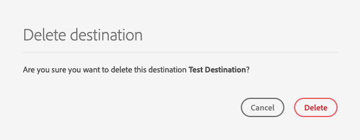
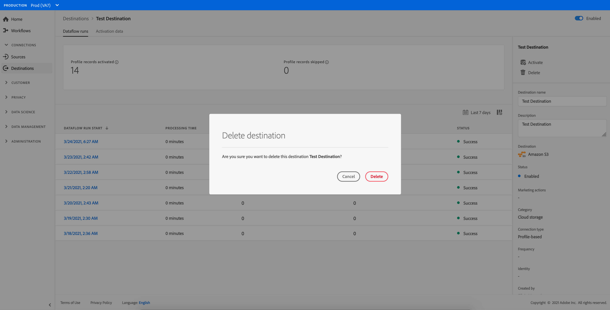

# Ziele löschen {#delete-destinations}

## Übersicht {#overview}

In der Adobe Experience Platform-Benutzeroberfläche können Sie vorhandene Verbindungen zu Zielen löschen.

Durch das Löschen eines Ziels werden alle vorhandenen Datenflüsse zu diesem Ziel entfernt. Alle Segmente, die für die Ziele aktiviert sind, die Sie löschen, werden vor dem Löschen des Datenflusses nicht zugeordnet.

Es gibt zwei Möglichkeiten, Ziele aus dem [!DNL Platform] [!DNL UI]. Sie haben folgende Möglichkeiten:

* [Löschen Sie Ziele aus dem [!UICONTROL Durchsuchen] tab](#delete-browse-tab)
* [Ziele von der Seite mit den Zieldetails löschen](#delete-destination-details-page)

## Löschen von Zielen über die Registerkarte &quot;Durchsuchen&quot;{#delete-browse-tab}

Gehen Sie wie folgt vor, um ein Ziel aus dem [!UICONTROL Durchsuchen] Registerkarte.

1. Melden Sie sich bei der [Experience Platform-Benutzeroberfläche](https://platform.adobe.com/) und wählen Sie **[!UICONTROL Ziele]** über die linke Navigationsleiste. Um Ihre vorhandenen Ziele anzuzeigen, wählen Sie **[!UICONTROL Durchsuchen]** aus der oberen Kopfzeile.

   

2. Filtersymbol auswählen  oben links, um das Sortierungsfenster zu öffnen. Das Sortierungsfenster bietet eine Liste aller Ziele. Sie können mehr als ein Ziel aus der Liste auswählen, um eine gefilterte Auswahl von Datenflüssen anzuzeigen, die mit dem ausgewählten Ziel verknüpft sind.

   

3. Wählen Sie die  in der Spalte &quot;Name&quot;und wählen Sie  **[!UICONTROL Löschen]** , um eine vorhandene Zielverbindung zu entfernen.
   

4. Auswählen **[!UICONTROL Löschen]** , um das Entfernen der Zielverbindung zu bestätigen.

   

## Ziele von der Seite mit den Zieldetails löschen{#delete-destination-details-page}

Gehen Sie wie folgt vor, um ein Ziel auf der Seite mit den Zieldetails zu löschen.

1. Melden Sie sich bei der [Experience Platform-Benutzeroberfläche](https://platform.adobe.com/) und wählen Sie **[!UICONTROL Ziele]** über die linke Navigationsleiste. Um Ihre vorhandenen Ziele anzuzeigen, wählen Sie **[!UICONTROL Durchsuchen]** aus der oberen Kopfzeile.

   

2. Filtersymbol auswählen  oben links, um das Sortierungsfenster zu öffnen. Das Sortierungsfenster bietet eine Liste aller Ziele. Sie können mehr als ein Ziel aus der Liste auswählen, um eine gefilterte Auswahl von Datenflüssen anzuzeigen, die mit dem ausgewählten Ziel verknüpft sind.

   

3. Wählen Sie den Namen des Ziels aus, das Sie löschen möchten.

   

   * Wenn das Ziel über einen vorhandenen Datenfluss verfügt, werden Sie zum [!UICONTROL Datenfluss-Abläufe] Registerkarte.

      

   * Wenn das Ziel keine vorhandenen Datenflüsse aufweist, gelangen Sie zu einer leeren Seite, auf der Sie Zielgruppen aktivieren können.

      

4. Auswählen **[!UICONTROL Löschen]** in der rechten Leiste.

   

5. Auswählen **[!UICONTROL Löschen]** im Bestätigungsdialogfeld, um das Ziel zu entfernen.

   

   >[!NOTE]
   >
   >Je nach Server-Load kann es einige Minuten dauern [!DNL Platform] , um das Ziel zu löschen.
