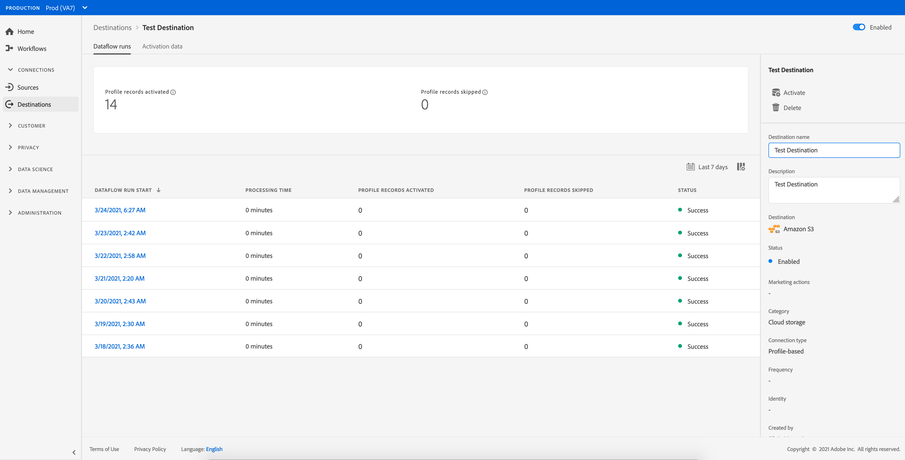

# Löschen von Zielen {#delete-destinations}

## Überblick {#overview}

In der Adobe Experience Platform-Benutzeroberfläche können Sie bestehende Verbindungen zu Zielen löschen.

Durch das Löschen eines Ziels werden alle vorhandenen Datenflüsse zu diesem Ziel entfernt. Alle Zielgruppen, die für die zu löschenden Ziele aktiviert sind, werden nicht zugeordnet, bevor der Datenfluss gelöscht wird.

Es gibt zwei Möglichkeiten, Ziele aus dem [!DNL Experience Platform]-[!DNL UI] zu löschen. Sie haben folgende Möglichkeiten:

* [Löschen von Zielen auf der Registerkarte [!UICONTROL Durchsuchen]](#delete-browse-tab)
* [Löschen von Zielen auf der Seite mit den Zieldetails](#delete-destination-details-page)

## Löschen von Zielen auf der Registerkarte Durchsuchen{#delete-browse-tab}

Gehen Sie wie folgt vor, um ein Ziel von der Registerkarte [!UICONTROL Durchsuchen] zu löschen.

1. Melden Sie sich bei der [Experience Platform-Benutzeroberfläche](https://platform.adobe.com/) an und wählen Sie **[!UICONTROL Ziele]** über die linke Navigationsleiste aus. Um Ihre vorhandenen Ziele anzuzeigen, wählen Sie **[!UICONTROL Durchsuchen]** aus der oberen Kopfzeile aus.

   

2. Wählen Sie das Symbol  oben links, um das Sortier-Bedienfeld zu öffnen. Das Sortier-Bedienfeld bietet eine Liste aller Ihrer Ziele. Sie können mehr als ein Ziel aus der Liste auswählen, um eine gefilterte Auswahl von Datenflüssen anzuzeigen, die mit dem ausgewählten Ziel verknüpft sind.

   

3. Wählen Sie die Schaltfläche  in der Spalte Name und dann  **[!UICONTROL Löschen]**, um eine vorhandene Zielverbindung zu entfernen.
   

4. Wählen Sie **[!UICONTROL Löschen]** aus, um das Entfernen der Zielverbindung zu bestätigen.

   

## Löschen von Zielen auf der Seite mit den Zieldetails{#delete-destination-details-page}

Gehen Sie wie folgt vor, um ein Ziel von der Seite mit den Zieldetails zu löschen.

1. Melden Sie sich bei der [Experience Platform-Benutzeroberfläche](https://platform.adobe.com/) an und wählen Sie **[!UICONTROL Ziele]** über die linke Navigationsleiste aus. Um Ihre vorhandenen Ziele anzuzeigen, wählen Sie **[!UICONTROL Durchsuchen]** aus der oberen Kopfzeile aus.

   

2. Wählen Sie das Symbol  oben links, um das Sortier-Bedienfeld zu öffnen. Das Sortier-Bedienfeld bietet eine Liste aller Ihrer Ziele. Sie können mehr als ein Ziel aus der Liste auswählen, um eine gefilterte Auswahl von Datenflüssen anzuzeigen, die mit dem ausgewählten Ziel verknüpft sind.

   

3. Wählen Sie den Namen des Ziels aus, das Sie löschen möchten.

   

   * Wenn das Ziel über vorhandene Datenflüsse verfügt, werden Sie zur Registerkarte [!UICONTROL Datenflussausführungen] weitergeleitet.

     

   * Wenn das Ziel nicht über vorhandene Datenflüsse verfügt, gelangen Sie auf eine leere Seite, auf der Sie mit der Aktivierung von Zielgruppen beginnen können.

     

4. Wählen **[!UICONTROL Löschen]** in der rechten Leiste aus.

   

5. Wählen **[!UICONTROL im Bestätigungsdialogfeld]** Löschen“ aus, um das Ziel zu entfernen.

   

   >[!NOTE]
   >
   >Je nach Server-Last kann es einige Minuten dauern, bis [!DNL Experience Platform] das Ziel löscht.
