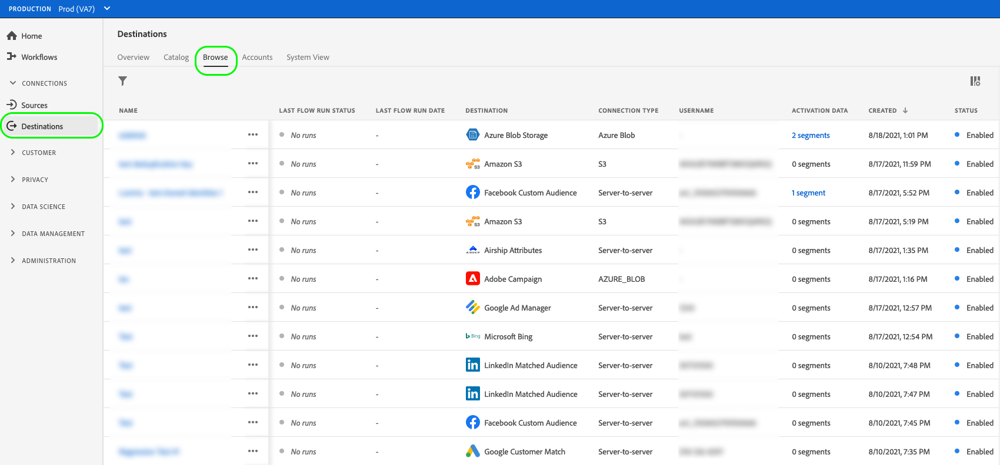
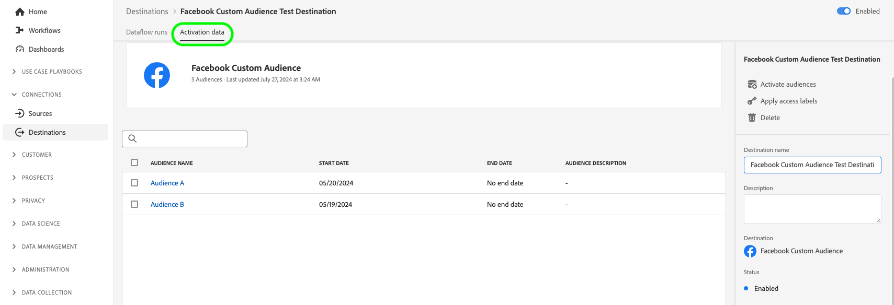

# Anzeigen von Zieldetails

## Übersicht {#overview}

In der Adobe Experience Platform-Benutzeroberfläche können Sie die Attribute und Aktivitäten Ihrer Ziele anzeigen und überwachen. Zu diesen Details gehören der Name und die ID des Ziels, Steuerelemente zum Aktivieren oder Deaktivieren der Ziele und mehr. Zu den Details gehören auch Metriken für aktivierte Profildatensätze, aktivierte, fehlgeschlagene und ausgeschlossene Identitäten sowie ein Verlauf der Datenfluss-Läufe.

>[!NOTE]
>
>Die Zieldetailseite ist Teil der [!UICONTROL Ziele] Arbeitsbereich im [!DNL Platform] [!DNL UI]. Siehe [[!UICONTROL Ziele] Arbeitsbereich - Übersicht](./destinations-workspace.md) für weitere Informationen.

## Anzeigen von Zieldetails {#view-details}

Gehen Sie wie folgt vor, um weitere Details zu einem vorhandenen Ziel anzuzeigen.

1. Melden Sie sich bei der [Experience Platform-Benutzeroberfläche](https://platform.adobe.com/) und wählen Sie **[!UICONTROL Ziele]** über die linke Navigationsleiste. Auswählen **[!UICONTROL Durchsuchen]** aus der oberen Kopfzeile, um Ihre vorhandenen Ziele anzuzeigen.

   

1. Filtersymbol auswählen  oben links, um das Sortierungsfenster zu öffnen. Das Sortierungsfenster bietet eine Liste aller Ziele. Sie können mehr als ein Ziel aus der Liste auswählen, um eine gefilterte Auswahl von Datenflüssen anzuzeigen, die mit dem ausgewählten Ziel verknüpft sind.

   

1. Wählen Sie den Namen des Ziels aus, das Sie anzeigen möchten.

   

1. Die Detailseite für das Ziel wird mit den verfügbaren Steuerelementen angezeigt.

   

## rechte Leiste {#right-rail}

In der rechten Leiste werden die grundlegenden Informationen zum ausgewählten Ziel angezeigt.

Die folgende Tabelle enthält die von der rechten Leiste bereitgestellten Steuerelemente und Details:

| Element in der rechten Leiste | Beschreibung |
| --- | --- |
| [!UICONTROL Aktivieren von Segmenten] | Wählen Sie dieses Steuerelement aus, um zu bearbeiten, welche Segmente dem Ziel zugeordnet sind, Exportpläne zu aktualisieren oder zugeordnete Attribute und Identitäten hinzuzufügen und zu entfernen. Weitere Informationen finden Sie in den Handbüchern unter [Aktivieren von Zielgruppendaten für Segmentstreaming-Ziele](./activate-segment-streaming-destinations.md), [Aktivieren von Zielgruppendaten für profilbasierte Batch-Ziele](./activate-batch-profile-destinations.md)und [Aktivieren von Zielgruppendaten für Streaming profilbasierter Ziele](./activate-streaming-profile-destinations.md) für weitere Informationen. |
| [!UICONTROL Löschen] | Ermöglicht das Löschen dieses Datenflusses und die Aufhebung der Zuordnung der zuvor aktivierten Segmente, falls vorhanden. |
| [!UICONTROL Zielname] | Dieses Feld kann bearbeitet werden, um den Zielnamen zu aktualisieren. |
| [!UICONTROL Beschreibung] | Dieses Feld kann bearbeitet werden, um eine optionale Beschreibung zum Ziel zu aktualisieren oder hinzuzufügen. |
| [!UICONTROL Ziel] | Die Zielplattform, an die Zielgruppen gesendet werden. Siehe [Zielkatalog](../catalog/overview.md) für weitere Informationen. |
| [!UICONTROL Status] | Gibt an, ob das Ziel aktiviert oder deaktiviert ist. |
| [!UICONTROL Marketing-Aktionen] | Gibt die Marketing-Aktionen (Anwendungsfälle) an, die für dieses Ziel aus Data-Governance-Gründen gelten. |
| [!UICONTROL Kategorie] | Gibt den Zieltyp an. Siehe [Zielkatalog](../catalog/overview.md) für weitere Informationen. |
| [!UICONTROL Verbindungstyp] | Gibt das Formular an, mit dem Ihre Zielgruppen an das Ziel gesendet werden. Mögliche Werte sind [!UICONTROL Cookie] und [!UICONTROL Profilbasiert]. |
| [!UICONTROL Häufigkeit] | Gibt an, wie oft die Zielgruppen an das Ziel gesendet werden. Mögliche Werte sind [!UICONTROL Streaming] und [!UICONTROL Batch]. |
| [!UICONTROL Identität] | Stellt den vom Ziel akzeptierten Identitäts-Namespace dar, z. B. `GAID`, `IDFA`oder `email`. Weitere Informationen zu akzeptierten Identitäts-Namespaces finden Sie im Abschnitt [Übersicht über Identitäts-Namespace](../../identity-service/namespaces.md). |
| [!UICONTROL Erstellt von] | Gibt den Benutzer an, der dieses Ziel erstellt hat. |
| [!UICONTROL Erstellt] | Gibt den UTC-Datum an, zu dem dieses Ziel erstellt wurde. |

{style=&quot;table-layout:auto&quot;}

## [!UICONTROL Aktiviert]/[!UICONTROL Behinderte] Umschalten {#enabled-disabled-toggle}

Sie können die **[!UICONTROL Aktiviert]/[!UICONTROL Behinderte]** Umschalten, um alle Datenexporte an das Ziel zu starten und anzuhalten.

## [!UICONTROL Datenfluss-Abläufe] {#dataflow-runs}

Die [!UICONTROL Datenfluss-Abläufe] -Tab enthält Metrikdaten zu Ihren Datenflüssen, die an Batch- und Streaming-Ziele ausgeführt werden. Siehe [Überwachen von Datenflüssen](monitor-dataflows.md) für Details und Metrikdefinitionen.

>[!NOTE]
>
>* Die Funktion zur Zielüberwachung wird derzeit für alle Ziele in Experience Platform unterstützt *Ausnahme* die [Adobe Target](/help/destinations/catalog/personalization/adobe-target-connection.md) und [Benutzerdefinierte Personalisierung](/help/destinations/catalog/personalization/custom-personalization.md) Ziele.
>* Für [Amazon Kinesis](/help/destinations/catalog/cloud-storage/amazon-kinesis.md), [Azure Event Hubs](/help/destinations/catalog/cloud-storage/azure-event-hubs.md)und [HTTP-API](/help/destinations/catalog/streaming/http-destination.md) Ziele, ausgeschlossene Identitäten werden derzeit nicht angezeigt.

## [!UICONTROL Aktivierungsdaten] {#activation-data}

Die [!UICONTROL Aktivierungsdaten] zeigt eine Liste der Segmente an, die dem Ziel zugeordnet wurden, einschließlich des Anfangs- und Enddatums (falls zutreffend) sowie anderer relevanter Informationen für den Datenexport, wie Exporttyp, -zeitplan und -frequenz. Um die Details zu einem bestimmten Segment anzuzeigen, wählen Sie dessen Namen aus der Liste aus.

>[!TIP]
>
>Um Details zu den Attributen und Identitäten anzuzeigen und zu bearbeiten, die einem Ziel zugeordnet sind, wählen Sie **[!UICONTROL Segmente aktivieren]** im [rechte Leiste](#right-rail).

>[!NOTE]
>
>Weitere Informationen zum Erkunden der Detailseite eines Segments finden Sie im Abschnitt [Übersicht über die Segmentierungsbenutzeroberfläche](../../segmentation/ui/overview.md#segment-details).
