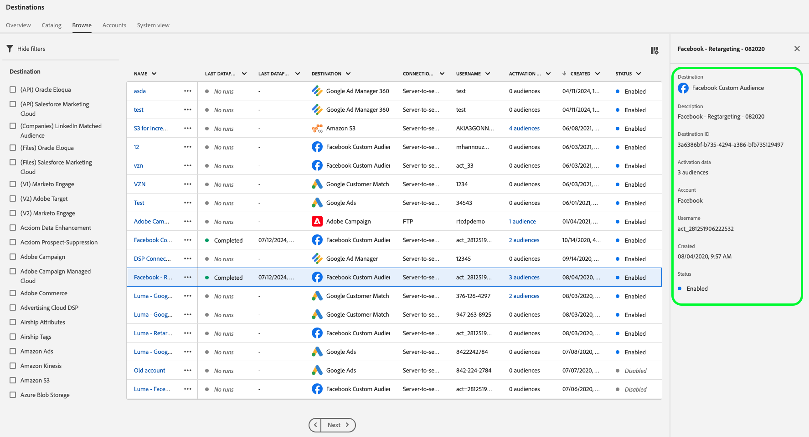

# Anzeigen von Zieldetails

## Übersicht {#overview}

In der Adobe Experience Platform-Benutzeroberfläche können Sie die Attribute und Aktivitäten Ihrer Ziele anzeigen und überwachen. Zu diesen Details gehören der Name und die ID des Ziels, Steuerelemente zum Aktivieren oder Deaktivieren der Ziele und mehr. Zu den Details gehören auch Metriken für aktivierte Profildatensätze, aktivierte, fehlgeschlagene und ausgeschlossene Identitäten sowie ein Verlauf der Datenfluss-Läufe.

>[!NOTE]
>
>Die Zieldetailseite ist Teil des Arbeitsbereichs [!UICONTROL Ziele] im Arbeitsbereich [!DNL Platform] [!DNL UI]. Weitere Informationen finden Sie unter [[!UICONTROL Ziele] Workspace - Übersicht](./destinations-workspace.md) .

## Anzeigen von Zieldetails {#view-details}

Gehen Sie wie folgt vor, um weitere Details zu einem vorhandenen Ziel anzuzeigen. Sie können die Ziel-ID eines Ziels, den Benutzer, der das Ziel erstellt hat, zum Zeitpunkt seiner Erstellung und andere Informationen ermitteln.

1. Melden Sie sich bei der [Experience Platform-Benutzeroberfläche](https://platform.adobe.com/) an und wählen Sie **[!UICONTROL Ziele]** über die linke Navigationsleiste aus. Wählen Sie in der oberen Kopfzeile **[!UICONTROL Durchsuchen]** aus, um Ihre vorhandenen Ziele anzuzeigen.

   

2. Wählen Sie das Symbol  oben links, um das Sortier-Bedienfeld zu öffnen. Das Sortier-Bedienfeld bietet eine Liste aller Ihrer Ziele. Sie können mehr als ein Ziel aus der Liste auswählen, um eine gefilterte Auswahl von Datenflüssen anzuzeigen, die mit dem ausgewählten Ziel verknüpft sind.

   

3. Wählen Sie die Zeile des Ziels aus, für die weitere Informationen angezeigt werden sollen. Dadurch wird eine rechte Leiste mit Informationen zum Ziel, einschließlich der Ziel-ID, des Benutzers, der die Zielverbindung erstellt hat, und anderen Informationen angezeigt.

   

4. Alternativ können Sie weitere Informationen zum Ziel anzeigen, indem Sie *den Namen des Ziels* auswählen, das Sie anzeigen möchten.

   

5. Die Detailseite für das Ziel wird in der rechten Leiste mit den verfügbaren Steuerelementen angezeigt.

   

## rechte Leiste {#right-rail}

In der rechten Leiste werden die grundlegenden Informationen zum ausgewählten Ziel angezeigt.

Die folgende Tabelle enthält die von der rechten Leiste bereitgestellten Steuerelemente und Details:

| Element in der rechten Leiste | Beschreibung |
| --- | --- |
| [!UICONTROL Zielgruppen aktivieren] | Wählen Sie dieses Steuerelement aus, um zu bearbeiten, welche Zielgruppen dem Ziel zugeordnet sind, Exportpläne zu aktualisieren oder zugeordnete Attribute und Identitäten hinzuzufügen und zu entfernen. Weitere Informationen finden Sie in den Handbüchern zu [Aktivieren von Zielgruppendaten für Zielgruppen-Streaming-Ziele](./activate-segment-streaming-destinations.md), [Aktivieren von Zielgruppendaten für Batch-profilbasierte Ziele](./activate-batch-profile-destinations.md) und [Aktivieren von Zielgruppendaten für Streaming profilbasierter Ziele](./activate-streaming-profile-destinations.md) . |
| [!UICONTROL Löschen] | Ermöglicht das Löschen dieses Datenflusses und die Aufhebung der Zuordnung der zuvor aktivierten Zielgruppen, falls vorhanden. |
| [!UICONTROL Zielname] | Dieses Feld kann bearbeitet werden, um den Zielnamen zu aktualisieren. |
| [!UICONTROL Beschreibung] | Dieses Feld kann bearbeitet werden, um eine optionale Beschreibung zum Ziel zu aktualisieren oder hinzuzufügen. |
| [!UICONTROL Ziel] | Die Zielplattform, an die Zielgruppen gesendet werden. Weitere Informationen finden Sie im [Zielkatalog](../catalog/overview.md). |
| [!UICONTROL Status] | Gibt an, ob das Ziel aktiviert oder deaktiviert ist. |
| [!UICONTROL Marketing-Aktionen] | Gibt die Marketing-Aktionen (Anwendungsfälle) an, die für dieses Ziel aus Data-Governance-Gründen gelten. |
| [!UICONTROL Kategorie] | Gibt den Zieltyp an. Weitere Informationen finden Sie im [Zielkatalog](../catalog/overview.md). |
| [!UICONTROL Verbindungstyp] | Gibt das Formular an, mit dem Ihre Zielgruppen an das Ziel gesendet werden. Mögliche Werte sind [!UICONTROL Cookie] und [!UICONTROL profilbasiert]. |
| [!UICONTROL Häufigkeit] | Gibt an, wie oft die Zielgruppen an das Ziel gesendet werden. Mögliche Werte sind [!UICONTROL Streaming] und [!UICONTROL Batch]. |
| [!UICONTROL Identität] | Stellt den vom Ziel akzeptierten Identitäts-Namespace dar, z. B. `GAID`, `IDFA` oder `email`. Weitere Informationen zu akzeptierten Identitäts-Namespaces finden Sie in der [Übersicht zum Identitäts-Namespace](../../identity-service/features/namespaces.md) . |
| [!UICONTROL Erstellt von] | Gibt den Benutzer an, der dieses Ziel erstellt hat. |
| [!UICONTROL Erstellt] | Gibt den UTC-Datum an, zu dem dieses Ziel erstellt wurde. |

{style="table-layout:auto"}

## Umschalter [!UICONTROL Aktiviert]/[!UICONTROL Deaktiviert] {#enabled-disabled-toggle}

Sie können den Umschalter **[!UICONTROL Aktiviert]/[!UICONTROL Deaktiviert]** verwenden, um alle Datenexporte an das Ziel zu starten und anzuhalten.

## [!UICONTROL Datenfluss wird ausgeführt] {#dataflow-runs}

Die Registerkarte [!UICONTROL Datenfluss läuft] enthält Metrikdaten zu Ihren Datenflüssen, die zu Batch- und Streaming-Zielen ausgeführt werden. Weitere Informationen und Metrikdefinitionen finden Sie unter [Überwachen von Datenflüssen](monitor-dataflows.md) .

>[!NOTE]
>
>* Die Zielüberwachungsfunktion wird derzeit für alle Ziele in Experience Platform *unterstützt, mit Ausnahme von* den Zielen [Adobe Target](/help/destinations/catalog/personalization/adobe-target-connection.md), [Benutzerdefinierte Personalisierung](/help/destinations/catalog/personalization/custom-personalization.md) und [Experience Cloud-Zielgruppen](/help/destinations/catalog/adobe/experience-cloud-audiences.md).
>* Für die Ziele [Amazon Kinesis](/help/destinations/catalog/cloud-storage/amazon-kinesis.md), [Azure Event Hub](/help/destinations/catalog/cloud-storage/azure-event-hubs.md) und [HTTP API](/help/destinations/catalog/streaming/http-destination.md) werden die Metriken geschätzt, die sich auf ausgeschlossene, fehlgeschlagene und aktivierte Identitäten beziehen. Höhere Volumina von Aktivierungsdaten führen zu einer höheren Genauigkeit der Metriken.

### Dauer der Datenflüsse {#dataflow-runs-duration}

Es gibt einen Unterschied in der angezeigten Dauer von Datenfluss-Läufen zwischen Streaming- und dateibasierten Zielen.

### Streaming-Ziele {#streaming}

Während die für die meisten Streaming-Datenfluss-Ausführungen angegebene **[!UICONTROL Verarbeitungsdauer]** etwa vier Stunden beträgt, wie in der Abbildung unten dargestellt, ist die tatsächliche Verarbeitungszeit für jeden Datenfluss viel kürzer. Dataflow-Run-Fenster bleiben länger geöffnet, falls Experience Platform erneut Aufrufe an das Ziel tätigen muss, und stellen Sie sicher, dass es keine verspäteten Daten für das gleiche Zeitfenster verpasst.

Weitere Informationen finden Sie unter [Datenfluss wird an Streaming-Ziele ausgeführt](/help/dataflows/ui/monitor-destinations.md#dataflow-runs-for-streaming-destinations) in der Überwachungsdokumentation.

### Dateibasierte Ziele {#file-based}

Bei Datenflüssen, die an dateibasierte Ziele ausgeführt werden, hängt die **[!UICONTROL Verarbeitungsdauer]** von der Größe der zu exportierenden Daten und der Systemlast ab. Beachten Sie außerdem, dass der Datenfluss zu dateibasierten Zielen nach Zielgruppen aufgeschlüsselt wird.

Weitere Informationen finden Sie unter [Datenfluss wird in der Überwachungsdokumentation zu Batch-(dateibasierten) Zielen ausgeführt](/help/dataflows/ui/monitor-destinations.md#dataflow-runs-for-batch-destinations) .

## [!UICONTROL Aktivierungsdaten] {#activation-data}

Auf der Registerkarte [!UICONTROL Aktivierungsdaten] wird eine Liste der Zielgruppen angezeigt, die dem Ziel zugeordnet wurden, einschließlich des Anfangs- und Enddatums (falls zutreffend) sowie anderer relevanter Informationen für den Datenexport, wie Exporttyp, -plan und -frequenz. Um Details zu einer bestimmten Zielgruppe anzuzeigen, wählen Sie deren Namen aus der Liste aus.

>[!TIP]
>
>Um Details zu den Attributen und Identitäten anzuzeigen und zu bearbeiten, die einem Ziel zugeordnet sind, wählen Sie **[!UICONTROL Zielgruppen aktivieren]** in der [rechten Leiste](#right-rail) aus.

### [!BADGE Beta]{type=Informative} Entfernen mehrerer Zielgruppen aus Aktivierungsflüssen {#bulk-remove}

>[!NOTE]
>
Diese Funktion befindet sich in der Beta-Phase und steht nur ausgewählten Kunden zur Verfügung. Wenden Sie sich an Ihren Adobe-Support-Mitarbeiter, um Zugriff auf diese Funktion anzufordern.

Um mehrere Zielgruppen aus vorhandenen Aktivierungsabläufen zu entfernen, wählen Sie die Zielgruppen aus und klicken Sie dann auf **[!UICONTROL Zielgruppen entfernen]**.

### Mehrere Dateien On-Demand an Batch-Ziele exportieren {#bulk-export}

Sie können [mehrere Dateien On-Demand exportieren](../ui/export-file-now.md) von der Seite **[!UICONTROL Aktivierungsdaten]**. Wählen Sie dazu die Zielgruppen aus, für die Sie Dateien bei Bedarf exportieren möchten, und wählen Sie das Steuerelement **[!UICONTROL Datei jetzt exportieren]** aus, um einen einmaligen Export Trigger, durch den eine Datei für jede ausgewählte Zielgruppe an Ihr Batch-Ziel gesendet wird.

### Bearbeiten von Aktivierungszeitplänen für mehrere Zielgruppen, die an Batch-Ziele exportiert werden {#bulk-edit-schedule}

Um den vorhandenen Aktivierungsplan mehrerer Zielgruppen gleichzeitig zu bearbeiten, wählen Sie die gewünschten Zielgruppen aus und klicken Sie dann auf **[!UICONTROL Zeitplan bearbeiten]**. Ausführliche Informationen zum Definieren oder Bearbeiten eines Exportzeitplans finden Sie im Abschnitt [Zielgruppenexport planen](../ui/activate-batch-profile-destinations.md#scheduling) .

>[!NOTE]
>
Weitere Informationen zum Erkunden der Detailseite einer Audience finden Sie in der [Übersicht über Audience Portal](../../segmentation/ui/audience-portal.md#segment-details) .
