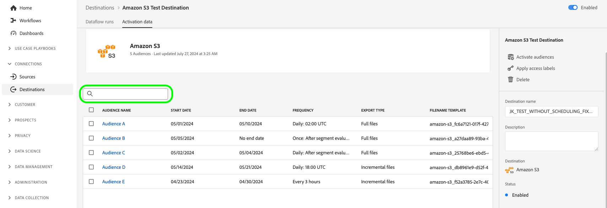
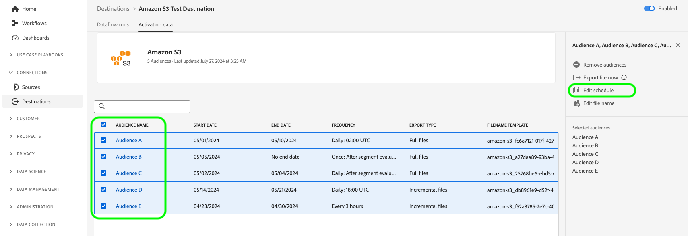

# Anzeigen von Zieldetails

## Überblick {#overview}

In der Adobe Experience Platform-Benutzeroberfläche können Sie die Attribute und Aktivitäten Ihrer Ziele anzeigen und überwachen. Zu diesen Details gehören der Name und die ID des Ziels, Steuerelemente zum Aktivieren oder Deaktivieren der Ziele und mehr. Zu den Details gehören auch Metriken für aktivierte Profildatensätze, aktivierte, fehlgeschlagene und ausgeschlossene Identitäten und ein Verlauf der Datenflussausführungen.

>[!NOTE]
>
>Die Seite mit den Zieldetails ist Teil des Arbeitsbereichs [!UICONTROL Ziele] im [!DNL Experience Platform] [!DNL UI]. Weitere Informationen dazu finden [[!UICONTROL &#x200B; in &#x200B;] Übersicht zum ](./destinations-workspace.md) .

## Anzeigen von Zieldetails {#view-details}

Gehen Sie wie folgt vor, um weitere Details zu einem vorhandenen Ziel anzuzeigen. Sie können die Ziel-ID eines Ziels, den Benutzer, der das Ziel erstellt hat, den Zeitpunkt seiner Erstellung und weitere Informationen ermitteln.

1. Melden Sie sich bei der [Experience Platform-Benutzeroberfläche](https://platform.adobe.com/) an und wählen Sie **[!UICONTROL Ziele]** über die linke Navigationsleiste aus. Wählen **[!UICONTROL Durchsuchen]** in der oberen Kopfzeile aus, um Ihre vorhandenen Ziele anzuzeigen.

   

2. Wählen Sie das Symbol  oben links, um das Sortier-Bedienfeld zu öffnen. Das Sortier-Bedienfeld bietet eine Liste aller Ihrer Ziele. Sie können mehr als ein Ziel aus der Liste auswählen, um eine gefilterte Auswahl von Datenflüssen anzuzeigen, die mit dem ausgewählten Ziel verknüpft sind.

   

3. Wählen Sie die Zeile des Ziels aus, für die Sie weitere Informationen aufrufen möchten. Dadurch wird eine rechte Leiste mit Informationen zum Ziel angezeigt, einschließlich der Ziel-ID, des Benutzers, der die Zielverbindung erstellt hat, und anderer Informationen.

   

4. Alternativ können Sie auch andere Informationen zum Ziel aufrufen, indem Sie *den Namen des Ziels* auswählen, das Sie anzeigen möchten.

   

5. Die Detailseite für das Ziel wird in der rechten Leiste mit den verfügbaren Steuerelementen angezeigt.

   

## Rechte Leiste {#right-rail}

In der rechten Leiste werden die grundlegenden Informationen zum ausgewählten Ziel angezeigt.

Die folgende Tabelle enthält die Steuerelemente und Details, die von der rechten Leiste bereitgestellt werden:

| Element in der rechten Leiste | Beschreibung |
| --- | --- |
| [!UICONTROL Zielgruppen aktivieren] | Wählen Sie dieses Steuerelement aus, um zu bearbeiten, welche Zielgruppen dem Ziel zugeordnet sind, Exportpläne zu aktualisieren oder zugeordnete Attribute und Identitäten hinzuzufügen und zu entfernen. Weitere Informationen finden Sie in [ Handbüchern unter „Aktivieren von Zielgruppendaten für Zielgruppen](./activate-segment-streaming-destinations.md) &quot;[ Aktivieren von Zielgruppendaten für Batch](./activate-batch-profile-destinations.md)Profil-basierte Ziele“ und [Aktivieren von Zielgruppendaten für Streaming-](./activate-streaming-profile-destinations.md) Ziele“. |
| [!UICONTROL Löschen] | Ermöglicht das Löschen dieses Datenflusses und hebt die Zuordnung der zuvor aktivierten Zielgruppen auf, sofern vorhanden. |
| [!UICONTROL Zielname] | Dieses Feld kann bearbeitet werden, um den Namen des Ziels zu aktualisieren. |
| [!UICONTROL Beschreibung] | Dieses Feld kann bearbeitet werden, um eine optionale Beschreibung des Ziels zu aktualisieren oder hinzuzufügen. |
| [!UICONTROL Ziel] | Die Zielplattform, an die Zielgruppen gesendet werden. Weitere Informationen finden [ im ](../catalog/overview.md)Zielkatalog“. |
| [!UICONTROL Status] | Gibt an, ob das Ziel aktiviert oder deaktiviert ist. |
| [!UICONTROL Marketing-Aktionen] | Gibt die Marketing-Aktionen (Anwendungsfälle) an, die für dieses Ziel zu Data-Governance-Zwecken gelten. |
| [!UICONTROL Kategorie] | Gibt den Zieltyp an. Weitere Informationen finden [ im ](../catalog/overview.md)Zielkatalog“. |
| [!UICONTROL Verbindungstyp] | Gibt das Formular an, mit dem Ihre Zielgruppen an das Ziel gesendet werden. Mögliche Werte sind [!UICONTROL Cookie] und [!UICONTROL profilbasiert]. |
| [!UICONTROL Häufigkeit] | Gibt an, wie oft die Zielgruppen an das Ziel gesendet werden. Zu den möglichen Werten gehören [!UICONTROL Streaming] und [!UICONTROL Batch]. |
| [!UICONTROL Identität] | Stellt den vom Ziel akzeptierten Identity-Namespace dar, z. B. `GAID`, `IDFA` oder `email`. Weitere Informationen zu zulässigen Identity-Namespaces finden Sie unter [Übersicht zu Identity-Namespaces](../../identity-service/features/namespaces.md). |
| [!UICONTROL Erstellt von] | Gibt den Benutzer an, der dieses Ziel erstellt hat. |
| [!UICONTROL Erstellt] | Gibt das UTC-Datum/die UTC-Uhrzeit an, zu der dieses Ziel erstellt wurde. |

{style="table-layout:auto"}

## Umschalter [!UICONTROL Aktiviert]/[!UICONTROL Deaktiviert] {#enabled-disabled-toggle}

Sie können den Umschalter **[!UICONTROL Aktiviert]/[!UICONTROL Deaktiviert]** verwenden, um alle Datenexporte an das Ziel zu starten und anzuhalten.

## [!UICONTROL Datenflussausführungen] {#dataflow-runs}

Die Registerkarte [!UICONTROL Datenflussausführungen] enthält Metrikdaten zu Ihren Datenflussausführungen zu Batch- und Streaming-Zielen. Siehe [Überwachen von ](monitor-dataflows.md)&quot; für Details und Metrikdefinitionen.

>[!NOTE]
>
>* Die Zielüberwachungsfunktion wird derzeit für alle Ziele in Experience Platform unterstützt *mit Ausnahme* Ziele [Adobe Target](/help/destinations/catalog/personalization/adobe-target-connection.md), [Benutzerdefinierte ](/help/destinations/catalog/personalization/custom-personalization.md) und [Experience Cloud Audiences](/help/destinations/catalog/adobe/experience-cloud-audiences.md).
>* Für die [Amazon Kinesis](/help/destinations/catalog/cloud-storage/amazon-kinesis.md)-, [Azure Event Hubs](/help/destinations/catalog/cloud-storage/azure-event-hubs.md)- und [HTTP API](/help/destinations/catalog/streaming/http-destination.md)-Ziele werden die Metriken in Bezug auf ausgeschlossene, fehlgeschlagene und aktivierte Identitäten geschätzt. Ein höheres Volumen an Aktivierungsdaten führt zu einer höheren Genauigkeit der Metriken.

### Dauer der Datenflussausführungen {#dataflow-runs-duration}

Die angezeigte Dauer der Datenflussausführungen zwischen Streaming- und dateibasierten Zielen unterscheidet sich.

### Streaming-Ziele {#streaming}

Während die **[!UICONTROL Verarbeitungsdauer]** die für die meisten Streaming-Datenflussausführungen angezeigt wird, etwa vier Stunden beträgt, wie in der Abbildung unten dargestellt, ist die tatsächliche Verarbeitungszeit für jeden Datenflusslauf viel kürzer. Datenflussausführungsfenster bleiben länger offen, falls Experience Platform erneut versuchen muss, das Ziel aufzurufen, und stellen Sie außerdem sicher, dass es keine spät ankommenden Daten für dasselbe Zeitfenster verpasst.

Weitere Informationen zu „Datenflussausführungen [ Streaming-Ziele“ finden ](/help/dataflows/ui/monitor-destinations.md#dataflow-runs-for-streaming-destinations) in der Dokumentation zur Überwachung.

### Dateibasierte Ziele {#file-based}

Bei Datenflussausführungen zu dateibasierten Zielen hängt die **[!UICONTROL Verarbeitungsdauer]** von der Größe der exportierten Daten und der Systemlast ab. Beachten Sie außerdem, dass die Datenflussausführungen zu dateibasierten Zielen nach Zielgruppe aufgeschlüsselt sind.

Weitere Informationen zu [Datenflussausführungen zu Batch-Zielen (dateibasiert)) finden ](/help/dataflows/ui/monitor-destinations.md#dataflow-runs-for-batch-destinations) in der Monitoring-Dokumentation.

## [!UICONTROL Aktivierungsdaten] {#activation-data}

Die Registerkarte **[!UICONTROL Aktivierungsdaten]** zeigt eine Liste von Zielgruppen an, die dem Ziel zugeordnet wurden, einschließlich des Anfangs- und Enddatums (falls zutreffend) sowie weiterer relevanter Informationen für den Datenexport, wie Exporttyp, -zeitplan und -frequenz. Um die Details zu einer bestimmten Zielgruppe anzuzeigen, wählen Sie den Namen aus der Liste aus.

>[!TIP]
>
>Um Details zu den Attributen und Identitäten, die einem Ziel zugeordnet sind, anzuzeigen und zu bearbeiten, wählen Sie **[!UICONTROL Zielgruppen aktivieren]** in der [ Leiste ](#right-rail).

>[!BEGINSHADEBOX]

Die **[!UICONTROL Aktivierungsdaten]** für ein dateibasiertes Ziel.

>[!ENDSHADEBOX]

>[!BEGINSHADEBOX]

Die **[!UICONTROL Aktivierungsdaten]** für ein Streaming-Ziel.

>[!ENDSHADEBOX]

### Filtern von aktivierten Zielgruppen {#filter-audiences}

Um durch die Liste der für ein Ziel aktivierten Zielgruppen zu filtern, geben Sie im Suchfeld einen Zielgruppennamen ein. Die Liste der Zielgruppen wird automatisch mit den Suchergebnissen aktualisiert.

### Entfernen mehrerer Zielgruppen aus Aktivierungsflüssen {#bulk-remove}

Um mehrere Zielgruppen aus vorhandenen Aktivierungsflüssen zu entfernen, wählen Sie die Zielgruppen aus und klicken dann auf **[!UICONTROL Zielgruppen entfernen]**.

### Exportieren mehrerer Dateien nach Bedarf an Batch-Ziele {#bulk-export}

Sie können [mehrere Dateien bei Bedarf exportieren](../ui/export-file-now.md) indem Sie die Seite **[!UICONTROL Aktivierungsdaten]** aufrufen. Wählen Sie dazu die Zielgruppen aus, für die Sie Dateien bei Bedarf exportieren möchten, und wählen Sie das Steuerelement **[!UICONTROL Datei jetzt exportieren]**, um einen einmaligen Trigger zu erstellen, mit dem für jede ausgewählte Zielgruppe eine Datei an Ihr Batch-Ziel gesendet wird.

### Bearbeiten von Aktivierungszeitplänen für mehrere Zielgruppen, die an Batch-Ziele exportiert werden {#bulk-edit-schedule}

Um den vorhandenen Aktivierungsplan für mehrere Zielgruppen gleichzeitig zu bearbeiten, wählen Sie die gewünschten Zielgruppen aus und klicken Sie dann auf **[!UICONTROL Zeitplan bearbeiten]**. Ausführliche Informationen zum Definieren oder Bearbeiten eines Exportzeitplans finden Sie im Abschnitt [Planen ](../ui/activate-batch-profile-destinations.md#scheduling) Zielgruppenexports.

>[!NOTE]
>
>Weitere Informationen zur Erkundung der Detailseite einer Zielgruppe finden Sie im Abschnitt [Zielgruppenportal - Übersicht](../../segmentation/ui/audience-portal.md#segment-details).

### Bearbeiten von Dateinamen für mehrere Zielgruppen, die an Batch-Ziele exportiert wurden {#bulk-edit-file-names}

Um die Namen mehrerer exportierter Zielgruppen gleichzeitig zu bearbeiten, wählen Sie die gewünschten Zielgruppen aus und klicken Sie auf **[!UICONTROL Dateinamen bearbeiten]**. Detaillierte Informationen zum Definieren oder Bearbeiten eines Dateinamens finden Sie im Abschnitt [Konfigurieren von Dateinamen](../ui/activate-batch-profile-destinations.md#configure-file-names) .

