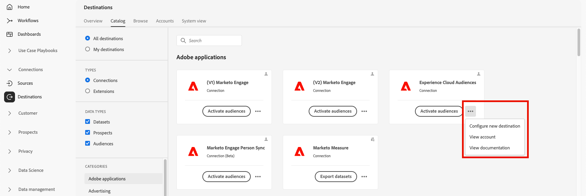

# Arbeitsbereich „Ziele“ {#destinations-workspace}

Wählen Sie in Adobe Experience Platform **[!UICONTROL Ziele]** über die linke Navigationsleiste, um auf die [!UICONTROL Ziele] Arbeitsbereich.

Die [!UICONTROL Ziele] Arbeitsbereich besteht aus fünf Bereichen, [!UICONTROL Übersicht], [!UICONTROL Katalog], [!UICONTROL Durchsuchen], [!UICONTROL Konten]und [!UICONTROL Systemansicht], wie in den folgenden Abschnitten beschrieben.

## [!UICONTROL Übersicht] {#overview}

Die **[!UICONTROL Übersicht]** angezeigt wird, [!UICONTROL Ziele] Dashboard, das wichtige Metriken zu den Zieldaten Ihres Unternehmens bereitstellt. Weitere Informationen finden Sie unter [[!UICONTROL Ziele] Dashboard-Handbuch](../../dashboards/guides/destinations.md).

>[!NOTE]
>
>Wenn Ihr Unternehmen neu bei Experience Platform ist und noch keine aktiven Ziele hat, wird die [!UICONTROL Ziele] Dashboard und [!UICONTROL Übersicht] nicht sichtbar sind. Wählen Sie stattdessen [!UICONTROL Ziele] über die linke Navigation zeigt die [[!UICONTROL Katalog] tab](#catalog).

## [!UICONTROL Katalog] {#catalog}

Die **[!UICONTROL Katalog]** zeigt eine Liste aller Ziele an, die in [!DNL Platform], an die Sie Daten senden können.

Die [!DNL Platform] Die Benutzeroberfläche bietet mehrere Such- und Filteroptionen auf der Zielkatalogseite:

* Verwenden Sie die Suchfunktion auf der Seite, um ein bestimmtes Ziel zu finden.
* Filtern von Zielen mithilfe des [!UICONTROL Kategorien] Kontrolle.
* Zwischen wechseln [!UICONTROL Alle Ziele] und [!UICONTROL Meine Ziele]. Wenn Sie **[!UICONTROL Alle Ziele]**, alle verfügbar [!DNL Platform] -Ziele angezeigt. Wenn Sie **[!UICONTROL Meine Ziele]**, können Sie nur die Ziele sehen, mit denen Sie eine Verbindung hergestellt haben.
* Zum Anzeigen auswählen **[!UICONTROL Verbindungen]** und/oder **[!UICONTROL Erweiterungen]**. Informationen zum Unterschied zwischen den beiden Kategorien finden Sie unter [Zieltypen und -kategorien](../destination-types.md).

Die Zielkarten enthalten entweder eine **[!UICONTROL Einrichten]** oder **[!UICONTROL Segmente aktivieren]** und ein sekundäres Steuerelement, das mehr Optionen anzeigt. Diese Steuerelemente werden nachfolgend beschrieben:

| Kontrolle | Beschreibung |
|---------|----------|
| [!UICONTROL Einrichten] | Ermöglicht die Erstellung einer Verbindung zum Ziel. |
| [!UICONTROL Aktivieren von Segmenten] | Nachdem Sie eine Verbindung zum Ziel hergestellt haben, können Sie Segmente aktivieren. |
| [!UICONTROL Konto anzeigen] | Zeigen Sie die Konten an, mit denen Sie eine Verbindung zu einem Ziel hergestellt haben. |
| [!UICONTROL Datenflüsse anzeigen] | Zeigen Sie die Datenaktivierungsflüsse an, die für ein Ziel vorhanden sind. |
| [!UICONTROL Dokumentation anzeigen] | Öffnet einen Link zur Dokumentationsseite für dieses spezifische Ziel, um weitere Informationen zu erhalten und Sie bei der Einrichtung zu unterstützen. |

{style=&quot;table-layout:auto&quot;}

Wählen Sie eine Zielkarte im Katalog aus, um die rechte Leiste zu öffnen. Hier können Sie eine Beschreibung des Ziels sehen. Die rechte Leiste bietet dieselben in der obigen Tabelle beschriebenen Steuerelemente, einschließlich einer Beschreibung des Zielorts und einer Angabe der Zielkategorie und des Zieltyps.

Weitere Informationen zu Zielkategorien und Informationen zu den einzelnen Zielen finden Sie in der [Zielkatalog](../catalog/overview.md) und [Zieltypen und Kategorien](../destination-types.md).

## [!UICONTROL Konten] {#accounts}

Die **[!UICONTROL Konten]** zeigt Details zu den Verbindungen an, die Sie mit verschiedenen Zielen hergestellt haben, und ermöglicht es Ihnen, vorhandene Verbindungsdetails zu aktualisieren. Siehe [Konten aktualisieren](update-accounts.md) für detaillierte Anweisungen.

## [!UICONTROL Durchsuchen] {#browse}

Auf der Registerkarte **[!UICONTROL Durchsuchen]** werden die Ziele angezeigt, mit denen Sie eine Verbindung hergestellt haben. Ziele mit der **[!UICONTROL Aktiviert/Deaktiviert]** Umschalten aktiviert: Setzen Sie das Ziel auf &quot;aktiv&quot;bzw. &quot;inaktiv&quot;. Sie können auch die Ziele anzeigen, an denen Daten fließen, indem Sie **[!UICONTROL Segmente]** > **[!UICONTROL Durchsuchen]** und wählen Sie ein zu prüfendes Segment aus. Die nachstehende Tabelle enthält alle Informationen, die für die einzelnen Ziele auf der Registerkarte „Durchsuchen“ verfügbar sind:

>[!TIP]
>
> * Wählen Sie die drei Punkte im [!UICONTROL Name] und verwenden Sie die **[!UICONTROL Segmente aktivieren ]**-Schaltfläche, um Segmente an dieses Ziel zu senden.
> * Wählen Sie die drei Punkte im [!UICONTROL Name] und verwenden Sie die **[!UICONTROL Löschen ]**Schaltfläche zu [remove](delete-destinations.md) eine bestehende Verbindung zu einem Ziel.
> * Wählen Sie die drei Punkte im [!UICONTROL Name] und verwenden Sie die **[!UICONTROL Überwachung ]**-Schaltfläche, um die Aktivierungsinformationen für dieses Ziel im [Monitoring-Dashboard](/help/dataflows/ui/monitor-destinations.md#monitoring-destinations-dashboard).

| Element | Beschreibung |
|---------|----------|
| Name | Der Name, den Sie für den Aktivierungsfluss zu diesem Ziel angegeben haben. Dieselbe Spalte enthält zwei Steuerelemente: [!UICONTROL Aktivieren ] und [!UICONTROL Ziel löschen]. |
| [!UICONTROL Status des letzten Flusslaufs] | Der Status des letzten Datenflusses. Siehe [Zieldetails anzeigen](destination-details-page.md) für weitere Informationen zu Datenfluss-Läufen. |
| [!UICONTROL Letztes Flusslaufdatum] | Zeit und Datum, an dem der letzte Datenfluss durchgeführt wurde. Siehe [Zieldetails anzeigen](destination-details-page.md) für weitere Informationen zu Datenfluss-Läufen. |
| [!UICONTROL Ziel] | Die Zielplattform, die Sie für Ihren Aktivierungsfluss ausgewählt haben. |
| [!UICONTROL Verbindungstyp] | Stellt den Verbindungstyp zu Ihrem Speicher-Bucket oder Ziel dar. <ul><li>Für E-Mail-Marketing-Ziele: Kann S3, FTP oder [!DNL Azure Blob].</li><li>Für Werbeziele in Echtzeit: Server-zu-Server.</li><li>Für Streaming-Ziele: Kann [!DNL Azure Event Hubs] oder [!DNL Amazon Kinesis].</li></ul> |
| [!UICONTROL Benutzername] | Die Kontoanmeldedaten, die Sie für den Zielfluss ausgewählt haben. |
| [!UICONTROL Aktivierungsdaten] | Gibt die Anzahl der Segmente an, die für dieses Ziel aktiviert werden. Wählen Sie dieses Steuerelement aus, um mehr über die aktivierten Segmente zu erfahren. Siehe [Aktivierungsdaten](/help/destinations/ui/destination-details-page.md#activation-data) auf der Zieldetailseite finden Sie weitere Informationen zu den aktivierten Segmenten. |
| [!UICONTROL Erstellt] | Datum und Uhrzeit (UTC) der Erstellung des Aktivierungsflusses zum Ziel. |
| [!UICONTROL Status] | `Active` oder `Inactive`. Gibt an, ob für dieses Ziel Daten aktiviert werden. |

Klicken Sie auf eine Zielzeile, um weitere Informationen zum Ziel in der rechten Leiste anzuzeigen.

Wählen Sie den Zielnamen aus, um Informationen zu den für dieses Ziel aktivierten Segmenten anzuzeigen. Klicken Sie auf **[!UICONTROL Aktivierung bearbeiten]**, um die Segmente, die an dieses Ziel gesendet werden, zu ändern oder hinzuzufügen.

## [!UICONTROL Systemansicht] {#system-view}

Die **[!UICONTROL Systemansicht]** zeigt eine grafische Darstellung der Aktivierungsflüsse an, die Sie in der Adobe Experience Platform eingerichtet haben.

Wählen Sie eines der Ziele aus, die auf der Seite angezeigt werden, und klicken Sie auf **[!UICONTROL Datenflüsse anzeigen]** um Informationen zu allen Verbindungen anzuzeigen, die Sie für jedes Ziel eingerichtet haben.

