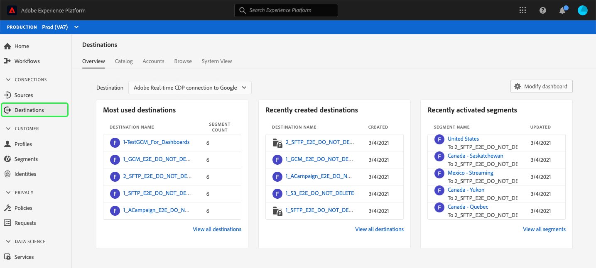

# Arbeitsbereich „Ziele“ {#destinations-workspace}

Wählen Sie in Adobe Experience Platform **[!UICONTROL Ziele]** aus der linken Navigationsleiste aus, um auf den Arbeitsbereich [!UICONTROL Ziele] zuzugreifen.

Der Arbeitsbereich [!UICONTROL Ziele] besteht aus fünf Bereichen: [!UICONTROL Übersicht], [!UICONTROL Katalog], [!UICONTROL Durchsuchen], [!UICONTROL Konten] und [!UICONTROL Systemansicht], wie in den folgenden Abschnitten beschrieben.

## [!UICONTROL Übersicht] {#overview}

Auf der Registerkarte **[!UICONTROL Übersicht]** wird das Dashboard [!UICONTROL Ziele] angezeigt, das wichtige Metriken zu den Zieldaten Ihres Unternehmens enthält. Weitere Informationen finden Sie im Dashboard-Handbuch [[!UICONTROL Ziele]](../../dashboards/guides/destinations.md).

>[!NOTE]
>
>Wenn Ihr Unternehmen neu in Experience Platform ist und noch keine aktiven Ziele hat, sind die Registerkarten [!UICONTROL Ziele] und [!UICONTROL Übersicht] nicht sichtbar. Wenn Sie stattdessen [!UICONTROL Ziele] aus der linken Navigation auswählen, wird die Registerkarte [[!UICONTROL Katalog] ](#catalog) angezeigt.

## [!UICONTROL Katalog] {#catalog}

Im Tab **[!UICONTROL Katalog]** wird eine Liste aller in [!DNL Platform] verfügbaren Ziele angezeigt, an die Sie Daten senden können.

Die Benutzeroberfläche [!DNL Platform] bietet mehrere Such- und Filteroptionen auf der Zielkatalogseite:

* Verwenden Sie die Suchfunktion auf der Seite, um ein bestimmtes Ziel zu finden.
* Filtern Sie Ziele mithilfe des Steuerelements [!UICONTROL Kategorien].
* Zwischen [!UICONTROL Alle Ziele] und [!UICONTROL Meine Ziele] wechseln. Wenn Sie **[!UICONTROL Alle Ziele]** auswählen, werden alle verfügbaren [!DNL Platform] Ziele angezeigt. Wenn Sie **[!UICONTROL Meine Ziele]** auswählen, können Sie nur die Ziele sehen, mit denen Sie eine Verbindung hergestellt haben.
* Wählen Sie diese Option, um **[!UICONTROL Verbindungen]** und/oder **[!UICONTROL Erweiterungen]** anzuzeigen. Informationen zum Unterschied zwischen den beiden Kategorien finden Sie unter [Zieltypen und -kategorien](../destination-types.md).

Die Zielkarten enthalten entweder ein **[!UICONTROL Configure]**- oder ein **[!UICONTROL Activate]**-Steuerelement und ein sekundäres Steuerelement, das weitere Optionen anzeigt. Diese Steuerelemente werden nachfolgend beschrieben:

| Kontrolle | Beschreibung |
|---------|----------|
| [!UICONTROL Konfigurieren von] | Ermöglicht die Erstellung einer Verbindung zum Ziel. |
| [!UICONTROL Aktivieren] | Nachdem Sie eine Verbindung zum Ziel hergestellt haben, können Sie Segmente aktivieren. |
| [!UICONTROL Konto anzeigen] | Zeigen Sie die Konten an, mit denen Sie eine Verbindung zu einem Ziel hergestellt haben. |
| [!UICONTROL Datenflüsse anzeigen] | Zeigen Sie die Datenaktivierungsflüsse an, die für ein Ziel vorhanden sind. |
| [!UICONTROL Dokumentation anzeigen] | Öffnet einen Link zur Dokumentationsseite für dieses spezifische Ziel, um weitere Informationen zu erhalten und Sie bei der Einrichtung zu unterstützen. |

{style=&quot;table-layout:auto&quot;}

Wählen Sie eine Zielkarte im Katalog aus, um die rechte Leiste zu öffnen. Hier können Sie eine Beschreibung des Ziels sehen. Die rechte Leiste bietet dieselben in der obigen Tabelle beschriebenen Steuerelemente, einschließlich einer Beschreibung des Zielorts und einer Angabe der Zielkategorie und des Zieltyps.

Weitere Informationen zu Zielkategorien und Informationen zu den einzelnen Zielen finden Sie unter [Zielkatalog](../catalog/overview.md) und [Zieltypen und Kategorien](../destination-types.md).

## [!UICONTROL Konten] {#accounts}

Der Tab **[!UICONTROL Konten]** zeigt Details zu den Verbindungen an, die Sie mit verschiedenen Zielen hergestellt haben, und ermöglicht es Ihnen, vorhandene Verbindungsdetails zu aktualisieren. Detaillierte Anweisungen finden Sie unter [Konten aktualisieren](update-accounts.md) .

## [!UICONTROL Durchsuchen] {#browse}

Auf der Registerkarte **[!UICONTROL Durchsuchen]** werden die Ziele angezeigt, mit denen Sie eine Verbindung hergestellt haben. Ziele, bei denen der Umschalter **[!UICONTROL Aktiviert/Deaktiviert]** aktiviert ist, legen das Ziel auf &quot;aktiv&quot;bzw. &quot;inaktiv&quot;fest. Sie können auch die Ziele anzeigen, an denen Daten fließen, indem Sie **[!UICONTROL Segmente]** > **[!UICONTROL Durchsuchen]** auswählen und ein zu prüfendes Segment auswählen. Die nachstehende Tabelle enthält alle Informationen, die für die einzelnen Ziele auf der Registerkarte „Durchsuchen“ verfügbar sind:

>[!TIP]
>
> * Verwenden Sie die Schaltfläche  in der Spalte **[!UICONTROL Name]**, um [Aktivieren](activate-destinations.md) weitere Segmente für dieses Ziel zu aktivieren.
> * Verwenden Sie die Schaltfläche  in der Spalte **[!UICONTROL Name]** , um [Löschen](delete-destinations.md) eine vorhandene Verbindung zu einem Ziel zu löschen.

| Element | Beschreibung |
|---------|----------|
| Name | Der Name, den Sie für den Aktivierungsfluss zu diesem Ziel angegeben haben. Dieselbe Spalte enthält zwei Steuerelemente: [!UICONTROL Aktivieren Sie ] und [!UICONTROL Löschen Sie das Ziel]. |
| [!UICONTROL Status des letzten Flusslaufs] | Der Status des letzten Datenflusses. Weitere Informationen zu Datenfluss-Läufen finden Sie unter [Zieldetails anzeigen](destination-details-page.md) . |
| [!UICONTROL Letztes Flusslaufdatum] | Zeit und Datum, an dem der letzte Datenfluss durchgeführt wurde. Weitere Informationen zu Datenfluss-Läufen finden Sie unter [Zieldetails anzeigen](destination-details-page.md) . |
| [!UICONTROL Ziel] | Die Zielplattform, die Sie für Ihren Aktivierungsfluss ausgewählt haben. |
| [!UICONTROL Verbindungstyp] | Stellt den Verbindungstyp zu Ihrem Speicher-Bucket oder Ziel dar. <ul><li>Für E-Mail-Marketing-Ziele: Kann S3, FTP oder [!DNL Azure Blob] sein.</li><li>Für Werbeziele in Echtzeit: Server-zu-Server.</li><li>Für Streaming-Ziele: Kann [!DNL Azure Event Hubs] oder [!DNL Amazon Kinesis] sein.</li></ul> |
| [!UICONTROL Benutzername] | Die Kontoanmeldedaten, die Sie für den Zielfluss ausgewählt haben. |
| [!UICONTROL Aktivierungsdaten] | Gibt die Anzahl der Segmente an, die für dieses Ziel aktiviert werden. Wählen Sie dieses Steuerelement aus, um mehr über die aktivierten Segmente zu erfahren. Weitere Informationen zu den aktivierten Segmenten finden Sie unter [Aktivierungsdaten](/help/destinations/ui/destination-details-page.md#activation-data) auf der Seite mit den Zieldetails . |
| [!UICONTROL Erstellt] | Datum und Uhrzeit (UTC) der Erstellung des Aktivierungsflusses zum Ziel. |
| [!UICONTROL Status] | `Active` oder `Inactive`. Gibt an, ob für dieses Ziel Daten aktiviert werden. Informationen zum Bearbeiten des Status finden Sie unter [Aktivierung deaktivieren](./activate-destinations.md#disable-activation). |

Klicken Sie auf eine Zielzeile, um weitere Informationen zum Ziel in der rechten Leiste anzuzeigen.

Wählen Sie den Zielnamen aus, um Informationen zu den für dieses Ziel aktivierten Segmenten anzuzeigen. Klicken Sie auf **[!UICONTROL Aktivierung bearbeiten]**, um die Segmente, die an dieses Ziel gesendet werden, zu ändern oder hinzuzufügen.

## [!UICONTROL Systemansicht] {#system-view}

Auf der Registerkarte **[!UICONTROL Systemansicht]** wird eine grafische Darstellung der Aktivierungsflüsse angezeigt, die Sie in der Adobe Experience Platform eingerichtet haben.

Wählen Sie eines der Ziele aus, die auf der Seite angezeigt werden, und klicken Sie auf **[!UICONTROL Fluss anzeigen]**, um Informationen zu allen Verbindungen anzuzeigen, die Sie für jedes Ziel eingerichtet haben.

