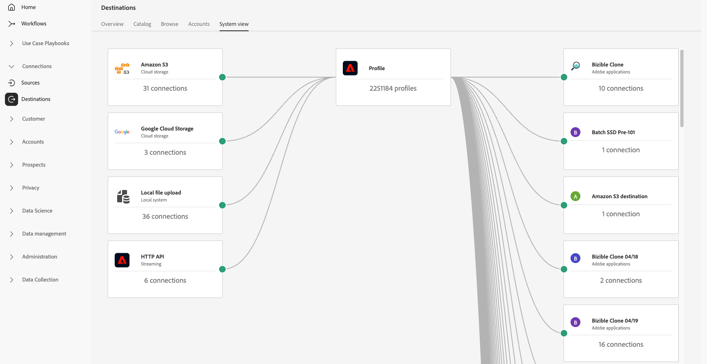

# Arbeitsbereich „Ziele“ {#destinations-workspace}

Wählen Sie in Adobe Experience Platform in der linken Navigationsleiste **[!UICONTROL Destinations]** aus, um auf den [!UICONTROL Destinations] Workspace zuzugreifen.

Der [!UICONTROL Destinations] Arbeitsbereich besteht aus fünf Abschnitten: [!UICONTROL Overview], [!UICONTROL Catalog], [!UICONTROL Browse], [!UICONTROL Accounts] und [!UICONTROL System View]. Diese werden in den folgenden Abschnitten beschrieben.

## [!UICONTROL Overview] {#overview}

Auf der Registerkarte **[!UICONTROL Overview]** wird das [!UICONTROL Destinations]-Dashboard angezeigt, das Schlüsselmetriken zu den Zieldaten Ihres Unternehmens bereitstellt. Weitere Informationen finden Sie im Handbuch zum [[!UICONTROL Destinations]-Dashboard](../../dashboards/guides/destinations.md).

>[!NOTE]
>
>Wenn Experience Platform neu in Ihrem Unternehmen ist und es noch keine aktiven Ziele hat, sind das [!UICONTROL Destinations]-Dashboard und [!UICONTROL Overview] Registerkarte nicht sichtbar. Wenn Sie [!UICONTROL Destinations] in der linken Navigation auswählen, wird stattdessen die Registerkarte [[!UICONTROL Catalog] angezeigt](#catalog).

## [!UICONTROL Catalog] {#catalog}

Auf der Registerkarte **[!UICONTROL Catalog]** wird eine Liste aller in [!DNL Experience Platform] verfügbaren Ziele angezeigt, an die Sie Daten senden können.

Die [!DNL Experience Platform]-Benutzeroberfläche bietet mehrere Such- und Filteroptionen auf der Zielkatalogseite:

* Verwenden Sie die Suchfunktion auf der Seite, um ein bestimmtes Ziel zu finden.
* Filtern Sie Ziele mithilfe des **[!UICONTROL Categories]**.
* Zwischen **[!UICONTROL All destinations]** und **[!UICONTROL My destinations]** umschalten. Wenn Sie **[!UICONTROL All destinations]** auswählen, werden alle verfügbaren [!DNL Experience Platform] angezeigt. Wenn Sie **[!UICONTROL My destinations]** auswählen, können Sie nur die Ziele sehen, mit denen Sie eine Verbindung hergestellt haben.
* Wählen Sie aus, um die **[!UICONTROL Connections]** und/oder **[!UICONTROL Extensions]** anzuzeigen. Um den Unterschied zwischen den beiden Kategorien zu verstehen, lesen Sie [Zieltypen und -kategorien](../destination-types.md).
* Filtern Sie die verfügbaren Ziele auf Grundlage ihres unterstützten [Datentyps](/help/destinations/destination-sdk/functionality/destination-configuration/audience-data-type.md). Wählen Sie zwischen Personen, Audiences, Konto-Audiences, Interessenten-Audiences oder Datensatz-Exporten.

Die Zielkarten enthalten primäre und sekundäre Steuerungsoptionen. Die primären Steuerelemente umfassen [!UICONTROL Set up], [!UICONTROL Activate], [!UICONTROL Activate audiences] oder [!UICONTROL Export datasets]. Die sekundären Steuerelemente ermöglichen die Anzeige von Optionen. Diese Einstellungen werden nachfolgend beschrieben:

| Kontrollvariante | Beschreibung |
|---------|----------|
| [!UICONTROL Set up] | Ermöglicht die Erstellung einer Verbindung zum Ziel. |
| [!UICONTROL Activate] | Nachdem Sie eine Verbindung zum Ziel hergestellt haben, können Sie Zielgruppen aktivieren oder Datensätze zu diesem Ziel exportieren. |
| [!UICONTROL Activate audiences] | Nachdem Sie eine Verbindung zum Ziel hergestellt haben, können Sie Zielgruppen für dieses Ziel aktivieren. |
| [!UICONTROL Export datasets] | Nachdem Sie eine Verbindung zum Ziel hergestellt haben, können Sie Datensätze zu diesem Ziel exportieren. |
| [!UICONTROL View account] | Zeigt die Konten an, mit denen Sie eine Verbindung zu einem Ziel hergestellt haben. |
| [!UICONTROL View dataflows] | Zeigt die Datenaktivierungsflüsse an, die für ein Ziel vorhanden sind. |
| [!UICONTROL View documentation] | Öffnet einen Link zur Dokumentationsseite für dieses spezifische Ziel, um weitere Informationen zu anzuzeigen und Sie bei der Einrichtung zu unterstützen. |

{style="table-layout:auto"}

Wählen Sie ein Ziel im Katalog aus, um die rechte Leiste zu öffnen. Hier können Sie eine Beschreibung des Ziels sehen. Die rechte Leiste bietet dieselben in der obigen Tabelle beschriebenen Steuerelemente, einschließlich einer Beschreibung des Zielorts und einer Angabe der Zielkategorie und des Zieltyps.

Weitere Informationen zu Zielkategorien und Informationen zu den einzelnen Zielen finden Sie im [Zielkatalog](../catalog/overview.md) und unter [Zieltypen und -kategorien](../destination-types.md).

## [!UICONTROL Browse] {#browse}

>[!NOTE]
>
>Aufgrund der Konfigurationen von Zugriffsbeschriftungen können Ziel-Datenflüsse, auf die ein Benutzer keinen Zugriff hat, in der Benutzeroberfläche ausgegraut angezeigt werden. Weitere Informationen finden Sie in [&#x200B; Dokumentation unter „Verwenden von Zugriffsbeschriftungen zur Verwaltung des Benutzerzugriffs &#x200B;](../../access-control/abac/apply-access-labels-destinations.md#important-callouts-and-items-to-know) Zieldatenflüsse“.

Auf der Registerkarte **[!UICONTROL Browse]** werden die Ziele angezeigt, mit denen Sie eine Verbindung hergestellt haben.

>[!TIP]
>
> Beginnen Sie mit der [Suchleiste](#search-browse), um bestimmte Datenflüsse zu finden, und verwenden Sie dann die [Seitenleistenfilter](#filter-options-browse), um Ihre Ergebnisse weiter einzugrenzen.

Bei Zielen, für die der Umschalter **[!UICONTROL Enabled/Disabled]** aktiviert ist, wird das Ziel auf **[!UICONTROL Enabled]** bzw. **[!UICONTROL Disabled]** festgelegt. Sie können auch die Ziele anzeigen, bei denen Daten fließen, indem Sie auf **[!UICONTROL Audiences]** > **[!UICONTROL Browse]** klicken und eine zu überprüfende Audience auswählen.

>[!TIP]
>
> 
> 
> * Klicken Sie auf die Auslassungszeichen (`...`) in der Spalte [!UICONTROL Name] und verwenden Sie das Steuerelement  **[!UICONTROL Activate audiences]**, um Zielgruppen oder Datensätze in dieses Ziel zu exportieren.
> * Klicken Sie auf die Auslassungszeichen (`...`) in der Spalte [!UICONTROL Name] und verwenden Sie das Steuerelement **[!UICONTROL Edit destination]**&#x200B;zum Bearbeiten vorhandener Zielverbindungen. Lesen Sie das Tutorial [Bearbeiten von Zielen](/help/destinations/ui/edit-destination.md) für weitere Informationen.
> * Klicken Sie auf die Auslassungszeichen (`...`) in der Spalte [!UICONTROL Name] und verwenden Sie das Steuerelement  **[!UICONTROL Edit marketing actions]**, um [die Marketing-Aktionen zu ändern](/help/destinations/ui/edit-activation.md#edit-marketing-actions) für das ausgewählte Ziel.
> * Klicken Sie auf die Auslassungszeichen (`...`) in der Spalte [!UICONTROL Name] und verwenden Sie das Steuerelement  **[!UICONTROL Delete]**, um eine bestehende Verbindung zu einem Ziel [&#x200B; &#x200B;](delete-destinations.md) entfernen.
> * Klicken Sie auf die Auslassungszeichen (`...`) in der Spalte [!UICONTROL Name] und verwenden Sie das Steuerelement  **[!UICONTROL View in monitoring]**, um Aktivierungsinformationen für dieses Ziel im [Monitoring-Dashboard](/help/dataflows/ui/monitor-destinations.md#monitoring-destinations-dashboard) anzuzeigen.
> * Klicken Sie auf die Auslassungszeichen (`...`) in der Spalte [!UICONTROL Name] und verwenden Sie das Steuerelement  **[!UICONTROL Subscribe to alerts]**, um Ziel-Datenfluss-Warnhinweise zu abonnieren. Sie können Warnhinweise abonnieren, um Nachrichten zum Status, Erfolg oder Misserfolg Ihres Datenflusses zu erhalten. Detaillierte [&#x200B; zu Ziel-Datenfluss-Warnhinweisen finden &#x200B;](alerts.md) unter Abonnieren von kontextabhängigen Ziel-Warnhinweisen .
> * Klicken Sie auf die Auslassungszeichen (`...`) in der Spalte [!UICONTROL Name] und verwenden Sie das Tags verwalten **[!UICONTROL Manage tags]**, um Tags zu einem Ziel hinzuzufügen oder daraus zu entfernen. Ausführliche Informationen zur Verwendung von Tags finden [&#x200B; im Abschnitt &#x200B;](#manage-tags)Verwalten von Ziel-Tags“.

Die nachstehende Tabelle enthält alle Informationen, die für die einzelnen Ziele auf der Registerkarte [!UICONTROL Browse] bereitgestellt werden.

| Element | Beschreibung |
|---------|----------|
| Name | Der Name, den Sie für den Aktivierungsfluss zu diesem Ziel angegeben haben. |
| Datentyp | Der von der Zielverbindung unterstützte Datentyp. Unterstützte Datentypen: <ul><li>**[!UICONTROL Customers]**</li><li>**[!UICONTROL Prospects]**</li><li>**[!UICONTROL Accounts]**</li><li>**[!UICONTROL Datasets]**</li></ul> |
| [!UICONTROL Last Dataflow Run Status] | Der Status der letzten Datenflussausführung. Weitere Informationen zur Ausführung von Datenflüssen finden Sie unter [Anzeigen von Zieldetails](destination-details-page.md). |
| [!UICONTROL Last Dataflow Run Date] | Zeit und Datum, an dem der letzte Datenfluss ausgeführt wurde. Wählen Sie die Spaltenüberschrift aus, um auf die Sortieroptionen zuzugreifen (**[!UICONTROL Sort Ascending]**, **[!UICONTROL Sort Descending]**). Weitere Informationen zur Ausführung von Datenflüssen finden Sie unter [Anzeigen von Zieldetails](destination-details-page.md). |
| [!UICONTROL Destination] | Die Zielplattform, die Sie für Ihren Aktivierungsfluss ausgewählt haben. |
| [!UICONTROL Account Expiration Date] | Das Datum, an dem die Verbindungsautorisierung zu diesem Ziel abläuft.   Ein Warnsymbol  wird vor dem Ablaufdatum angezeigt, um Sie darauf hinzuweisen, dass die Verbindung abläuft und möglicherweise erneuert werden muss. Datenflüsse zu abgelaufenen Verbindungen werden angehalten und Sie müssen sich erneut authentifizieren, um Ihre Aktivierungs-Workflows fortzusetzen.  **Wichtig**: Diese Spalte ist derzeit nur für die Verbindungen [Pinterest](../catalog/advertising/pinterest.md), [LinkedIn](../catalog/social/linkedin.md) und [LinkedIn Matched Audiences](../catalog/social/linkedin-b2b.md) verfügbar.   {width="100" zoomable="yes" alt="Screenshot showing the account expiration warning icon and expiration date in the Browse tab."} |
| [!UICONTROL Username] | Die Kontoanmeldedaten, die Sie für den Zielfluss ausgewählt haben. |
| [!UICONTROL Activation Data] | Gibt die Anzahl der Zielgruppen an, die für dieses Ziel aktiviert werden. Wählen Sie dieses Steuerelement aus, um mehr über die aktivierten Zielgruppen zu erfahren. Weitere Informationen zu [&#x200B; aktivierten Zielgruppen finden &#x200B;](/help/destinations/ui/destination-details-page.md#activation-data) auf der Zieldetailseite unter „Aktivierungsdaten“. |
| [!UICONTROL Created] | Datum und Uhrzeit der Erstellung des Aktivierungsflusses zum Ziel. Klicken Sie auf das Symbol mit dem Pfeil nach oben/unten, um nach den neuesten oder ältesten Aktivierungsflüssen zu sortieren. |
| [!UICONTROL Modified] | Datum und Uhrzeit der letzten Änderung des Aktivierungsflusses zum Ziel. |
| [!UICONTROL Status] | `Enabled` oder `Disabled`. Gibt an, ob für dieses Ziel Daten aktiviert sind. |
| [!UICONTROL Access labels] | Zeigt alle Zugriffsbeschriftungen an, die diesem Ziel-Datenfluss hinzugefügt wurden. Weitere Informationen [Anwenden von Zugriffskennzeichnungen auf Ziel-Datenflüsse](/help/access-control/abac/apply-access-labels-destinations.md). |
| [!UICONTROL Tags] | Zeigt alle Tags an, die diesem Ziel-Datenfluss hinzugefügt wurden. Verwenden Sie Tags, um Ihre Datenflüsse zu organisieren und zu kategorisieren, um die Verwaltung zu erleichtern. |

Klicken Sie auf eine Zielzeile, um weitere Informationen zum Ziel in der rechten Leiste aufzurufen, z. B. Ziel-ID, Beschreibung, Anzahl der aktivierten Zielgruppen und mehr.

Wählen Sie den Zielnamen aus, um Informationen über die für dieses Ziel aktivierten Zielgruppen anzuzeigen. Klicken Sie auf **[!UICONTROL Edit destination]** [Zieleinstellungen ändern](/help/destinations/ui/edit-destination.md) oder **[!UICONTROL Activate audiences]**, um dem Datenfluss neue Zielgruppen hinzuzufügen.

### Filtern von Datenflüssen in der Registerkarte Durchsuchen {#filter-browse}

Die Registerkarte **[!UICONTROL Browse]** enthält erweiterte Filter- und Suchfunktionen, mit denen Sie Ihre Ziel-Datenflüsse schnell finden und verwalten können. Verwenden Sie die linke Seitenleiste, um Filter anzuwenden, und die Suchleiste, um bestimmte Datenflüsse anhand des Namens zu finden.

### Suchfunktion {#search-browse}

Verwenden Sie die Suchleiste oben in der Tabelle, um Datenflüsse schnell nach Namen zu finden. Während der Eingabe werden die Ergebnisse automatisch so gefiltert, dass nur übereinstimmende Datenflüsse angezeigt werden.

### Filteroptionen {#filter-options-browse}

Verwenden Sie die Filter in der linken Seitenleiste, um die Suche einzugrenzen.

* **[!UICONTROL Destination platform]**: Filtern von Datenflüssen nach bestimmten Zielplattformen (z. B. [!DNL Amazon S3], [!DNL Facebook Custom Audience], [!DNL LinkedIn Matched Audience] usw.). Sie können mehrere Plattformen gleichzeitig auswählen.
* **[!UICONTROL Has any tag]**: Filtern von Datenflüssen, denen bestimmte Tags zugewiesen sind. Auf diese Weise können Sie Datenflüsse basierend auf Ihren benutzerdefinierten Tags organisieren und finden.
* **[!UICONTROL Status]**: Filtern von Datenflüssen nach ihrem Betriebsstatus:
   * **[!UICONTROL Enabled]**: Zeigt nur aktive Datenflüsse an
   * **[!UICONTROL Disabled]**: Zeigt nur inaktive Datenflüsse an
* **[!UICONTROL Account name]**: Filtern von Datenflüssen nach dem zugehörigen Kontonamen. Auf diese Weise können Sie alle Datenflüsse finden, die mit einem bestimmten Zielkonto verbunden sind.
* **[!UICONTROL Created]**: Filtern Sie Datenflüsse nach dem Benutzer, der sie erstellt hat. Verwenden Sie diesen Filter, um Datenflüsse zu finden, die von bestimmten Team-Mitgliedern erstellt wurden.
* **[!UICONTROL Modified by]**: Filtern von Datenflüssen nach dem Benutzer, der sie zuletzt geändert hat. Verwenden Sie diesen Filter, um die letzten Änderungen zu identifizieren, die von bestimmten Benutzern vorgenommen wurden.
* **[!UICONTROL Creation date]**: Filtern von Datenflüssen nach ihrem Erstellungsdatum mithilfe eines Datumsbereichs:
   * **[!UICONTROL Start date]**: Beginn des Datumsbereichs festlegen
   * **[!UICONTROL End date]**: Das Ende des Datumsbereichs festlegen
* **[!UICONTROL Modified date]**: Filtern von Datenflüssen nach dem Änderungsdatum mithilfe eines Datumsbereichs:
   * **[!UICONTROL Start date]**: Beginn des Datumsbereichs festlegen
   * **[!UICONTROL End date]**: Das Ende des Datumsbereichs festlegen

### Aktive Filter {#active-filters-browse}

Wenn Sie Filter anwenden, werden sie als Tags unter der Suchleiste angezeigt.

Dort haben Sie folgende Möglichkeiten:

* Alle derzeit aktiven Filter anzeigen
* Entfernen Sie einzelne Filter, indem Sie auf das Symbol `X` jedes Filter-Tags klicken
* Alle Filter gleichzeitig mit der Option **[!UICONTROL Clear all]** löschen

### Verwalten von Ziel-Tags {#manage-tags}

Mit Tags können Sie Ihre Ziel-Datenflüsse organisieren und kategorisieren, um die Verwaltung zu erleichtern. Sie können Tags zu einzelnen Datenflüssen hinzufügen und daraus entfernen, um sie entsprechend Ihren Geschäftsanforderungen zu gruppieren.

Um ein Tag zu einem Datenfluss hinzuzufügen, wählen Sie die Auslassungszeichen (`...`) in der Spalte **[!UICONTROL Name]** und dann **[!UICONTROL Manage tags]** aus dem Kontextmenü aus.
Geben Sie den Namen eines neuen Tags in das Feld **[!UICONTROL Tags]** ein und wählen Sie **[!UICONTROL Save]** aus, um Ihre Änderungen anzuwenden.

Um ein Tag aus einem Datenfluss zu entfernen, klicken Sie auf das Auslassungszeichen (`...`) in der Spalte **[!UICONTROL Name]** und wählen Sie im Kontextmenü die Option **[!UICONTROL Manage tags]** aus. Wählen Sie dann für das Tag, das Sie entfernen möchten, das Symbol `X` aus.

### Best Practices für das Tagging {#tag-best-practices}

Stellen Sie sicher, dass Ihre Ziel-Datenflüsse organisiert, leicht zu finden und verwaltbar bleiben, indem Sie die folgenden Tagging-Richtlinien befolgen.

* **Beschreibende Namen verwenden**: Erstellen Sie Tags, die den Zweck oder die Kategorie des Datenflusses klar angeben (z. B. „Marketing-Kampagnen“, „Kundenbindung“, „Saisonale Werbeaktionen„).
* **Konsistent sein**: Verwenden Sie eine konsistente Namenskonvention in Ihrer gesamten Organisation
* **Einfach halten**: Vermeiden Sie es, zu viele Tags zu erstellen, da dies die Filterung weniger effektiv machen kann
* **Verwenden hierarchischer Tags**: Erwägen Sie die Verwendung von Präfixen zum Gruppieren verwandter Tags (z. B. „Campaign-Q4“, „Campaign-Q1„)

## [!UICONTROL Accounts] {#accounts}

Die Registerkarte **[!UICONTROL Accounts]** zeigt Details zu den Verbindungen an, die Sie mit verschiedenen Zielen hergestellt haben, und ermöglicht es Ihnen, vorhandene Kontodetails zu aktualisieren oder zu löschen. In der nachstehenden Tabelle sehen Sie alle Informationen, die Sie über jedes Zielkonto erhalten können.

>[!TIP]
>
> * Klicken Sie auf die Auslassungszeichen (`...`) in der Spalte [!UICONTROL Platform] und verwenden Sie das Steuerelement **[!UICONTROL Activate]**/**[!UICONTROL Activate audiences]**/**[!UICONTROL Export datasets]**, um Zielgruppen oder Datensätze in dieses Ziel zu exportieren.
> * Klicken Sie auf die Auslassungszeichen (`...`) in der Spalte [!UICONTROL Platform] und verwenden Sie das Steuerelement **[!UICONTROL Edit details]**, um [&#x200B; Details eines vorhandenen &#x200B;](update-accounts.md) zu aktualisieren.
> * Klicken Sie auf die Auslassungszeichen (`...`) in der Spalte [!UICONTROL Platform] und verwenden Sie das Steuerelement **[!UICONTROL Delete]**, um [&#x200B; vorhandenes &#x200B;](delete-destination-account.md) zu löschen.

| Element | Beschreibung |
|---|---|
| [!UICONTROL Name] | Der Name, den Sie dem Zielkonto beim [&#x200B; des Ziels &#x200B;](connect-destination.md#authenticate) haben. Wählen Sie die Spaltenüberschrift aus, um auf die Sortieroptionen zuzugreifen (**[!UICONTROL Sort Ascending]**, **[!UICONTROL Sort Descending]**). |
| [!UICONTROL Destination] | Der Ziel-Connector, für den Sie die Verbindung eingerichtet haben. |
| [!UICONTROL Connection Type] | Gibt den Kontoverbindungstyp zu Ihrem Speicher-Behälter oder Ziel an. Je nach Ziel stehen folgende Authentifizierungsoptionen zur Verfügung: <ul><li>Bei E-Mail-Marketing-Zielen: S3, FTP oder Azure Blob.</li><li>Bei Echtzeit-Werbezielen: Server-zu-Server.</li><li>Bei Amazon S3-Cloud-Speicherzielen: Zugriffsschlüssel. </li><li>Bei SFTP-Cloud-Speicherzielen: Grundlegende Authentifizierung für SFTP.</li><li>OAuth 1- oder OAuth 2-Authentifizierung</li><li>Authentifizierung über Bearer-Token</li></ul> |
| [!UICONTROL Username] | Der Benutzername, den Sie im Workflow [Ziel verbinden“ ausgewählt &#x200B;](../catalog/email-marketing/overview.md#connect-destination). |
| [!UICONTROL Connections] | Gibt die Zahl der eindeutigen erfolgreich verbundenen Ziel-Datenflüsse an, die für ein Ziel erstellt wurden, zusammen mit grundlegenden Informationen. |
| [!UICONTROL Authorization date] | Das Datum, an dem die Verbindung zu diesem Ziel genehmigt wurde. |
| [!UICONTROL Expiration date] | Das Datum, an dem die Verbindungsautorisierung zu diesem Ziel abläuft.   Ein Warnsymbol  wird vor dem Ablaufdatum angezeigt, um Sie darauf hinzuweisen, dass die Verbindung abläuft und möglicherweise erneuert werden muss. Datenflüsse zu abgelaufenen Verbindungen werden angehalten und Sie müssen sich erneut authentifizieren, um Ihre Aktivierungs-Workflows fortzusetzen.  **Wichtig**: Diese Spalte ist derzeit nur für die Verbindungen [Pinterest](../catalog/advertising/pinterest.md), [LinkedIn](../catalog/social/linkedin.md) und [LinkedIn Matched Audiences](../catalog/social/linkedin-b2b.md) verfügbar.   {width="100" zoomable="yes"} |

{style="table-layout:auto"}

### Konten filtern {#filter-accounts}

Die Registerkarte **[!UICONTROL Accounts]** enthält erweiterte Filter- und Suchfunktionen, mit denen Sie Ihre Zielkonten schnell finden und verwalten können. Verwenden Sie die linke Seitenleiste, um Filter anzuwenden, und die Suchleiste, um bestimmte Konten nach Namen zu finden.

#### Nach Konten suchen {#search-accounts}

Verwenden Sie die Suchleiste oben in der Tabelle, um Konten schnell nach Namen zu finden. Während der Eingabe werden die Ergebnisse automatisch so gefiltert, dass nur übereinstimmende Konten angezeigt werden.

#### Filteroptionen {#filter-options-accounts}

Verwenden Sie die Filter in der linken Seitenleiste, um die Suche einzugrenzen.

* **[!UICONTROL Destination platform]**: Filtern von Konten nach bestimmten Zielplattformen (z. B.: [!DNL Microsoft Bing], [!DNL Amazon S3], [!DNL Facebook Custom Audiences], [!DNL LinkedIn Matched Audiences] usw.). Sie können mehrere Plattformen gleichzeitig auswählen.
* **[!UICONTROL Created by]**: Filtern Sie Konten nach dem Benutzer, der sie erstellt hat. Verwenden Sie diesen Filter, um Konten zu finden, die von bestimmten Team-Mitgliedern erstellt wurden.

#### Aktive Filter {#active-filters-accounts}

Wenn Sie Filter anwenden, werden sie als Tags unter der Suchleiste angezeigt.

Dort haben Sie folgende Möglichkeiten:

* Alle derzeit aktiven Filter anzeigen
* Entfernen Sie einzelne Filter, indem Sie auf das Symbol `X` jedes Filter-Tags klicken
* Alle Filter gleichzeitig mit der Option **[!UICONTROL Clear all]** löschen

## [!UICONTROL System View] {#system-view}

Auf der Registerkarte **[!UICONTROL System View]** wird eine grafische Darstellung der Aktivierungsflüsse angezeigt, die Sie in Adobe Experience Platform eingerichtet haben.

Wählen Sie eines der Ziele aus, die auf der Seite angezeigt werden, und klicken Sie auf **[!UICONTROL View dataflows]** , um Informationen über alle Verbindungen anzuzeigen, die Sie für die einzelnen Ziele eingerichtet haben.

