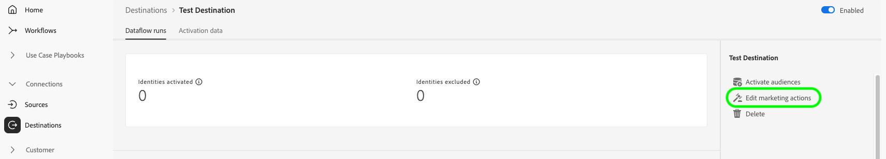
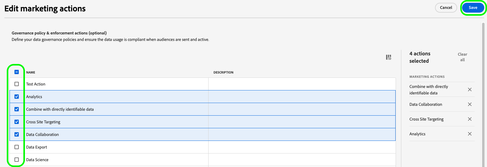

# Bearbeiten von Aktivierungsdatenflüssen {#edit-activation-flows}

In Adobe Experience Platform können Sie verschiedene Komponenten vorhandener Aktivierungsdatenflüsse für Ziele konfigurieren, z. B.:

* [Aktivieren oder Deaktivieren](#enable-disable-dataflows) von Aktivierungsdatenflüssen
* [Hinzufügen zusätzlicher Zielgruppen](#add-audiences) zu Aktivierungsdatenflüssen
* [Zugeordnete Attribute und Identitäten bearbeiten](#edit-mapped-attributes)
* [Bearbeiten des Aktivierungsplans und der Exporthäufigkeit](#edit-schedule-frequency)
* [Hinzufügen zusätzlicher Datensätze](#add-datasets) zum Aktivierungs-Workflow
* [Marketing-Aktionen bearbeiten](#edit-marketing-actions) für Ihre Aktivierungsdatenflüsse
* [Zugriffskennzeichnungen anwenden](#apply-access-labels) auf exportierte Daten
* [Namen und Beschreibungen ](#edit-names-descriptions) Aktivierungsdatenflüsse bearbeiten)

## Durchsuchen von Aktivierungsdatenflüssen {#browse-activation-dataflows}

Gehen Sie wie folgt vor, um Ihre vorhandenen Aktivierungsdatenflüsse zu durchsuchen und den Datenfluss zu identifizieren, den Sie bearbeiten möchten.

1. Melden Sie sich bei der Benutzeroberfläche von [Experience Platform ](https://platform.adobe.com/) und wählen Sie **[!UICONTROL Destinations]** über die linke Navigationsleiste aus. Wählen Sie **[!UICONTROL Browse]** in der oberen Kopfzeile aus, um Ihre vorhandenen Ziel-Datenflüsse anzuzeigen.

   

2. Wählen Sie das Symbol  oben links, um das Sortier-Bedienfeld zu öffnen. Das Sortier-Bedienfeld bietet eine Liste aller Ihrer Ziele. Sie können mehr als ein Ziel aus der Liste auswählen, um eine gefilterte Auswahl von Datenflüssen anzuzeigen, die mit dem ausgewählten Ziel verknüpft sind.

   

3. Wählen Sie den Namen des Ziel-Datenflusses aus, den Sie bearbeiten möchten.

   

4. Die **[!UICONTROL Dataflow runs]** für das Ziel wird mit den verfügbaren Steuerelementen angezeigt. Je nach Zieltyp können Sie verschiedene Datenflussvorgänge ausführen. Siehe die nächsten Abschnitte für jede unterstützte Datenflussoperation.

## Aktivieren oder Deaktivieren von Aktivierungsdatenflüssen {#enable-disable-dataflows}

Verwenden Sie den Umschalter **[!UICONTROL Enabled]/[!UICONTROL Disabled]** , um alle Datenexporte an das Ziel zu starten oder anzuhalten.

## Hinzufügen von Zielgruppen zu einem Aktivierungsdatenfluss {#add-audiences}

Wählen Sie **[!UICONTROL Activate audiences]** in der rechten Leiste aus, um zu ändern, welche Zielgruppen an das Ziel gesendet werden sollen. Diese Aktion führt Sie zum Aktivierungs-Workflow.

Im **[!UICONTROL Select audiences]** Schritt des Aktivierungs-Workflows können Sie vorhandene Zielgruppen entfernen oder neue Zielgruppen zum Aktivierungs-Workflow hinzufügen.

Der Aktivierungs-Workflow unterscheidet sich je nach Zieltyp geringfügig. Weitere Informationen zu den Aktivierungs-Workflows für die einzelnen Zieltypen finden Sie in den folgenden Handbüchern:

* [Aktivieren von Zielgruppen für Streaming](./activate-segment-streaming-destinations.md)Ziele (z. B. Facebook oder Twitter);
* [Aktivieren von Zielgruppen für Batch-Profil-](./activate-batch-profile-destinations.md) (z. B. Amazon S3 oder Oracle Eloqua);
* [Aktivieren von Zielgruppen für Exportziele von Streaming-Profilen](./activate-streaming-profile-destinations.md) (z. B. HTTP-API oder Amazon Kinesis).

## Bearbeiten des Aktivierungsplans und der Exporthäufigkeit {#edit-schedule-frequency}

Wählen Sie **[!UICONTROL Activate audiences]** in der rechten Leiste aus. Diese Aktion führt Sie zum Aktivierungs-Workflow.

Wählen Sie den **[!UICONTROL Scheduling]** Schritt im Aktivierungs-Workflow aus, um den Aktivierungsplan zu bearbeiten und die Häufigkeit für den Datenfluss zu exportieren. In diesem Schritt können Sie konfigurieren, wie oft Daten an das Ziel exportiert werden.

Im **[!UICONTROL Scheduling]** Schritt des Aktivierungs-Workflows haben Sie folgende Möglichkeiten:

* Anpassen der Exportfrequenz.
* Festlegen oder Ändern des Start- und Enddatums für den Aktivierungsdatenfluss und mehr.

Die Planungsvorgänge, die Sie ausführen können, variieren geringfügig je nach Zieltyp. Weitere Informationen zu den Aktivierungs-Workflows für die einzelnen Zieltypen finden Sie in den folgenden Handbüchern:

* [Aktivieren von Zielgruppen für Streaming](./activate-segment-streaming-destinations.md)Ziele (z. B. Facebook oder Twitter);
* [Aktivieren von Zielgruppen für Batch-Profil-](./activate-batch-profile-destinations.md) (z. B. Amazon S3 oder Oracle Eloqua);
* [Aktivieren von Zielgruppen für Exportziele von Streaming-Profilen](./activate-streaming-profile-destinations.md) (z. B. HTTP-API oder Amazon Kinesis).

## Zugeordnete Attribute und Identitäten bearbeiten {#edit-mapped-attributes}

Wählen Sie **[!UICONTROL Activate audiences]** in der rechten Leiste aus. Diese Aktion führt Sie zum Aktivierungs-Workflow.

Wählen Sie den **[!UICONTROL Mapping]** Schritt im Aktivierungs-Workflow aus, um die zugeordneten Attribute und Identitäten für Ihren Aktivierungsdatenfluss zu bearbeiten. Auf diese Weise können Sie anpassen, welche Profilattribute und Identitäten an das Ziel exportiert werden sollen.

Im **[!UICONTROL Mapping]** Schritt des Aktivierungs-Workflows haben Sie folgende Möglichkeiten:

* Hinzufügen neuer Attribute oder Identitäten zur Zuordnung.
* Entfernen vorhandener Attribute oder Identitäten aus der Zuordnung.
* Passen Sie die Reihenfolge der Zuordnungen an, um die Spaltenreihenfolge in exportierten Dateien zu definieren.

Der Aktivierungs-Workflow unterscheidet sich je nach Zieltyp geringfügig. Weitere Informationen zu den Aktivierungs-Workflows für die einzelnen Zieltypen finden Sie in den folgenden Handbüchern:

* [Aktivieren von Zielgruppen für Streaming](./activate-segment-streaming-destinations.md)Ziele (z. B. Facebook oder Twitter);
* [Aktivieren von Zielgruppen für Batch-Profil-](./activate-batch-profile-destinations.md) (z. B. Amazon S3 oder Oracle Eloqua);
* [Aktivieren von Zielgruppen für Exportziele von Streaming-Profilen](./activate-streaming-profile-destinations.md) (z. B. HTTP-API oder Amazon Kinesis).

## Hinzufügen von Datensätzen zu einem Aktivierungsdatenfluss {#add-datasets}

Wählen Sie **[!UICONTROL Export datasets]** in der rechten Leiste aus, um zusätzliche Datensätze auszuwählen, die an Ihr Ziel exportiert werden sollen. Diese Option führt Sie zum [Workflow für den Datensatzexport](export-datasets.md).

>[!NOTE]
>
>Diese Option ist nur für (Ziele[ die den Datensatzexport unterstützen](export-datasets.md#supported-destinations) sichtbar.

## [!BADGE Beta]{type=Informative} Marketing-Aktionen bearbeiten {#edit-marketing-actions}

>[!NOTE]
>
>Diese Funktion befindet sich derzeit in der **Betaversion**. Wenden Sie sich an Ihren Adobe-Support-Mitarbeiter, um Zugriff zu erhalten.

Sie können Marketing-Aktionen hinzufügen oder entfernen, die Sie beim erstmaligen Herstellen einer Verbindung mit dem Ziel eingerichtet haben.

Wählen Sie **[!UICONTROL Edit marketing actions]** in der rechten Leiste aus, um den Auswahlbildschirm für Marketing-Aktionen zu öffnen.

Wählen Sie die entsprechenden Marketing-Aktionen aus und klicken Sie dann auf **[!UICONTROL Save]** , um die Änderungen anzuwenden.

## Anwenden von Zugriffs-Labels {#apply-access-labels}

Wählen Sie **[!UICONTROL Apply access labels]** aus, um die Datennutzungsbeschriftungen für die exportierten Daten zu bearbeiten. Weitere Informationen finden [ in der Dokumentation ](../../data-governance/labels/overview.md) Datennutzungskennzeichnungen .

## Namen und Beschreibungen von Aktivierungsdatenflüssen bearbeiten {#edit-names-descriptions}

Um den Namen und die Beschreibung des Aktivierungsdatenflusses zu bearbeiten, verwenden Sie die Felder **[!UICONTROL Destination name]** und **[!UICONTROL Description]** .

## Nächste Schritte {#next-steps}

In diesem Tutorial haben Sie den **[!UICONTROL destinations]**-Arbeitsbereich erfolgreich verwendet, um vorhandene Ziel-Datenflüsse zu aktualisieren.

Weitere Informationen zu Zielen finden Sie unter [Ziele - Übersicht](../catalog/overview.md).
