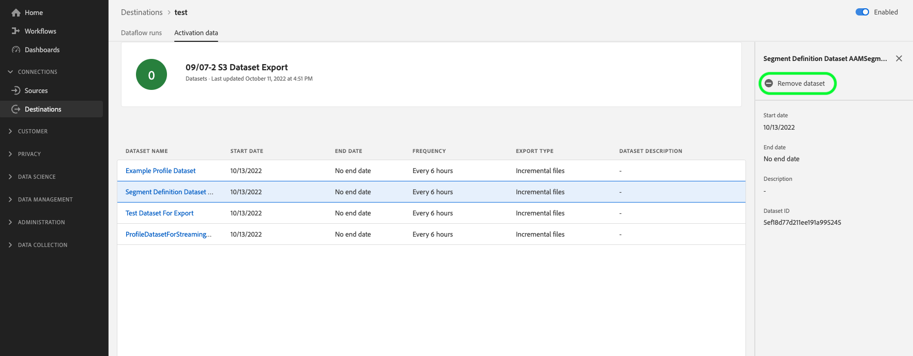

# (Beta) Exportieren von Datensätzen in Cloud-Speicher-Ziele

>[!IMPORTANT]
>
>* Die Funktion zum Exportieren von Datensätzen ist derzeit als Beta-Version verfügbar und steht nicht allen Benutzern zur Verfügung. Die Dokumentation und Funktionalität können sich ändern.
>* Diese Beta-Funktion unterstützt den Export von Daten der ersten Generation, wie in der Real-time Customer Data Platform definiert [Produktbeschreibung](https://helpx.adobe.com/legal/product-descriptions/real-time-customer-data-platform-b2c-edition-prime-and-ultimate-packages.html).
>* Diese Funktion steht Kunden zur Verfügung, die das Real-Time CDP Prime- und Ultimate-Package erworben haben. Wenden Sie sich für weitere Informationen an Ihren Kundenbetreuer.

In diesem Artikel wird der Workflow erläutert, der zum Exportieren erforderlich ist [Datensätze](/help/catalog/datasets/overview.md) von Adobe Experience Platform zu Ihrem bevorzugten Cloud-Speicher, z. B. [!DNL Amazon S3], SFTP-Speicherorten oder [!DNL Google Cloud Storage].

## Wann Segmente aktiviert oder Datensätze exportiert werden {#when-to-activate-segments-or-activate-datasets}

Einige dateibasierte Ziele im Experience Platform-Katalog unterstützen sowohl die Segmentaktivierung als auch den Datensatzexport.

* Erwägen Sie die Aktivierung von Segmenten , wenn Ihre Daten in Profile strukturiert sein sollen, die nach Zielgruppeninteressen oder Qualifikationen gruppiert sind.
* Betrachten Sie alternativ Datensatzexporte, wenn Sie Rohdatensätze exportieren möchten, die nicht nach Zielgruppeninteressen oder Qualifikationen gruppiert oder strukturiert sind. Sie können diese Daten für Berichte, Datenwissenschaft-Workflows, Compliance-Anforderungen und viele andere Anwendungsfälle verwenden.

Dieses Dokument enthält alle Informationen, die zum Exportieren von Datensätzen erforderlich sind. Wenn Sie Segmente für Cloud-Speicher- oder E-Mail-Marketing-Ziele aktivieren möchten, lesen Sie [Aktivieren von Zielgruppendaten für Batch-Profil-Export-Ziele](/help/destinations/ui/activate-batch-profile-destinations.md).

## Voraussetzungen {#prerequisites}

Um Datensätze in Cloud-Speicher-Ziele zu exportieren, müssen Sie erfolgreich [mit Ziel verbunden](./connect-destination.md). Wenn Sie das noch nicht getan haben, navigieren Sie zum [Zielkatalog](../catalog/overview.md), durchsuchen Sie die unterstützten Ziele und konfigurieren Sie das Ziel, das Sie verwenden möchten.

### Erforderliche Berechtigungen {#permissions}

Zum Exportieren von Datensätzen benötigen Sie die **[!UICONTROL Ziele verwalten]**, **[!UICONTROL Ziele anzeigen]**, **[!UICONTROL Ziele aktivieren]** und **[!UICONTROL Verwalten und Aktivieren von Datensatzzielen]** [Zugriffssteuerungsberechtigungen](/help/access-control/home.md#permissions). Lesen Sie die [Übersicht zur Zugriffskontrolle](/help/access-control/ui/overview.md) oder wenden Sie sich an Ihren Produktadministrator, um die erforderlichen Berechtigungen zu erhalten.

Um sicherzustellen, dass Sie über die erforderlichen Berechtigungen zum Exportieren von Datensätzen verfügen und dass das Ziel den Export von Datensätzen unterstützt, durchsuchen Sie den Zielkatalog. Wenn ein Ziel über eine **[!UICONTROL Aktivieren]** oder **[!UICONTROL Exportieren von Datensätzen]** und Sie über die entsprechenden Berechtigungen verfügen.

## Auswählen des Ziels {#select-destination}

Befolgen Sie die Anweisungen zum Auswählen eines Ziels, an dem Sie Ihre Datensätze exportieren können:

1. Navigieren Sie zu **[!UICONTROL Verbindungen und Ziele]** und wählen Sie die Registerkarte **[!UICONTROL Katalog]**.

   

1. Auswählen **[!UICONTROL Aktivieren]** oder **[!UICONTROL Exportieren von Datensätzen]** auf der Karte, die dem Ziel entspricht, an das Sie Datensätze exportieren möchten.

   

1. Auswählen **[!UICONTROL Datentypdatensätze]** und wählen Sie die Zielverbindung aus, in die Sie Datensätze exportieren möchten, und wählen Sie dann **[!UICONTROL Nächste]**.

>[!TIP]
> 
>Wenn Sie ein neues Ziel zum Exportieren von Datensätzen einrichten möchten, wählen Sie **[!UICONTROL Neues Ziel konfigurieren]** zum Trigger [Mit Ziel verbinden](/help/destinations/ui/connect-destination.md) Arbeitsablauf.

1. Die **[!UICONTROL Auswählen von Datensätzen]** angezeigt. Fahren Sie mit dem nächsten Abschnitt fort, um [Datensätze auswählen](#select-datasets) für den Export.

## Auswählen Ihrer Datensätze {#select-datasets}

Aktivieren Sie die Kontrollkästchen links neben den Datensatznamen, um die Datensätze auszuwählen, die Sie an das Ziel exportieren möchten, und wählen Sie dann **[!UICONTROL Nächste]**.

## Datensatz-Export planen {#scheduling}

Im **[!UICONTROL Planung]** Schritt, können Sie ein Startdatum sowie eine Exportkadenz für Ihre Datensatzexporte festlegen.

Die **[!UICONTROL Inkrementelle Dateien exportieren]** automatisch ausgewählt. Dies Trigger einen Export, bei dem die erste Datei eine vollständige Momentaufnahme des Datensatzes ist und nachfolgende Dateien seit dem vorherigen Export inkrementelle Ergänzungen zum Datensatz darstellen.

>[!IMPORTANT]
>
>Die erste exportierte inkrementelle Datei enthält alle vorhandenen Daten im Datensatz, die als Aufstockung dienen.

1. Verwenden Sie den **[!UICONTROL Häufigkeitsselektor]** zur Auswahl der Exportfrequenz:

   * **[!UICONTROL Täglich]**: Planen Sie den inkrementellen Dateiexport einmal täglich zum angegebenen Zeitpunkt.
   * **[!UICONTROL Stündlich]**: Planen Sie den inkrementellen Dateiexport alle 3, 6, 8 oder 12 Stunden.

2. Verwenden Sie den **[!UICONTROL Zeitselektor]** zur Auswahl der Tageszeit im Format [!DNL UTC], zu der der Export erfolgen soll.

3. Verwenden Sie den **[!UICONTROL Datumsselektor]**, um das Intervall auszuwählen, in dem der Export stattfinden soll. Beachten Sie, dass es in der Betaversion der Funktion nicht möglich ist, ein Enddatum für die Exporte festzulegen. Weitere Informationen finden Sie unter [bekannte Einschränkungen](#known-limitations) Abschnitt.

4. Auswählen **[!UICONTROL Nächste]** Speichern Sie den Zeitplan und fahren Sie mit dem **[!UICONTROL Überprüfen]** Schritt.

>[!NOTE]
> 
>Bei Datensatzexporten haben die Dateinamen ein vordefiniertes Standardformat, das nicht geändert werden kann. Siehe Abschnitt . [Überprüfen eines erfolgreichen Datensatzexports](#verify) für weitere Informationen und Beispiele für exportierte Dateien.

## Überprüfung {#review}

Auf der Seite **[!UICONTROL Überprüfen]** können Sie eine Zusammenfassung Ihrer Auswahl sehen. Auswählen **[!UICONTROL Abbrechen]** um den Fluss aufzuteilen, **[!UICONTROL Zurück]** die Einstellungen zu ändern oder **[!UICONTROL Beenden]** , um Ihre Auswahl zu bestätigen und mit dem Export von Datensätzen an das Ziel zu beginnen.

## Überprüfen eines erfolgreichen Datensatzexports {#verify}

Beim Exportieren von Datensätzen erstellt Experience Platform eine `.json` oder `.parquet` -Datei in dem von Ihnen angegebenen Speicherort gespeichert. Erwarten Sie, dass eine neue Datei entsprechend dem von Ihnen angegebenen Exportplan an Ihrem Speicherort abgelegt wird.

Experience Platform erstellt eine Ordnerstruktur am angegebenen Speicherort, in dem die exportierten Datensatzdateien abgelegt werden. Für jeden Exportzeitpunkt wird ein neuer Ordner erstellt, der dem folgenden Muster folgt:

`folder-name-you-provided/datasetID/exportTime=YYYYMMDDHHMM`

Der standardmäßige Dateiname wird nach dem Zufallsprinzip generiert und stellt sicher, dass die exportierten Dateinamen eindeutig sind.

### Beispieldatensatzdateien {#sample-files}

Das Vorhandensein dieser Dateien in Ihrem Speicherort ist eine Bestätigung für einen erfolgreichen Export. Um zu verstehen, wie die exportierten Dateien strukturiert sind, können Sie ein Beispiel herunterladen [.parquet-Datei](../assets/common/part-00000-tid-253136349007858095-a93bcf2e-d8c5-4dd6-8619-5c662e261097-672704-1-c000.parquet) oder [.json-Datei](../assets/common/part-00000-tid-4172098795867639101-0b8c5520-9999-4cff-bdf5-1f32c8c47cb9-451986-1-c000.json).

## Datensatz aus Ziel entfernen {#remove-dataset}

Gehen Sie wie folgt vor, um einen Datensatz aus einem vorhandenen Datenfluss zu entfernen:

1. Melden Sie sich bei der [Experience Platform-Benutzeroberfläche](https://platform.adobe.com/) und wählen Sie **[!UICONTROL Ziele]** über die linke Navigationsleiste. Auswählen **[!UICONTROL Durchsuchen]** aus der oberen Kopfzeile, um Ihre vorhandenen Ziel-Datenflüsse anzuzeigen.

   

   >[!TIP]
   > 
   >Filtersymbol auswählen  oben links, um das Sortierungsfenster zu öffnen. Das Sortierungsfenster bietet eine Liste aller Ziele. Sie können mehr als ein Ziel aus der Liste auswählen, um eine gefilterte Auswahl von Datenflüssen anzuzeigen, die mit dem ausgewählten Ziel verknüpft sind.

1. Aus dem **[!UICONTROL Aktivierungsdaten]** auswählen, wählen Sie das Steuerelement Datensätze aus, um alle Datensätze anzuzeigen, die diesem Exportdataflow zugeordnet sind.

   

1. Die **[!UICONTROL Aktivierungsdaten]** Seite für das Ziel angezeigt. Auswählen **[!UICONTROL Datensatz entfernen]** in der rechten Leiste, um das Dialogfeld zum Entfernen von Datensatzbestätigungen Trigger.

   

1. Wählen Sie im Bestätigungsdialogfeld die Option **[!UICONTROL Entfernen]** , um den Datensatz sofort aus den Exporten in das Ziel zu entfernen.

   

## Bekannte Einschränkungen {#known-limitations}

Beachten Sie die folgenden Einschränkungen für die Betaversion von Datensatzexporten:

* Es gibt derzeit eine einzige Berechtigung (**[!UICONTROL Verwalten und Aktivieren von Datensatzzielen]**), die Berechtigungen für Datensatzziele verwalten und aktivieren. Diese Steuerelemente werden in Zukunft in detailliertere Berechtigungen aufgeteilt. Überprüfen Sie die [erforderliche Berechtigungen](#permissions) für eine vollständige Liste der Berechtigungen, die Sie zum Exportieren von Datensätzen benötigen.
* Derzeit können Sie nur inkrementelle Dateien exportieren und für Ihre Datensatzexporte kann kein Enddatum ausgewählt werden.
* Exportierte Dateinamen können derzeit nicht angepasst werden.
* Die Benutzeroberfläche hindert Sie derzeit nicht daran, einen Datensatz zu löschen, der in ein Ziel exportiert wird. Löschen Sie keine Datensätze, die in Ziele exportiert werden. [Datensatz entfernen](#remove-dataset) aus einem Ziel-Datenfluss, bevor er gelöscht wird.
* Überwachungsmetriken für Datensatzexporte werden derzeit mit Zahlen für Profilexporte gemischt, sodass sie nicht die tatsächlichen Exportzahlen widerspiegeln.
