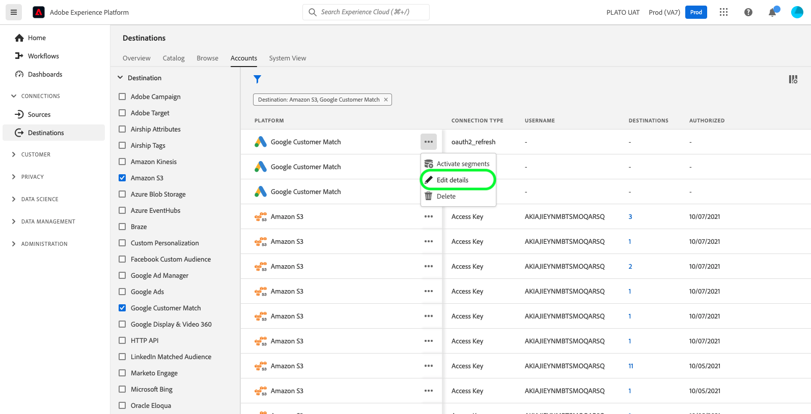

# Zielkonten aktualisieren

## Übersicht {#overview}

Die **[!UICONTROL Konten]** zeigt Details zu den Verbindungen an, die Sie mit verschiedenen Zielen hergestellt haben. Siehe Abschnitt [Übersicht über Konten](../ui/destinations-workspace.md#accounts) für alle Informationen, die Sie für jedes Zielkonto erhalten können.

In diesem Tutorial werden die Schritte zum Aktualisieren der Details des Zielkontos mithilfe der Experience Platform-Benutzeroberfläche beschrieben.

Sie können die Details des Zielkontos aktualisieren, um die Anmeldeinformationen für Ihre aktuellen oder abgelaufenen Konten für die Ziele, die Sie derzeit verwenden, zu aktualisieren und erneut zu authentifizieren. In der Regel haben OAuth- und Trägertokens je nach Zielplattform eine begrenzte Lebensdauer. Wenn diese Token ablaufen, können Sie sie im unten beschriebenen Workflow aktualisieren. Dieser Workflow weist Sie an, den OAuth-Workflow zu durchlaufen oder ein Token erneut einzufügen. Ebenso können Sie die Anmeldeinformationen aktualisieren, wenn sich ein Kennwort oder ein Benutzerzugriff auf der nachgelagerten Plattform geändert hat.

Bei Batch-Zielen können Sie den Zugriff- oder geheimen Schlüssel aktualisieren, wenn sich einer dieser Schlüssel geändert hat. Wenn Sie Ihre Dateien in Zukunft verschlüsseln möchten, können Sie außerdem einen öffentlichen RSA-Schlüssel einfügen, und Ihre exportierten Dateien werden in Zukunft verschlüsselt.

## Konten aktualisieren {#update}

Gehen Sie wie folgt vor, um Verbindungsdetails zu vorhandenen Zielen zu aktualisieren.

1. Melden Sie sich bei der [Experience Platform-Benutzeroberfläche](https://platform.adobe.com/) und wählen Sie **[!UICONTROL Ziele]** über die linke Navigationsleiste. Auswählen **[!UICONTROL Konten]** aus der oberen Kopfzeile, um Ihre vorhandenen Konten anzuzeigen.

   

2. Filtersymbol auswählen  oben links, um das Sortierungsfenster zu öffnen. Das Sortierungsfenster bietet eine Liste aller Ziele. Sie können mehr als ein Ziel aus der Liste auswählen, um eine gefilterte Auswahl von Konten anzuzeigen, die mit den ausgewählten Zielen verknüpft sind.

   

3. Wählen Sie die Auslassungszeichen (`...`) neben dem Namen des Kontos, das Sie aktualisieren möchten. Ein Popup-Bedienfeld wird angezeigt, das Optionen für **[!UICONTROL Segmente aktivieren]**, **[!UICONTROL Details bearbeiten]** und **[!UICONTROL Löschen]** das Konto. Wählen Sie die  **[!UICONTROL Details bearbeiten]** -Schaltfläche, um die Kontoinformationen zu bearbeiten.

   

4. Geben Sie Ihre aktualisierten Kontoanmeldeinformationen ein.

   * Für Konten, die eine `OAuth1` oder `OAuth2` Verbindungstyp auswählen **[!UICONTROL OAuth erneut anschließen]** , um Ihre Kontoanmeldeinformationen zu verlängern. Sie können auch den Namen und die Beschreibung Ihres Kontos aktualisieren.

   

   * Für Konten, die eine `Access Key` oder `ConnectionString` Verbindungstyp können Sie Ihre Kontoauthentifizierungsinformationen bearbeiten, einschließlich Informationen wie Zugriffskennung, geheime Schlüssel oder Verbindungszeichenfolgen. Sie können auch den Namen und die Beschreibung Ihres Kontos aktualisieren.

   

   * Für Konten, die eine `Bearer token` Verbindungstyp können Sie bei Bedarf ein neues Trägertoken eingeben. Sie können auch den Namen und die Beschreibung Ihres Kontos aktualisieren.

   

   * Für Konten, die eine `Server to server` Verbindungstyp, können Sie den Namen und die Beschreibung Ihres Kontos aktualisieren.

   

5. Auswählen **[!UICONTROL Speichern]** , um die Aktualisierung der Kontodetails abzuschließen.

## Nächste Schritte

In diesem Tutorial haben Sie erfolgreich die **[!UICONTROL Ziele]** Arbeitsbereich zum Aktualisieren vorhandener Konten.

Weitere Informationen zu Zielen finden Sie im Abschnitt [Ziele - Übersicht](../catalog/overview.md).