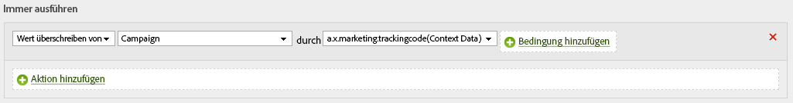

# Daten an Adobe Analytics senden

Das Adobe Experience Platform [!DNL Web SDK] kann Daten an Adobe Analytics senden. Dies funktioniert durch die Übersetzung von `xdm` in ein Format, das Adobe Analytics verwenden kann.

## Einrichten

Adobe Analytics nimmt die gesendeten Daten automatisch auf, wenn in der Benutzeroberfläche für die Kundenkonfiguration eine Report Suite zugeordnet ist. Hier können Sie einen oder mehrere Berichte einer bestimmten Konfiguration zuordnen. Nachdem eine Report Suite zugeordnet wurde, beginnt automatisch der Datenfluss.

## Automatisch zugeordnete Daten

Das Adobe Experience Platform [!DNL Edge Network] ordnet automatisch viele XDM-Variablen zu. Die vollständige Liste dieser Variablen ist [hier](automatically-mapped-vars.md) aufgeführt.

## Manuell zugeordnete Daten

Auf alle vom Edge Network erfassten Daten kann über Verarbeitungsregeln zugegriffen werden. Die Daten werden mithilfe der Punktnotation reduziert und stehen als Kontextdaten zur Verfügung.

Angenommen, Sie haben ein Schema, das so aussieht:

```javascript
{
  key:value,
  object:{
    key1:value1,
    key2:value2
  },
  array:[
    "v0",
    "v1",
    "v2"
  ],
  arrayofobjects:[
    {
      obj1key:objval0
    },
    {
      obj2key:objval1
    }
  ]
}
```

Dann wären dies die Kontextdatenschlüssel, die Ihnen zur Verfügung stehen.

```javascript
a.x.key //value
a.x.object.key1 //value1
a.x.object.key2 //value2
a.x.array.0 //v0
a.x.array.1 //v1
a.x.array.2 //v2
a.x.arrayofobjects.0.obj1key //objval0
a.x.arrayofobjects.1.obj2key //objval1
```

Hier ein Beispiel für eine Verarbeitungsregel, die diese Daten verwenden würde.


