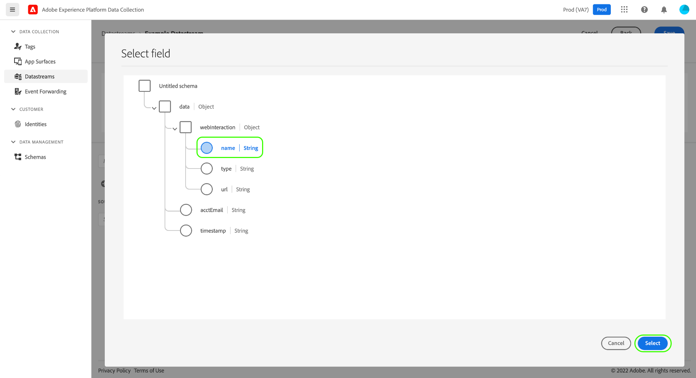

# Datenvorbereitung für die Datenerfassung

Data Prep ist ein Adobe Experience Platform-Dienst, mit dem Sie Daten zuordnen, umwandeln und überprüfen können. [Experience-Datenmodell (XDM)](../../xdm/home.md). Beim Konfigurieren einer Platform-aktivierten [datastream](./overview.md)können Sie Datenvorbereitung verwenden, um Ihre Quelldaten XDM zuzuordnen, wenn Sie sie an das Platform Edge Network senden.

>[!NOTE]
>
>Eine umfassende Anleitung zu allen Data Prep-Funktionen, einschließlich Umwandlungsfunktionen für berechnete Felder, finden Sie in der folgenden Dokumentation:
>
>* [Datenvorbereitung – Übersicht](../../data-prep/home.md)
>* [Funktionen zur Datenvorbereitung](../../data-prep/functions.md)
>* [Verarbeiten von Datenformaten mit der Datenvorbereitung](../../data-prep/data-handling.md)


In diesem Handbuch wird beschrieben, wie Sie Ihre Daten in der Datenerfassungs-Benutzeroberfläche zuordnen. Um den Schritten zu folgen, starten Sie den Prozess der Erstellung eines Datastreams bis zum (einschließlich) [Grundlegender Konfigurationsschritt](./overview.md#create).

Eine kurze Demonstration des Prozesses &quot;Datenvorbereitung für die Datenerfassung&quot;finden Sie im folgenden Video:

>[!VIDEO](https://video.tv.adobe.com/v/342120?quality=12&enable10seconds=on&speedcontrol=on)

## [!UICONTROL Auswählen von Daten] {#select-data}

Auswählen **[!UICONTROL Zuordnung speichern und hinzufügen]** nach Abschluss der grundlegenden Konfiguration für einen Datastream und **[!UICONTROL Daten auswählen]** angezeigt. Von hier müssen Sie ein JSON-Beispielobjekt bereitstellen, das die Struktur der Daten darstellt, die Sie an Platform senden möchten.

Um Eigenschaften direkt aus Ihrer Datenschicht zu erfassen, muss das JSON-Objekt über eine einzige Stammeigenschaft verfügen `data`. Die Untereigenschaften der `data` -Objekt sollte dann so konstruiert werden, dass es den Datenschichteigenschaften zugeordnet wird, die Sie erfassen möchten. Wählen Sie den folgenden Abschnitt aus, um ein Beispiel für ein ordnungsgemäß formatiertes JSON-Objekt mit einer `data` root.

+++JSON-Beispieldatei mit `data` root

```json
{
  "data": {
    "eventMergeId": "cce1b53c-571f-4f36-b3c1-153d85be6602",
    "eventType": "view:load",
    "timestamp": "2021-09-30T14:50:09.604Z",
    "web": {
      "webPageDetails": {
        "siteSection": "Product section",
        "server": "example.com",
        "name": "product home",
        "URL": "https://www.example.com"
      },
      "webReferrer": {
        "URL": "https://www.adobe.com/index2.html",
        "type": "external"
      }
    },
    "commerce": {
      "purchase": 1,
      "order": {
        "orderID": "1234"
      }
    },
    "product": [
      {
        "productInfo": {
          "productID": "123"
        }
      },
      {
        "productInfo": {
          "productID": "1234"
        }
      }
    ],
    "reservation": {
      "id": "anc45123xlm",
      "name": "Embassy Suits",
      "SKU": "12345-L",
      "skuVariant": "12345-LG-R",
      "priceTotal": "112.99",
      "currencyCode": "USD",
      "adults": 2,
      "children": 3,
      "productAddMethod": "PDP",
      "_namespace": {
        "test": 1,
        "priceTotal": "112.99",
        "category": "Overnight Stay"
      },
      "freeCancellation": false,
      "cancellationFee": 20,
      "refundable": true
    }
  }
}
```

+++

Um Eigenschaften aus einem XDM-Objektdatenelement zu erfassen, gelten dieselben Regeln für das JSON-Objekt, die Root-Eigenschaft muss jedoch als `xdm` anstatt. Wählen Sie den folgenden Abschnitt aus, um ein Beispiel für ein ordnungsgemäß formatiertes JSON-Objekt mit einer `xdm` root.

+++JSON-Beispieldatei mit `xdm` root

```json
{
  "xdm": {
    "environment": {
      "type": "browser",
      "browserDetails": {
        "userAgent": "Mozilla/5.0 (Macintosh; Intel Mac OS X 10_7_5) AppleWebkit/537.36 (KHTML, like Gecko) Chrome/49.0.2623.112 Safari/537.36",
        "javaScriptEnabled": true,
        "javaScriptVersion": "1.8.5",
        "cookiesEnabled": true,
        "viewportHeight": 900,
        "viewportWidth": 1680,
        "javaEnabled": true
      },
      "domain": "adobe.com",
      "colorDepth": 24,
      "viewportHeight": 1050,
      "viewportWidth": 1680
    },
    "device": {
      "screenHeight": 1050,
      "screenWidth": 1680
    }
  }
}
```

+++

Sie können die Option auswählen, um das Objekt als Datei hochzuladen, oder stattdessen das Raw-Objekt in das bereitgestellte Textfeld einfügen. Wenn die JSON gültig ist, wird im rechten Bereich ein Vorschauschema angezeigt. Klicken Sie auf **[!UICONTROL Weiter]**, um fortzufahren.


## [!UICONTROL Zuordnung]

Die **[!UICONTROL Zuordnung]** angezeigt, sodass Sie die Felder in Ihren Quelldaten dem Zielereignisschema in Platform zuordnen können. Von hier aus können Sie die Zuordnung auf zwei Arten konfigurieren:

* [Erstellen neuer Zuordnungsregeln](#create-mapping) für diesen Datastream durch einen manuellen Prozess.
* [Importieren von Zuordnungsregeln](#import-mapping) aus einem vorhandenen Datastream.

### Neues Mapping erstellen {#create-mapping}

Wählen Sie zunächst **[!UICONTROL Neues Mapping hinzufügen]** , um eine neue Zuordnungszeile zu erstellen.


Wählen Sie das Quellsymbol () und wählen Sie im angezeigten Dialogfeld das Quellfeld aus, das Sie auf der bereitgestellten Arbeitsfläche zuordnen möchten. Nachdem Sie ein Feld ausgewählt haben, verwenden Sie die **[!UICONTROL Auswählen]** zum Fortfahren.



Wählen Sie anschließend das Schemasymbol (), um ein ähnliches Dialogfeld für das Zielereignisschema zu öffnen. Wählen Sie das Feld aus, dem Sie die Daten zuordnen möchten, bevor Sie eine Bestätigung mit **[!UICONTROL Auswählen]**.


Die Zuordnungsseite wird erneut mit dem abgeschlossenen Feld-Mapping angezeigt. Die **[!UICONTROL Zuordnen des Fortschritts]** -Abschnitt aktualisiert, um die Gesamtzahl der Felder widerzuspiegeln, die erfolgreich zugeordnet wurden.


>[!TIP]
>
>Wenn Sie ein Array von Objekten (im Quellfeld) einem Array von verschiedenen Objekten (im Zielfeld) zuordnen möchten, fügen Sie `[*]` nach dem Array-Namen in den Pfaden für Quell- und Zielfelder, wie unten dargestellt.
>
>

### Vorhandene Zuordnungsregeln importieren {#import-mapping}

Wenn Sie zuvor einen Datastream erstellt haben, können Sie die konfigurierten Zuordnungsregeln für einen neuen Datastream wiederverwenden.

>[!WARNING]
>
>Durch das Importieren von Zuordnungsregeln aus einem anderen Datenspeicher werden alle vor dem Import hinzugefügten Feldzuordnungen überschrieben.

Wählen Sie zunächst **[!UICONTROL Importzuordnung]**.

![Bild, das die [!UICONTROL Importzuordnung] Schaltfläche ausgewählt](../images/datastreams/data-prep/import-mapping-button.png)

Wählen Sie im angezeigten Dialogfeld den Datenspeicher aus, dessen Zuordnungsregeln Sie importieren möchten. Nachdem der Datastream ausgewählt wurde, wählen Sie **[!UICONTROL Vorschau]**.


>[!NOTE]
>
>Datenspeicher können nur innerhalb desselben importiert werden [Sandbox](../../sandboxes/home.md). Mit anderen Worten: Sie können keinen Datenspeicher von einer Sandbox in eine andere importieren.

Im nächsten Bildschirm wird eine Vorschau der gespeicherten Zuordnungsregeln für den ausgewählten Datenspeicher angezeigt. Stellen Sie sicher, dass die angezeigten Zuordnungen dem entsprechen, was Sie erwarten, und wählen Sie dann **[!UICONTROL Import]** , um die Zuordnungen zu bestätigen und zum neuen Datastream hinzuzufügen.


>[!NOTE]
>
>Wenn Quellfelder in den importierten Zuordnungsregeln nicht in den von Ihnen verwendeten JSON-Beispieldaten enthalten sind [früher](#select-data), werden diese Feldzuordnungen nicht in den Import einbezogen.

### Abschließen der Zuordnung

Führen Sie die oben genannten Schritte aus, um den Rest der Felder dem Zielschema zuzuordnen. Sie müssen zwar nicht alle verfügbaren Quellfelder zuordnen, jedoch müssen alle Felder im Zielschema, die wie erforderlich festgelegt sind, zugeordnet werden, um diesen Schritt abzuschließen. Die **[!UICONTROL Erforderliche Felder]** gibt an, wie viele erforderliche Felder in der aktuellen Konfiguration noch nicht zugeordnet sind.

Sobald die Anzahl der erforderlichen Felder null erreicht hat und Sie mit Ihrer Zuordnung zufrieden sind, wählen Sie **[!UICONTROL Speichern]** um Ihre Änderungen abzuschließen.


## Nächste Schritte

In diesem Handbuch wurde beschrieben, wie Sie Ihre Daten XDM zuordnen, wenn Sie einen Datenspeicher in der Datenerfassungs-Benutzeroberfläche einrichten. Wenn Sie dem Tutorial zu allgemeinen Datenspeichern gefolgt sind, können Sie jetzt zum Schritt auf [Anzeigen von Datenspeicherdetails](./overview.md).
