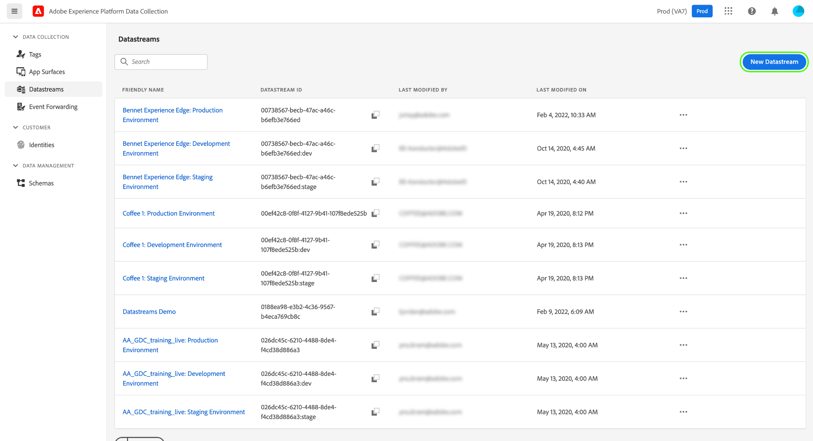
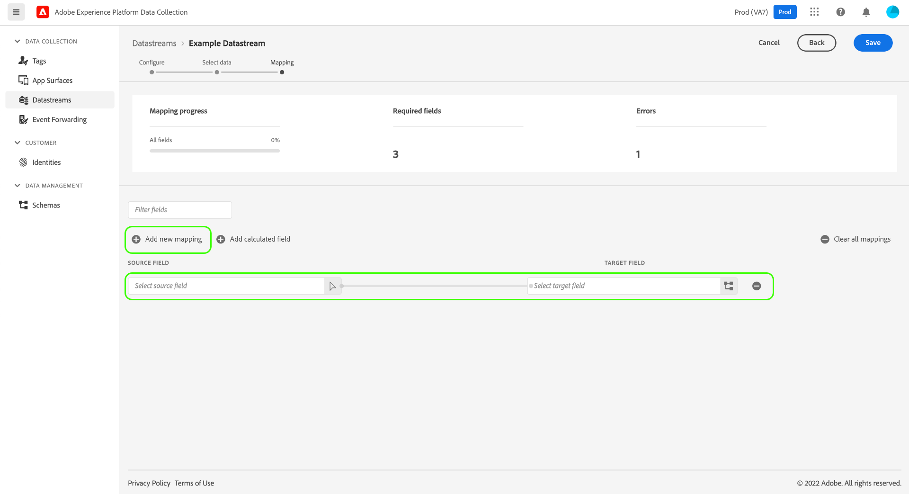
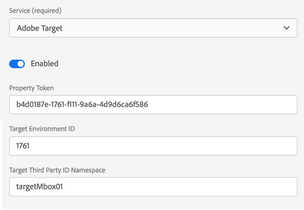

# Konfigurieren eines Datenspeichers

Ein Datastream stellt die serverseitige Konfiguration bei der Implementierung der Adobe Experience Platform Web- und Mobile-SDKs dar. Während [configure-Befehl](configuring-the-sdk.md) im SDK steuert Elemente, die auf dem Client verarbeitet werden müssen (z. B. die `edgeDomain`), verarbeiten Datastreams alle anderen Konfigurationen für das SDK. Wenn eine Anforderung an das Adobe Experience Platform Edge Network gesendet wird, muss die `edgeConfigId` wird verwendet, um auf den Datastream zu verweisen. Auf diese Weise können Sie die serverseitige Konfiguration aktualisieren, ohne Codeänderungen auf Ihrer Website vornehmen zu müssen.

In diesem Dokument werden die Schritte zum Konfigurieren eines Datastreams in der Datenerfassungs-Benutzeroberfläche beschrieben.

>[!NOTE]
>
>Ihre Organisation muss für diese Funktion freigeschaltet sein, damit sie über die Benutzeroberfläche darauf zugreifen kann. Bitte füllen Sie Folgendes aus [Formular](https://adobe.ly/websdkaccess) , um den erforderlichen Zugriff anzufordern. Um Datenspeicher zu verwalten, muss Ihr Benutzerkonto einem Produktprofil für Tags in hinzugefügt werden. [!DNL Adobe Experience Platform].

## Zugriff auf [!UICONTROL Datenspeicher] Arbeitsbereich

Sie können Datenspeicher in der Datenerfassungs-Benutzeroberfläche erstellen und verwalten, indem Sie **[!UICONTROL Datenspeicher]** in der linken Navigation.


Die [!UICONTROL Datenspeicher] zeigt eine Liste der vorhandenen Datensätze an, einschließlich Anzeigename, Kennung und Datum der letzten Änderung. Wählen Sie den Namen eines Datastreams aus, um [Anzeigen der Details und Konfigurieren von Diensten](#view-details).

Wählen Sie das Symbol &quot;Mehr&quot;(**...**) für einen bestimmten Datastream, um weitere Optionen anzuzeigen. Auswählen **[!UICONTROL Bearbeiten]** , um die [Basiskonfiguration](#configure) für den Datastream oder wählen Sie **[!UICONTROL Löschen]** , um den Datastream zu entfernen.


## Neuen Datastream erstellen {#create}

Um einen Datastream zu erstellen, wählen Sie zunächst **[!UICONTROL Neuer Datenspeicher]**.



### [!UICONTROL Konfigurieren] {#configure}

Der Workflow zur Erstellung von Datensätzen wird angezeigt, beginnend mit dem Konfigurationsschritt. Von hier müssen Sie einen Namen und eine optionale Beschreibung für den Datastream angeben.

Wenn Sie diesen Datastream zur Verwendung in Experience Platform konfigurieren und das Platform Web SDK verwenden, müssen Sie auch eine [ereignisbasiertes Experience-Datenmodell (XDM)-Schema](../../xdm/classes/experienceevent.md) um die Daten darzustellen, die Sie für die Aufnahme planen.


Auswählen **[!UICONTROL Erweiterte Optionen]** , um zusätzliche Steuerelemente zum Konfigurieren des Datenspeichers anzuzeigen.


| Einstellung | Beschreibung |
| --- | --- |
| [!UICONTROL Geo-Position] | Bestimmt anhand der IP-Adresse des Benutzers, ob GPS-Suchen stattfinden. Die Standardeinstellung **[!UICONTROL Keines]** deaktiviert alle GPS-Suchen, während die **[!UICONTROL Ort]** -Einstellung stellt GPS-Koordinaten auf zwei Dezimalstellen bereit. |
| [!UICONTROL Erstanbieter-ID-Cookie] | Wenn diese Einstellung aktiviert ist, weist sie das Edge-Netzwerk an, bei der Suche nach einem [Erstanbieter-Geräte-ID](../identity/first-party-device-ids.md), anstatt nach diesem Wert in der Identity Map zu suchen.<br><br>Wenn Sie diese Einstellung aktivieren, müssen Sie den Namen des Cookies angeben, in dem die ID gespeichert werden soll. |
| [!UICONTROL Synchronisierung der Drittanbieter-ID] | ID-Synchronisationen können in Container gruppiert werden, damit verschiedene ID-Synchronisierungen zu unterschiedlichen Zeiten ausgeführt werden können. Wenn diese Einstellung aktiviert ist, können Sie festlegen, welcher Container mit ID-Synchronisierungen für diesen Datastream ausgeführt wird. |

Der Rest dieses Abschnitts konzentriert sich auf die Schritte zur Zuordnung von Daten zu einem ausgewählten Platform-Ereignisschema. Wenn Sie das Mobile SDK verwenden oder anderweitig nicht Ihren Datenspeicher für Platform konfigurieren, wählen Sie **[!UICONTROL Speichern]** bevor Sie mit dem nächsten Abschnitt fortfahren [Hinzufügen von Diensten zum Datastream](#add-services).

### Datenvorbereitung für die Datenerfassung {#data-prep}

>[!IMPORTANT]
>
>Die Datenvorbereitung für die Datenerfassung wird derzeit nicht für Mobile SDK-Implementierungen unterstützt.

Data Prep ist ein Experience Platform-Dienst, mit dem Sie Daten dem Experience-Datenmodell (XDM) (Experience-Datenmodell) zuordnen, umwandeln und überprüfen können. Beim Konfigurieren eines Platform-aktivierten Datastreams können Sie Datenvorbereitungsfunktionen verwenden, um Ihre Quelldaten beim Senden an das Platform Edge Network XDM zuzuordnen.

>[!NOTE]
>
>Eine umfassende Anleitung zu allen Data Prep-Funktionen, einschließlich Umwandlungsfunktionen für berechnete Felder, finden Sie in der folgenden Dokumentation:
>
>* [Datenvorbereitung – Übersicht](../../data-prep/home.md)
>* [Funktionen zur Datenvorbereitung](../../data-prep/functions.md)
>* [Verarbeiten von Datenformaten mit der Datenvorbereitung](../../data-prep/data-handling.md)


In den folgenden Unterabschnitten werden die grundlegenden Schritte zum Zuordnen Ihrer Daten in der Datenerfassungs-Benutzeroberfläche beschrieben. Eine kurze Demonstration dieser Schritte finden Sie im folgenden Video:

>[!VIDEO](https://video.tv.adobe.com/v/342120?quality=12&enable10seconds=on&speedcontrol=on)

#### [!UICONTROL Auswählen von Daten]

Auswählen **[!UICONTROL Zuordnung speichern und hinzufügen]** nach Abschluss der [Grundlegender Konfigurationsschritt](#configure)und die **[!UICONTROL Daten auswählen]** angezeigt. Von hier müssen Sie ein JSON-Beispielobjekt bereitstellen, das die Struktur der Daten darstellt, die Sie an Platform senden möchten.

Sie sollten dieses JSON-Objekt so erstellen, dass Sie es den Eigenschaften in Ihrer Datenschicht zuordnen können, die Sie erfassen möchten. Wählen Sie den folgenden Abschnitt aus, um ein Beispiel für ein ordnungsgemäß formatiertes JSON-Objekt anzuzeigen.

+++JSON-Beispieldatei

```json
{
  "data": {
    "eventMergeId": "cce1b53c-571f-4f36-b3c1-153d85be6602",
    "eventType": "view:load",
    "timestamp": "2021-09-30T14:50:09.604Z",
    "web": {
      "webPageDetails": {
        "siteSection": "Product section",
        "server": "example.com",
        "name": "product home",
        "URL": "https://www.example.com"
      },
      "webReferrer": {
        "URL": "https://www.adobe.com/index2.html",
        "type": "external"
      }
    },
    "commerce": {
      "purchase": 1,
      "order": {
        "orderID": "1234"
      }
    },
    "product": [
      {
        "productInfo": {
          "productID": "123"
        }
      },
      {
        "productInfo": {
          "productID": "1234"
        }
      }
    ],
    "reservation": {
      "id": "anc45123xlm",
      "name": "Embassy Suits",
      "SKU": "12345-L",
      "skuVariant": "12345-LG-R",
      "priceTotal": "112.99",
      "currencyCode": "USD",
      "adults": 2,
      "children": 3,
      "productAddMethod": "PDP",
      "_namespace": {
        "test": 1,
        "priceTotal": "112.99",
        "category": "Overnight Stay"
      },
      "freeCancellation": false,
      "cancellationFee": 20,
      "refundable": true
    }
  }
}
```

+++

>[!IMPORTANT]
>
>Das JSON-Objekt muss über einen einzigen Stammknoten verfügen. `data` , um die Validierung zu bestehen.

Sie können die Option auswählen, um das Objekt als Datei hochzuladen, oder stattdessen das Raw-Objekt in das bereitgestellte Textfeld einfügen. Wenn die JSON gültig ist, wird im rechten Bereich ein Vorschauschema angezeigt. Klicken Sie auf **[!UICONTROL Weiter]**, um fortzufahren.


#### [!UICONTROL Zuordnung]

Die **[!UICONTROL Zuordnung]** angezeigt, sodass Sie die Felder in Ihren Quelldaten dem Zielereignisschema in Platform zuordnen können. Wählen Sie zunächst **[!UICONTROL Neues Mapping hinzufügen]** , um eine neue Zuordnungszeile zu erstellen.



Wählen Sie das Quellsymbol () und wählen Sie im angezeigten Dialogfeld das Quellfeld aus, das Sie auf der bereitgestellten Arbeitsfläche zuordnen möchten. Nachdem Sie ein Feld ausgewählt haben, verwenden Sie die **[!UICONTROL Auswählen]** zum Fortfahren.


Wählen Sie anschließend das Schemasymbol (), um ein ähnliches Dialogfeld für das Zielereignisschema zu öffnen. Wählen Sie das Feld aus, dem Sie die Daten zuordnen möchten, bevor Sie eine Bestätigung mit **[!UICONTROL Auswählen]**.


Die Zuordnungsseite wird erneut mit dem abgeschlossenen Feld-Mapping angezeigt. Die **[!UICONTROL Zuordnen des Fortschritts]** -Abschnitt aktualisiert, um die Gesamtzahl der Felder widerzuspiegeln, die erfolgreich zugeordnet wurden.


>[!TIP]
>
>Wenn Sie ein Array von Objekten (im Quellfeld) einem Array von verschiedenen Objekten (im Zielfeld) zuordnen möchten, fügen Sie `[*]` nach dem Array-Namen in den Pfaden für Quell- und Zielfelder, wie unten dargestellt.
>
>

Führen Sie die oben genannten Schritte aus, um den Rest der Felder dem Zielschema zuzuordnen. Sie müssen zwar nicht alle verfügbaren Quellfelder zuordnen, jedoch müssen alle Felder im Zielschema, die wie erforderlich festgelegt sind, zugeordnet werden, um diesen Schritt abzuschließen. Die **[!UICONTROL Erforderliche Felder]** gibt an, wie viele erforderliche Felder in der aktuellen Konfiguration noch nicht zugeordnet sind.

Sobald die Anzahl der erforderlichen Felder null erreicht hat und Sie mit Ihrer Zuordnung zufrieden sind, wählen Sie **[!UICONTROL Speichern]** um Ihre Änderungen abzuschließen.


## Anzeigen von Datenspeicherdetails {#view-details}

Nachdem Sie einen neuen Datastream konfiguriert oder einen vorhandenen ausgewählt haben, um ihn anzuzeigen, wird die Detailseite für diesen Datastream angezeigt. Hier finden Sie weitere Informationen zum Datastream, einschließlich seiner Kennung.


Im Bildschirm mit den Datenspeicherdetails können Sie [Dienste hinzufügen](#add-services) , um Funktionen aus den Adobe Experience Cloud-Produkten zu aktivieren, auf die Sie Zugriff haben.

## Hinzufügen von Diensten zu einem Datastream {#add-services}

Wählen Sie auf der Detailseite eines Datastreams die Option **[!UICONTROL Dienst hinzufügen]** , um mit dem Hinzufügen der verfügbaren Dienste für diesen Datastream zu beginnen.


Wählen Sie im nächsten Bildschirm im Dropdown-Menü einen Dienst aus, der für diesen Datastream konfiguriert werden soll. In dieser Liste werden nur die Dienste angezeigt, auf die Sie Zugriff haben.


Wählen Sie den gewünschten Dienst aus, geben Sie die angezeigten Konfigurationsoptionen ein und wählen Sie dann **[!UICONTROL Speichern]** , um den Dienst zum Datastream hinzuzufügen. Alle hinzugefügten Dienste werden in der Detailansicht für den Datastream angezeigt.


In den folgenden Unterabschnitten werden die Konfigurationsoptionen für die einzelnen Dienste beschrieben.

>[!NOTE]
>
>Jede Dienstkonfiguration enthält eine **[!UICONTROL Aktiviert]** ein-/ausschalten, der automatisch aktiviert wird, wenn der Dienst ausgewählt ist. Um den ausgewählten Dienst für diesen Datastream zu deaktivieren, wählen Sie die **[!UICONTROL Aktiviert]** wieder umschalten.

### Adobe Analytics-Einstellungen

Dieser Dienst steuert, ob und wie Daten an Adobe Analytics gesendet werden. Weitere Informationen finden Sie im Handbuch zu [Senden von Daten an Analytics](../data-collection/adobe-analytics/analytics-overview.md).


| Einstellung | Beschreibung |
| --- | --- |
| [!UICONTROL Report Suite-ID] | **(Erforderlich)** Die ID der Analytics Report Suite, an die Sie Daten senden möchten. Diese ID finden Sie in der Adobe Analytics-Benutzeroberfläche unter [!UICONTROL Admin] > [!UICONTROL ReportSuites]. Wenn mehrere Report Suites angegeben sind, werden die Daten in die einzelnen Report Suites kopiert. |

### Adobe Audience Manager-Einstellungen

Dieser Dienst steuert, ob und wie Daten an Adobe Audience Manager gesendet werden. Zum Senden von Daten an Audience Manager ist nur diese Option erforderlich. Die anderen Einstellungen sind optional, werden jedoch empfohlen.


| Einstellung | Beschreibung |
| --- | --- |
| [!UICONTROL Cookie-Ziele aktiviert] | Ermöglicht dem SDK das Freigeben von Segmentinformationen über [Cookie-Ziele](https://experienceleague.adobe.com/docs/audience-manager/user-guide/features/destinations/custom-destinations/create-cookie-destination.html) von [!DNL Audience Manager]. |
| [!UICONTROL URL-Ziele aktiviert] | Ermöglicht dem SDK das Freigeben von Segmentinformationen über [URL-Ziele](https://experienceleague.adobe.com/docs/audience-manager/user-guide/features/destinations/custom-destinations/create-url-destination.html) von [!DNL Audience Manager]. |

### Adobe Experience Platform-Einstellungen

>[!IMPORTANT]
>
>Beachten Sie beim Aktivieren eines Datastreams für Platform die aktuell verwendete Platform-Sandbox, wie im oberen Band der Datenerfassungs-Benutzeroberfläche angezeigt.
>
>
>
>Sandboxes sind virtuelle Partitionen in Adobe Experience Platform, mit denen Sie Ihre Daten und Implementierungen von anderen in Ihrem Unternehmen isolieren können. Nachdem ein Datastream erstellt wurde, kann seine Sandbox nicht mehr geändert werden. Weitere Informationen zur Rolle von Sandboxes in Experience Platform finden Sie unter [Sandbox-Dokumentation](../../sandboxes/home.md).

Dieser Dienst steuert, ob und wie Daten an Adobe Experience Platform gesendet werden.


| Einstellung | Beschreibung |
| --- | --- |
| [!UICONTROL Ereignis-Datensatz] | **(Erforderlich)** Wählen Sie den Platform-Datensatz aus, an den Kundenereignisdaten gestreamt werden. Dieses Schema muss [XDM ExperienceEvent-Klasse](../../xdm/classes/experienceevent.md). |
| [!UICONTROL Profildatensatz] | Wählen Sie den Platform-Datensatz aus, an den Kundenattributdaten gesendet werden. Dieses Schema muss [Klasse &quot;XDM Individual Profile&quot;](../../xdm/classes/individual-profile.md). |
| [!UICONTROL Offer Decisioning] | Aktivieren Sie dieses Kontrollkästchen, um die Offer decisioning für eine Platform Web SDK-Implementierung zu aktivieren. Siehe Handbuch unter [Verwenden von Offer decisioning mit dem Platform Web SDK](../personalization/offer-decisioning/offer-decisioning-overview.md) für weitere Implementierungsdetails. Weitere Informationen zu Offer decisioning-Funktionen finden Sie im Abschnitt [Adobe Journey Optimizer-Dokumentation](https://experienceleague.adobe.com/docs/journey-optimizer/using/offer-decisioniong/get-started/starting-offer-decisioning.html?lang=de). |
| [!UICONTROL Edge-Segmentierung] | Aktivieren Sie dieses Kontrollkästchen, um [Kantensegmentierung](../../segmentation/ui/edge-segmentation.md) für diesen Datastream. Wenn das SDK Daten über einen Datastream sendet, der für die Kantensegmentierung aktiviert ist, werden alle aktualisierten Segmentmitgliedschaften für das betreffende Profil in der Antwort zurückgesendet.<br><br>Diese Option kann in Kombination mit [!UICONTROL Personalisierungsziele] für [Anwendungsfälle für die Personalisierung der nächsten Seite](../../destinations/ui/configure-personalization-destinations.md). |
| [!UICONTROL Personalisierungsziele] | Bei Verwendung in Kombination mit dem [!UICONTROL Edge-Segmentierung] aktivieren, ermöglicht es diese Option dem Datastream, eine Verbindung zu Personalisierungsmaschinen wie Adobe Target herzustellen. Spezifische Schritte finden Sie in der Dokumentation zu Zielen unter [Konfigurieren von Personalisierungszielen](../../destinations/ui/configure-personalization-destinations.md). |

### Adobe Target-Einstellungen

Dieser Dienst steuert, ob und wie Daten an Adobe Target gesendet werden.



| Einstellung | Beschreibung |
| --- | --- |
| [!UICONTROL Eigenschafts-Token] | [!DNL Target] ermöglicht es Kunden, Berechtigungen durch die Verwendung von Eigenschaften zu steuern. Weitere Informationen zu Eigenschaften finden Sie im Handbuch unter [Konfigurieren von Unternehmensberechtigungen](https://experienceleague.adobe.com/docs/target/using/administer/manage-users/enterprise/properties-overview.html?lang=de) im [!DNL Target] Dokumentation.<br><br>Das Eigenschafts-Token befindet sich in der Adobe Target-Benutzeroberfläche unter [!UICONTROL Einrichtung] > [!UICONTROL Eigenschaften]. |
| [!UICONTROL Target-Umgebungs-ID] | [Umgebungen in Adobe Target](https://experienceleague.adobe.com/docs/target/using/administer/hosts.html) helfen Ihnen bei der Verwaltung Ihrer Implementierung in allen Phasen der Entwicklung. Diese Einstellung gibt an, welche Umgebung Sie für diesen Datastream verwenden werden.<br><br>Best Practice ist, dies für jeden Ihrer `dev`, `stage`und `prod` Datastream-Umgebungen, um die Dinge einfach zu halten. Wenn Sie jedoch bereits Adobe Target-Umgebungen definiert haben, können Sie diese verwenden. |
| [!UICONTROL Namespace der Target-Drittanbieter-ID] | Der Identitäts-Namespace für `mbox3rdPartyId` Sie möchten für diesen Datastream verwenden. Siehe Handbuch unter [Umsetzung `mbox3rdPartyId` mit dem Web SDK](../personalization/adobe-target/using-mbox-3rdpartyid.md) für weitere Informationen. |

### [!UICONTROL Ereignisweiterleitung] settings

Dieser Dienst steuert, ob und wie Daten an gesendet werden [Ereignisweiterleitung](../../tags/ui/event-forwarding/overview.md).


| Einstellung | Beschreibung |
| --- | --- |
| [!UICONTROL Launch-Eigenschaft] | **(Erforderlich)** Die Ereignisweiterleitungs-Eigenschaft, an die Sie Daten senden möchten. |
| [!UICONTROL Launch-Umgebung] | **(Erforderlich)** Die Umgebung innerhalb der ausgewählten Eigenschaft, an die Sie Daten senden möchten. |

>[!NOTE]
>
>Sie können **[!UICONTROL IDs manuell eingeben]** um die Eigenschaften- und Umgebungsnamen einzugeben, anstatt die Dropdown-Menüs zu verwenden.

## Nächste Schritte

In diesem Handbuch wurde beschrieben, wie Sie einen Datastream in der Datenerfassungs-Benutzeroberfläche konfigurieren. Weitere Informationen zum Installieren und Konfigurieren des Web SDK nach dem Einrichten eines Datastreams finden Sie im Abschnitt [Handbuch zur Datenerfassung E2E](../../collection/e2e.md#install).
