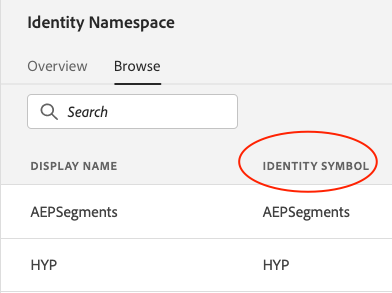

# Identitäten zwischen Audience Manager und Experience Platform synchronisieren

Adobe Experience Platform Web SDK unterstützt die Möglichkeit, Kunden-IDs und deren Authentifizierungsstatus über den Befehl [sendEvent](./overview.md#syncing-identities) zu deklarieren.

Wählen Sie Ihre Namensraum aus den Namensräumen [Identitätsdienst](../../identity/../identity-service/namespaces.md) aus, um mithilfe der Werte in der Spalte &quot;Identitätssymbol&quot;den Kontext anzugeben, auf den sich eine Identität bezieht:

Als Audience Manager verwenden Sie alle vorhandenen Data Sources, die den ID-Typ verwenden: Geräteübergreifende Elemente verfügen automatisch über einen entsprechenden Identitäts-Namensraum. Um den entsprechenden Identitäts-Namensraum für Ihre Audience Manager-Datenquelle zu finden, melden Sie sich bei Adobe Experience Platform an und navigieren Sie zum Identitätsabschnitt.

Jede neue [!DNL Audience Manager]-Datenquelle, die den ID-Typ verwendet: Geräteübergreifend wird ein entsprechender Identitäts-Namensraum generiert. Datenquellen-ID-Typen Cookie und Geräte-Advertising-ID werden derzeit nicht unterstützt. Darüber hinaus generiert jeder in Adobe Experience Platform erstellte Identity Namensraum eine entsprechende [!DNL Audience Manager]-Datenquelle, beachten Sie jedoch, dass die syncIdentity-Methode nur Namensraum-Identitätssymbole unterstützt.
