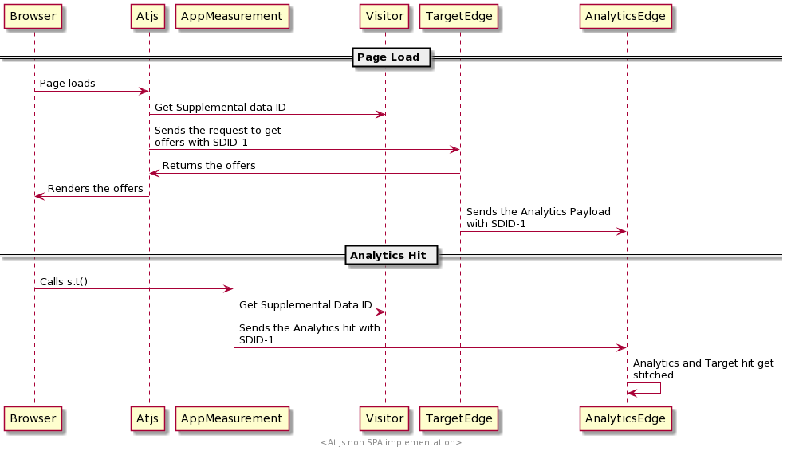

# Vergleich der at.js-Bibliothek mit dem Web SDK

## Übersicht

Dieser Artikel bietet einen Überblick über die Unterschiede zwischen den `at.js` und dem Experience Platform Web SDK.

## Installieren der Bibliotheken

### Installieren von at.js

Wir erlauben unseren Kunden, die Bibliothek direkt über die Registerkarte Implementierung von Adobe Experience Cloud herunterzuladen. Die at.js-Bibliothek ist mit Einstellungen angepasst, die der Kunde wie folgt verwendet: clientCode, imsOrgId usw.

### Installieren des Web SDK

Die vordefinierte Version ist in einem CDN verfügbar. Sie können die Bibliothek im CDN direkt auf Ihrer Seite referenzieren oder sie herunterladen und in Ihrer eigenen Infrastruktur hosten. Es ist in minimierten und nicht minimierten Formaten verfügbar. Die nicht minimierte Version ist für Debugging-Zwecke hilfreich.

URL-Struktur: https://cdn1.adoberesources.net/alloy/[VERSION]/alloy.min.js ODER legierungen.js für die nicht minimierte Version.

Beispiel:

* Minimiert: [https://cdn1.adoberesources.net/alloy/2.6.4/alloy.min.js](https://cdn1.adoberesources.net/alloy/2.6.4/alloy.min.js)
* Nicht minimiert: [https://cdn1.adoberesources.net/alloy/2.6.4/alloy.js](https://cdn1.adoberesources.net/alloy/2.6.4/alloy.js)

[Weitere Infos](../../fundamentals/installing-the-sdk.md)

## Bibliotheken konfigurieren

### &quot;at.js&quot;konfigurieren

Am Ende jeder at.js-Datei finden Sie einen Abschnitt, in dem wir ein Einstellungsobjekt instanziieren und übergeben. Es kann angepasst werden. Beim Herunterladen füllen wir diesen Abschnitt mit aktuellen Kundeneinstellungen.

```javascript
window.adobe.target.init(window, document, {
  "clientCode": "demo",
  "imsOrgId": "",
  "serverDomain": "localhost:5000",
  "timeout": 2000,
  "globalMboxName": "target-global-mbox",
  "version": "2.0.0",
  "defaultContentHiddenStyle": "visibility: hidden;",
  "defaultContentVisibleStyle": "visibility: visible;",
  "bodyHiddenStyle": "body {opacity: 0 !important}",
  "bodyHidingEnabled": true,
  "deviceIdLifetime": 63244800000,
  "sessionIdLifetime": 1860000,
  "selectorsPollingTimeout": 5000,
  "visitorApiTimeout": 2000,
  "overrideMboxEdgeServer": false,
  "overrideMboxEdgeServerTimeout": 1860000,
  "optoutEnabled": false,
  "optinEnabled": false,
  "secureOnly": false,
  "supplementalDataIdParamTimeout": 30,
  "authoringScriptUrl": "//cdn.tt.omtrdc.net/cdn/target-vec.js",
  "urlSizeLimit": 2048,
  "endpoint": "/rest/v1/delivery",
  "pageLoadEnabled": true,
  "viewsEnabled": true,
  "analyticsLogging": "server_side",
  "serverState": {},
  "decisioningMethod": "server-side",
  "legacyBrowserSupport":  false
});
```

[Weitere Informationen](https://experienceleague.adobe.com/docs/target/using/implement-target/client-side/at-js-implementation/functions-overview/targetgobalsettings.html?lang=en)


### Web SDK konfigurieren

Die Konfiguration für das SDK erfolgt mit dem `configure`-Befehl.

>[!IMPORTANT]
>
>`configure` is *always* der erste Befehl mit dem Namen .

Beispiel:

```javascript
alloy("configure", {
  "edgeConfigId": "ebebf826-a01f-4458-8cec-ef61de241c93",
  "orgId":"ADB3LETTERSANDNUMBERS@AdobeOrg"
});
```

Es gibt viele Optionen, die während der Konfiguration festgelegt werden können. Alle Optionen sind nachstehend nach Kategorie gruppiert aufgeführt.

[Weitere Infos](../../fundamentals/configuring-the-sdk.md)


## Anfordern und automatischen Rendern von Target-Angeboten für Seitenladevorgänge

### Verwenden von at.js

Verwenden von at.js 2.x, wenn Sie die Einstellung `pageLoadEnabled`, wird ein Aufruf an Target Edge mit der Bibliothek Trigger. `execute -> pageLoad`. Wenn alle Einstellungen auf die Standardwerte festgelegt sind, ist keine benutzerdefinierte Codierung erforderlich. Sobald at.js zur Seite hinzugefügt und vom Browser geladen wird, wird ein Target Edge-Aufruf ausgeführt.

### Verwenden des Web SDK

In Adobe Target erstellte Inhalte [Visual Experience Composer](https://experienceleague.adobe.com/docs/target/using/experiences/vec/visual-experience-composer.html) kann automatisch vom SDK abgerufen und gerendert werden.

Verwenden Sie zum Anfordern und automatischen Rendern von Target-Angeboten die `sendEvent` und legen Sie die `renderDecisions` -Option `true`. Dies zwingt das SDK dazu, personalisierte Inhalte automatisch zu rendern, die für das automatische Rendering geeignet sind.

Beispiel:

```javascript
alloy("sendEvent", {
  "renderDecisions": true,
  "xdm": {
    "commerce": {
      "order": {
        "purchaseID": "a8g784hjq1mnp3",
        "purchaseOrderNumber": "VAU3123",
        "currencyCode": "USD",
        "priceTotal": 999.98
      }
    }
  }
});
```

Experience Platform Web SDK sendet automatisch eine Benachrichtigung mit den vom WEB SDK ausgeführten Angeboten. Dies ist ein Beispiel dafür, wie eine Payload einer Benachrichtigungsanfrage aussieht:

```json
{
  "events": [{
      "xdm": {
        "_experience": {
          "decisioning": {
            "propositions": [
              {
                "id": "AT:eyJhY3Rpdml0eUlkIjoiMTI3MDE5IiwiZXhwZXJpZW5jZUlkIjoiMCJ9",
                "scope": "cart",
                "scopeDetails": {
                  "decisionProvider": "TGT",
                  "activity": {
                    "id": "127019"
                  },
                  "experience": {
                    "id": "0"
                  },
                  "strategies": [
                    {
                      "step": "entry",
                      "algorithmID": "0",
                      "trafficType": "0"
                    },
                    {
                      "step": "display",
                      "algorithmID": "0",
                      "trafficType": "0"
                    }
                  ],
                  "characteristics": {
                    "eventToken": "bKMxJ8dCR1XlPfDCx+2vSGqipfsIHvVzTQxHolz2IpSCnQ9Y9OaLL2gsdrWQTvE54PwSz67rmXWmSnkXpSSS2Q=="
                  }
                }
              }
            ]
          }
        },
        "eventType": "display",
        "web": {
          "webPageDetails": {
            "viewName": "cart",
            "URL": "https://alloyio.com/personalizationSpa/cart"
          },
          "webReferrer": {
            "URL": ""
          }
        },
        "device": {
          "screenHeight": 800,
          "screenWidth": 1280,
          "screenOrientation": "landscape"
        },
        "environment": {
          "type": "browser",
          "browserDetails": {
            "viewportWidth": 1280,
            "viewportHeight": 284
          }
        },
        "placeContext": {
          "localTime": "2021-12-10T15:50:34.467+02:00",
          "localTimezoneOffset": -120
        },
        "timestamp": "2021-12-10T13:50:34.467Z",
        "implementationDetails": {
          "name": "https://ns.adobe.com/experience/alloy",
          "version": "2.6.2",
          "environment": "browser"
        }
      }
    }
  ]
}
```

[Weitere Infos](../rendering-personalization-content.md)

## Anfordern und NICHT automatisch Rendern von Target-Angeboten für Seitenladevorgänge

### Verwenden von at.js

Es gibt zwei Möglichkeiten, einen Aufruf an Target Edge auszulösen, der Angebote für das Laden der Seite abruft.

Beispiel 1:

```javascript
adobe.target.getOffer({
   mbox: "target-global-mbox", 
   success: console.log,
   error: console.error
});
```

Beispiel 2:

```javascript
adobe.target.getOffers({
    request: {
      execute: {
        pageLoad: {}
    }
  }
})
.then(console.log)
.catch(console.error);
```

[Weitere Informationen](https://experienceleague.adobe.com/docs/target/using/implement-target/client-side/at-js-implementation/functions-overview/cmp-atjs-functions.html?lang=en)

### Verwenden des Web SDK

Führen Sie einen `sendEvent` -Befehl mit einem speziellen Bereich unter `decisionScopes`: `__view__`. Dieser Umfang dient als Signal, um alle Seitenladeaktivitäten aus Target abzurufen und alle Ansichten vorab abzurufen. Das Web SDK versucht außerdem, alle ansichtsbasierten VEC-Aktivitäten zu evaluieren. Das Deaktivieren des Vorabrufs von Ansichten wird derzeit im Web SDK nicht unterstützt.

Um auf Personalisierungsinhalte zuzugreifen, können Sie eine Callback-Funktion bereitstellen, die aufgerufen wird, nachdem das SDK eine erfolgreiche Antwort vom Server erhalten hat. Ihr Rückruf wird mit einem Ergebnisobjekt bereitgestellt, das die Eigenschaft propositions enthalten kann, die alle zurückgegebenen Personalisierungsinhalte enthält.

Beispiel:

```javascript
alloy("sendEvent", {
    xdm: {...},
    decisionScopes: ["__view__"]
  }).then(function(result) {
    if (result.propositions) {
      result.propositions.forEach(proposition => {
        proposition.items.forEach(item => {
          if (item.schema === HTML_SCHEMA) {
            // manually apply offer
            document.getElementById("form-based-offer-container").innerHTML =
              item.data.content;
            const executedPropositions = [
              {
                id: proposition.id,
                scope: proposition.scope,
                scopeDetails: proposition.scopeDetails
              }
            ];
          // manually send the display notification event, so that Target/Analytics impressions aare increased
            alloy("sendEvent",{
              "xdm": {
                "eventType": "decisioning.propositionDisplay",
                "_experience": {
                  "decisioning": {
                    "propositions": executedPropositions
                  }
                }
              }
            });
          }
        });
      });
    }
  });
```

[Weitere Infos](../rendering-personalization-content.md#manually-rendering-content)


## Anfordern bestimmter formularbasierter Target-Mboxes


### Verwenden von at.js

Sie können formularbasierte Composer-Aktivitäten mit der `getOffer` Funktion:

Beispiel 1:

```javascript
adobe.target.getOffer({
   mbox: "hero-banner", 
   success: console.log,
   error: console.error
});
```

Beispiel 2:

```javascript
adobe.target.getOffers({
    request: {
      execute: {
        mboxes: [
        {
          index: 0,
          name: "hero-banner"
        }]
    }
  }
})
.then(console.log)
.catch(console.error);
```

[Weitere Informationen](https://experienceleague.adobe.com/docs/target/using/implement-target/client-side/at-js-implementation/functions-overview/cmp-atjs-functions.html?lang=en)


### Verwenden des Web SDK

Sie können formularbasierte Composer-basierte Aktivitäten abrufen, indem Sie die `sendEvent` und Übergeben der Mbox-Namen unter dem `decisionScopes` -Option. Die `sendEvent` gibt einen Promise zurück, der mit einem Objekt aufgelöst wird, das die angeforderten Aktivitäten/Vorschläge enthält: So wird die `propositions` Array sieht wie folgt aus:

```javascript
[
  {
    "id": "AT:eyJhY3Rpdml0eUlkIjoiNDM0Njg5IiwiZXhwZXJpZW5jZUlkIjoiMCJ9",
    "scope": "hero-banner",
    "scopeDetails": {
      "decisionProvider": "TGT",
      "activity": {
        "id": "434689"
      },
      "experience": {
        "id": "0"
      },
      "strategies": [
        {
          "algorithmID": "0",
          "trafficType": "0"
        }
      ],
      "characteristics": {
        "eventToken": "2lTS5KA6gj4JuSjOdhqUhGqipfsIHvVzTQxHolz2IpTMromRrB5ztP5VMxjHbs7c6qPG9UF4rvQTJZniWgqbOw=="
      }
    },
    "items": [
      {
        "id": "1184844",
        "schema": "https://ns.adobe.com/personalization/html-content-item",
        "meta": {
          "geo.state": "bucuresti",
          "activity.id": "434689",
          "experience.id": "0",
          "activity.name": "a4t test form based activity",
          "offer.id": "1184844",
          "profile.tntId": "04608610399599289452943468926942466370-pybgfJ"
        },
        "data": {
          "id": "1184844",
          "format": "text/html",
          "content": "<div> analytics impressions </div>"
        }
      }
    ]
  },
  {
    "id": "AT:eyJhY3Rpdml0eUlkIjoiNDM0Njg5IiwiZXhwZXJpZW5jZUlkIjoiMCJ9",
    "scope": "hero-banner",
    "scopeDetails": {
      "decisionProvider": "TGT",
      "activity": {
        "id": "434689"
      },
      "characteristics": {
        "eventToken": "E0gb6q1+WyFW3FMbbQJmrg=="
      }
    },
    "items": [
      {
        "id": "434689",
        "schema": "https://ns.adobe.com/personalization/measurement",
        "data": {
          "type": "click",
          "format": "application/vnd.adobe.target.metric"
        }
      }
    ]
  }
]
```

Beispiel:

```javascript
alloy("sendEvent", {
  xdm: { ...},
  decisionScopes: ["hero-banner"]
}).then(function (result) {
  var propositions = result.propositions;

  if (propositions) {
    // Find the discount proposition, if it exists.
    for (var i = 0; i < propositions.length; i++) {
      var proposition = propositions[i];
      for (var j = 0; j < proposition.items; j++) {
        var item = proposition.items[j];
        if (item.schema === HTML_SCHEMA) {
          // apply offer
          document.getElementById("form-based-offer-container").innerHTML =
            item.data.content;
          const executedPropositions = [
            {
              id: proposition.id,
              scope: proposition.scope,
              scopeDetails: proposition.scopeDetails
            }
          ];

          alloy("sendEvent", {
            "xdm": {
              "eventType": "decisioning.propositionDisplay",
              "_experience": {
                "decisioning": {
                  "propositions": executedPropositions
                }
              }
            }
          });
        }
      }
    }
  }
});
```

[Weitere Infos](../rendering-personalization-content.md#manually-rendering-content)

## Anwenden der Target-Aktivitäten

### Verwenden von at.js

Sie können die Target-Aktivitäten mithilfe der `applyOffers` Funktion: `adobe.target.applyOffer(options)`

Beispiel:

```javascript
adobe.target.getOffers({...})
  .then(response => adobe.target.applyOffers({ response: response }))
  .then(() => console.log("Success"))
  .catch(error => console.log("Error", error));
```

[Weitere Informationen](https://experienceleague.adobe.com/docs/target/using/implement-target/client-side/at-js-implementation/functions-overview/adobe-target-applyoffers-atjs-2.html?lang=en)

### Verwenden des Web SDK

Diese Funktion wird derzeit im Web SDK nicht unterstützt.

## Verfolgen von Ereignissen

### Verwenden von at.js

Sie können Ereignisse mithilfe der `trackEvent` Funktion oder Verwendung `sendNotifications`.

Diese Funktion löst eine Anforderung zum Reporting von Benutzeraktionen aus, z. B. Klicks und Konversionen. In der Antwort werden keine Aktivitäten bereitgestellt.


**Beispiel 1**

```javascript
adobe.target.trackEvent({ 
    "type": "click",
    "mbox": "some-mbox"
});
```

**Beispiel 2**

```javascript
adobe.target.sendNotifications({ 
    request: {
       notifications: [{
          ...,
          mbox: {
            name: "some-mbox"
          },
          type: "click",
          ...
       }]
    }
});
```

[Weitere Informationen](https://experienceleague.adobe.com/docs/target/using/implement-target/client-side/at-js-implementation/functions-overview/adobe-target-trackevent.html?lang=en)

### Verwenden des Web SDK

Sie können Ereignisse und Benutzeraktionen verfolgen, indem Sie die `sendEvent` -Befehl eingeben und die `_experience.decisioning.propositions` XDM-Feldgruppe und Festlegen der `eventType` auf einen von 2 Werten:

* `decisioning.propositionDisplay`: Signalisiert das Rendering der Target-Aktivität.
* `decisioning.propositionInteract`: Signalisiert eine Benutzerinteraktion mit der Aktivität, z. B. einen Mausklick.

Die `_experience.decisioning.propositions` XDM-Feldgruppe ist ein Array von Objekten. Die Eigenschaften der einzelnen Objekte werden aus dem `result.propositions` , die in der `sendEvent` command: `{ id, scope, scopeDetails }`

**Beispiel 1: Tracking einer `decisioning.propositionDisplay` -Ereignis nach dem Rendern einer Aktivität**

```javascript
alloy("sendEvent", {
  xdm: {},
  decisionScopes: ['discount']
}).then(function(result) {
  var propositions = result.propositions;

  var discountProposition;
  if (propositions) {
    // Find the discount proposition, if it exists.
    for (var i = 0; i < propositions.length; i++) {
      var proposition = propositions[i];
      if (proposition.scope === "discount") {
        discountProposition = proposition;
        break;
      }
    }
  }

  if (discountProposition) {
    // Find the item from proposition that should be rendered.
    // Rather than assuming there a single item that has HTML
    // content, find the first item whose schema indicates
    // it contains HTML content.
    for (var j = 0; j < discountProposition.items.length; j++) {
      var discountPropositionItem = discountProposition.items[i];
      if (discountPropositionItem.schema === "https://ns.adobe.com/personalization/html-content-item") {
        var discountHtml = discountPropositionItem.data.content;
        // Render the content
        var dailySpecialElement = document.getElementById("daily-special");
        dailySpecialElement.innerHTML = discountHtml;
        
        // For this example, we assume there is only a single place to update in the HTML.
        break;  
      }
    }
      // Send a "decisioning.propositionDisplay" event signaling that the proposition has been rendered.
    alloy("sendEvent", {
      xdm: {
        eventType: "decisioning.propositionDisplay",
        _experience: {
          decisioning: {
            propositions: [
              {
                id: discountProposition.id,
                scope: discountProposition.scope,
                scopeDetails: discountProposition.scopeDetails
              }
            ]
          }
        }
      }
    });
  }
});
```

**Beispiel 2: Tracking einer `decisioning.propositionInteract` -Ereignis nach Eintreten einer Klickmetrik**

```javascript
alloy("sendEvent", {
  xdm: { ...},
  decisionScopes: ["hero-banner"]
}).then(function (result) {
  var propositions = result.propositions;

  if (propositions) {
    // Find the discount proposition, if it exists.
    for (var i = 0; i < propositions.length; i++) {
      var proposition = propositions[i];
      for (var j = 0; j < proposition.items; j++) {
        var item = proposition.items[j];

        if (item.schema === "https://ns.adobe.com/personalization/measurement") {
          // add metric to the DOM element
          const button = document.getElementById("form-based-click-metric");

          button.addEventListener("click", event => {
            const executedPropositions = [
              {
                id: proposition.id,
                scope: proposition.scope,
                scopeDetails: proposition.scopeDetails
              }
            ];
            // send the click track event
            alloy("sendEvent", {
              "xdm": {
                "eventType": "decisioning.propositionInteract",
                "_experience": {
                  "decisioning": {
                    "propositions": executedPropositions
                  }
                }
              }
            });
          });
        }
      }
    }
  }
});
```

[Weitere Infos](../rendering-personalization-content.md#manually-rendering-content)

## Trigger einer Ansichtsänderung in einer Einzelseiten-App

### Verwenden von at.js

Verwenden Sie die `adobe.target.triggerView` -Funktion. Diese Funktion kann immer aufgerufen werden, wenn eine neue Seite geladen wird oder wenn eine Komponente auf einer Seite erneut wiedergegeben wird. adobe.target.triggerView() sollte für Einzelseitenanwendungen (SPA) implementiert werden, damit der Visual Experience Composer (VEC) zum Erstellen von A/B-Tests und Erlebnis-Targeting (XT)-Aktivitäten verwendet werden kann. Wenn adobe.target.triggerView() nicht auf der Site implementiert ist, kann VEC nicht für SPA verwendet werden.

**Beispiel**

```javascript
adobe.target.triggerView("homeView")
```

[Weitere Informationen](https://experienceleague.adobe.com/docs/target/using/implement-target/client-side/at-js-implementation/functions-overview/adobe-target-triggerview-atjs-2.html?lang=en)


### Verwenden des Web SDK

Um eine Änderung der Ansicht einer Einzelseitenanwendung Trigger oder zu signalisieren, legen Sie die `web.webPageDetails.viewName` -Eigenschaft unter `xdm` der `sendEvent` Befehl. Das Web SDK prüft den Ansichts-Cache, ob Angebote für die `viewName` festgelegt in `sendEvent` Sie werden ausgeführt und ein Anzeigebenachrichtigungsereignis gesendet.

**Beispiel**

```javascript
alloy("sendEvent", {
  renderDecisions: true,
  xdm:{
    web:{
      webPageDetails:{
        viewName: "homeView"
      }
    }
  }
});
```

[Weitere Infos](./spa-implementation.md#implementing-xdm-views)

## Verwenden von Antwort-Token

Von Adobe Target zurückgegebene Personalisierungsinhalte umfassen [Antwort-Token](https://experienceleague.adobe.com/docs/target/using/administer/response-tokens.html), die Details zur Aktivität, zum Angebot, zum Erlebnis, zum Benutzerprofil, zu geografischen Informationen und mehr enthalten. Diese Details können für Drittanbieter-Tools freigegeben oder zum Debugging verwendet werden. Antwort-Token können in der Benutzeroberfläche von Adobe Target konfiguriert werden.

### Verwenden von at.js

Verwenden Sie benutzerdefinierte at.js-Ereignisse, um auf die Target-Antwort zu warten und die Antwort-Token zu lesen.

**Beispiel**

```javascript
document.addEventListener(adobe.target.event.REQUEST_SUCCEEDED, function(e) { 
  console.log("Request succeeded", e.detail); 
}); 
```

[Weitere Informationen](https://experienceleague.adobe.com/docs/target/using/administer/response-tokens.html?lang=en)


### Verwenden des Web SDK

>[!IMPORTANT]
>
>Stellen Sie sicher, dass Sie die Platform Web SDK-Version 2.6.0 oder höher verwenden.

Die Antwort-Token werden als Teil der `propositions` die im Ergebnis der `sendEvent` Befehl. Jeder Vorschlag enthält ein Array von `items`, und jedes Element enthält eine `meta` -Objekt mit Antwort-Token gefüllt, wenn sie in der Target-Administrator-Benutzeroberfläche aktiviert sind. [Weitere Informationen](https://experienceleague.adobe.com/docs/target/using/administer/response-tokens.html?lang=en)

**Beispiel**

```javascript
alloy("sendEvent", {
    renderDecisions: true,
    xdm: {}
  }).then(function(result) {
    if (result.propositions) {
      // Format of result.propositions:
      /*
        [
            {
                "id": "",
                "scope": "",
                "items": [
                    {
                        "id": "",
                        "schema": "",
                        "data": {},
                        "meta": { // RESPONSE TOKENS
                            "activity.name": ...,
                            "offer.id": ...,
                            "profile.activeActivities": ...
                        }
                    }
                ],
                "scopeDetails": {}
                "renderAttempted": false
            }
        ]
      */
    }
  });
```

[Weitere Infos](./accessing-response-tokens.md)

## Beheben von Flackern

### Verwenden von at.js

Mit at.js können Sie Flackern verhindern, indem Sie `bodyHidingEnabled: true` sodass at.js derjenige ist, der sich darum kümmert, die personalisierten Container vorab auszublenden, bevor die DOM-Änderungen abgerufen und angewendet werden.
Die Seitenabschnitte, die personalisierte Inhalte enthalten, können durch Überschreiben von at.js vorab ausgeblendet werden `bodyHiddenStyle`.
Standardmäßig `bodyHiddenStyle` blendet die gesamte HTML aus `body`.
Beide Einstellungen können mit `window.targetGlobalSettings`. `window.targetGlobalSettings` vor dem Laden von at.js platziert werden.

### Verwenden des Web SDK

Mit dem Web SDK kann der Kunde seinen Pre-hiding-Stil im Befehl &quot;configure&quot;einrichten, wie im folgenden Beispiel:

```javascript
alloy("configure", {
  edgeConfigId: "configurationId",
  orgId: "orgId@AdobeOrg",
  debugEnabled: true,
  prehidingStyle: "body { opacity: 0 !important }"
});
```

Beim asynchronen Laden des Web SDK empfehlen wir, das folgende Snippet in die Seite einzufügen, bevor das Web SDK eingefügt wird:

```html
<script>
  !function(e,a,n,t){
  if (a) return;
  var i=e.head;if(i){
  var o=e.createElement("style");
  o.id="alloy-prehiding",o.innerText=n,i.appendChild(o),
  setTimeout(function(){o.parentNode&&o.parentNode.removeChild(o)},t)}}
  (document, document.location.href.indexOf("adobe_authoring_enabled") !== -1, "body { opacity: 0 !important }", 3000);
</script>
```

## Handhabung von A4T

### Verwenden von at.js

Es gibt zwei Arten von A4T-Protokollierung, die mit at.js unterstützt werden:

* Clientseitige Protokollierung in Analytics
* Serverseitige Protokollierung in Analytics

#### Clientseitige Protokollierung in Analytics

**Beispiel 1: Verwenden der globalen Target-Einstellung**

Die clientseitige Protokollierung in Analytics kann durch Festlegen von `analyticsLogging: client_side` in den at.js-Einstellungen oder durch Überschreiben der `window.targetglobalSettings` -Objekt.
Wenn diese Option eingerichtet ist, sieht das Format der zurückgegebenen Payload wie folgt aus:

```json
{
  "analytics": {
    "payload": {
      "pe": "tnt",
      "tnta": "167169:0:0|0|100,167169:0:0|2|100,167169:0:0|1|100"
    }
  }
}
```

Die Payload kann dann über die Dateneinfüge-API an Analytics weitergeleitet werden.

Beispiel 2: Konfiguration in jeder `getOffers` Funktion:

```javascript
adobe.target.getOffers({
      request: {
        experienceCloud: {
          analytics: {
            logging: "client_side"
          }
        },
        prefetch: {
          mboxes: [{
            index: 0,
            name: "a1-serverside-xt"
          }]
        }
      }
    })
    .then(console.log)
```

So sieht die Antwort-Payload aus:

```json
{
  "prefetch": {
    "mboxes": [{
      "index": 0,
      "name": "a1-serverside-xt",
      "options": [{
        "content": "",
        "type": "html",
        "eventToken": "n/K05qdH0MxsiyH4gX05/2qipfsIHvVzTQxHolz2IpSCnQ9Y9OaLL2gsdrWQTvE54PwSz67rmXWmSnkXpSSS2Q==",
        "responseTokens": {
          "profile.memberlevel": "0",
          "geo.city": "bucharest",
          "activity.id": "167169",
          "experience.name": "USA Experience",
          "geo.country": "romania"
        }
      }],
      "analytics": {
        "payload": {
          "pe": "tnt",
          "tnta": "167169:0:0|0|100,167169:0:0|2|100,167169:0:0|1|100"
        }
      }
    }]
  }
}
```

Die Analytics-Payload (`tnta` Token) im Analytics-Treffer mit [Dateneinfüge-API](https://github.com/AdobeDocs/analytics-1.4-apis/blob/master/docs/data-insertion-api/index.md).

#### Serverseitige Protokollierung in Analytics

Die serverseitige Protokollierung in Analytics kann durch Festlegen von `analyticsLogging: server_side` in den at.js-Einstellungen oder durch Überschreiben der `window.targetglobalSettings` -Objekt.
Anschließend werden die Daten wie folgt übertragen:



[Weitere Informationen](https://experienceleague.adobe.com/docs/target/using/integrate/a4t/a4timplementation.html?lang=en)

### Verwenden des Web SDK

Web SDK unterstützt auch:

* Clientseitige Protokollierung in Analytics
* Serverseitige Protokollierung in Analytics

#### Clientseitige Protokollierung in Analytics

Die clientseitige Protokollierung in Analytics ist aktiviert, wenn Adobe Analytics für diese DataStream-Konfiguration deaktiviert ist.


Der Kunde hat Zugriff auf das Analytics-Token (`tnta`), die für Analytics mit freigegeben werden muss, [Dateneinfüge-API](https://github.com/AdobeDocs/analytics-1.4-apis/blob/master/docs/data-insertion-api/index.md)
in durch Verketten der `sendEvent` und navigieren Sie durch das resultierende Vorschlagsarray.

**Beispiel**

```javascript
alloy("sendEvent", {
    "renderDecisions": true,
    "xdm": {
      "web": {
        "webPageDetails": {
          "name": "Home Page"
        }
      }
    }
  }
).then(function (results) {
  var analyticsPayloads = new Set();
  for (var i = 0; i < results.propositions.length; i++) {
    var proposition = results.propositions[i];
    var renderAttempted = proposition.renderAttempted;

    if (renderAttempted === true) {
      var analyticsPayload = getAnalyticsPayload(proposition);
      if (analyticsPayload !== undefined) {
        analyticsPayloads.add(analyticsPayload);
      }
    }
  }
  var analyticsPayloadsToken = concatenateAnalyticsPayloads(analyticsPayloads);
  // send the page view Analytics hit with collected Analytics payload using Data Insertion API
});
```

Im Folgenden finden Sie ein Diagramm, das zeigt, wie Datenflüsse bei der Aktivierung von Analytics Client Side erfolgen:


#### Serverseitige Protokollierung in Analytics

Die serverseitige Protokollierung in Analytics ist aktiviert, wenn Analytics für diese DataStream-Konfiguration aktiviert ist.


Wenn die serverseitige Analytics-Protokollierung aktiviert ist, muss die A4T-Payload für Analytics freigegeben werden, damit die Analytics-Berichterstellung zeigt, dass korrekte Impressionen und Konversionen auf Experience Edge-Ebene freigegeben werden, sodass der Kunde keine zusätzliche Verarbeitung durchführen muss.

So fließen Daten in unsere Systeme, wenn die serverseitige Analytics-Protokollierung aktiviert ist:


## Festlegen globaler Target-Einstellungen

### Verwenden von at.js

Sie können Einstellungen in der at.js-Bibliothek mithilfe von `window.targetGlobalSettings` überschreiben, anstatt die Einstellungen in der Benutzeroberfläche von Target Standard/Premium oder durch Verwendung von REST-APIs zu konfigurieren.

Die Überschreibung sollte definiert werden, bevor at.js geladen wird, oder in Administration > Implementierung > at.js-Einstellungen bearbeiten > Codeeinstellungen > Bibliothekskopfzeile.

Beispiel:

```javascript
window.targetGlobalSettings = {  
   timeout: 200, // using custom timeout  
   visitorApiTimeout: 500, // using custom API timeout  
   enabled: document.location.href.indexOf('https://www.adobe.com') >= 0 // enabled ONLY on adobe.com  
};
```

[Weitere Informationen](https://experienceleague.adobe.com/docs/target/using/implement-target/client-side/at-js-implementation/functions-overview/targetgobalsettings.html?lang=en)

### Verwenden des Web SDK

Diese Funktion wird im Web SDK nicht unterstützt.

## Aktualisieren von Target-Profilattributen

### Verwenden von at.js

**Beispiel 1**

```javascript
adobe.target.getOffer({
   mbox: "target-global-mbox",
   params: {
     "profile.name": "test",
     "profile.gender": "female"
   },
   success: console.log,
   error: console.error
});
```

**Beispiel 2**

```javascript
adobe.target.getOffers({
    request: {
      execute: {
        pageLoad: {
          profileParameters: {
            name: "test",
            gender: "female"
          }
        }
    }
  }
})
.then(console.log)
.catch(console.error);
```

### Verwenden des Web SDK

Um ein Target-Profil zu aktualisieren, verwenden Sie die `sendEvent` und legen Sie die `data.__adobe.target` -Eigenschaft, wobei Schlüsselnamen vorangestellt werden, indem `profile`.

**Beispiel**

```javascript
alloy("sendEvent", {
  renderDecisions: true,
  data: {
    __adobe: {
      target: {
        "profile.gender": "female",
        "profile.age": 30
      }
    }
  }
});
```

## Verwendung von Target Recommendations

### Verwenden von at.js

**Beispiel 1**

```javascript
adobe.target.getOffer({
   mbox: "target-global-mbox",
   params: {
     "entity.productName": "T-shirt",
     "entity.productId": "1234"
   },
   success: console.log,
   error: console.error
});
```

**Beispiel 2**

```javascript
adobe.target.getOffers({
    request: {
      execute: {
        pageLoad: {
          parameters: {
            "entity.productName": "T-shirt",
            "entity.productId": "1234"
          }
        }
    }
  }
})
.then(console.log)
.catch(console.error);
```

[Weitere Informationen](https://experienceleague.adobe.com/docs/target/using/implement-target/client-side/at-js-implementation/functions-overview/adobe-target-getoffers-atjs-2.html?lang=en)


### Verwenden des Web SDK

Verwenden Sie zum Senden von Empfehlungsdaten die `sendEvent` und legen Sie die `data.__adobe.target` -Eigenschaft, wobei Schlüsselnamen vorangestellt werden, indem `entity`.

**Beispiel**

```javascript
alloy("sendEvent", {
  renderDecisions: true,
  data: {
    __adobe: {
      target: {
        "entity.productName": "T-shirt",
        "entity.productId": "1234"
      }
    }
  }
});
```

## Wie verwende ich Drittanbieter-IDs?

### Verwenden von at.js

Die Verwendung von at.js bietet mehrere Möglichkeiten zum Senden `mbox3rdPartyId`verwendet `getOffer` oder `getOffers`:

**Beispiel 1**

```javascript
adobe.target.getOffer({
  mbox:"test",
  params:{
    "mbox3rdPartyId": "1234"
  },
  success: console.log,
  error: console.error
});
```

**Beispiel 2**

```javascript
adobe.target.getOffers({
    request: {
      id:{
        thirdPartyId: "1234"
      },
      execute: {
        pageLoad: {}
    }
  }
})
.then(console.log)
.catch(console.error);
```

Oder es gibt eine Möglichkeit, die `mbox3rdPartyId` entweder in `targetPageParams` oder `targetPageParamsAll`.
Wenn Sie `targetPageParams`, wird sie in den Anfragen für `target-global-mbox` auch bekannt als `pag-lLoad`.
Die Empfehlung soll mithilfe von `targetPageParamsAll` da sie in jeder Zielgruppenanfrage gesendet wird.
Der Vorteil der Verwendung von `targetPageParamsAll` ist, dass Sie die `mbox3rdPartyId` einmalig auf der Seite angezeigt wird. Dadurch wird sichergestellt, dass alle Zielanforderungen das Recht haben `mbox3rdPartyId`.

```javascript
window.targetPageParamsAll = function() {
      return {
        "mbox3rdPartyId": "1234"
      };
    };
```

```javascript
window.targetPageParams = function() {
  return {
    "mbox3rdPartyId": "1234"
  };
};
```

[Weitere Informationen](https://experienceleague.adobe.com/docs/target/using/implement-target/client-side/at-js-implementation/functions-overview/targetpageparams.html?lang=en)

### Verwenden des Web SDK

Das Web SDK unterstützt die Target-Drittanbieter-ID. Es sind jedoch einige weitere Schritte erforderlich. Bevor wir uns in die Lösung eintauchen, sollten wir ein wenig darüber sprechen `identityMap`.
Mit Identity Map können Kunden mehrere Identitäten senden. Alle Identitäten sind mit einem Namespace versehen. Jeder Namespace kann eine oder mehrere Identitäten aufweisen. Eine bestimmte Identität kann als primär markiert werden.
Mit diesem Wissen im Hinterkopf können wir sehen, welche Schritte zur Einrichtung des Web SDK zur Verwendung der Target-Drittanbieter-ID erforderlich sind.

1. Richten Sie den Namespace ein, der die Target-Drittanbieter-ID in der Ansicht &quot;Data Stream Configuration&quot;enthält:


1. Senden Sie diesen Identitäts-Namespace in jedem sendEvent-Befehl wie diesem:

```javascript
alloy("sendEvent", {
  "renderDecisions": true,
  "xdm": {
    "identityMap": {
      "TGT3PID": [
        {
          "id": "1234",
          "primary": true
        }
      ]
    }
  }
});
```

## Festlegen von Eigenschafts-Token

### Verwenden von at.js

Bei der Verwendung von at.js gibt es zwei Möglichkeiten, die Eigenschafts-Token entweder mithilfe von `targetPageParams` oder `targetPageParamsAll`. Verwenden `targetPageParams` fügt das Eigenschafts-Token zum `target-global-mbox` -Aufruf, jedoch mit `targetPageParamsAll` fügt das Token zu allen Target-Aufrufen hinzu:

**Beispiel 1**

```javascript
   window.targetPageParamsAll = function() {
      return {
        "at_property": "1234"
      };
    };
```

**Beispiel 2**

```javascript
window.targetPageParams = function() {
      return {
        "at_property": "1234"
      };
    };
```

### Verwenden des Web SDK

Mit dem Web SDK können Kunden die Eigenschaft bei der Einrichtung der Data Stream-Konfiguration auf einer höheren Ebene unter dem Adobe Target-Namespace einrichten:

Das bedeutet, dass jeder Target-Aufruf für diese spezifische Data Stream-Konfiguration dieses Eigenschafts-Token enthält.

## Wie kann ich mboxes vorab abrufen?

### Verwenden von at.js

Diese Funktion ist nur in at.js 2.x verfügbar. at.js 2.x verfügt über eine neue Funktion mit dem Namen `getOffers`. `getOffers` -Kunden die Möglichkeit bieten, Inhalte für eine oder mehrere Mboxes vorab abzurufen. Siehe folgendes Beispiel:

```javascript
adobe.target.getOffers({
    request: {
      prefetch: {
        mboxes: [{
          index: 0,
          name: "test-mbox",
          parameters: {
            ...
          },
          profileParameters: {
            ...
          }
        }]
    }
  }
})
.then(console.log)
.catch(console.error);
```

HINWEIS: Es wird dringend empfohlen sicherzustellen, dass alle `mbox` im `mboxes` -Array hat einen eigenen Index. Normalerweise hat die erste Mbox `index=0`, dem nächsten `index=1`, usw.

### Verwenden des Web SDK

Diese Funktion wird im Web SDK derzeit nicht unterstützt.

## Debugging der Target-Implementierung

### Verwenden von at.js

at.js stellt die folgenden Debugging-Funktionen bereit:

* Mbox deaktivieren - Deaktivieren Sie Target vom Abrufen und Rendern, um zu überprüfen, ob die Seite ohne Target-Interaktionen fehlerhaft ist.
* Mbox Debug - at.js protokolliert jede Aktion
* Target Trace - mit einem Mbox-Trace-Token, das im Bullseye-Format generiert wurde, ist ein Trace-Objekt mit Details, die am Entscheidungsprozess beteiligt waren, verfügbar unter `window.___target_trace` Objekt

Hinweis: Alle diese Debugging-Funktionen sind mit erweiterten Funktionen in [Adobe Experience Platform Debugger](https://chrome.google.com/webstore/detail/adobe-experience-platform/bfnnokhpnncpkdmbokanobigaccjkpob)

### Verwenden des Web SDK

Bei Verwendung des Web SDK stehen Ihnen mehrere Debugging-Funktionen zur Verfügung:

* Verwenden [Griffon](https://aep-sdks.gitbook.io/docs/beta/project-griffon)
* [Web SDK-Debugging aktiviert](../../../edge/fundamentals/debugging.md)
* Verwendung [Web SDK-Überwachungshooks](https://github.com/adobe/alloy/wiki/Monitoring-Hooks)
* Verwendung [Adobe Experience Platform Debugger](../../../debugger/home.md)
* Target Trace
