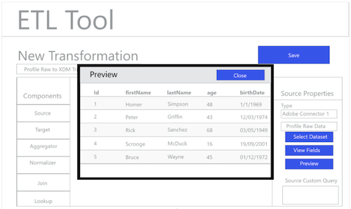

# ETL-Arbeitsablauf

Verschiedene Werkzeuge für Extract, Transform und Load (ETL) können sich im Format unterscheiden, aber die meisten bieten ähnliche Funktionen, um die Kombination mehrerer Datenquellen zu unterstützen.

## ETL-Tool-Beispiel

Die folgenden Diagramme bieten Beispiele für gängige ETL-Aktionen und eine allgemeine Benutzererfahrung, die auf Standardinteraktionen basiert. Diese Bilder können einfach an eine bestimmte ETL-Benutzererfahrung angepasst werden.

Die folgenden Aktionen werden in den im [ETL-Integrationsleitfaden](home.md)beschriebenen Schritten beschrieben. Einige Schritte verweisen auf bestimmte &quot;Abbildungen&quot;, andere beschreiben ähnliche Aktionen wie der hier dargestellte Arbeitsablauf.

### Abbildung 1: Konfigurieren des neuen Adobe Experience Platform Connector:

### Abbildung 2: Aktivierung des Experience Platform Connector:

### Abbildung 3: Benutzeroberfläche des ETL Transformation Management:

### Abbildung 4: Benutzeroberfläche &quot;Neue Transformation&quot;mit Experience Platform Connection:

### Abbildung 5: Durchsuchen von Quell-Experience-Plattform-Datensätzen:

### Abbildung 6: Metadaten und Musterdaten aus dem Datensatz in der ETL-Benutzeroberfläche:

### Abbildung 7: Anzeigen von Feldinformationen aus Datasets im Schema:

### Abbildung 8: Anzeigen einer Vorschau von Daten aus Datasets

### Abbildung 9: Definieren der Parameter für die Datensynchronisierung für den Vorgang der Transformation:

### Abbildung 10: Definieren des Datasets zur Zielgruppe des Experience Data Model (XDM):

### Abbildung 11: Anzeigen der hierarchischen XDM-Schema und Metadaten zur Unterstützung von Zuordnungen/Transformationen:

### Abbildung 12: Speichern und Ausführen/Planen der Transformationen:

