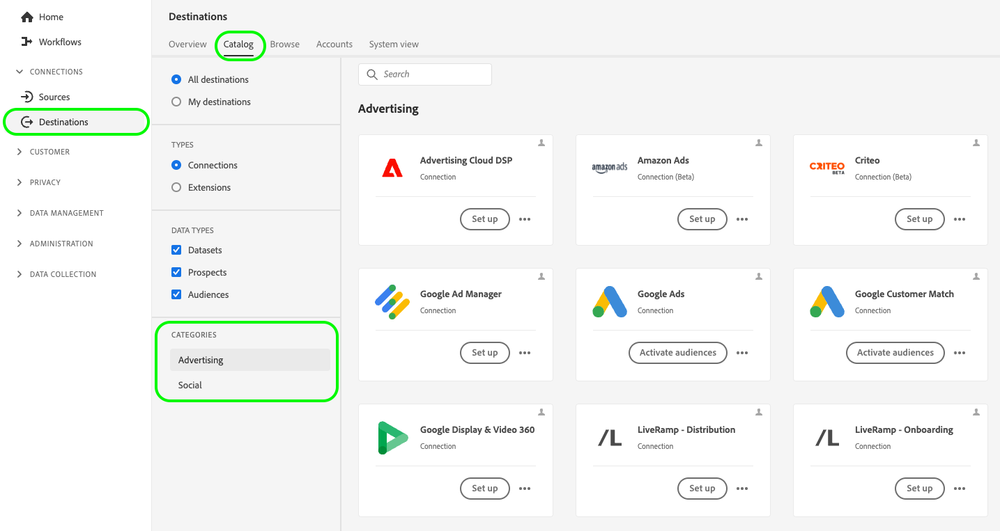
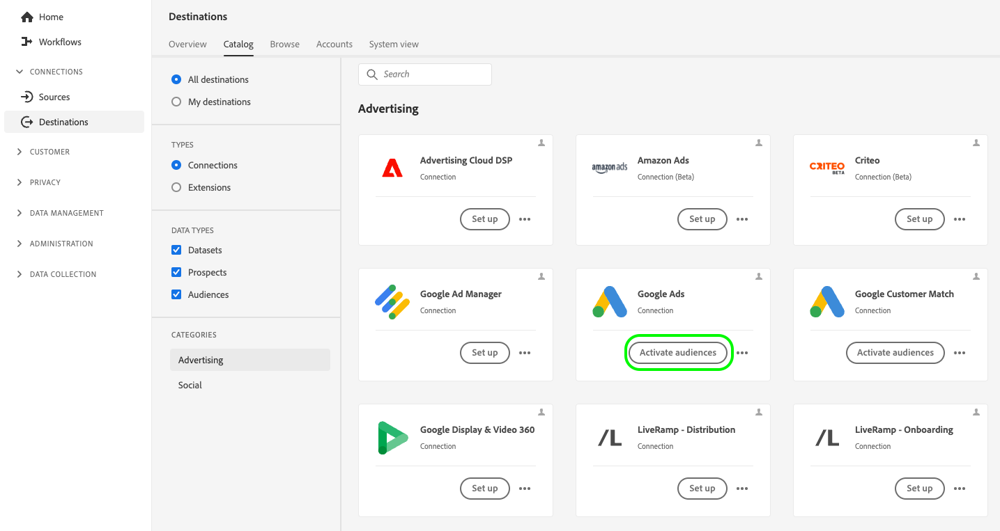

# Zielgruppen durch erweiterte Audience Manager-Aktivierung aktivieren

Auf dieser Seite wird der End-to-End-Workflow beschrieben, den Sie befolgen müssen, um Zielgruppen vom Audience Manager für die von der erweiterten Aktivierung unterstützten Zielplattformen zu aktivieren.

## Voraussetzungen {#before-you-begin}

Bei den in diesem Handbuch beschriebenen Schritten wird davon ausgegangen, dass Sie die Seite [Erweiterte Aktivierung - Übersicht](overview.md) gelesen und bestätigt haben, dass Sie die Voraussetzungen für die Zielgruppenaktivierung erfüllen.

>[!IMPORTANT]
>
>Um Zielgruppen über [!DNL Expanded Activation] zu aktivieren, stellen Sie sicher, dass Ihre Audience Manager-Zielgruppen auf (**E-Mail-Adressen)**. Weitere Informationen finden Sie [Voraussetzungen](overview.md#prerequisites).

## 1. Schritt: Quellverbindung des Audience Managers konfigurieren {#configure-source}

Der [Audience Manager-Quell-Connector](../sources/connectors/adobe-applications/audience-manager.md) sendet in Adobe Audience Manager erfasste Zielgruppendaten zur Aktivierung auf den Zielplattformen, die von der erweiterten Aktivierung unterstützt werden.

Befolgen Sie die Anleitung zum [ einer Audience Manager-Quellverbindung ](../sources/tutorials/ui/create/adobe-applications/audience-manager.md) Konfigurieren Ihres Quell-Connectors.

>[!TIP]
>
>Der Adobe Audience Manager-Quell-Connector ist der einzige Quell-Connector, der in der erweiterten Aktivierung verfügbar ist.
>
>Wenn Sie Zielgruppen basierend auf zusätzlichen Kennungen aufnehmen möchten, müssen Sie eine Edition von [Real-Time CDP](../rtcdp/overview.md) erwerben. Weitere Informationen erhalten Sie von Ihrem Adobe-Support-Mitarbeiter.

### Anzeigen und Überwachen aufgenommener Zielgruppen {#view-audiences}

Die Zielgruppen, die Sie über den Audience Manager in die erweiterte Aktivierung einbringen, können im Dashboard **[!UICONTROL Zielgruppen]** angezeigt werden.

Um Ihre Zielgruppen anzuzeigen, gehen Sie zu **[!UICONTROL Kunde]** > **[!UICONTROL Zielgruppen]** > **[!UICONTROL Durchsuchen]**.

>[!IMPORTANT]
>
>* Es kann bis zu 48 Stunden dauern, bis Zielgruppen in der erweiterten Aktivierung vollständig ausgefüllt sind. Dies gilt auch für Aktualisierungen vorhandener Audience Manager-Zielgruppen.
>* Neu erstellte Audience Manager-Zielgruppen werden nicht automatisch in der erweiterten Aktivierung angezeigt. Um neue Segmente in Expanded Activation aufzunehmen, müssen Sie sie über den Audience Manager-Quell-Connector hinzufügen.

Nachdem Sie Ihren Audience Manager-Quell-Connector konfiguriert haben, fahren Sie mit [Schritt 2](#create-destination-connection) fort.

## Schritt 2: Erstellen einer neuen Zielverbindung {#create-destination-connection}

Bevor Sie Ihre Audience Manager-Zielgruppen an Ihre Zielplattform Ihrer Wahl senden können, müssen Sie zunächst eine Verbindung zu einer Zielplattform erstellen.

Navigieren Sie in der linken Seitenleiste zu **[!UICONTROL Verbindungen]** > **[!UICONTROL Ziele]** > **[!UICONTROL Katalog]**.

Die verfügbaren Zielkategorien für [!DNL Expanded Activation] sind [advertising](../destinations/catalog/advertising/overview.md) und [social](../destinations/catalog/social/overview.md).

Um eine neue Verbindung zu einer Zielplattform zu erstellen, folgen Sie der Anleitung [Erstellen einer neuen Zielverbindung](../destinations/ui/connect-destination.md). Gehen Sie dann zu [Schritt 3](#activate-audiences).

## Schritt 3: Aktivieren von Zielgruppen für Ihr Ziel {#activate-audiences}

Nachdem Sie erfolgreich [Audience Manager-Zielgruppen](#configure-source) aufgenommen und [eine neue Zielverbindung erstellt haben](#create-destination-connection) können Sie Ihre Zielgruppen jetzt für die Zielplattform Ihrer Wahl aktivieren.

Um Zielgruppen für Ihr Ziel zu aktivieren, folgen Sie der Anleitung [Aktivieren von Zielgruppen für Streaming-Ziele](../destinations/ui/activate-segment-streaming-destinations.md).

## Zielgruppenaktivierung überprüfen {#verify}

In der [Dokumentation zur Zielüberwachung](../dataflows/ui/monitor-destinations.md) finden Sie detaillierte Informationen darüber, wie Sie den Datenfluss zu Ihren Zielen überwachen.
