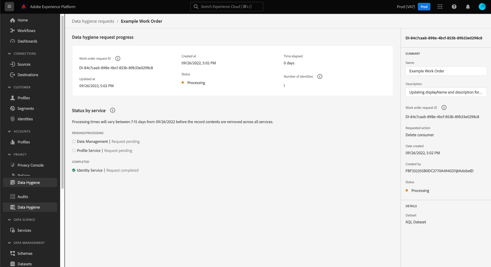

# Durchsuchen von Datenhygiene-Arbeitsaufträgen {#browse-work-orders}

>[!CONTEXTUALHELP]
>id="platform_hygiene_workorders"
>title="IDs für Arbeitsaufträge"
>abstract="Wenn eine Datenhygiene-Anfrage an das System gesendet wird, wird ein Arbeitsauftrag erstellt, um die angeforderte Aufgabe auszuführen. Anders ausgedrückt, ist ein Arbeitsauftrag ein spezifischer Datenhygiene-Prozess, der seinen aktuellen Status und andere zugehörige Details enthält. Bei der Erstellung eines Arbeitsauftrags wird diesem automatisch eine eigene eindeutige ID zugewiesen."
>text="See the data hygiene UI guide to learn more."

>[!IMPORTANT]
>
>Die Datenhygiene-Funktionen in Adobe Experience Platform sind derzeit nur für Organisationen verfügbar, die **Adobe Healthcare Shield** oder **Adobe Privacy &amp; Security Shield** erworben haben.

Wenn eine Datenhygiene-Anfrage an das System gesendet wird, wird ein Arbeitsauftrag erstellt, um die angeforderte Aufgabe auszuführen. Ein Arbeitsauftrag stellt einen spezifischen Datenhygiene-Prozess dar, z. B. das geplante Ablaufen eines Datensatzes, wobei sein aktueller Status und andere zugehörige Details enthalten sind.

In diesem Handbuch wird beschrieben, wie Sie bestehende Arbeitsaufträge in der Adobe Experience Platform-Benutzeroberfläche anzeigen und verwalten können.

## Auflisten und Filtern vorhandener Arbeitsaufträge

Wenn Sie zum ersten Mal auf den Arbeitsbereich **[!UICONTROL Datenhygiene]** in der Benutzeroberfläche zugreifen, wird eine Liste der vorhandenen Arbeitsaufträge mit allgemeinen Details angezeigt.

![Bild, das den Arbeitsbereich [!UICONTROL Datenhygiene] in der Platform-Benutzeroberfläche zeigt](../images/ui/browse/work-order-list.png)

In der Liste werden nur Arbeitsaufträge für jeweils eine Kategorie angezeigt. Auswählen **[!UICONTROL Verbraucher]** eine Liste mit Löschaufgaben für Datensätze anzuzeigen, und **[!UICONTROL Datensatz]** , um eine Liste der geplanten Datensatzabläufe anzuzeigen.

![Bild, das die Registerkarte [!UICONTROL Datensatz] zeigt](../images/ui/browse/dataset-tab.png)

Wählen Sie das Trichtersymbol () aus, um eine Liste von Filtern für die angezeigten Arbeitsaufträge aufzurufen.

Je nach angezeigtem Arbeitsauftrag sind unterschiedliche Filteroptionen verfügbar.

### Filter für Löschvorgänge von Datensätzen

Die folgenden Filter gelten für Löschanfragen zum Aufzeichnen von Löschanfragen:

| Filter | Beschreibung |
| --- | --- |
| [!UICONTROL Status] | Filtern Sie nach dem aktuellen Status des Arbeitsauftrags:<ul><li>**[!UICONTROL Abgeschlossen]**: Der Vorgang ist abgeschlossen.</li><li>**[!UICONTROL Fehlgeschlagen]**: Beim Vorgang ist ein Fehler aufgetreten und er konnte nicht abgeschlossen werden.</li><li>**[!UICONTROL Wird ausgeführt]**: Die Anfrage wurde gestartet und wird derzeit verarbeitet.</li></ul> |
| [!UICONTROL Erstellt am] | Filtern Sie nach dem Zeitpunkt, zu dem der Arbeitsauftrag erstellt wurde. |
| [!UICONTROL Aktualisierungsdatum] | Filtern Sie nach dem Zeitpunkt, zu dem der Arbeitsauftrag zuletzt aktualisiert wurde. Erstellungen werden als Aktualisierungen gezählt. |

### Filter für die Gültigkeit von Datensätzen

Die folgenden Filter gelten für Anfragen zur Gültigkeit von Datensätzen:

| Filter | Beschreibung |
| --- | --- |
| [!UICONTROL Status] | Filtern Sie nach dem aktuellen Status des Arbeitsauftrags:<ul><li>**[!UICONTROL Abgeschlossen]**: Der Vorgang ist abgeschlossen.</li><li>**[!UICONTROL Ausstehend]**: Der Vorgang wurde erstellt, aber noch nicht ausgeführt. Eine [Datensatz-Gültigkeitsanfrage](./dataset-expiration.md) nimmt diesen Status vor dem geplanten Löschdatum an. Zum Löschdatum ändert sich der Status auf [!UICONTROL Wird ausgeführt], sofern der Vorgang nicht zuvor bereits abgebrochen wurde.</li><li>**[!UICONTROL Wird ausgeführt]**: Die Datensatz-Gültigkeitsanfrage wurde gestartet und wird derzeit verarbeitet.</li><li>**[!UICONTROL Abgebrochen]**: Der Vorgang wurde im Rahmen einer manuellen Benutzeranfrage abgebrochen.</li></ul> |
| [!UICONTROL Erstellt am] | Filtern Sie nach dem Zeitpunkt, zu dem der Arbeitsauftrag erstellt wurde. |
| [!UICONTROL Ablaufdatum] | Filtern Sie Datensatz-Gültigkeitsanfragen nach dem geplanten Löschdatum für den jeweiligen Datensatz. |
| [!UICONTROL Aktualisierungsdatum] | Filtern Sie nach dem Zeitpunkt, zu dem der Arbeitsauftrag zuletzt aktualisiert wurde. Erstellungen und Abläufe werden als Aktualisierungen gezählt. |

{style=&quot;table-layout:auto&quot;}

## Anzeigen der Details eines Arbeitsauftrags {#view-details}

>[!CONTEXTUALHELP]
>id="platform_hygiene_statusbyservice"
>title="Status nach Service"
>abstract="Anfragen zur Datenhygiene werden von mehreren Services von Experience Platform unabhängig voneinander bearbeitet. In diesem Abschnitt wird der aktuelle Verarbeitungsstatus der Anfrage für jeden einzelnen Service beschrieben. Weitere Informationen finden Sie im Handbuch zur Datenhygiene-Benutzeroberfläche."

>[!CONTEXTUALHELP]
>id="platform_hygiene_numberofidentities"
>title="Anzahl der Identitäten"
>abstract="Die Anzahl der Identitäten, deren Datensätze im Rahmen dieses Arbeitsauftrags aktualisiert oder gelöscht werden mussten. Die in der Zählung enthaltenen Identitäten müssen nicht unbedingt in den betroffenen Datensätzen vorhanden sein. Weitere Informationen finden Sie im Handbuch zur Datenhygiene-Benutzeroberfläche."

>[!CONTEXTUALHELP]
>id="platform_hygiene_responsemessages"
>title="Löschantwort aufzeichnen"
>abstract="Wenn ein Prozess zum Löschen von Datensätzen eine Antwort vom System erhält, werden diese Meldungen unter der **[!UICONTROL Ergebnis]** Abschnitt. Wenn während der Bearbeitung eines Arbeitsauftrags ein Problem auftritt, werden alle relevanten Fehlermeldungen in diesem Abschnitt angezeigt, um Ihnen bei der Fehlersuche zu helfen. Weitere Informationen finden Sie im Handbuch zur Datenhygiene-Benutzeroberfläche."

Wählen Sie die ID eines aufgelisteten Arbeitsauftrags aus, um dessen Details anzuzeigen.

Je nach ausgewähltem Typ des Arbeitsauftrags sind unterschiedliche Informationen und Steuerelemente verfügbar. Diese werden in den folgenden Abschnitten erläutert.

### Löschdetails aufzeichnen {#record-delete}

Die Details einer Anfrage zum Löschen von Datensätzen umfassen den aktuellen Status und die seit der Anforderung verstrichene Zeit. Jede Anfrage enthält auch den Abschnitt **[!UICONTROL Status nach Service]**, der individuelle Statusdetails zu jedem nachgelagerten Service bereitstellt, der an der Löschung beteiligt ist. In der rechten Leiste können Sie mithilfe von Steuerelementen den Namen und die Beschreibung der Arbeitsaufträge aktualisieren.

### Details zur Datensatzgültigkeit {#dataset-expiration}

Die Detailseite für eine Datensatz-Gültigkeit enthält Informationen zu Standardattributen, einschließlich des geplanten Ablaufdatums und der vor der Löschung verbleibenden Tage. In der rechten Leiste können Sie Steuerelemente verwenden, um die Gültigkeit zu bearbeiten oder abzubrechen.

## Nächste Schritte

In diesem Handbuch wurde beschrieben, wie Sie vorhandene Datenhygiene-Arbeitsaufträge in der Platform-Benutzeroberfläche anzeigen und verwalten können. Informationen zum Erstellen eigener Arbeitsaufträge finden Sie in der folgenden Dokumentation:

* [Verwalten von Datensatzgültigkeiten](./dataset-expiration.md)
* [Löschen von Datensätzen verwalten](./record-delete.md)
