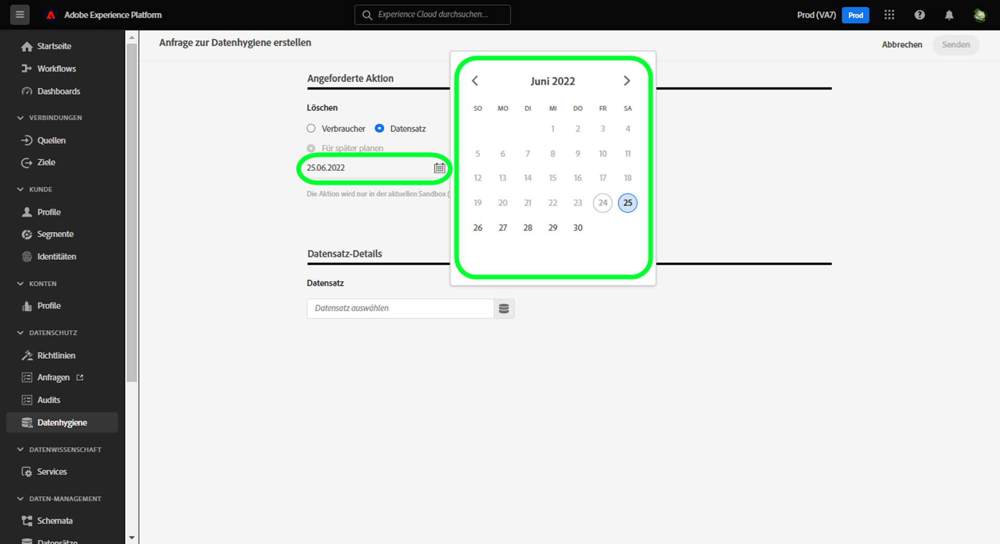

# Automatisierte Datensatzablauffristen {#dataset-expiration}

>[!CONTEXTUALHELP]
>id="platform_privacyConsole_scheduleDatasetExpiration_description"
>title="Löschen unerwünschter oder abgelaufener Kundendatensätze"
>abstract="<h2>Beschreibung</h2>
Um den Lebenszyklus der Experience Platform-Daten unabhängig von der Einhaltung gesetzlicher Vorschriften zu verwalten, können Kundendatensätze gelöscht und Ablaufdaten für Datensätze geplant werden. Informationen zum Erstellen oder Verwalten von Anfragen betroffener Personen sind im Abschnitt über den Anwendungsfall „Berücksichtigen von Datenschutzanträgen betroffener Personen“ zu finden.
"

Die [[!UICONTROL Lebenszyklus der Daten] Arbeitsbereich](./overview.md) In der Adobe Experience Platform-Benutzeroberfläche können Sie die Ablaufzeit für Datensätze planen. Wenn ein Datensatz sein Ablaufdatum erreicht, starten der Data Lake, der Identity Service und das Echtzeit-Kundenprofil separate Prozesse, um den Inhalt des Datensatzes aus den entsprechenden Services zu entfernen. Sobald die Daten aus allen drei Services gelöscht wurden, wird der Ablauf als abgeschlossen markiert.

>[!WARNING]
>
>Wenn ein Datensatz ausläuft, müssen alle Datenflüsse, die Daten in diesen Datensatz einspeisen, manuell geändert werden, damit Ihre nachgeschalteten Workflows nicht beeinträchtigt werden.

In diesem Dokument wird beschrieben, wie Sie die Ablaufzeit von Datensätzen in der Platform-Benutzeroberfläche planen und automatisieren.

>[!NOTE]
>
>Der Datensatzablauf löscht derzeit keine Daten aus dem Adobe Experience Platform Edge Network. Es besteht jedoch keine Möglichkeit, dass Daten innerhalb des Edge-Netzwerks verbleiben, nachdem der Datensatz auf abläuft. Dies liegt daran, dass sich die 15-Tage-Service-Lizenzvereinbarung für den Ablauf von Datensätzen mit dem 14-Tage-Zeitraum überschneidet, in dem Daten im Edge-Netzwerk vorhanden sind, bevor sie verworfen werden.

## Planen einer Datensatzgültigkeit {#schedule-dataset-expiration}

>[!CONTEXTUALHELP]
>id="platform_privacyConsole_scheduleDatasetExpiration_instructions"
>title="Anweisungen"
>abstract="<ul><li>Wählen Sie im linken Navigationsbereich <a href="https://experienceleague.adobe.com/docs/experience-platform/hygiene/ui/overview.html?lang=de">Datenlebenszyklus</a> und anschließend die Option <b>Anfrage erstellen</b> aus.</li><li>Wenn Sie Datensätze löschen möchten:</li>   <li>Wählen Sie <b>Datensatz</b> aus.</li>   <li>Wählen Sie einen bestimmten Datensatz aus, aus dem Datensätze gelöscht werden sollen, oder wählen Sie die Option aus, sie aus allen Datensätzen zu löschen.</li>   <li>Geben Sie die Identitäten der Personen an, deren Datensätze gelöscht werden sollen. Wählen Sie <b>Identität hinzufügen</b> aus, um die Identitäten einzeln anzugeben, oder wählen Sie <b>Dateien auswählen</b> aus, um stattdessen eine JSON-Datei mit Identitäten hochzuladen.</li>   <li>Wählen Sie bei Bedarf <b>Vorlage</b> aus, um das erwartete Format der JSON-Datei anzuzeigen.</li><li>Anweisungen zum <a href="https://experienceleague.adobe.com/docs/experience-platform/hygiene/ui/dataset-expiration.html?lang=de#schedule-dataset-expiration">Planen von Ablaufdaten für Datensätze</a> finden Sie in der Dokumentation.</li></ul>"

Um eine Anforderung zu erstellen, wählen Sie **[!UICONTROL Anforderung erstellen]** von der Hauptseite im Arbeitsbereich aus.

>[!IMPORTANT]
>
>Real-Time CDP-, Adobe Journey Optimizer- und Customer Journey Analytics-Benutzer haben 20 ausstehende geplante Aufträge zur Ablaufzeit von Datensätzen. Gesundheitsschild- und Datenschutz- und Sicherheitsschild-Benutzer haben 50 ausstehende geplante Arbeitsaufträge zum Ablauf von Datensätzen. Das bedeutet, dass Sie planen können, 20 oder 50 Datensätze gleichzeitig zu löschen. Wenn Sie beispielsweise 20 geplante Datensatzabläufe haben und ein Datensatz morgen gelöscht werden soll, können Sie keine weiteren Abläufe festlegen, bis dieser Datensatz gelöscht wurde.

![Die [!UICONTROL Lebenszyklus der Daten] Arbeitsbereich mit [!UICONTROL Anforderung erstellen] hervorgehoben.](../images/ui/ttl/create-request-button.png)

Der Workflow für die Anforderungserstellung wird angezeigt. Unter dem [!UICONTROL Angeforderte Aktion] Bereich, wählen Sie **[!UICONTROL Datensatz löschen]** , um die Steuerelemente für die Ablaufplanung von Datensätzen zu aktualisieren.

![Der Workflow für die Anfrageerstellung mit dem [!UICONTROL Datensatz löschen] hervorgehoben.](../images/ui/ttl/dataset-selected.png)

### Auswählen von Datum und Datensatz {#select-date-and-dataset}

Wählen Sie im Abschnitt **[!UICONTROL Angeforderte Aktion]** ein Datum aus, an dem der Datensatz gelöscht werden soll. Sie können das Datum manuell eingeben (im Format `mm/dd/yyyy`) oder wählen Sie das Kalendersymbol (), um das Datum aus einem Dialogfeld auszuwählen.

Weiter, unter **[!UICONTROL Datensatzdetails]** Wählen Sie das Datenbanksymbol (), um ein Dialogfeld zur Datensatzauswahl zu öffnen. Wählen Sie aus der Liste einen Datensatz aus, auf den die Gültigkeit angewendet werden soll, und klicken Sie danach auf **[!UICONTROL Fertig]**.

![Die [!UICONTROL Datensatz auswählen] mit einem ausgewählten Datensatz und [!UICONTROL Fertig] hervorgehoben.](../images/ui/ttl/select-dataset.png)

>[!NOTE]
>
>Es werden nur Datensätze angezeigt, die zur aktuellen Sandbox gehören.

### Senden der Anfrage {#submit-request}

Der Abschnitt [!UICONTROL Datensatzdetails] wird ausgefüllt und enthält die primäre Identität und das Schema für den ausgewählten Datensatz. Geben Sie unter **[!UICONTROL Anfrageeinstellungen]** einen Namen und eine optionale Beschreibung für die Anfrage ein und wählen Sie dann **[!UICONTROL Senden]**.

![Eine abgeschlossene Datensatzablaufanfrage mit der [!UICONTROL Anforderungseinstellungen] und [!UICONTROL Einsenden] hervorgehoben.](../images/ui/ttl/submit.png)

A [!UICONTROL Validierungsanfrage] angezeigt. Sie werden aufgefordert, den Namen des Datensatzes und das Datum zu bestätigen, ab dem der Datensatz gelöscht wird. Wählen Sie **[!UICONTROL Senden]** aus, um fortzufahren.

Nachdem die Anfrage gesendet wurde, wird eine Arbeitsreihenfolge erstellt und auf der Registerkarte &quot;Haupt&quot;im [!UICONTROL Lebenszyklus der Daten] Arbeitsbereich. Hier können Sie den Fortschritt des Arbeitsauftrags überwachen.

>[!NOTE]
>
>Der Abschnitt mit der Übersicht über [Timelines und Transparenz](../home.md#dataset-expiration-transparency) enthält Details dazu, wie die Gültigkeit von Datensätzen verarbeitet wird, nachdem sie abgelaufen ist.

## Bearbeiten oder Abbrechen einer Datensatzgültigkeit {#edit-or-cancel}

Um eine Datensatzgültigkeit zu bearbeiten oder abzubrechen, wählen Sie auf der Hauptseite des Arbeitsbereichs **[!UICONTROL Datensatz]** und danach die jeweilige Datensatzgültigkeit aus der Liste aus.

Auf der Detailseite der Datensatzgültigkeit zeigt die rechte Leiste Steuerelemente zum Bearbeiten oder Abbrechen des geplanten Löschvorgangs an.

## Nächste Schritte

In diesem Dokument wurde beschrieben, wie Sie in der Experience Platform-Benutzeroberfläche einen Zeitplan für Datensatzgültigkeiten erstellen können. Informationen zur Durchführung anderer Aufgaben zur Datenminimierung in der Benutzeroberfläche finden Sie im Abschnitt [Übersicht über die Benutzeroberfläche für den Lebenszyklus von Daten](./overview.md).

Informationen zum Planen von Datensatzabläufen mithilfe der Data Hygiene API finden Sie im Abschnitt [Endpunkt-Anleitung zum Ablauf von Datensätzen](../api/dataset-expiration.md).
