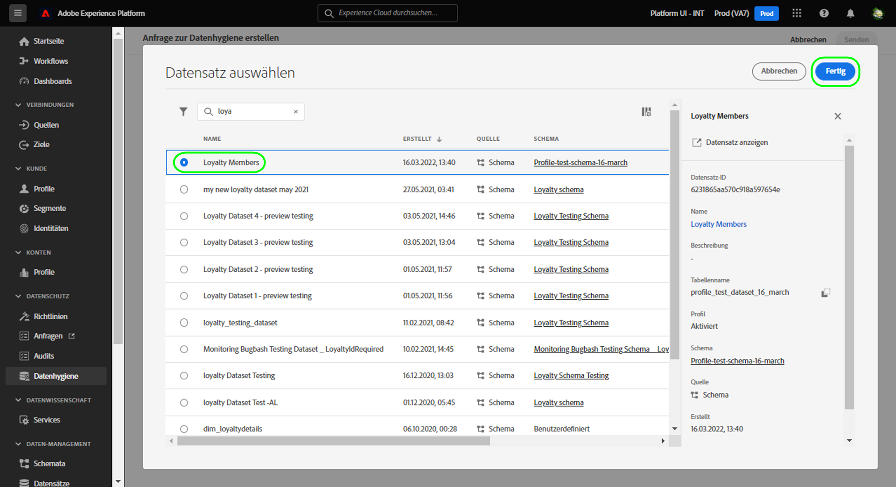

# Verwalten von Datensatzgültigkeiten {#dataset-expiration}

>[!CONTEXTUALHELP]
>id="platform_privacyConsole_scheduleDatasetExpiration_description"
>title="Löschen unerwünschter oder abgelaufener Kundendatensätze"
>abstract="<h2>Beschreibung</h2>
Um den Lebenszyklus der Experience Platform-Daten unabhängig von der Einhaltung gesetzlicher Vorschriften zu verwalten, können Kundendatensätze gelöscht und Ablaufdaten für Datensätze geplant werden. Informationen zum Erstellen oder Verwalten von Anfragen betroffener Personen sind im Abschnitt über den Anwendungsfall „Berücksichtigen von Datenschutzanträgen betroffener Personen“ zu finden.
"

>[!IMPORTANT]
>
>Die Datenhygiene-Funktionen in Adobe Experience Platform sind derzeit nur für Organisationen verfügbar, die **Adobe Healthcare Shield** oder **Adobe Privacy &amp; Security Shield** erworben haben. Diese Funktionen sollen in naher Zukunft allgemein veröffentlicht werden. Weitere Informationen zu der bevorstehenden Verfügbarkeit erhalten Sie von der Adobe-Kundenbetreuung. Sie können jedoch [über die Benutzeroberfläche [!UICONTROL Datensätze] sofort Datensätze löschen](../../catalog/datasets/user-guide.md#delete).

Der Arbeitsbereich [[!UICONTROL Datenhygiene]](./overview.md) in der Adobe Experience Platform-Benutzeroberfläche bietet Ihnen die Möglichkeit, die Gültigkeitsdauer für Datensätze festzulegen. Wenn ein Datensatz sein Ablaufdatum erreicht, starten der Data Lake, der Identity Service und das Echtzeit-Kundenprofil separate Prozesse, um den Inhalt des Datensatzes aus den entsprechenden Services zu entfernen. Sobald die Daten aus allen drei Services gelöscht wurden, wird der Ablauf als abgeschlossen markiert.

>[!WARNING]
>
>Wenn ein Datensatz ausläuft, müssen alle Datenflüsse, die Daten in diesen Datensatz einspeisen, manuell geändert werden, damit Ihre nachgeschalteten Workflows nicht beeinträchtigt werden.

In diesem Dokument wird beschrieben, wie Sie Datensatzgültigkeiten in der Platform-Benutzeroberfläche planen und verwalten.

## Planen einer Datensatzgültigkeit {#schedule-dataset-expiration}

>[!CONTEXTUALHELP]
>id="platform_privacyConsole_scheduleDatasetExpiration_instructions"
>title="Anleitung"
>abstract="<ul><li>Wählen Sie im linken Navigationsbereich <a href="https://experienceleague.adobe.com/docs/experience-platform/hygiene/ui/overview.html?lang=de">Datenhygiene</a> und anschließend die Option <b>Anforderung erstellen</b> aus.</li><li>Wenn Sie Datensätze löschen möchten:</li>   <li>Wählen Sie <b>Datensatz</b> aus.</li>   <li>Wählen Sie einen bestimmten Datensatz aus, aus dem Datensätze gelöscht werden sollen, oder wählen Sie die Option aus, sie aus allen Datensätzen zu löschen.</li>   <li>Geben Sie die Identitäten der Personen an, deren Datensätze gelöscht werden sollen. Wählen Sie <b>Identität hinzufügen</b> aus, um die Identitäten einzeln anzugeben, oder wählen Sie <b>Dateien auswählen</b> aus, um stattdessen eine JSON-Datei mit Identitäten hochzuladen.</li>   <li>Wählen Sie bei Bedarf <b>Vorlage</b> aus, um das erwartete Format der JSON-Datei anzuzeigen.</li><li>Anweisungen zum <a href="https://experienceleague.adobe.com/docs/experience-platform/hygiene/ui/dataset-expiration.html#schedule-dataset-expiration?lang=de">Planen von Ablaufdaten für Datensätze</a> finden Sie in der Dokumentation.</li></ul>"

Um eine neue Anfrage zu erstellen, wählen Sie auf der Hauptseite im Arbeitsbereich die Option **[!UICONTROL Anfrage erstellen]** aus.

![Bild, das die ausgewählte Schaltfläche [!UICONTROL Anfrage erstellen] zeigt](../images/ui/ttl/create-request-button.png)

Daraufhin öffnet sich das Dialogfeld für die Anfrageerstellung. Wählen Sie im Abschnitt **[!UICONTROL Angeforderte Aktion]** die Option **[!UICONTROL Datensatz löschen]** aus, um die verfügbaren Steuerelemente für die Planung der Datensatzgültigkeit zu aktualisieren.

![Bild, das den ausgewählten Button [!UICONTROL Anfrage erstellen] zeigt](../images/ui/ttl/dataset-selected.png)

### Auswählen von Datum und Datensatz

Daraufhin öffnet sich das Dialogfeld für die Anfrageerstellung. Wählen Sie im Abschnitt **[!UICONTROL Angeforderte Aktion]** ein Datum aus, an dem der Datensatz gelöscht werden soll. Sie können das Datum manuell eingeben (im Format `mm/dd/yyyy`) oder das Kalendersymbol anklicken () und dann das Datum aus einem Dialogfeld auswählen.

Wählen Sie danach unter **[!UICONTROL Datensatzdetails]** das Datenbanksymbol (), um ein Dialogfeld zur Datensatzauswahl zu öffnen. Wählen Sie aus der Liste einen Datensatz aus, auf den die Gültigkeit angewendet werden soll, und klicken Sie danach auf **[!UICONTROL Fertig]**.

>[!NOTE]
>
>Es werden nur Datensätze angezeigt, die zur aktuellen Sandbox gehören.

### Senden der Anfrage

Der Abschnitt [!UICONTROL Datensatzdetails] wird ausgefüllt und enthält die primäre Identität und das Schema für den ausgewählten Datensatz. Geben Sie unter **[!UICONTROL Anfrageeinstellungen]** einen Namen und eine optionale Beschreibung für die Anfrage ein und wählen Sie dann **[!UICONTROL Senden]**.

![Bild, das die ausgewählte Schaltfläche [!UICONTROL Senden] zeigt](../images/ui/ttl/submit.png)

Sie werden aufgefordert, das Datum zu bestätigen, an dem der Datensatz gelöscht werden soll. Wählen Sie **[!UICONTROL Senden]** aus, um fortzufahren.

Nachdem die Anfrage übermittelt wurde, wird ein Arbeitsauftrag erstellt und auf der Hauptregisterkarte des Arbeitsbereichs [!UICONTROL Datenhygiene] angezeigt. Hier können Sie den Fortschritt des Arbeitsauftrags überwachen.

>[!NOTE]
>
>Der Abschnitt mit der Übersicht über [Timelines und Transparenz](../home.md#dataset-expiration-transparency) enthält Details dazu, wie die Gültigkeit von Datensätzen verarbeitet wird, nachdem sie abgelaufen ist.

## Bearbeiten oder Abbrechen einer Datensatzgültigkeit

Um eine Datensatzgültigkeit zu bearbeiten oder abzubrechen, wählen Sie auf der Hauptseite des Arbeitsbereichs **[!UICONTROL Datensatz]** und danach die jeweilige Datensatzgültigkeit aus der Liste aus.

Auf der Detailseite der Datensatzgültigkeit zeigt die rechte Leiste Steuerelemente zum Bearbeiten oder Abbrechen des geplanten Löschvorgangs an.

## Nächste Schritte

In diesem Dokument wurde beschrieben, wie Sie in der Experience Platform-Benutzeroberfläche einen Zeitplan für Datensatzgültigkeiten erstellen können. Weitere Informationen zur Durchführung anderer Datenhygiene-Aufgaben in der Benutzeroberfläche finden Sie im Abschnitt [Übersicht über die Datenhygiene-Benutzeroberfläche](./overview.md).

Informationen zum Planen von Datensatzgültigkeiten mithilfe der Datenhygiene-API finden Sie im [Handbuch zum Datensatzgültigkeits-Endpunkt](../api/dataset-expiration.md).
