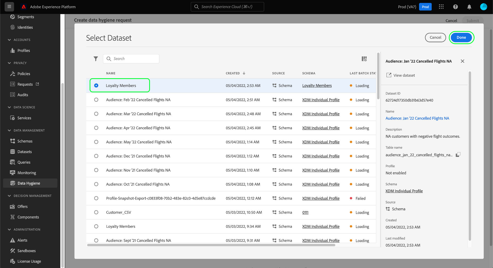

# Verwalten von Datensatzabläufen

>[!IMPORTANT]
>
>Die Datenhygiene-Funktionen in Adobe Experience Platform sind derzeit nur für Organisationen verfügbar, die Healthcare Shield erworben haben.

Die [[!UICONTROL Datenhygiene] Arbeitsbereich](./overview.md) In der Adobe Experience Platform-Benutzeroberfläche können Sie einen Ablauf des Datensatzes planen. Wenn ein Datensatz sein Ablaufdatum erreicht, beginnen der Data Lake, der Identity Service und das Echtzeit-Kundenprofil separate Prozesse, um den Inhalt des Datensatzes aus den entsprechenden Diensten zu entfernen. Sobald die Daten aus allen drei Diensten gelöscht wurden, wird der Ablauf als abgeschlossen markiert.

In diesem Dokument wird beschrieben, wie Sie die Ablaufdaten von Datensätzen in der Platform-Benutzeroberfläche planen und verwalten.

## Datensatz-Ablaufdatum planen

Um eine neue Anfrage zu erstellen, wählen Sie auf der Hauptseite im Arbeitsbereich die Option **[!UICONTROL Anfrage erstellen]** aus.

![Bild, das die ausgewählte Schaltfläche [!UICONTROL Anfrage erstellen] zeigt](../images/ui/ttl/create-request-button.png)

<!-- The request creation dialog appears. Under the **[!UICONTROL Action]** section, select **[!UICONTROL Dataset]** to update the available controls for dataset expiration scheduling-->

### Auswählen von Datum und Datensatz

Daraufhin öffnet sich das Dialogfeld für die Anfrageerstellung. Wählen Sie im Abschnitt **[!UICONTROL Aktion]** ein Datum aus, an dem der Datensatz gelöscht werden soll. Sie können das Datum manuell eingeben (im Format `mm/dd/yyyy`) oder das Kalendersymbol anklicken () und dann das Datum aus einem Dialogfeld auswählen.

Wählen Sie danach unter **[!UICONTROL Datensatzdetails]** das Datenbanksymbol (), um ein Dialogfeld zur Datensatzauswahl zu öffnen. Wählen Sie einen Datensatz aus der Liste aus, auf den die Gültigkeit angewendet werden soll, und wählen Sie dann **[!UICONTROL Fertig]**.

>[!NOTE]
>
>Es werden nur Datensätze angezeigt, die zur aktuellen Sandbox gehören.

### Senden der Anfrage

Nachdem Sie einen Datensatz und ein Ablaufdatum ausgewählt haben, wählen Sie **[!UICONTROL Einsenden]**.

![Bild, das die ausgewählte Schaltfläche [!UICONTROL Senden] zeigt](../images/ui/ttl/submit.png)

Sie werden aufgefordert, das Datum zu bestätigen, an dem der Datensatz gelöscht werden soll. Wählen Sie **[!UICONTROL Senden]** aus, um fortzufahren.

Nachdem die Anfrage übermittelt wurde, wird ein Arbeitsauftrag erstellt und auf der Hauptregisterkarte des Arbeitsbereichs [!UICONTROL Datenhygiene] angezeigt. Hier können Sie den Fortschritt des Arbeitsauftrags überwachen.

## Bearbeiten oder Abbrechen eines Datensatzablaufs

Um den Ablauf eines Datensatzes zu bearbeiten oder abzubrechen, wählen Sie **[!UICONTROL Datensatz]** auf der Hauptseite des Arbeitsbereichs und wählen Sie den Ablauf des Datensatzes aus der Liste aus.

Auf der Detailseite des Datensatzablaufs zeigt die rechte Leiste Steuerelemente zum Bearbeiten oder Abbrechen des geplanten Löschvorgangs an.

## Nächste Schritte

In diesem Dokument wurde beschrieben, wie Sie die Ablaufzeit von Datensätzen in der Experience Platform-Benutzeroberfläche planen. Informationen zum Planen von Datensatzabläufen mithilfe der Data Hygiene-API finden Sie im Abschnitt [Endpunkt-Anleitung zum Ablauf von Datensätzen](../api/dataset-expiration.md).
