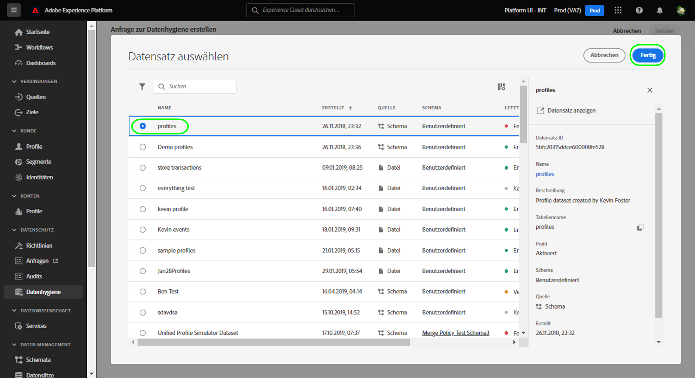
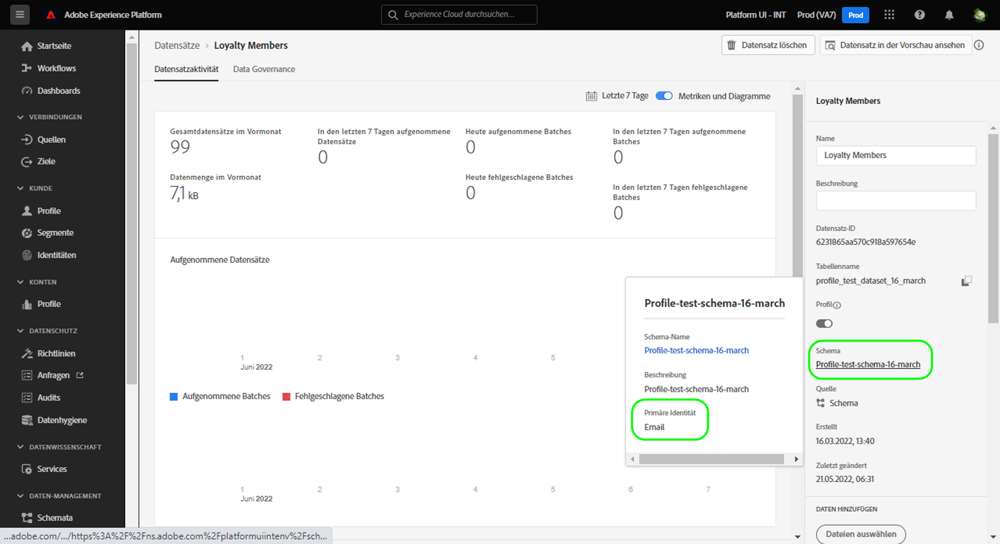
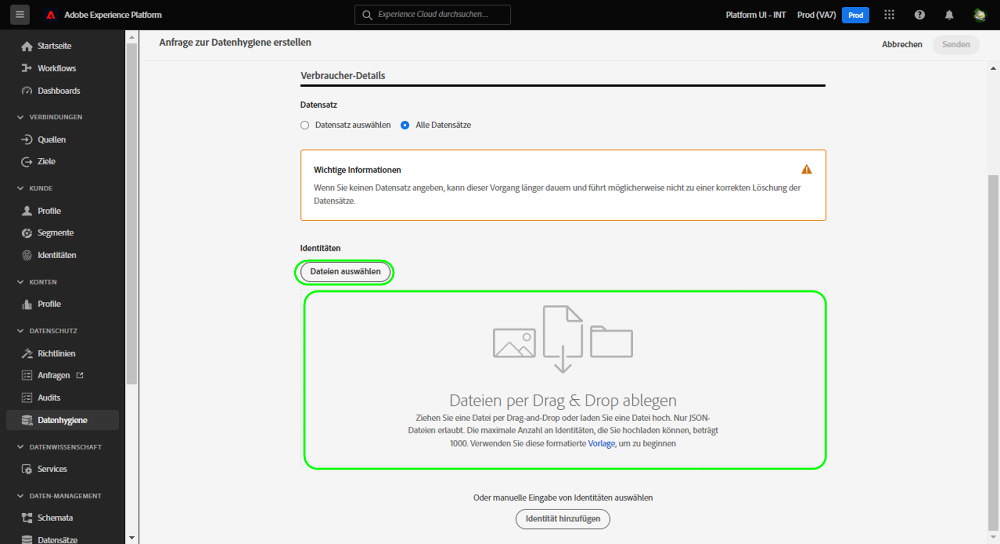
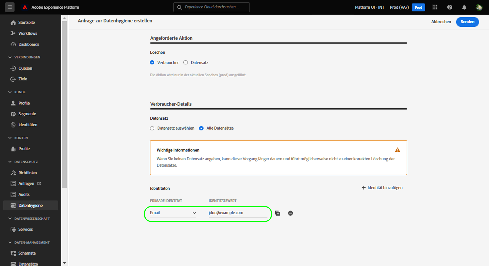
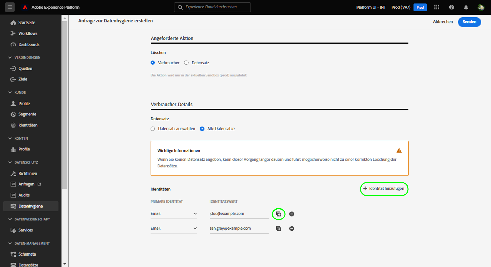
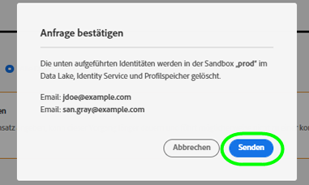

# Löschen von Verbraucherdatensätzen

>[!IMPORTANT]
>
>Die Datenhygiene-Funktionen in Adobe Experience Platform sind derzeit nur für Organisationen verfügbar, die Adobe Shield for Healthcare erworben haben.

Im [[!UICONTROL Datenhygiene]-Arbeitsbereich](./overview.md) in der Adobe Experience Platform-Benutzeroberfläche können Sie Verbraucherdatensätze löschen, die vom Identity Service und Echtzeit-Kundenprofil verwendet werden.

## Voraussetzungen

Das Löschen von Verbraucherdatensätzen setzt ein Verständnis der Funktionsweise von Identitätsfeldern in Experience Platform voraus. Insbesondere müssen Sie die primären Identitätswerte der Verbraucher kennen, deren Daten Sie löschen möchten. Diese Werte hängen vom Datensatz (oder den Datensätzen) ab, aus dem Sie die Daten löschen möchten.

Weitere Informationen zu Identitäten in Platform finden Sie in der folgenden Dokumentation:

* [Adobe Experience Platform Identity Service](../../identity-service/home.md): Führt Identitäten zwischen Geräten und Systemen zusammen und verknüpft Datensätze anhand der Identitätsfelder, die von den entsprechenden XDM-Schemas definiert werden.
   * [Identity-Namespaces](../../identity-service/namespaces.md): In Identity-Namespaces werden die verschiedenen Arten von Identitätsinformationen definiert, die sich auf eine einzelne Person beziehen können. Sie sind eine erforderliche Komponente für jedes Identitätsfeld.
* [Echtzeit-Kundenprofil](../../profile/home.md): Nutzt Verbraucher-Identitätsdiagramme, um vereinheitlichte Verbraucherprofile auf der Grundlage aggregierter Daten aus mehreren Quellen bereitzustellen, die nahezu in Echtzeit aktualisiert werden.
* [Experience-Datenmodell (XDM)](../../xdm/home.md): Stellt Standarddefinitionen und -strukturen für Platform-Daten durch die Verwendung von Schemas bereit. Alle Platform-Datensätze entsprechen einem bestimmten XDM-Schema und das Schema definiert, welche Felder Identitäten sind.
   * [Identitätsfelder](../../xdm/ui/fields/identity.md): Erfahren Sie, wie ein Identitätsfeld in einem XDM-Schema definiert wird.

## Erstellen einer neuen Anfrage

Wählen Sie zunächst auf der Hauptseite im Arbeitsbereich die Option **[!UICONTROL Anfrage erstellen]** aus.

![Bild, das die ausgewählte Schaltfläche [!UICONTROL Anfrage erstellen] zeigt](../images/ui/delete-consumer/create-request-button.png)

Das Dialogfeld für die Anfrageerstellung öffnet sich. Standardmäßig ist die Option **[!UICONTROL Verbraucher]** im Abschnitt **[!UICONTROL Aktion]** ausgewählt. Lassen Sie diese Option aktiviert.


## Auswählen von Datensätzen

Geben Sie im Abschnitt **[!UICONTROL Verbraucherdetails]** an, ob Sie Verbraucherdaten aus einem oder allen Datensätzen löschen möchten.

Wenn Sie **[!UICONTROL Datensatz auswählen]** auswählen, wird das Datenbanksymbol () angezeigt und ein Dialogfeld öffnet sich, in dem Sie den gewünschten Datensatz aus der Liste auswählen können.



Wenn Sie Verbraucherdaten aus allen Datensätzen löschen möchten, wählen Sie **[!UICONTROL Alle Datensätze]** aus.

![Bild, das die ausgewählte Option [!UICONTROL Alle Datensätze] zeigt](../images/ui/delete-consumer/all-datasets.png)

>[!NOTE]
>
>Wenn Sie die Option **[!UICONTROL Alle Datensätze]** auswählen, kann es sein, dass der Löschvorgang länger dauert und möglicherweise nicht zu einer korrekten Löschung der Datensätze führt.

## Angabe von Verbraucheridentitäten {#provide-consumer-identities}

>[!CONTEXTUALHELP]
>id="platform_hygiene_primaryidentity"
>title="Primäre Identität"
>abstract="Eine primäre Identität ist ein Attribut, das einen Datensatz mit dem Profil eines Verbrauchers in Experience Platform verknüpft. Das Feld für die primäre Identität für einen Datensatz wird durch das Schema definiert, auf dem der Datensatz basiert. In dieser Spalte müssen Sie den Typ (oder Namespace) der primären Identität der Privatkund*innen angeben, z. B. `email` für E-Mail-Adressen und `ecid` für Experience Cloud-IDs. Weitere Informationen finden Sie im Handbuch zur Datenhygiene-Benutzeroberfläche."

>[!CONTEXTUALHELP]
>id="platform_hygiene_identityvalue"
>title="Identitätswert"
>abstract="In dieser Spalte müssen Sie den Wert für die primäre Identität des Verbrauchers angeben, der dem in der linken Spalte angegebenen Identitätstyp entsprechen muss. Wenn der primäre Identitätstyp `email` ist, sollte der Wert die E-Mail-Adresse der Privatkund*innen sein. Weitere Informationen finden Sie im Handbuch zur Datenhygiene-Benutzeroberfläche."

Beim Löschen von Verbraucherdaten müssen Sie Identitätsinformationen angeben, damit das System weiß, welche Datensätze gelöscht werden sollen. Für jeden Datensatz in Platform werden Daten basierend auf dem Feld **primäre Identität** gelöscht, das durch das Schema des Datensatzes definiert wird.

Wie alle Identitätsfelder in Platform besteht eine primäre Identität aus zwei Elementen: einem **Typ** (manchmal auch als Identity-Namespace bezeichnet) und einem **Wert**. Der Identitätstyp liefert den Kontext dazu, wie das Feld einen Verbraucher identifiziert (z. B. über eine E-Mail-Adresse). Der Wert liefert die spezifische Identität eines Verbrauchers für diesen Typ (z. B. `jdoe@example.com` für den Identitätstyp `email`).  Felder, die häufig als Identitäten verwendet werden, sind Kontoinformationen, Geräte-IDs und Cookie-IDs.

>[!TIP]
>
>Wenn Sie die primäre Identität für einen bestimmten Datensatz nicht kennen, können Sie sie in der Platform-Benutzeroberfläche ermitteln. Wählen Sie dazu im Arbeitsbereich **[!UICONTROL Datensätze]** den betreffenden Datensatz aus der Liste aus. Bewegen Sie auf der Detailseite für den Datensatz den Mauszeiger in der rechten Leiste über den Namen des Datensatzschemas. Die primäre Identität wird zusammen mit dem Schemanamen und der Beschreibung angezeigt.
>
>

Wenn Sie Verbraucherdaten aus einem einzelnen Datensatz löschen, müssen alle von Ihnen angegebenen Identitäten denselben Typ aufweisen, da ein Datensatz nur eine primäre Identität haben kann. Wenn Sie sie aus allen Datensätzen löschen, können Sie mehrere Identitätstypen einbeziehen, da verschiedene Datensätze unterschiedliche primäre Identitäten haben können.

Beim Löschen von Verbraucherdaten stehen zwei Optionen zur Bereitstellung von Verbraucheridentitäten zur Verfügung:

* [Hochladen einer JSON-Datei](#upload-json)
* [Manuelle Eingabe von Identitätswerten](#manual-identity)

### Hochladen einer JSON-Datei {#upload-json}

Um eine JSON-Datei hochzuladen, können Sie die Datei per Drag-and-Drop in den entsprechenden Bereich ziehen oder **[!UICONTROL Dateien auswählen]** wählen, um die Datei in Ihrem lokalen Verzeichnis zu suchen und auszuwählen.



Die JSON-Datei muss als Array von Objekten formatiert sein, wobei jedes Objekt eine Verbraucheridentität repräsentieren muss.

```json
[
  {
    "namespaceCode": "email",
    "value": "jdoe@example.com"
  },
  {
    "namespaceCode": "email",
    "value": "san.gray@example.com"
  }
]
```

| Eigenschaft | Beschreibung |
| --- | --- |
| `namespaceCode` | Der Identitätstyp. |
| `value` | Die Identität des Verbrauchers, gekennzeichnet durch den Typ. |

Nach dem Hochladen der Datei können Sie mit dem [Senden der Anfrage](#submit) fortfahren.

### Manuelle Eingabe von Identitätswerten {#manual-identity}

Um Identitäten manuell einzugeben, wählen Sie **[!UICONTROL Identität hinzufügen]** aus.

![Bild, das die ausgewählte Schaltfläche [!UICONTROL Identität hinzufügen] zeigt](../images/ui/delete-consumer/add-identity.png)

Daraufhin werden Steuerelemente angezeigt, mit denen Sie Verbraucheridentitäten einzeln eingeben können. Wählen Sie unter **[!UICONTROL Primäre Identität]** im Dropdown-Menü den Identitätstyp aus. Geben Sie unter **[!UICONTROL Identitätswert]** den primären Identitätswert für den Verbraucher an.



Um weitere Identitäten hinzuzufügen, wählen Sie das Pluszeichen () neben einer der Zeilen oder wählen Sie **[!UICONTROL Identität hinzufügen]** aus.



## Senden der Anfrage (#submit)

Nachdem Sie der Anfrage Identitäten hinzugefügt haben, wählen Sie **[!UICONTROL Senden]** aus.

![Bild, das die ausgewählte Schaltfläche [!UICONTROL Senden] zeigt](../images/ui/delete-consumer/submit.png)

Sie werden aufgefordert, die Liste der Identitäten zu bestätigen, deren Daten Sie löschen möchten. Wählen Sie **[!UICONTROL Senden]** aus, um Ihre Auswahl zu bestätigen.



Nachdem die Anfrage gesendet wurde, wird ein Arbeitsauftrag erstellt und auf der Registerkarte [!UICONTROL Verbraucher] des Arbeitsbereichs [!UICONTROL Datenhygiene] angezeigt. Hier können Sie den Fortschritt des Arbeitsauftrags überwachen. Die meisten Arbeitsaufträge zum Löschen von Verbraucherdaten dauern mehrere Tage.

## Nächste Schritte

In diesem Dokument wurde beschrieben, wie Sie Verbraucherdaten über die Experience Platform-Benutzeroberfläche löschen können. Weitere Informationen zur Durchführung anderer Datenhygieneaufgaben in der Benutzeroberfläche finden Sie im Abschnitt [Übersicht über die Datenhygiene-Benutzeroberfläche](./overview.md).

<!--

Paragraph below should be commented out until workorder.md will be added to the TOC.

To learn how to delete consumer records using the Data Hygiene API, refer to the [work order endpoint guide](../api/workorder.md).

-->
